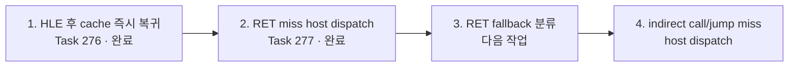

# AOT-DBT 4단계 작업 로드맵 / AOT-DBT four-stage work roadmap

## 한국어

### 1. 목적

`aot-dbt`는 별도 실행기가 아니라 `aot-dynamic`의 planner, emitter, code cache,
translation worker, SMC 일관성 및 HLE 의미를 공유하면서 Windows
`INT3`/VEH와 TF single-step 왕복을 점진적으로 정상 host dispatch로 교체하는
실행 정책입니다.

이 문서는 이미 완료된 두 기반 작업과 바로 이어질 두 후속 작업의 순서를 고정합니다.
각 단계는 이전 단계의 계측과 안전 계약을 유지하며, 원본 guest 실행 의미를 바꾸지
않습니다.



### 2. 단계별 계획

#### 1단계 — HLE 처리 후 기존 cache entry 즉시 복귀 (완료)

- Task 276에서 `aot-dbt` backend 정책과 공용 capability 판정을 추가했습니다.
- HLE가 명령을 완전히 emulate하고 EIP를 전진시킨 뒤, segment-write barrier와
  직선 구간 preflight를 통과한 기존 cache entry에만 즉시 복귀합니다.
- cache miss, quarantine, HLE boundary, decode/read 실패는 기존 TF bridge로
  fail-closed합니다.
- 완료 근거: 30초 실행에서 즉시 복귀 `5,670/2,335`, fatal 0,
  DBT legacy fallback 0.

#### 2단계 — translated RET miss의 host-stack dispatch (완료)

- Task 277에서 `C3`/`C2 iw` return inline-cache miss를 Win32 x86 host-stack
  thunk와 기존 return resolver에 연결했습니다.
- 성공 시 `INT3`/VEH 왕복 없이 cache target으로 이동하고, 실패 시 guest
  register/EFLAGS/stack 의미를 보존한 채 기존 VEH 경로로 돌아갑니다.
- 완료 근거: 15초 실행에서 시도/성공/fallback `5,507/849/4,658`,
  fatal 0, legacy fallback 0.

#### 3단계 — RET fallback 원인 계측과 분류 (다음 작업)

먼저 실행 의미를 변경하지 않는 관측 전용 증분으로 시작합니다. 현재 단일
`fallback` 카운터를 다음 의사결정에 필요한 원인별 카운터로 분해합니다.

- DBT site 또는 host-stack ABI 상태 검증 실패
- guest return stack 읽기 실패 또는 비정상 target
- 기존 `ResolveAotTransferTarget`의 cache lookup/dynamic translation 실패
- quarantine, HLE target 또는 안전성 정책에 의한 거부
- inline-cache worker 요청·publication 실패
- 위 범주에 속하지 않는 명시적 `unknown`

세부 구현에서 한 실패가 여러 내부 조건을 통과하더라도 최종 원인 하나만 기록합니다.
다음 회계 불변식을 유지합니다.

```text
attempt = success + classified fallback total
classified fallback total includes explicit unknown
```

동일 binary, 격리 EEPROM, 고정 관측 시간으로 `aot-dynamic`과 `aot-dbt`를 비교합니다.
진행도, HLE/Glide milestone, fatal, legacy fallback, single-step, DBT return 카운터와
EEPROM hash를 함께 남깁니다. 가장 큰 안전하게 제거 가능한 fallback 범주가 확인되어야
4단계의 구체 설계 입력이 확정됩니다.

완료 조건:

- 모든 RET fallback이 원인별 또는 `unknown`으로 회계됩니다.
- 계측 추가 전후에 guest-visible 결과와 EEPROM hash가 동일합니다.
- Win32 x86 Debug 빌드와 기존 AOT/inline-cache/SMC probe가 통과합니다.
- 적어도 한 번의 안정된 hot-phase 표본으로 상위 fallback 원인을 확정합니다.

#### 4단계 — indirect call/jump miss의 host-stack dispatch

3단계 결과와 Task 277의 검증된 host-stack ABI를 바탕으로 prefix 없는 legacy-32
`FF /2` near indirect call과 `FF /4` near indirect jump의 inline-cache miss를
정상 host dispatch로 전환합니다.

- emitter는 source, operand/target capture, success/fallback continuation과 patch
  metadata를 플랫폼 공용 image에 기록합니다.
- Win32 thunk는 guest register/EFLAGS를 보존하고 host stack에서 기존 target
  resolver와 serialized patch worker를 호출합니다.
- call은 원본 return-address push를, jump는 stack 불변을 정확히 재현합니다.
- operand 해석, target resolution, SMC generation, quarantine, translation 또는
  publication 실패는 기존 provenance-aware `INT3`/VEH 경로로 fail-closed합니다.
- `legacy`, `aot`, `aot-dynamic`의 image layout과 실행 의미는 변경하지 않습니다.

Task 281 실측(모든 RET fallback이 `quarantined target`, hot phase `indir` 34,851회 대
RET fallback 8,034회)에 따라 4단계의 세부 결정을 다음과 같이 확정합니다.

- **operand capture는 A안을 채택합니다.** thunk가 저장한 guest `CONTEXT`로 기존
  `HandleAotIndirectTransfer`를 재사용해 현재 target 해석 의미를 그대로 보존합니다.
  emitter가 operand target을 직접 캡처하는 B안은 코드 캐시 ABI를 복잡하게 만들고
  memory operand 읽기 시점이 원본 실행과 달라질 수 있으므로, A안에서 register 또는
  ModRM memory operand 재현이 불충분하다고 실측될 때만 재검토합니다.
- **target 안전 정책은 RET과 동일하게 유지합니다.** quarantine은 자기 수정 페이지의
  정확성 장치이므로 indirect 경로에서도 완화하지 않고 fail-closed합니다.
- 착수 전에 Task 281이 남긴 attempt 회계 보정(진입 시점 카운터가 아니라
  `attempt = success + fallback` 도출)을 먼저 처리합니다.

완료 조건:

- synthetic probe가 call/jump의 register 및 관측된 ModRM memory operand,
  success/fallback continuation과 기존 backend layout을 검증합니다.
- Win32 x86 Debug 빌드와 기존 AOT/inline-cache/SMC probe가 통과합니다.
- 실제 실행에서 direct-dispatch 시도/성공/fallback이 회계되고 fatal 및 legacy
  fallback은 0입니다.
- 동일 조건 A/B에서 EEPROM hash와 의미 기반 milestone이 일치합니다.

### 3. 공통 성능 판정

제목 표시줄 FPS는 Glide buffer swap 빈도이므로 DBT 자체 처리량의 단독 지표로 사용하지
않습니다. 각 단계는 동일 초기 상태와 고정 warm-up/hot-phase 구간에서 다음을 함께
비교합니다.

- wall-clock당 guest progress
- single-step 및 `INT3`/VEH 경계 횟수
- DBT 시도/성공/fallback과 원인별 분포
- AOT residency, dynamic append와 inline-cache patch
- Glide milestone/FPS, fatal/exception, EEPROM hash

단일 실행의 초기화 timing 차이는 성능 향상 근거로 사용하지 않습니다.

### 4. 이 로드맵 이후

일반 HLE boundary, 미번역 fallthrough와 arbitrary cache miss를 exception-free
dispatcher로 전환하는 작업은 이 4단계 이후의 별도 설계 범위입니다. 특히 selector 0
저메모리 의미와 생성 CFG 전체의 HLE boundary를 보장하기 전에는 HLE 직후 cache miss를
직접 번역하지 않습니다.

## English

### 1. Purpose

`aot-dbt` is not a separate executor. It shares the `aot-dynamic` planner,
emitter, code cache, translation worker, SMC coherency, and HLE semantics while
incrementally replacing Windows `INT3`/VEH and TF single-step round trips with
normal host dispatch.

This document fixes the order of two completed foundation increments and the
next two follow-up tasks. Every stage preserves the preceding observability and
safety contracts without changing original guest execution semantics.

### 2. Ordered stages

#### Stage 1 — Immediate existing-cache re-entry after HLE (complete)

Task 276 introduced the `aot-dbt` policy. Immediate re-entry is allowed only
after a fully emulated HLE instruction advances EIP, passes the segment-write
barrier and straight-line preflight, and finds an existing cache entry. Every
miss or validation failure retains the established TF bridge. A 30-second run
recorded 5,670/2,335 attempts/successes, zero fatal state, and zero DBT legacy
fallback.

#### Stage 2 — Host-stack dispatch for translated RET misses (complete)

Task 277 connected `C3`/`C2 iw` return inline-cache misses to a Win32 x86
host-stack thunk and the existing resolver. Success avoids an `INT3`/VEH round
trip; failure preserves guest registers, flags, and stack semantics before
returning to the established VEH path. A 15-second run recorded
5,507/849/4,658 attempts/successes/fallbacks with zero fatal state and zero
legacy fallback.

#### Stage 3 — Instrument and classify RET fallback causes (next)

Begin with an observation-only increment. Replace the single fallback count with
exclusive cause counters covering site/ABI validation, guest-stack or target
failure, transfer resolution or dynamic translation failure, quarantine/HLE
policy rejection, worker/publication failure, and an explicit unknown category.
Maintain `attempt = success + classified fallback total`.

Use the same binary, isolated EEPROM, fixed observation windows, and comparable
warm/hot phases. Record progress, semantic milestones, fatal/legacy state,
single-step counts, DBT counters, and EEPROM hashes. Completion requires complete
cause accounting, unchanged guest-visible results and EEPROM hash, the Win32 x86
Debug build and existing probes, and at least one stable hot-phase sample that
identifies the dominant fallback causes.

#### Stage 4 — Host-stack dispatch for indirect call/jump misses

Using Stage 3 evidence and the proven Task 277 stack ABI, route prefix-free
legacy-32 `FF /2` near indirect call and `FF /4` near indirect jump inline-cache
misses through normal host dispatch. The platform-neutral image records source,
operand/target capture, continuations, and patch metadata. The Win32 thunk saves
guest state, runs the existing resolver and serialized patch worker on the host
stack, and precisely reproduces call return-address push or jump stack
invariance.

Task 281 measurements — every RET fallback classified as a quarantined target, and
34,851 hot-phase indirect boundaries against 8,034 RET fallbacks — fix three Stage 4
decisions. Operand capture uses option A: reuse `HandleAotIndirectTransfer` with the
thunk's saved guest `CONTEXT`, preserving current target-resolution semantics.
Emitter-side operand capture (option B) complicates the code-cache ABI and shifts when
memory operands are read, so it is revisited only if option A proves insufficient for
register or ModRM memory operands. The target safety policy stays identical to the RET
path, and the Task 281 attempt-accounting correction (deriving
`attempt = success + fallback`) lands before Stage 4 begins.

Every operand, resolution, SMC, quarantine, translation, or publication failure
must fail closed to the provenance-aware `INT3`/VEH path. Existing backend
layouts remain unchanged. Completion requires synthetic operand/layout tests,
the full Win32 x86 Debug build and existing probes, accounted live dispatch
counters with zero fatal/legacy fallback, and matching semantic milestones and
EEPROM hashes in controlled A/B runs.

### 3. Common performance criteria

Window-title FPS counts Glide buffer swaps and is not a standalone DBT throughput
metric. Compare progress per wall-clock time, single-step and `INT3`/VEH
boundaries, DBT cause counters, AOT residency/dynamic append/cache patches,
semantic Glide milestones/FPS, fatal/exception state, and EEPROM hashes over the
same initial state and fixed warm/hot phases. Initialization timing from a single
run is not evidence of a performance gain.

### 4. After this roadmap

Exception-free dispatch for general HLE boundaries, untranslated fallthrough,
and arbitrary cache misses remains a separate design after these four stages.
Immediate translation after an HLE cache miss stays prohibited until selector-
zero low-memory semantics and whole-generated-CFG HLE-boundary guarantees exist.
