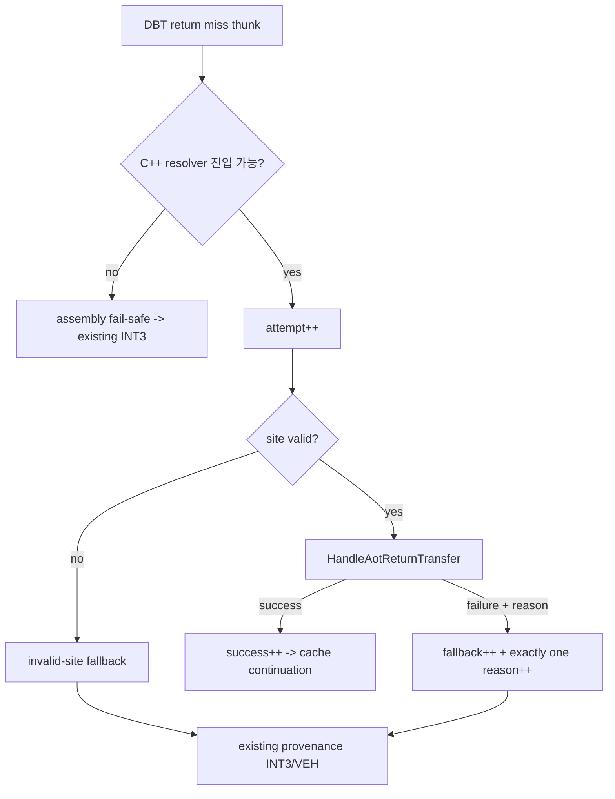

# AOT-DBT RET fallback 원인 분류 설계 / AOT-DBT RET fallback classification design

## 한국어

### 1. 배경과 목표

Task 277의 `aot-dbt` return host dispatcher는 15초 실행에서
시도/성공/fallback `5,507/849/4,658`을 기록했습니다. 성공은 return miss의
`INT3`/VEH 왕복을 제거하지만, fallback은 하나의 총계만 있어 다음 최적화 대상을
결정할 수 없습니다.

Task 281은 실행 의미를 바꾸지 않고 모든 **C++ return resolver 진입**을 성공 또는
배타적인 fallback 원인 하나로 회계합니다. 실측된 지배 원인은 Task 280 로드맵
4단계 indirect call/jump host dispatcher의 operand capture와 fail-closed 정책을
결정하는 입력으로 사용합니다.

### 2. 확인된 현재 제어 흐름

현재 `ResolveAotDbtReturnMissFrame`은 DBT site를 확인한 뒤 attempt를 증가시키고
`HandleAotReturnTransfer`를 호출합니다. handler가 `false`를 반환할 수 있는 실제
구간은 다음과 같습니다.

1. handler 상태 또는 return opcode 검증 실패
2. guest stack의 return target 읽기 실패
3. HLE/quarantine 등 target 안전 정책 거부
4. 기존 cache lookup 이후 동적 번역 실패

inline-cache patch 요청은 target resolution 성공 뒤 수행되며, patch가 실패해도 현재
miss는 해석된 cache target으로 직접 이동합니다. 따라서 patch 실패는 RET fallback
원인이 아니며 기존 patch attempt/success 계측으로 별도 관찰합니다.

### 3. 배타적 원인 모델

공개 실행 결과와 내부 `ThreadContext`는 같은 고정 순서 배열을 사용합니다.

| 순서 | 원인 | 의미 |
|---:|---|---|
| 0 | invalid site | miss 주소와 DBT metadata site가 일치하지 않음 |
| 1 | invalid state | handler context/re-entry 계약이 유효하지 않음 |
| 2 | invalid instruction | guest source가 `C3`/`C2 iw`가 아님 |
| 3 | unreadable stack | guest ESP에서 return target을 읽을 수 없음 |
| 4 | zero target | 해석에 실패한 return target이 0 |
| 5 | HLE target | target이 등록된 HLE boundary |
| 6 | quarantined target | target guest page가 quarantine됨 |
| 7 | non-guest target | target이 guest arena 또는 AOT cache 주소가 아님 |
| 8 | translation failure | guest target의 cache lookup 뒤 동적 번역 실패 |
| 9 | unknown | 위 분류에 속하지 않는 fail-closed 실패 |

adapter는 유효한 `ThreadContext`와 frame으로 C++ resolver에 진입한 즉시 attempt를
증가시킵니다. site 검증 실패도 attempt/fallback에 포함합니다. active context 또는
host stack 자체가 없어 assembly가 C++로 진입하지 못하는 ABI fail-safe는 이 회계의
범위 밖이며, synthetic ABI 검증과 기존 provenance `INT3` fallback으로 유지합니다.

다음 불변식을 종료 결과에서 확인합니다.

```text
attempt = success + fallback
fallback = sum(reason[0..9])
```

### 4. 구현 구조



- fallback enum과 고정 reason count는 Win32 execution result에 둡니다.
- `ThreadContext`는 reason별 atomic counter를 소유합니다.
- `RecordAotDbtReturnFallback`만 total과 reason counter를 함께 증가시킵니다.
- `HandleAotReturnTransfer`는 선택적 output parameter로 실패 원인을 전달하며, 기존
  호출자는 parameter를 생략해 동작을 그대로 유지합니다.
- 종료 snapshot과 host log에 고정 순서 reason vector를 출력합니다.
- synthetic probe는 모든 reason을 한 번씩 기록해 total/sum/slot 불변식을 검증합니다.

### 5. 런타임 검증과 결정 기준

동일 binary와 원본에서 복사한 격리 EEPROM을 사용합니다. `aot-dbt`를 내부 graceful
timeout으로 반복 실행하고, 저주소 배치 실패 표본은 성능·원인 결론에서 제외합니다.
필요하면 같은 조건의 `aot-dynamic`을 의미 기반 회귀 대조로 사용합니다.

필수 판정:

- exception/fatal/legacy fallback 0
- `attempt = success + fallback = success + reason sum`
- EEPROM hash 불변
- 기존 AOT/inline-cache/native-span/SMC probe 통과
- 안정된 hot-phase 표본에서 지배 fallback 원인과 비율 확정

지배 원인이 target resolution 이전(site/state/opcode/stack)이면 Task 277 ABI를 먼저
수정합니다. HLE/quarantine/non-guest가 지배하면 indirect dispatcher도 같은 target
정책을 유지하고 직접 처리 범위를 넓히지 않습니다. translation failure가 지배하면
dynamic append 실패를 세분화한 뒤 Stage 4 emitter ABI를 확정합니다.

## English

### 1. Background and goal

The Task 277 `aot-dbt` return host dispatcher recorded 5,507/849/4,658
attempts/successes/fallbacks in a 15-second run. Success removes one return-miss
`INT3`/VEH round trip, but a single fallback total cannot identify the next safe
optimization.

Task 281 preserves execution semantics while accounting every **C++ return
resolver entry** as either success or exactly one fallback cause. The dominant
live cause becomes input to the Task 280 Stage 4 indirect call/jump dispatcher
operand-capture and fail-closed policy.

### 2. Confirmed current control flow

`ResolveAotDbtReturnMissFrame` validates the DBT site, increments attempts, and
calls `HandleAotReturnTransfer`. The handler can currently fail at handler-state
or opcode validation, guest return-stack read, target safety policy, or dynamic
translation after a cache miss. Inline-cache patching happens after successful
resolution; patch failure does not reject the current direct continuation and
therefore remains separate patch telemetry rather than a RET fallback cause.

### 3. Exclusive cause model

The public execution result and internal `ThreadContext` share a fixed ten-slot
order: invalid site, invalid state, invalid instruction, unreadable stack, zero
target, HLE target, quarantined target, non-guest target, translation failure,
and unknown.

The adapter increments attempt as soon as it enters the C++ resolver with a
valid context and frame, so site validation failure is accounted. An assembly
fail-safe that cannot enter C++ because the active context or host stack is
missing stays outside this per-context accounting domain and retains the proven
provenance `INT3` fallback.

The final result must satisfy:

```text
attempt = success + fallback
fallback = sum(reason[0..9])
```

One helper increments both fallback total and exactly one reason counter.
`HandleAotReturnTransfer` reports an optional reason without changing existing
callers. Snapshot/log output uses the fixed order, and a synthetic probe records
every reason once to verify total, sum, and slots.

### 4. Runtime verification and decision rule

Use the same binary and isolated copies of the original EEPROM. Run `aot-dbt`
with a graceful internal timeout and exclude low-address placement failures from
functional or performance conclusions. Use an equivalent `aot-dynamic` run when
a semantic regression control is needed.

Require zero exception/fatal/legacy fallback, both accounting invariants,
unchanged EEPROM hashes, all existing AOT/inline-cache/native-span/SMC probes,
and at least one stable hot-phase sample that establishes the dominant cause.

If a pre-resolution category dominates, fix the Task 277 ABI first. If
HLE/quarantine/non-guest targets dominate, Stage 4 retains those target-policy
fallbacks. If translation failure dominates, refine dynamic-append failure
classification before fixing the Stage 4 emitter ABI.
