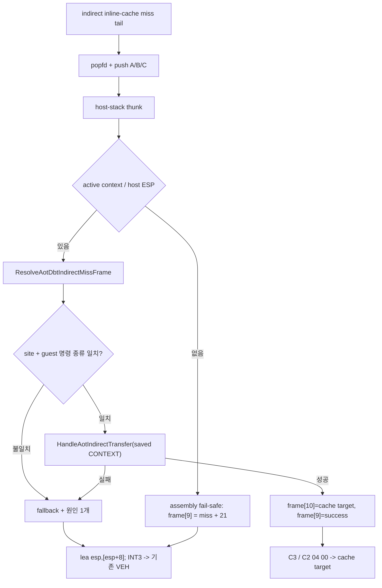

# AOT-DBT indirect call/jump miss host dispatch 설계 / AOT-DBT indirect call/jump miss host dispatch design

> **구현 결과 (2026-07-24):** 이 설계대로 구현·synthetic probe 검증까지 완료했으나,
> 실제 `aot-dbt`에서 활성화하면 Glide attract 경로에서 결정적으로 크래시합니다. 성공
> 전이의 최종 상태는 VEH 경로와 증명상 동일한데도 누적 손상이 발생하며, layout·inline
> cache patch·FPU/SSE는 근인에서 배제됐습니다. 따라서 기능은 **기본 비활성(opt-in,
> `REPIU_AOT_DBT_INDIRECT=1`)** 으로 두고 조사를 계속합니다. 상세 실측과 통제 실험은
> `docs/analysis/current-execution-frontier.md` Task 282 항목을 참조하십시오.
>
> **Implementation outcome (2026-07-24):** Built and synthetic-probe-verified as designed,
> but enabling it live deterministically crashes the Glide attract path even though the
> success transfer's final state is provably identical to the VEH path. Layout, inline-cache
> patching, and FPU/SSE were ruled out. Kept opt-in and disabled by default
> (`REPIU_AOT_DBT_INDIRECT=1`); see the Task 282 entry in
> `docs/analysis/current-execution-frontier.md`.

## 한국어

### 1. 배경과 목표

Task 280 로드맵 4단계입니다. Task 281 실측에서 `aot-dbt` 120초 hot phase의
`indir` boundary는 34,851회로 RET fallback 8,034회의 약 4.3배였고, RET fallback은
전부 `quarantined target`이어서 RET 경로에서 추가로 회수할 여지가 없었습니다.
따라서 남은 최대 경계는 간접 call/jump inline-cache miss입니다.

목표는 prefix 없는 legacy-32 `FF /2` near indirect call과 `FF /4` near indirect jump의
inline-cache miss tail을 `INT3`/VEH 왕복 대신 Task 277에서 검증된 host-stack thunk로
연결하는 것입니다. 실행 의미, guest 가시 상태, 기존 backend layout은 바꾸지 않습니다.

### 2. 확인된 현재 구조

간접 inline-cache site는 `pushfd` 뒤에 4개의 compare/guard/hit entry를 두고, 마지막
entry가 실패하면 miss tail로 떨어집니다. 현재 miss tail은 `popfd; INT3` 2바이트입니다.
`INT3`는 VEH에서 `HandleAotReentry`가 address map으로 guest 주소를 복원하고
(`aot_reentry_pending = true`, boundary 카운터 증가), 이어서
`HandleAotIndirectTransfer`가 guest 명령을 디코드해 operand target을 읽고,
`ResolveAotTransferTarget`으로 cache target을 얻은 뒤 inline cache patch를 요청하고,
call이면 return 주소를 guest stack에 쓰고 `Eip`를 cache target으로 바꿉니다.

즉 target 해석과 call/jump 의미 재현은 이미 한 곳에 있습니다. 4단계는 이 함수에
도달하는 경로에서 Windows breakpoint exception 왕복만 제거합니다.

### 3. A안 채택과 계약

Task 281 결론에 따라 **A안**을 채택합니다. thunk가 저장한 guest `CONTEXT`를 그대로
넘겨 기존 `HandleAotIndirectTransfer`를 재사용하고, emitter는 operand를 직접 캡처하지
않습니다. 근거는 두 가지입니다.

1. operand 해석 의미 보존. `call [esp+8]`처럼 ESP 기준 memory operand가 존재하므로
   operand는 **원본 실행 시점의 guest ESP**로 읽혀야 합니다. thunk가 복원하는 `Esp`가
   그 값이면 기존 디코더가 그대로 정확합니다.
2. 변경 범위 최소화. 코드 캐시 ABI는 고정 프레임 3슬롯만 추가하며, target 정책과
   inline-cache patch 경로는 손대지 않습니다.

계약은 다음과 같습니다.

- 합성 `CONTEXT.Eip` = site의 guest source, `CONTEXT.Esp` = 명령 실행 직전 guest ESP.
- `HandleAotIndirectTransfer`가 call에서 return 주소를 쓰는 위치는 `Esp - 4`입니다.
  emitter는 바로 그 자리에 return 주소 슬롯을 미리 push해 두므로, handler의 쓰기는
  같은 슬롯을 같은 값으로 덮어씁니다.
- handler가 바꾸는 `Esp`는 thunk가 사용하지 않습니다(`POPAD`는 저장된 ESP를 무시).
  최종 ESP는 emitter가 고정한 continuation 바이트가 결정합니다.

### 4. 방출 layout

miss tail을 call/jump 공통 3슬롯 프레임으로 고정합니다. jump도 미사용 슬롯 하나를
push해 프레임 깊이를 통일하므로, thunk의 assembly fail-safe와 resolver가 분기 없이
같은 오프셋을 사용합니다.

```text
miss_cache_offset:
  9D                       popfd                     ; 기존과 동일
  68 imm32                 push A  ; call=return addr, jump=0
  68 imm32                 push B  ; miss address (placement가 채움)
  68 imm32                 push C  ; guest source
  E9 rel32                 jmp     AotDbtIndirectMissThunk
fallback_cache_offset:                              ; = miss + 21
  8D 64 24 08              lea esp,[esp+8]           ; A/B 슬롯 제거
  CC                       int3                      ; 기존 provenance 경로
success_cache_offset:
  call: C3                 ret                       ; target pop, ESP -> A
  jump: C2 04 00           ret 4                     ; target pop + A 제거
```

ESP 전이는 다음과 같습니다. `esp0`은 간접 명령 실행 직전 guest ESP입니다.

| 시점 | ESP | 비고 |
|---|---|---|
| miss tail 진입 후 `popfd` | `esp0` | inline cache가 push한 flags 해제 |
| push A/B/C 완료 | `esp0-12` | thunk 진입 프레임 |
| `pushfd; pushad` | `esp0-48` | frame[9]=C, frame[10]=B, frame[11]=A |
| thunk `ret`(frame[9] pop) | `esp0-8` | continuation으로 진입 |
| success(call) `C3` | `esp0-4` | `[esp]` = return 주소 → call 의미 |
| success(jump) `C2 04 00` | `esp0` | 스택 불변 → jump 의미 |
| fallback `lea esp,[esp+8]` | `esp0` | 원본 상태로 복원 후 `INT3` |

resolver는 성공 시 frame[10]에 해석된 cache target을, frame[9]에 success continuation
주소를 씁니다. 실패 시 frame[9]에 fallback continuation 주소만 씁니다.



### 5. fail-closed 판정

resolver는 C++ 진입 직후 entry를 세고, 다음을 모두 통과해야 handler를 호출합니다.

1. miss 주소로 찾은 DBT indirect site가 존재하고 `guest_source`가 일치합니다.
2. guest source의 명령이 `FF`이고 ModRM `/digit`이 site의 call/jump 종류와 같습니다.

2번은 SMC로 guest 명령이 바뀐 뒤 stale site가 남는 경우를 막습니다. 종류가 어긋난
상태로 handler를 호출하면 call 경로의 return 주소 쓰기가 프레임 슬롯을 침범할 수
있으므로, 이 검증은 안전상 필수입니다.

target 안전 정책은 RET과 동일하게 유지합니다. HLE boundary, quarantine, non-guest,
translation 실패는 모두 기존 provenance `INT3`/VEH로 fail-closed하며, indirect 경로에서
직접 처리 범위를 넓히지 않습니다.

### 6. 회계 모델

Task 281의 10칸 원인 모델을 두 경로가 공유합니다. enum 이름은
`AotDbtDispatchFallbackReason`으로 일반화하고, slot 3은 return의 stack 읽기 실패와
indirect의 operand 읽기 실패를 함께 뜻하도록 `kUnreadableSource`로 둡니다. 카운터
배열은 경로별로 분리해 RET과 indirect 수치를 계속 따로 비교합니다.

또한 Task 281이 남긴 attempt 회계 오차를 함께 보정합니다. `ThreadContext`는 C++ 진입
횟수를 `entry`로 유지하고, 보고되는 `attempt`는 snapshot에서 `success + fallback`으로
도출합니다. 이렇게 하면 graceful timeout이 resolver 실행 중에 걸려도 다음 불변식이
항상 성립합니다.

```text
attempt = success + fallback = success + sum(reason[0..9])
entry - attempt = 관측 종료 시점의 in-flight 건수 (0 또는 1)
```

### 7. 구현 구조

- 공용 image: `AotDbtIndirectDispatchSite`(guest_source, miss/immediate/thunk/fallback/
  success offset, is_call)와 `enable_dbt_indirect_miss_dispatch` 옵션을 추가합니다.
- emitter: `EmitIndirectInlineCacheSlot`이 옵션에 따라 miss tail을 위 layout으로
  방출합니다. 옵션이 꺼지면 기존 `popfd; INT3` 바이트를 그대로 유지합니다.
- Win32 placement와 dynamic append: return site와 같은 방식으로 miss 절대 주소와 thunk
  `rel32`를 해결하고, append 시 offset을 재배치합니다.
- Win32 thunk와 adapter는 전용 파일 `aot_dbt_indirect_dispatch.{h,cpp}`에 둡니다.
- 정책 결선: `aot-dbt` backend에서만 옵션을 켭니다.

### 8. 검증

- synthetic probe: call/jump layout, register와 ModRM memory operand 형태, 옵션 비활성
  시 기존 layout 유지, placement의 miss immediate와 thunk `rel32`, dynamic append 후
  offset 재배치, indirect fallback 원인 slot과 회계 불변식.
- Win32 x86 Debug 전체 빌드와 기존 AOT/inline-cache/native-span/SMC probe 통과.
- 동일 binary·격리 EEPROM `aot-dbt` 실구동에서 indirect 시도/성공/fallback 회계,
  fatal·exception·legacy fallback 0, EEPROM hash 불변, `indir` boundary 감소 확인.
- 대조 `aot-dynamic`은 새 카운터가 0이고 기존 layout을 유지해야 합니다.

## English

### 1. Background and goal

This is Stage 4 of the Task 280 roadmap. Task 281 measured 34,851 hot-phase `indir`
boundaries against 8,034 RET fallbacks, and every RET fallback was a quarantined
target, so no further RET recovery is safe. The remaining largest boundary is the
indirect call/jump inline-cache miss.

The goal is to route prefix-free legacy-32 `FF /2` and `FF /4` inline-cache misses
through the Task 277 host-stack thunk instead of an `INT3`/VEH round trip, without
changing execution semantics, guest-visible state, or existing backend layouts.

### 2. Confirmed current structure

An indirect site is `pushfd`, four compare/guard/hit entries, then a `popfd; INT3`
miss tail. In the VEH, `HandleAotReentry` restores the guest address from the address
map and `HandleAotIndirectTransfer` decodes the guest instruction, reads the operand,
resolves a cache target, requests the inline-cache patch, writes the call return
address to the guest stack, and sets `Eip`. Target resolution and call/jump semantics
therefore already live in one place; Stage 4 only removes the exception round trip on
the way there.

### 3. Option A and its contract

Option A reuses `HandleAotIndirectTransfer` with the thunk's saved guest `CONTEXT`.
Operands such as `call [esp+8]` must be read with the guest ESP the instruction would
have seen, so the restored `Esp` makes the existing decoder exactly correct, and the
code-cache ABI only grows by a fixed three-slot frame. The handler writes a call's
return address at `Esp - 4`, which is exactly the slot the emitter pushes first, so
the write lands in the intended slot with the same value. The handler's `Esp` update
is inert because `POPAD` ignores the saved ESP; the emitted continuation bytes decide
the final ESP.

### 4. Emitted layout

The miss tail pushes three slots for both calls and jumps — a jump pushes one unused
slot so the frame depth is uniform for the assembly fail-safe and the resolver:
`popfd`, `push A` (call return address or zero), `push B` (miss address), `push C`
(guest source), `jmp thunk`; then the fallback continuation `lea esp,[esp+8]; int3`
at `miss + 21`, and the success continuation `C3` for calls or `C2 04 00` for jumps.

With `esp0` as the guest ESP before the indirect instruction, the thunk frame sits at
`esp0-12`, the thunk's `ret` consumes slot C and lands on the continuation at
`esp0-8`, a call's `C3` leaves `esp0-4` with the return address at `[esp]`, a jump's
`ret 4` restores `esp0`, and the fallback's `lea` restores `esp0` before the existing
provenance `INT3`.

### 5. Fail-closed rules

The resolver counts the C++ entry first, then requires a matching DBT indirect site
and a guest instruction whose `FF /digit` still matches the site's call/jump kind.
The second check is mandatory: calling the handler on a mismatched kind could let the
call-path return-address write land on a frame slot. All target policy failures —
HLE, quarantine, non-guest, translation — keep failing closed to the provenance
`INT3`/VEH path exactly as the RET path does.

### 6. Accounting model

Both paths share the Task 281 ten-slot cause model, generalized to
`AotDbtDispatchFallbackReason` with slot 3 renamed `kUnreadableSource` to cover the
return stack read and the indirect operand read, while keeping separate per-path
counter arrays. The Task 281 attempt discrepancy is corrected at the same time:
`ThreadContext` keeps the raw C++ entry count, and the reported attempt is derived as
`success + fallback`, so the invariant holds even when a graceful timeout lands inside
the resolver. `entry - attempt` then reports the in-flight count.

### 7. Implementation structure

Add `AotDbtIndirectDispatchSite` and an `enable_dbt_indirect_miss_dispatch` build
option to the platform-neutral image; emit the new tail only when it is on. Win32
placement and dynamic append resolve and relocate the miss immediate and thunk `rel32`
like the return sites. The Win32 thunk and adapter live in a dedicated
`aot_dbt_indirect_dispatch.{h,cpp}`, and only the `aot-dbt` backend enables the option.

### 8. Verification

Synthetic probes cover call and jump layouts, register and ModRM memory operands, the
unchanged legacy layout when disabled, placement and dynamic-append offset handling,
and the fallback-reason invariants. The full Win32 x86 Debug build and every existing
probe must pass. An isolated-EEPROM `aot-dbt` run must show accounted indirect
attempts/successes/fallbacks, zero fatal/exception/legacy fallback, unchanged EEPROM
hashes, and a reduced `indir` boundary count, while an `aot-dynamic` control keeps
zero new counters and its existing layout.
