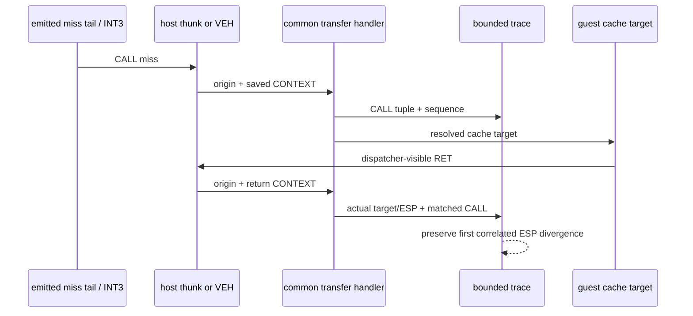

# AOT-DBT CALL/RET 왕복 결정적 관측 설계 / AOT-DBT CALL/RET deterministic round-trip trace design

## 한국어

### 1. 배경과 목표

Task 283은 indirect host dispatch 크래시를 CALL 경로로 이분했고, guest-stack
반환주소 write, adapter의 폐기되는 ESP 변화, 진단용 shadow stack과 반환주소 값 자체를
근인에서 배제했습니다. JUMP-only는 240초·33,935회 무크래시였지만 CALL-only는
`guest_eip=0x030F1DD7` 직후 Glide DLL `0x1019B7B9`에서 같은 access violation을
재현했습니다.

남은 질문은 host-dispatch CALL이 만든 물리적 반환 frame과 이를 소비하는 RET의 왕복이
언제 처음 VEH 기준과 달라지는가입니다. 이번 작업은 원본 guest 바이트나 전이 의미를
바꾸지 않고, dispatcher가 실제로 관측한 CALL/RET 왕복만 고정 크기 trace로 기록합니다.

### 2. 관측 범위와 비범위

관측 대상은 다음 두 C++ resolver 경계입니다.

- `HandleAotIndirectTransfer`에 들어온 성공 CALL
- `HandleAotReturnTransfer`에 들어와 guest stack의 반환주소를 읽은 RET

inline-cache hit로 C++ resolver를 전혀 거치지 않는 CALL/RET은 이번 trace에서 직접
관측되지 않습니다. 따라서 결과는 "모든 guest CALL/RET"이 아니라 "dispatcher-visible
CALL/RET"의 완전한 기록입니다. 이 제한은 결과 해석과 작업 로그에 명시합니다.

### 3. 데이터 모델

진단 기능은 Win32 전용 `aot_dbt_call_return_trace.{h,cpp}` 하위 시스템이 소유합니다.
동적 allocation이나 resolver 내부 로그 출력은 사용하지 않습니다.

CALL event:

```text
sequence
origin = VEH | host
source
target
return_address
entry_esp
```

RET event:

```text
sequence
origin = VEH | host
return_source
actual_target
return_esp
matched_call_sequence
expected_source / target / return_address / return_esp
target_matches / esp_matches
```

CALL shadow frame에는 기존 source/target/fallthrough 외에 CALL sequence, entry ESP,
origin을 보존합니다. RET은 최상위 frame의 fallthrough와 actual target이 일치할 때 해당
CALL을 소비한 것으로 연계하고, expected return ESP는 `call_entry_esp - 4`로 판정합니다.
반환주소 target이 일치한 RET의 ESP 불일치는 ring과 별도의 first-divergence sticky
slot에 한 번만 보존합니다. target이 다른 RET은 inline-cache hit로 먼저 소비된 CALL과
현재 같은 stack depth가 재사용된 경우를 구분할 수 없으므로 억지로 연계하지 않습니다.

trace는 최근 256개 CALL과 **반환주소 target으로 CALL sequence를 확정할 수 있는 RET**를
순환 보존합니다. dispatcher-visible RET 전체는 누적 카운터로만 세며, 연계되지 않은
고빈도 RET가 소수 CALL tuple을 덮지 않게 합니다. 총 저장 event/CALL/관측 RET/
match/mismatch와 overwrite 수는 별도 누적 카운터로 유지하므로 전체 규모와 첫 실패를
잃지 않습니다.

### 4. 경로 식별과 활성화

공용 transfer handler는 optional origin 인자를 받습니다.

- 메인 VEH dispatcher 호출은 기본 `VEH`
- `ResolveAotDbtIndirectMissFrame`과 `ResolveAotDbtReturnMissFrame` 호출은 `host`

`REPIU_AOT_DBT_CALL_TRACE=1`일 때만 기록합니다. 미설정/다른 값에서는 모든 추가
기록 분기가 즉시 반환하고 기존 상태 및 최종 출력은 변하지 않습니다.



### 5. 상태 회수와 출력

`ThreadContext`가 live trace 상태를 소유하고, guest thread 종료/join 뒤
`Win32MinimalExecutionAttempt`로 POD snapshot을 복사합니다. loader 최종 로그는 다음을
출력합니다.

- configured, total, CALL, RET, match, mismatch, overwrite
- first-divergence sticky entry
- chronological order로 복원한 최근 ring event

shared live telemetry 구조 버전은 이번 작업에서 변경하지 않습니다. Task 282/283 크래시는
기존 caught-exception 종료 경로로 최종 attempt가 회수되므로, 먼저 더 작은 변경으로
결정적 trace를 검증합니다.

### 6. 안전 계약

- 원본 guest 바이트, code-cache layout, inline-cache patch 정책을 변경하지 않습니다.
- handler가 계산한 target, stack write, EIP/ESP/EFLAGS 값을 변경하지 않습니다.
- resolver hot path에서 allocation, mutex, 파일 I/O와 형식화 로그를 수행하지 않습니다.
- trace 비활성 시 기존 실행 분기와 출력 의미를 유지합니다.
- 기존 `aot_call_frames`의 진단 의미만 확장하며 게임 로직이나 HLE 의미로 사용하지 않습니다.

### 7. 검증

1. synthetic probe로 다음을 검증합니다.
   - trace 비활성 시 event 0
   - VEH/host CALL origin과 tuple 보존
   - 일치 RET의 CALL sequence 연계와 target/ESP 판정
   - target이 연계된 RET의 ESP 불일치 sticky first-divergence
   - 연계할 수 없는 고빈도 RET의 ring 제외
   - 256개 초과 시 ring overwrite와 시간순 snapshot
2. Win32 x86 Debug 전체 빌드와 기존 `repiu_aot_probe`를 통과합니다.
3. 동일 binary·격리 EEPROM·240초 조건에서 실행합니다.
   - control: indirect off + trace on
   - experiment: calls-only + trace on
4. 두 실행의 dispatcher-visible CALL/RET sequence를 source 기준으로 비교하고,
   크래시 직전 최초 target/ESP 불일치 또는 경로별 event 차이를 기록합니다.
5. 결정적 발산이 없으면 Task 223에서 검토한 trap-backend 장시간 single-step 비교를
   다음 단계로 넘깁니다.

### 8. 구현 결과와 설계 판정

구현은 위 경계를 유지했습니다. 단, 초기 실구동에서 dispatcher-visible RET가 1만 회를
넘어 256칸 ring의 CALL을 모두 덮는 문제가 드러나, ring 보존 정책을 "모든 RET"에서
"반환주소 target으로 기존 CALL을 확정할 수 있는 RET"로 좁혔습니다. 전체 RET 수는
별도 카운터로 계속 보존합니다. 이는 관측 의미를 줄이는 변경이 아니라, 이미 명시한
dispatcher-visible 경계 안에서 모호한 RET가 결정적인 CALL 증거를 밀어내지 않게 하는
보존 정책입니다.

240초 격리 EEPROM A/B 결과, calls-only 실행에서 크래시 전 관측된 30개 CALL tuple은
control의 첫 30개와 모두 일치했고, 양쪽에서 공통으로 연계된 26개 RET tuple도 모두
일치했습니다. calls-only의 CALL sequence 27, 30, 33, 56은 dispatcher-visible RET가
없었습니다. 27/30/33은 inline-cache hit 복귀 가능성이 있고, 마지막 56은 크래시 전
미복귀 호출일 수 있으므로 현재 trace만으로 구분하지 않습니다. 따라서 Task 284는
공용 resolver가 보이는 CALL tuple과 상관 RET ESP를 근인에서 배제하고, 다음 관측
경계를 emitted inline-cache hit/물리적 `C3` continuation으로 좁혔습니다.

## English

### 1. Background and goal

Task 283 isolated the indirect host-dispatch crash to CALL and ruled out the redundant
guest-stack return-address write, the adapter's discarded ESP mutation, the diagnostic
shadow stack, and the return-address value itself. JUMP-only survived 240 seconds and
33,935 transfers, while CALL-only reproduced the same access violation after guest EIP
`0x030F1DD7`, at Glide DLL EIP `0x1019B7B9`.

The remaining question is where a physical CALL/RET round trip created by host dispatch
first differs from the VEH baseline. This task records only dispatcher-observed CALL/RET
round trips in bounded storage, without changing original guest bytes or transfer semantics.

### 2. Observation boundary

The trace covers successful CALLs entering `HandleAotIndirectTransfer` and RETs entering
`HandleAotReturnTransfer` after reading the guest-stack return address. A CALL or RET that
hits an inline cache and never enters a C++ resolver is outside this trace. Results therefore
describe every dispatcher-visible round trip, not every physical guest CALL/RET.

### 3. Data model

A dedicated Win32 `aot_dbt_call_return_trace.{h,cpp}` subsystem owns fixed storage and
performs no allocation or formatted logging in a resolver. A CALL event stores sequence,
VEH/host origin, source, target, return address, and entry ESP. A retained RET event stores
its origin, source, actual target and ESP, the matched CALL sequence and expected tuple,
plus independent target/ESP match flags. Every dispatcher-visible RET is counted, but only
RETs whose target identifies a recorded CALL enter the event ring; this prevents thousands
of unrelated return misses from overwriting the much smaller CALL population.

The existing call shadow frame gains the CALL sequence, entry ESP, and origin. A RET consumes
the top frame when its target equals the frame fallthrough; expected return ESP is
`call_entry_esp - 4`. The first ESP mismatch on a target-correlated RET is retained in a
sticky slot in addition to a 256-event ring. A target-mismatching RET is not forcibly
correlated because an earlier inline-cache-hit return can make a reused stack depth
ambiguous. Total event/CALL/RET/match/mismatch and overwrite counters preserve aggregate
evidence after the ring wraps.

### 4. Origin and enablement

The common transfer handlers accept an optional origin. Main VEH calls use the default VEH
origin; the DBT indirect and return resolver adapters pass host origin explicitly. Recording
is enabled only by `REPIU_AOT_DBT_CALL_TRACE=1`; otherwise it returns immediately and leaves
existing state and output unchanged.

### 5. Recovery, output, and safety

`ThreadContext` owns the live fixed trace. After guest-thread termination/join it is copied
as POD into `Win32MinimalExecutionAttempt`, whose final log prints counters, the sticky first
divergence, and the recent ring in chronological order. Shared-live-telemetry versioning is
unchanged because the known crash already reaches the caught-exception final snapshot.

The feature changes no guest byte, code-cache layout, inline-cache policy, target, stack
write, or architectural register result. It performs no allocation, mutex acquisition, file
I/O, or formatted logging in resolver paths. The extended call frames remain diagnostic-only.

### 6. Verification

Synthetic probes cover disabled behavior, VEH/host origins, matching return correlation,
correlated ESP first-divergence capture, unrelated-RET filtering, and ring wrap order. The
Win32 x86 Debug build and all existing probes must pass. A 240-second isolated-EEPROM A/B compares indirect-off against
calls-only with tracing enabled and identifies the earliest dispatcher-visible target/ESP or
event-sequence divergence before the crash. If no deterministic divergence is visible, the
next step is the longer trap-backend single-step comparison considered in Task 223.

### 7. Implementation outcome and design decision

The implementation retained the boundary above. An initial live run showed more than ten
thousand dispatcher-visible RETs overwriting every CALL in the 256-entry ring, so retention
was narrowed from every RET to RETs whose return target identifies an existing CALL. The
separate total RET counter remains complete. This is a retention-policy correction inside
the declared observation boundary, preventing ambiguous RET traffic from evicting decisive
CALL evidence.

In the isolated 240-second A/B, all 30 CALL tuples observed before the calls-only crash
matched the control's first 30, and all 26 target-correlated RET tuples common to both runs
also matched. Calls-only sequences 27, 30, 33, and 56 had no dispatcher-visible correlated
RET. Sequences 27/30/33 may have returned through inline-cache hits, while the final sequence
56 may be an in-flight call at the crash; this trace cannot distinguish them. Task 284
therefore rules out the CALL tuple and correlated return ESP visible to the shared resolver
and narrows the next observation boundary to the emitted inline-cache-hit/physical `C3`
continuation path.
