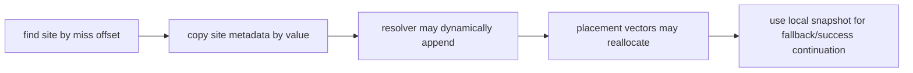

# AOT-DBT dispatch-site 수명 안전 설계 / AOT-DBT dispatch-site lifetime safety design

## 한국어

### 1. 근인

Task 285는 indirect host adapter의 success continuation이 sequence 56에서
`0xEB53DDDD`로 오염되는 직접 증거를 확보했습니다. adapter는 placement의
`dbt_indirect_dispatch_sites` 원소 포인터를 잡은 뒤
`HandleAotIndirectTransfer`를 호출합니다. resolver는 미번역 target을 동적 append하며,
append가 같은 vector에 `push_back`해 기존 원소 포인터를 무효화할 수 있습니다.
adapter가 resolver 뒤 `site->success_cache_offset`을 읽는 것이 use-after-reallocation의
정확한 지점입니다.

RET adapter도 `dbt_return_dispatch_sites` 원소 포인터를
`HandleAotReturnTransfer` 호출 전후로 유지하므로 같은 결함 가능성이 있습니다.

### 2. 수정 원칙

dispatch site는 작고, adapter가 필요한 필드는 모두 값 타입입니다. 따라서 검색 함수가
placement 원소 포인터를 반환하지 않고 호출자 소유 snapshot에 site 전체를 복사합니다.

indirect와 RET adapter 모두 다음 순서를 사용합니다.

1. miss address로 site를 검색해 local value로 복사
2. guest source/opcode 검증과 fallback continuation을 local value로 계산
3. resolver 호출
4. resolver 뒤 success continuation도 local value로 계산

placement base address는 예약된 code-cache allocation의 고정 주소이므로 별도 값으로
복사해 사용합니다. resolver 뒤 placement vector 원소 포인터나 참조는 남기지 않습니다.

### 3. 범위와 안전

- guest byte, code-cache byte/layout, inline-cache patch 정책을 바꾸지 않습니다.
- target 해석, stack 의미, EFLAGS/GPR 결과를 바꾸지 않습니다.
- indirect와 RET adapter의 metadata ownership만 수정합니다.
- `FindDispatchSite`는 `bool + out value` 형태로 바꿔 포인터 수명 오용을 API 수준에서
  어렵게 합니다.
- AOT host adapter에서 resolver를 가로질러 placement vector 원소 포인터를 유지하는
  다른 패턴이 없는지 함께 검색합니다.

### 4. 검증

1. Win32 x86 Debug 전체 빌드와 모든 AOT probe
2. sequence 56 Task 285 probe:
   - pre-C3 continuation이 cache 안의 정상 주소
   - pre/post/return EIP·ESP 전부 match
   - `0xDDDDDDDD`/`0xEB5xDDDD` 오염 없음
3. probe-off calls-only 240초 격리 EEPROM:
   - 기존 Glide AV 미재현
   - 기존 크래시 구간을 넘어 실제 도달한 Glide 호출을 정확히 기록
4. indirect-off control과 EEPROM hash 비교
5. RET host dispatch 회계와 fallback probe 회귀 없음

### 5. 검증 결과와 활성화 정책

설계대로 indirect와 RET adapter가 resolver 진입 전에 site 전체를 값으로 복사하도록
수정했습니다. sequence 56은 더 이상 poison continuation을 만들지 않았고
pre-C3/post-C3/return-target EIP·ESP가 모두 기대값과 일치했습니다.

probe를 끈 240초 격리 실행 결과는 다음과 같습니다.

| 조건 | 예외 | progress | indirect `entry/attempt/success/fallback` | 확인된 Glide 호출 |
|---|---|---:|---:|---|
| calls-only | 없음, timeout | 95,842 | `33741/33741/60/33681` | texture download 2, buffer clear 2, buffer swap 1 |
| indirect off | 없음, timeout | 94,836 | `0/0/0/0` | texture download 2, buffer clear 1 |

두 실행 모두 EEPROM SHA-256이 fixture와 같은
`A1FC1D120EF12DE4FB3608551750F93E02F911F26A3DDF9054ABCE4846652570`이었습니다.
calls-only는 수정 전 30~50초에 재현되던 Glide access violation 없이 240초를
완주했습니다. 따라서 use-after-reallocation 수정의 안전성 목표는 충족했습니다.

다만 성공은 33,741회 시도 중 60회, 약 0.18%에 불과하고 단일 실행의 progress 차이
약 1.1%는 timing 변동과 분리할 수 없습니다. 따라서 CALL host dispatch는 계속
opt-in으로 유지합니다. 기본 활성화는 반복 성능 측정이나 fallback/quarantine 개선으로
유의미한 이득을 입증하는 별도 작업에서만 재검토합니다.

## English

### Root cause and fix

Task 285 directly observed sequence 56's indirect success continuation poisoned as
`0xEB53DDDD`. The adapter retained a pointer into
`placement->dbt_indirect_dispatch_sites` across `HandleAotIndirectTransfer`; translating the
new target dynamically appended to the same vector and could reallocate it. The subsequent
`site->success_cache_offset` read was a use-after-reallocation. The RET adapter has the same
lifetime pattern.

Both search functions will copy the complete small value-type site into caller-owned local
storage before entering a resolver. Guest validation, fallback continuation, and success
continuation all use that snapshot. No placement-vector element pointer or reference
survives a resolver call. The cache base is also retained by value.

This changes no guest/cache byte, layout, patch policy, target resolution, stack meaning, or
architectural result. Verification consists of the full Win32 build and probes, a sequence
56 step run with matching pre/post/return state and no poison values, a probe-off 240-second
calls-only run progressing beyond the former AV while recording the exact Glide calls
reached, an indirect-off control, unchanged EEPROM hashes, and RET host-dispatch regression
checks.

### Verification result and enablement policy

Both adapters now copy the complete site by value before resolver entry. Sequence 56
produced matching pre-C3, post-C3, and return-target EIP/ESP with no poison continuation.
The probe-off calls-only run timed out cleanly at 240 seconds with progress 95,842 and
indirect accounting `33741/33741/60/33681`; it reached two texture downloads, two buffer
clears, and one buffer swap. The indirect-off control also timed out cleanly with progress
94,836 and reached two texture downloads and one buffer clear. Both EEPROM hashes matched
the fixture.

The former 30-to-50-second Glide access violation is therefore removed. CALL host dispatch
nevertheless remains opt-in: only 60 of 33,741 attempts succeeded (about 0.18%), and the
roughly 1.1% single-run progress difference is not separable from timing variance. Default
enablement requires a separate repeated performance result or a meaningful reduction in
fallback/quarantine traffic.
