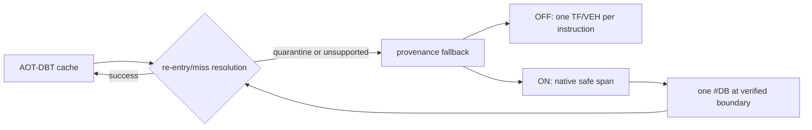

# AOT-DBT fallback native linear-span 성능 판정 설계 / AOT-DBT fallback native linear-span performance design

## 한국어

### 1. 배경과 목표

Task 286 이후 기본 `aot-dbt`는 안정적으로 240초 실행하고 texture download와 buffer
swap까지 도달합니다. 그러나 RET와 indirect miss의 대부분은 자기 수정 페이지의
`quarantined target`이므로 정확성 정책상 기존 provenance `INT3`/VEH와 TF
single-step fallback을 유지해야 합니다.

Task 275의 `native_linear_span`은 일반 single-step 지점에서 다음 HLE 민감 명령,
제어 전이 또는 명시적 memory write 직전까지를 Zydis로 매번 새로 스캔하고, Dr0
경계까지 TF 없이 실행합니다. 게스트 byte를 수정하거나 분석 결과를 cache하지 않으므로
quarantine과 SMC 정책을 완화하지 않습니다.

이 작업의 목표는 최신 기본 `aot-dbt` fallback에서 기존 opt-in span을 반복 A/B하고,
정확성과 의미 기반 성능 이득이 모두 재현될 때만 기본 승격을 검토하는 것입니다.

### 2. 통제 변수

같은 Win32 x86 Debug binary와 같은 원본 EEPROM에서 실행별 격리 사본을 만듭니다.
모든 실행은 다음을 고정합니다.

- `REPIU_EXECUTION_BACKEND=aot-dbt`
- `REPIU_AOT_INDIRECT_CACHE_SLOTS=4`
- `REPIU_AOT_DBT_INDIRECT` unset: Task 282 Stage 4 혼입 금지
- `REPIU_NATIVE_REGION` unset
- CALL trace/step probe unset
- supervisor 240초 deadline

유일한 비교 변수는 `REPIU_NATIVE_LINEAR_SPAN` unset/OFF와 `1`/ON입니다.
3쌍을 `OFF→ON`, `ON→OFF`, `OFF→ON` 교차 순서로 실행합니다.

### 3. 하네스 변경

기존 `scripts/benchmark_native_linear_span.ps1`를 공용화합니다.

- `Backend` 인자로 `aot-dynamic`과 `aot-dbt`를 선택합니다.
- 결과 디렉터리에 backend를 포함해 과거 결과와 섞이지 않게 합니다.
- `aot-dbt` 실행에서 Stage 4와 진단 환경 변수를 명시적으로 제거합니다.
- 각 EEPROM SHA-256과 fixture 일치 여부를 CSV에 남깁니다.
- 기존 progress, single-step, span, AOT boundary와 Glide milestone을 유지합니다.
- backend와 실행 순서를 CSV에 기록합니다.

새 hot-path 계측이나 guest/runtime 의미 변경은 하지 않습니다. 기존 snapshot만으로
성능 결론을 낼 수 없을 때만 후속 계측을 별도 설계합니다.

### 4. 판정 기준

정확성 조건:

1. 모든 실행에서 supervisor가 deadline까지 정상 관찰하고 unexpected child exit가 없습니다.
2. fatal과 legacy fallback은 0입니다.
3. 모든 ON 실행에서 `span_entry == span_boundary`, `span_cancel == 0`입니다.
4. 모든 EEPROM SHA-256이 fixture와 같습니다.
5. OFF와 ON의 의미 기반 Glide milestone 집합이 모순되지 않습니다.

성능 조건:

- 세 표본 중앙값으로 progress, single-step, guest-instruction proxy를 비교합니다.
- 첫 window/texture/draw/swap 시간은 검열 표본 수와 함께 비교합니다.
- 실행 순서를 바꿔도 방향이 유지되는지 각 pair를 함께 봅니다.
- 단일 progress 차이나 초기 window-open 차이는 승격 근거로 사용하지 않습니다.

ON이 single-step을 일관되게 줄이면서 texture/swap 도달 시간을 악화시키지 않고,
progress 또는 더 늦은 milestone을 반복 개선하면 기본 승격 후보입니다. 그렇지 않으면
opt-in을 유지하고 일반 HLE/fallthrough miss의 exception-free dispatcher 설계로
이동합니다.

### 5. Supervisor 검열 시 직접 loader 확인

3쌍 supervisor 실행에서 OFF와 ON이 모두 texture/draw/swap 이전에 검열되면 처리량
판정과 의미 milestone 판정을 분리합니다. 같은 binary와 교차 순서를 유지하되 loader
자체의 graceful 240초 timeout으로 3쌍을 추가 실행합니다.

직접 loader는 종료 attempt에서 progress, single-step, exception/timeout,
AOT/DBT 회계와 Glide ordinal별 호출 횟수를 보존합니다. supervisor에서 이미 검증한
span entry/boundary/cancel 수명주기를 다시 대신하지 않고 다음을 확인합니다.

- `_GRTEXDOWNLOADMIPMAPLEVEL@32`(49) 호출 횟수
- draw ordinal 71~76 호출 합계
- `_GRBUFFERSWAP@4`(85) 호출 횟수
- caught exception/fatal/legacy fallback과 EEPROM hash

두 runner가 모두 세 pair에서 progress 우세 방향을 재현하고 직접 loader의 늦은
milestone이 OFF보다 나쁘지 않을 때만 기본 승격 후보로 판정합니다.

### 6. 실측 결과와 선택 정책

Supervisor 3쌍은 모든 late milestone이 검열됐지만 세 pair 모두 ON progress가
높았습니다. 중앙값 변화는 progress `+8.36%`, single-step `-30.81%`,
guest-instruction proxy `+38.75%`였습니다. 모든 ON은
`entry == boundary`, cancel 0이었고 모든 실행의 fatal/legacy fallback은 0,
EEPROM hash는 fixture와 같았습니다.

직접 loader 3쌍은 순서와 무관하게 처리량과 의미 milestone 우세를 재현했습니다.

| 중앙값 | OFF | ON | 변화 |
|---|---:|---:|---:|
| progress | 95,455 | 106,772 | +11.86% |
| single-step | 2,315,826 | 1,344,717 | -41.93% |
| texture download | 2 | 4 | +100% |
| draw | 0 | 42 | 0에서 실제 draw 진입 |
| buffer swap | 0 | 11 | 0에서 실제 swap 진입 |

각 pair의 progress 증가는 `+27.83%`, `+11.17%`, `+12.91%`였습니다. ON의
texture/draw/swap은 `4/42/11`, `4/42/11`, `4/40/10`으로 안정적으로 반복됐습니다.
6회 모두 loader exit 0, caught exception false, graceful timeout true,
fatal/legacy fallback 0, EEPROM hash 일치였습니다.

따라서 `aot-dbt` fallback의 native linear span은 기본 승격 조건을 충족합니다.
전체 프로그램의 기본 backend는 바꾸지 않고, backend가 `aot-dbt`일 때만 환경 변수
미지정 기본값을 ON으로 바꿉니다.

환경 정책:

- unset/empty: `aot-dbt`에서 ON, 다른 backend에서 OFF
- `1`, `on`, `true`: 모든 backend에서 명시적 ON
- `0`, `off`, `false`: 모든 backend에서 명시적 OFF
- 알 수 없는 값: fail-closed OFF

기존 A/B script의 OFF는 unset 대신 `0`을 사용하도록 갱신합니다. 이 변경은 span
scanner/executor, guest byte, AOT layout, quarantine/SMC 정책을 바꾸지 않습니다.

## English

### Background and goal

After Task 286, baseline `aot-dbt` runs stably for 240 seconds and reaches texture download
and buffer swap. Most RET and indirect misses nevertheless target quarantined
self-modifying pages, so correctness requires the existing provenance `INT3`/VEH and TF
single-step fallback.

Task 275's `native_linear_span` rescans from an ordinary single-step point to the next
HLE-sensitive instruction, control transfer, or explicit memory write and runs the safe
prefix without TF under a Dr0 boundary. It patches no guest byte and caches no decoded
result, so it does not weaken quarantine or SMC policy.

This task measures that existing opt-in path inside current baseline `aot-dbt` and considers
default promotion only if both correctness and semantic performance gains reproduce.

### Controlled experiment

Use one Win32 x86 Debug binary and a fresh isolated copy of the same EEPROM fixture per run.
Fix the backend to `aot-dbt`, four indirect-cache slots, Task 282 Stage 4 off, native region
off, CALL diagnostics off, and a 240-second supervisor deadline. Toggle only
`REPIU_NATIVE_LINEAR_SPAN`, using three alternating pairs:
`OFF→ON`, `ON→OFF`, `OFF→ON`.

Generalize `scripts/benchmark_native_linear_span.ps1` with a backend parameter, backend-
specific result directories, explicit removal of Stage 4 and diagnostic variables, EEPROM
hash/match columns, and a backend column. Keep the existing progress, single-step, span,
AOT-boundary, and Glide-milestone extraction. Add no hot-path telemetry or execution-
meaning change unless the existing snapshot proves insufficient.

### Decision criteria

Every run must reach the supervisor deadline without an unexpected child exit, fatal state,
or legacy fallback. Every ON run must have `span_entry == span_boundary` and zero
cancellation. All EEPROM hashes must match the fixture, and semantic Glide milestones must
not contradict the control path.

Compare medians across three samples for progress, single-step, and the guest-instruction
proxy. Compare window, texture, draw, and swap times together with censor counts and inspect
each alternating pair for order independence. A single progress or initialization-time
difference is not promotion evidence.

If ON consistently reduces single-step while not delaying texture/swap and repeatedly
improves progress or later milestones, it becomes a default-promotion candidate. Otherwise
it remains opt-in and the next design target is exception-free dispatch for general
HLE/fallthrough misses.

### Direct-loader confirmation when supervisor milestones are censored

If all three supervisor pairs censor both modes before texture, draw, and swap, separate
the throughput result from the semantic-milestone result. Run three additional alternating
pairs with the loader's own graceful 240-second timeout using the same binary and isolated
EEPROM policy.

The final loader attempt preserves progress, single-step, exception/timeout, AOT/DBT
accounting, and per-ordinal Glide call counts. It does not replace the span lifecycle
invariants already checked by the supervisor runs. Compare texture-download ordinal 49,
the sum of draw ordinals 71 through 76, buffer-swap ordinal 85, exception/fatal/fallback
state, and EEPROM hashes. Default promotion requires both runners to reproduce the
per-pair progress direction and the direct-loader late milestones to be no worse under ON.

### Measured result and selected policy

All three supervisor pairs favored ON despite censoring every late milestone. Median
progress increased 8.36%, single-step fell 30.81%, and the guest-instruction proxy
increased 38.75%. Every ON run had `entry == boundary` and zero cancellation; every run
had zero fatal/legacy fallback and a matching EEPROM hash.

The three direct-loader pairs reproduced both throughput and semantic milestone gains.
Median progress increased from 95,455 to 106,772 (+11.86%), single-step fell from
2,315,826 to 1,344,717 (-41.93%), texture downloads increased from two to four, median
draw count from zero to 42, and median swaps from zero to 11. Pairwise progress gains were
27.83%, 11.17%, and 12.91%. ON texture/draw/swap counts were `4/42/11`, `4/42/11`, and
`4/40/10`. All six loader runs exited zero after a graceful timeout with no caught
exception, fatal state, legacy fallback, or EEPROM difference.

Native linear spans therefore meet the default-promotion criteria for `aot-dbt` fallback.
The program-wide default backend does not change. An unset/empty setting enables spans
only for `aot-dbt`; `1|on|true` explicitly enables them for any backend;
`0|off|false` explicitly disables them for any backend; unknown values fail closed to
disabled. Benchmark OFF modes will use explicit `0`. Scanner/executor semantics, guest
bytes, AOT layout, and quarantine/SMC policy remain unchanged.
