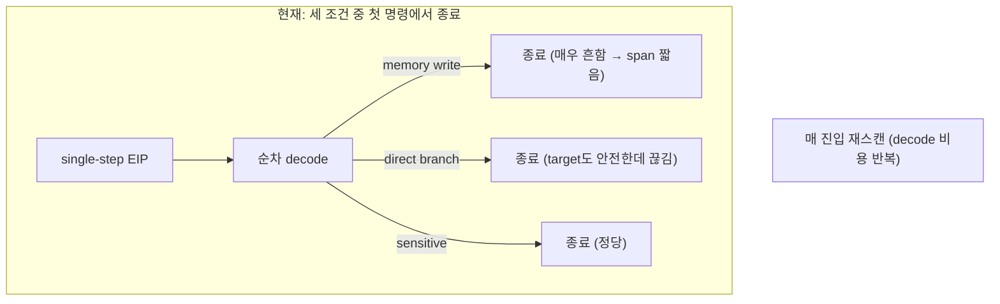
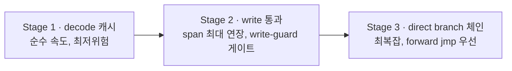
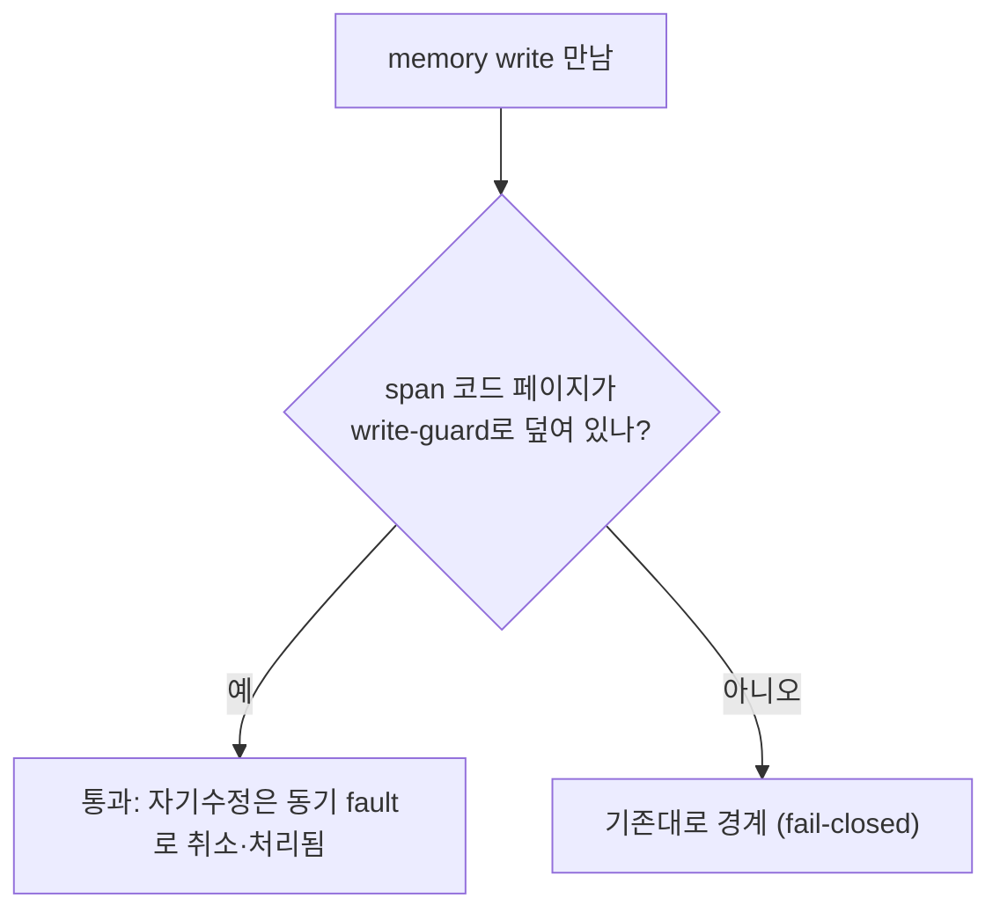

# 20260724-288 네이티브 직선 span 확장 / Native linear-span extension

## 한국어

### 1. 배경과 병목 재확인

Task 287로 `aot-dbt` fallback의 native linear span은 기본 활성화됐고, 직접 loader
3쌍 중앙값에서 single-step `-41.93%`, progress `+11.86%`, texture/draw/swap
`2/0/0 → 4/42/11`을 반복 확인했습니다.

이 결과가 방향을 확정합니다. `aot-dbt` 4단계 로드맵(Task 276~286)이 겨냥한 전이 경계
예외는 hot phase 기준 수만 건 규모(RET fallback 8,034, indirect 34,851)인데, 실제
지배적 비용은 fail-closed 구간의 **명령 단위 TF single-step 수백만 건**입니다. native
linear span은 그 수백만 건을 직접 줄이므로 처음으로 progress가 유의미하게 움직였습니다.

따라서 이번 작업은 전이 경계 dispatch를 더 손대는 대신, **span 하나가 네이티브로
실행하는 명령 수를 늘리고 span 진입 비용을 낮춰** single-step 절감을 심화합니다.

### 2. 현재 구현의 종료 조건과 한계

`ScanNativeLinearSpanWithZydis`([verified_region_analyzer.cpp:345](../../src/platform/win32/verified_region_analyzer.cpp#L345))는
현재 EIP부터 순차 디코드하여 다음 세 조건 중 **가장 먼저** 나타나는 명령에서 span을
끊습니다.

- `IsSensitive`: segment/interrupt/I/O/string/privileged/system
- `HasExplicitMemoryWrite`: 명시적 memory-write operand를 가진 명령
- `control_transfer`: `branch_type != NONE`인 모든 call/jump/cond/ret

그 앞에 안전 명령이 2개 이상일 때만 Dr0 실행 breakpoint를 경계 주소에 설치하고 TF를
끕니다. 상한은 64명령이고, **분석 결과를 cache하지 않아 매 진입마다 Zydis로 다시
스캔**합니다([native_linear_span.cpp:116](../../src/platform/win32/native_linear_span.cpp#L116)).

세 한계가 span 길이와 진입 비용을 직접 제약합니다.

- **memory write에서 종료**: 실제 코드에서 store는 매우 흔하므로 span이 짧게 끊깁니다.
  종료 이유는 span이 뒤쪽 자기 바이트를 self-modify하는 경우를 막기 위해서입니다
  (Task 275 §3).
- **direct branch에서 종료**: 네이티브 실행은 direct branch를 스스로 따라가는데도 Dr0
  경계가 branch에 걸려 매 branch마다 single-step 왕복이 발생합니다. Watcom 코드는
  forward `jmp`가 잦아 손실이 큽니다.
- **매 진입 재스캔**: 같은 EIP에서 span을 반복 진입해도 매번 Zydis 디코드를
  수행합니다. 수백만 진입 규모에서 순수 CPU 낭비입니다.

### 3. 세 개의 독립 확장 단계

각 단계는 게스트 실행 의미를 바꾸지 않고, 기존 Task 287 harness로 독립 A/B 가능하며,
실패 시 기존 fail-closed single-step으로 되돌아갑니다. 위험 대비 가치 순서로 배치합니다.

#### Stage 1 — page-generation 기반 decode 캐시 (순수 throughput, 최저 위험)

같은 EIP의 반복 진입에서 스캔 결과(`boundary_address`, `instruction_count`,
`boundary_sensitive`, `boundary_memory_write`)를 캐시합니다. 무효화 키는 **코드 페이지
generation**입니다. 페이지 coherence 계층이 이미 유지하는
`latest_generation`/`AllocateWin32AotGeneration`과 write-watch
([aot_page_coherence_win32.cpp](../../src/platform/win32/aot_page_coherence_win32.cpp))를
재사용하여, span 코드 페이지의 generation이 올라가면 해당 페이지에 걸린 캐시 항목만
버립니다.

- SMC 안전성을 완화하지 않습니다. stale span은 AOT 코드 coherence를 관장하는 바로 그
  generation 메커니즘으로 무효화됩니다.
- 캐시 miss/무효화/coherence 미추적 페이지는 기존과 동일하게 재스캔합니다(fail-safe).
- 신규 계측: decode 캐시 hit/miss.

#### Stage 2 — non-aliasing memory write 통과 (span 최대 연장)

memory write가 span을 끊는 유일한 이유는 store가 span의 아직 실행 안 한 바이트를
self-modify하는 경우입니다. **span 코드 페이지 전체가 write-guard(write-watch 또는
read-only 보호)로 덮여 있으면**, 그 페이지에 대한 어떤 store도 coherence 핸들러로
동기적으로 fault하므로 span 내부 자기수정은 실행 완료 전에 반드시 잡힙니다. 이 조건에서만
스캔이 memory write를 경계로 삼지 않고 통과합니다.

- guard 미적용 페이지에서는 기존대로 write를 경계로 유지합니다(fail-closed).
- span entry 자체가 write이면 기존 single-step fault/HLE 처리가 필요할 수 있고 통과 이득도
  작으므로 기존대로 경계로 유지합니다. 적어도 한 개의 일반 명령을 지난 뒤 만난 write만
  후보로 삼습니다.
- write memory operand의 base/index register가 같은 span의 앞선 명령에서 변경됐다면
  목적지 non-aliasing을 현재 CONTEXT로 보수적으로 판단할 수 없으므로 기존 경계로
  유지합니다.
- base/index가 entry CONTEXT와 같을 때도 effective write range를 계산해, 전체 범위가
  기존 guest memory 계약의 `runtime_base..runtime_size` 안에 있을 때만 통과합니다.
  범위 안에서는 write-watch page를 허용하고, 나머지 대상 page의 최초 접근에만
  `VirtualQuery`로 committed+writable을 확인해 page별 결과를 캐시합니다. 범위 밖,
  overflow, read-only 또는 미commit 주소는 DOS low-memory/fault/HLE 가능성이 있으므로
  기존 경계로 유지합니다. 반복 scan은 O(1) page-cache 조회를 사용합니다.
- span 실행 중 실제 자기수정 store가 발생하면 access-violation/guard 예외가
  `LeaveNativeLinearSpan(reached_boundary=false)` 취소 경로로 들어오고, 기존 coherence
  핸들러가 write를 처리한 뒤 다음 진입에서 재스캔합니다.
- 선결 검증: AOT 코드 backing 게스트 페이지의 write-guard 실제 커버리지를 확인합니다.
  커버리지가 부분적이면 덮인 페이지에서만 write를 통과합니다.
- 신규 계측: write-cross 횟수, guard 미커버로 인한 write 경계 유지 횟수,
  write-watch fault로 인한 정상 span 중단 횟수. 마지막 항목은 예상치 못한 cancel과
  분리합니다.

#### Stage 3 — direct control transfer 체인 (forward `jmp` 우선)

네이티브 실행은 direct branch를 스스로 따라가므로, 경계를 branch가 아니라 **taken
경로에서 다음에 실제로 도달하는 경계**에 두면 branch 자체의 single-step 왕복을 제거할 수
있습니다. loop로 인한 무한 대기를 피하기 위해 보수적으로 시작합니다.

- 1차: in-range·non-boundary target을 가진 **forward direct unconditional `jmp rel`**
  만 통과합니다. target이 entry보다 앞(backward)이면 loop 위험으로 종료합니다.
- conditional branch는 taken/not-taken 두 후속이 모두 경계이므로, 남은 Dr1으로 두 번째
  후속을 감시하는 확장을 2차 후보로 둡니다(현재 Dr0만 사용하고 Dr1~Dr3은 보존).
- indirect/far transfer, HLE boundary target, quarantine 페이지 target은 통과하지
  않습니다(fail-closed).
- 신규 계측: branch-chain 통과 횟수, backward/loop로 인한 종료 횟수.

### 4. 정확성 계약(공통)

- 게스트 바이트를 수정하지 않습니다. INT3 소유권/복원/SMC 문제가 없습니다(Task 275 계승).
- 예상치 못한 예외는 span을 취소하고 debug register와 TF를 복원한 뒤 기존 exception
  chain으로 넘깁니다.
- Stage 1/3 ON 실행은 `span_entry == span_boundary`, `span_cancel == 0`을 유지합니다.
  Stage 2는 실제 code alias store가 write-watch fault로 안전하게 중단될 수 있으므로
  `span_entry == span_boundary + span_write_fault_cancel`, 예상치 못한
  `span_cancel == 0`을 유지합니다. 모든 단계에서 fatal/legacy fallback 0과 EEPROM
  SHA-256 일치를 유지합니다.
- quarantine/SMC 정책과 AOT layout을 바꾸지 않습니다.

### 5. 검증

1. synthetic scanner probe 확장: (Stage 1) generation 무효화로 stale 캐시 미사용,
   (Stage 2) guard 커버 페이지에서만 write 통과, (Stage 3) forward-only jmp 체인과
   backward 종료.
2. Win32 x86 Debug 전체 빌드와 기존 AOT/inline-cache/SMC/native-span probe 통과.
3. 동일 binary·격리 EEPROM·교차 순서로 각 Stage를 OFF/ON A/B
   (`scripts/benchmark_native_linear_span.ps1`,
   `scripts/task287_direct_linear_span_ab.ps1` 재사용, Backend=`aot-dbt`).
4. single-step, progress, guest-instruction proxy, span entry/boundary/cancel,
   instruction_total, texture/draw/swap, fatal/exception, EEPROM hash를 함께 비교.

### 6. 판정과 승격 정책

각 Stage는 정확성 불변식을 모두 유지하면서 single-step을 반복 감소시키고 늦은 milestone을
악화시키지 않을 때만 기본 ON 승격 후보입니다. 단일 실행 초기화 timing 차이는 근거로
쓰지 않습니다. Task 287과 동일하게 supervisor 검열 시 직접 loader 3쌍으로 보완합니다.

## English

### 1. Background

Task 287 made the `aot-dbt` native linear span default-on and reproduced median
single-step -41.93%, progress +11.86%, and texture/draw/swap `2/0/0 → 4/42/11`. The
dominant cost is not the tens-of-thousands of transfer-boundary exceptions the four-stage
roadmap targeted, but the **millions of per-instruction TF single steps** in fail-closed
regions. Linear spans cut that population directly, so this task deepens span coverage
instead of touching transfer dispatch again: run more instructions natively per span and
lower per-entry scan cost.

### 2. Current termination limits

`ScanNativeLinearSpanWithZydis` decodes forward from EIP and stops at the first of an
HLE-sensitive instruction, an explicit memory write, or any control transfer, requiring at
least two safe instructions and a 64-instruction cap. It caches nothing, re-decoding on
every entry. Three limits constrain span length and entry cost: memory writes (very common)
cut spans short; direct branches stop the span even though native execution follows them;
and every entry re-runs Zydis.

### 3. Three independent extension stages

Each stage preserves guest semantics, is independently A/B-able with the Task 287 harness,
and fails closed to single-step. Ordered by risk-adjusted value.

- **Stage 1 — page-generation decode cache (pure throughput, lowest risk).** Cache scan
  results per entry EIP, invalidated by the code-page generation counter the coherence layer
  already maintains (`latest_generation` / `AllocateWin32AotGeneration` / write-watch). Stale
  spans are dropped by the same mechanism that governs AOT coherence, so SMC safety is
  unchanged. Misses, invalidations, and untracked pages rescan as today.
- **Stage 2 — cross non-aliasing memory writes (maximal span length).** A write ends a span
  only to prevent self-modification of not-yet-executed span bytes. If the span's code pages
  are fully write-guarded (write-watch or read-only), any store into them faults
  synchronously into the coherence handler before completing, so in-span self-modification is
  always caught. Under that predicate the scanner passes writes; otherwise it keeps the write
  boundary (fail-closed). Prerequisite: confirm write-guard coverage of AOT-backing guest
  pages; if partial, cross writes only on covered pages. A write at the span entry remains on
  the existing single-step path because it may require fault/HLE handling and offers little
  batching value; only writes reached after at least one ordinary instruction are candidates.
  If an earlier instruction in the same span modified the write operand's base or index
  register, the destination cannot be conservatively classified from the entry context and
  the write remains a boundary. Otherwise the scanner preflights the effective write range
  from the entry context and passes it only when the complete range lies inside the existing
  `runtime_base..runtime_size` guest-memory contract. Write-watched pages are allowed;
  other target pages are checked once with `VirtualQuery` for committed+writable protection
  and the result is cached per page. Out-of-range, overflowing, read-only, or uncommitted
  accesses remain on the existing DOS-low-memory/fault/HLE boundary. Repeated scans use the
  O(1) page cache instead of calling `VirtualQuery` again.
- **Stage 3 — chain across direct control transfers (forward `jmp` first).** Place the
  boundary at the next real boundary along the taken path instead of at the branch. Start
  conservatively: pass only forward direct unconditional `jmp rel` to an in-range, non-boundary
  target; stop on backward targets (loop risk). Conditional branches (two successors) are a
  second candidate using the still-free Dr1. Indirect/far/HLE/quarantine targets never pass.

### 4. Shared correctness contract

No guest byte is modified (inherits Task 275). Unexpected exceptions cancel the span, restore
debug registers and TF, and fall through to the existing exception chain. Stages 1 and 3
retain `span_entry == span_boundary` with zero cancellation. Stage 2 may stop safely on a
real write-watch fault, so its invariant is
`span_entry == span_boundary + span_write_fault_cancel` with zero unexpected cancellation.
Every stage retains zero fatal/legacy fallback and an unchanged EEPROM SHA-256.
Quarantine/SMC policy and AOT layout are unchanged.

### 5. Verification

Extend the synthetic scanner probe (generation invalidation; write-cross only on guarded
pages; forward-only jmp chaining with backward stop); pass the full Win32 x86 Debug build and
existing AOT/inline-cache/SMC/native-span probes; run per-stage OFF/ON A/B on the same binary
and isolated EEPROM in alternating order with the reused Task 287 scripts (Backend=`aot-dbt`),
comparing single-step, progress, the guest-instruction proxy, span entry/boundary/cancel,
instruction_total, texture/draw/swap, fatal/exception, and EEPROM hash.

### 6. Decision and promotion

A stage is a default-on candidate only if it repeatedly reduces single-step while preserving
every correctness invariant and not delaying late milestones. Single-run initialization timing
is not evidence. As in Task 287, supplement censored supervisor runs with three direct-loader
pairs.
