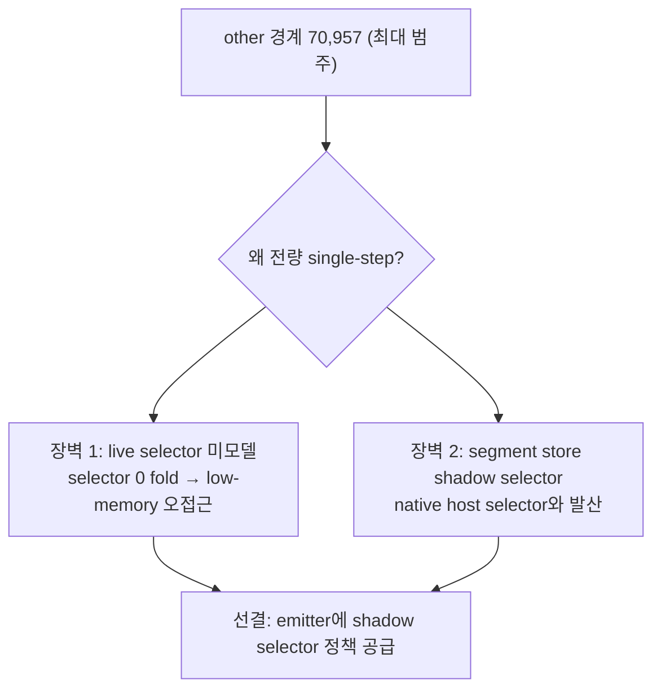
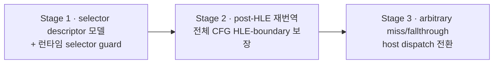
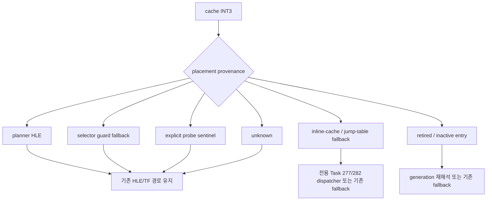

# 20260724-289 selector 인지 exception-free dispatch / Selector-aware exception-free dispatch

## 한국어

### 1. 배경과 최상한 병목

Task 280 로드맵 4단계는 RET과 indirect call/jump 경계를 다뤘지만, hot phase의 가장 큰
경계 범주는 `other` **70,957회**(일반 HLE boundary, 미번역 fallthrough, arbitrary cache
miss)입니다. 이 범주는 어떤 aot-dbt 단계도 건드리지 않았고 전량 `INT3`/VEH + TF
single-step으로 fail-closed합니다. 여기가 남은 최상한 지렛대입니다.

로드맵은 이 일반 dispatcher를 명시적으로 "이후 별도 설계 범위"로 미뤘습니다. 이유는 두
개의 확인된 정확성 장벽입니다.

1. **planner/emitter가 live selector 값을 모릅니다.** `mov es, ax`(ax=0) 직후 emitter는
   selector base 0을 `[eax+0]` 직접 native 접근으로 fold하지만, 이 시점의 selector 0은
   DOS low-memory HLE 의미가 필요합니다. 그래서 HLE 직후 cache miss를 그대로 번역하면
   `0xC0000005`로 죽습니다([aot-dbt-post-hle-reentry.md](../analysis/aot-dbt-post-hle-reentry.md)).
2. **segment-register store는 HLE boundary로 유지됩니다.** single-step 경로는 segment
   store에서 host selector가 아니라 게스트 **shadow** selector를 반환하므로, host selector를
   native로 저장하면 값이 발산합니다(Task 264 Phase 2 revert,
   [aot_translation_plan.cpp:124](../../src/runtime/aot_translation_plan.cpp#L124)).

즉 이 작업의 본질은 dispatcher 배관이 아니라 **emitter에 live segment/selector 정책을
공급하는 것**입니다. 현재 `kSegmentOverrideMem`은 정적 base를 fold하는 self-correcting
guard뿐이라, 번역 시점에 selector 0 저메모리와 flat descriptor를 구분하지 못합니다.

### 2. 설계 원칙

- **AGENTS.md**: 정확성을 최적화보다 우선합니다. 두 revert 선례(selector 0 저메모리,
  shadow selector 발산)를 회귀시키지 않는 것이 각 단계의 통과 조건입니다.
- selector 정책은 **게스트 shadow selector 상태**를 근거로 합니다. host segment register가
  아닙니다.
- 증명 불가 지점은 반드시 기존 provenance-aware `INT3`/VEH single-step으로 fail-closed
  합니다. dispatcher는 안전하게 제거 가능한 경계만 전환합니다.
- `legacy`, `aot`, `aot-dynamic`의 image layout과 실행 의미는 바꾸지 않습니다.

### 3. 단계별 계획 (기반 우선)

#### 구현 착수 전 정정 — Task 264 기반 재사용

코드 대조 결과 Task 264 Phase 3a가 이미 `ThreadContext::guest_{es,ss,ds,fs,gs}`의
shadow 주소와 값, `selector_table`의 descriptor base를 `kSegmentOverrideMem` guard에
공급합니다. 따라서 Stage 1은 새 selector 저장소나 새 emitter ABI를 만들지 않고 이
기반을 보강합니다.

확인된 공백은 두 가지입니다.

1. 현재 `Win32AotSegmentResolution::base == 0`은 정상 flat descriptor와 selector 0 또는
   descriptor 미해석을 구분하지 못합니다. 그 결과 selector 0도 guard가 일치하면
   `[offset+0]` 네이티브 접근으로 활성화될 수 있습니다.
2. 재해석 self-gate가 selector 값만 비교하므로 같은 selector의 descriptor base/limit가
   DPMI로 바뀌면 이전 folded base가 남을 수 있습니다.

Stage 1은 resolution에 descriptor 존재 여부, base, limit, flags, native-fold 가능 여부를
명시하고 전체 상태 fingerprint로 재해석합니다. selector 0과 전 구간이 DOS low-memory에
속하는 descriptor는 기존 HLE boundary로 남깁니다. selector가 0이 아닌 정상 flat
descriptor와 Task 264에서 검증된 GS non-flat base-add descriptor는 계속 guarded native로
사용합니다. descriptor limit를 매 접근에서 증명할 수 없는 기존 re-encode 범위는 넓히지
않으며, 새로 증명 불가능한 상태는 항상 boundary입니다.

실행당 fast-path hit를 세기 위한 emitted memory increment는 hot access 자체를 교란하므로
추가하지 않습니다. 대신 native 활성 site, low-memory HLE site, unresolved site를
재해석 시 집계하고, 실제 guard fallback은 기존 segment-override boundary 계측을
native-eligible mismatch와 HLE-required exit로 분류합니다.

#### Stage 1 (기반) — live selector descriptor 모델과 런타임 guard

emitter가 참조할 **selector → descriptor(base/limit/flat 여부) 정책**을 정의하고,
segment-override memory 접근을 **런타임 guarded native 접근**으로 방출합니다.

- fast path: 게스트 shadow selector가 기대한 flat descriptor로 여전히 매핑되면 base-folded
  native 접근을 수행합니다.
- guard exit: live shadow selector가 HLE 의미가 필요한 값(selector 0 / low-memory /
  non-flat)이면 folded 접근 대신 기존 HLE low-memory 핸들러로 나갑니다.

이로써 현재의 "boundary 대 정적 fold" 이분법을 "selector-guarded native 대 HLE-exit"로
바꿉니다. Stage 1 자체는 `other` 경계를 아직 제거하지 않지만, segment 접근을 정확성 guard와
함께 번역 가능하게 만드는 **선결 조건**입니다.

- 선결: 게스트 shadow selector 상태를 emitter/런타임에 노출하는 최종 구조를 확정합니다
  ([aot-dbt-post-hle-reentry.md](../analysis/aot-dbt-post-hle-reentry.md) 미확정 항목).
- 신규 계측: selector-guard fast-path hit, HLE-exit, guard mismatch 횟수.

구현 정정에 따라 비침습 계측은 fast-path **활성 site** 수, HLE-required site 수,
unresolved site 수와 실제 HLE-exit/mismatch 경계 수를 사용합니다.

#### Stage 2 — post-HLE cache miss 재번역 (전체 CFG HLE-boundary 보장)

Task 276은 HLE 직후 **기존 cache hit + 직선 preflight + segment-write barrier**로만 즉시
복귀합니다. Stage 1의 selector guard가 생기면, 새로 생성한 CFG 내부의 segment-override
접근이 guard를 달고 있으므로 low-memory HLE를 조용히 우회할 수 없습니다.

- 생성 CFG의 모든 명령이 (a) HLE boundary로 방출되거나 (b) Stage 1 selector guard를
  갖는지 검증하는 whole-CFG preflight를 추가합니다.
- 검증을 통과하면 HLE 직후 cache miss를 single-step 대신 즉시 번역·복귀합니다.
- 검증 실패는 기존 TF bridge를 유지합니다(fail-closed).
- 이 단계가 Task 276 post-HLE 크래시의 근본 조건(selector 0 fold 우회)을 제거합니다.

#### Stage 3 — arbitrary cache miss / 미번역 fallthrough의 host dispatch

Stage 1~2 위에서 남은 `other` 경계(arbitrary miss, 미번역 fallthrough)를 Task 277/282의
검증된 aot-dbt host-stack ABI로 dispatch합니다.

- 성공: `INT3`/VEH + single-step 왕복 없이 번역된 target으로 진입합니다.
- fail-closed: indirect target이 미지 영역으로 가거나, quarantine SMC 페이지거나, selector
  guard가 non-flat을 보고하면 기존 single-step으로 되돌립니다.
- 신규 계측: dispatch 시도/성공/원인별 fallback(RET Task 281 분류 방식 재사용).

### 4. 위험과 정직한 상한

이 작업은 item 288(native span)보다 상한이 높지만 정확성 위험도 높습니다. 핵심 난점은
shadow selector 상태 모델링이며, 두 revert 선례가 회귀 감시 기준입니다. 각 Stage는
synthetic probe(flat descriptor → native, selector 0 → HLE-exit)와 A/B 증거가 확보될
때까지 opt-in으로 유지하고, 정확성 불변식과 의미 milestone이 반복 재현될 때만 승격합니다.

item 288과의 관계: native span은 fail-closed 구간을 **번역 없이** 네이티브로 줄이고, item
289는 fail-closed 구간의 **모집단 자체를** 번역으로 줄입니다. 289가 번역 가능 집합을 넓힐수록
288이 나머지를 담당하므로 두 작업은 같은 수백만 규모 single-step 병목에서 상보적으로
누적됩니다.

### 5. 검증

1. synthetic selector-guard probe: shadow flat → folded native, shadow selector 0 →
   HLE-exit, mismatch → fail-closed.
2. whole-CFG HLE-boundary preflight probe: guard/boundary 누락 CFG는 재번역 거부.
3. Win32 x86 Debug 전체 빌드와 기존 AOT/inline-cache/SMC/DBT probe 통과.
4. 동일 binary·격리 EEPROM·교차 순서 A/B(Backend=`aot-dbt`): single-step, progress,
   `other` 경계 수, dispatch 회계, texture/draw/swap, fatal/exception, EEPROM hash.
5. 각 단계에서 EEPROM SHA-256과 의미 기반 Glide milestone이 control 경로와 일치.

## English

### 1. Background and the highest-ceiling bottleneck

The largest hot-phase boundary category is `other` at 70,957 (general HLE boundaries,
untranslated fallthrough, arbitrary cache misses). No aot-dbt stage touched it, and it all
fails closed to `INT3`/VEH + TF single-step. The roadmap deferred this general dispatcher
because of two confirmed correctness barriers: (1) the planner/emitter does not know live
selector values, so folding selector-0 base into a direct `[eax+0]` access after `mov es,ax`
crashes because selector 0 needs DOS low-memory HLE; (2) segment-register stores stay HLE
boundaries because single-step returns the guest *shadow* selector, not the host selector, so
a native host-selector store diverges (Task 264 Phase 2 revert). The real work is therefore
feeding the emitter a live segment/selector policy, not dispatcher plumbing.

### 2. Principles

Accuracy over optimization (AGENTS.md); not regressing the two revert precedents is each
stage's gate. The selector policy is grounded in the guest *shadow* selector state, not host
segment registers. Unprovable sites must fail closed to the existing provenance-aware
`INT3`/VEH single step. `legacy`, `aot`, and `aot-dynamic` layouts and semantics are
unchanged.

### 3. Foundation-first stages

Implementation reconnaissance found that Task 264 Phase 3a already supplies each emitted
guard with the address/value of `ThreadContext::guest_{es,ss,ds,fs,gs}` and the descriptor
base from `selector_table`. Stage 1 therefore reuses that ABI. The actual gaps are that
`base == 0` conflates a valid flat descriptor with selector zero or failed resolution, and
the re-resolution self-gate compares only selector values, missing same-selector
base/limit changes. Stage 1 adds explicit descriptor presence/base/limit/flags/native-fold
state and fingerprints the complete resolution. Selector zero and descriptors wholly in
DOS low memory stay HLE boundaries; valid nonzero flat descriptors and the Task-264-proven
GS non-flat base-add descriptor remain guarded-native. Per-access emitted increments would
perturb the hot path, so telemetry counts activated/HLE/unresolved sites at re-resolution
and classifies actual guard-boundary fallback as HLE-required versus eligible mismatch.

- **Stage 1 (foundation) — live selector descriptor model + runtime guard.** Define a
  selector→descriptor (base/limit/flat) policy the emitter consults, and emit segment-override
  accesses as runtime-guarded native accesses: a folded fast path when the shadow selector
  still maps to the expected flat descriptor, and a guard exit to the existing HLE low-memory
  handler when the live shadow selector needs HLE semantics (selector 0 / low-memory /
  non-flat). This replaces "boundary vs static fold" with "selector-guarded native vs HLE
  exit." Prerequisite: fix the structure that exposes guest shadow selector state to the
  emitter/runtime.
- **Stage 2 — post-HLE re-translation with whole-CFG HLE-boundary guarantee.** With the Stage 1
  guard, a freshly generated CFG's segment accesses carry the guard and cannot silently bypass
  low-memory HLE. Add a whole-CFG preflight verifying every instruction is either an HLE
  boundary or carries the selector guard; on pass, translate and re-enter the post-HLE miss
  instead of single-stepping; on failure, keep the TF bridge. This removes the root condition
  of the Task 276 post-HLE crash.
- **Stage 3 — host dispatch for arbitrary miss / untranslated fallthrough.** Route the
  remaining `other` boundaries through the proven Task 277/282 host-stack ABI. Fail closed for
  indirect targets into unknown regions, quarantined SMC pages, or non-flat selector reports.
  Reuse the Task 281 cause classification for fallback accounting.

### 4. Risk and honest ceiling

Higher ceiling than Task 288 but higher correctness risk; the crux is shadow-selector
modeling, watched against the two revert precedents. Each stage stays opt-in until synthetic
probes (flat→native, selector-0→HLE-exit) and A/B evidence reproduce the correctness
invariants and semantic milestones. Relation to Task 288: native spans shrink fail-closed
single-stepping *without translating*, while this task shrinks the fail-closed *population* by
translating more; as 289 widens the translatable set, 288 covers the remainder, so both
accumulate on the same millions-scale bottleneck.

### 5. Verification

Synthetic selector-guard probe (shadow flat→folded native; shadow selector-0→HLE-exit;
mismatch→fail-closed); whole-CFG HLE-boundary preflight probe (reject CFGs missing a
guard/boundary); full Win32 x86 Debug build and existing AOT/inline-cache/SMC/DBT probes;
same-binary isolated-EEPROM alternating A/B (Backend=`aot-dbt`) comparing single-step,
progress, `other`-boundary count, dispatch accounting, texture/draw/swap, fatal/exception, and
EEPROM hash; matching EEPROM SHA-256 and semantic Glide milestones at every stage.

## 한국어 — Stage 3 구현 전 provenance 게이트

코드 대조 결과, 초기 Stage 3 설명의 "미번역 fallthrough"는 현재 cache image의 정상
상태가 아닙니다. `BuildAotCodeCacheImage`는 direct call/jump, conditional edge, block
fallthrough의 target을 같은 image 안에서 `rel32`로 해소하지 못하면 image 생성을
실패시킵니다. 또한 임의 guest cache miss는 cache 안의 `INT3` 주소가 없으므로 그 자체로
`HandleAotReentry`의 breakpoint 경로에 들어오지 않습니다.

따라서 `other` opcode만 보고 모든 boundary를 host dispatch하면 planner HLE, selector
guard fallback, jump-table/inline-cache fallback, retired/inactive generation entry를 서로
구분하지 못해 정확성을 훼손합니다. Stage 3은 먼저 cache address와 placement metadata를
대조해 다음 provenance를 분리합니다.

provenance census에서 별도의 arbitrary-miss/fallthrough 모집단이 실제로 관찰되고 guest
target·stack ABI·HLE exclusion을 모두 증명할 수 있을 때만 exception-free tail을
추가합니다. 모집단이 0이면 Stage 3을 보류하고, `other`의 지배적인 planner HLE 명령을
정확하게 번역하는 별도 작업을 다음 성능 레버로 삼습니다.

## English — provenance gate before Stage 3 implementation

Code inspection corrects one premise of the original Stage 3 description: an untranslated
fallthrough is not a valid completed cache-image state. `BuildAotCodeCacheImage` rejects an
image unless direct, conditional, and block-fallthrough edges resolve to `rel32` targets
inside that image. An arbitrary guest cache miss also has no cache `INT3` address by itself,
so it cannot directly enter the breakpoint branch of `HandleAotReentry`.

Stage 3 therefore first classifies each cache breakpoint by placement provenance: planner
HLE, selector-guard fallback, inline-cache/jump-table fallback, retired/inactive generation
entry, explicit probe sentinel, or unknown. Only a separately observed population with a
provable guest target, stack ABI, and HLE exclusion may gain an exception-free tail. If that
population is zero, Stage 3 remains held and the next performance lever is faithful native
translation of the planner-HLE instructions that dominate `other`.

### 확인 결과 / Confirmed result

O(1) placement provenance index와 합성 probe를 추가한 뒤 60초 기본 `aot-dbt` 실행은
`HLE/segment/inline/jump-table/retired/probe/fixup/unknown =
22,248/7,064/34,912/0/7,298/0/0/0`을 기록했습니다. inline 34,912는 guest-opcode
return+indirect `6,463+28,449`와 정확히 같고, retired 7,298도 기존 retired-entry trap과
같습니다. 전체 cache breakpoint 71,522와 boundary 71,486의 차이 36은 retired trap에서
새 generation으로 즉시 복귀해 일반 boundary 회계를 건너뛴 횟수입니다. unknown은 0이므로
Stage 3b의 범용 host dispatch 모집단은 없습니다.

After adding the O(1) placement provenance index and synthetic probe, the 60-second default
`aot-dbt` run recorded `HLE/segment/inline/jump-table/retired/probe/fixup/unknown =
22,248/7,064/34,912/0/7,298/0/0/0`. Inline exactly matches guest-opcode
return+indirect (`6,463+28,449`), and retired exactly matches the existing retired-entry trap
counter. The 36-hit difference between all cache breakpoints (71,522) and ordinary boundaries
(71,486) is the retired-entry path that immediately re-enters a new generation before ordinary
boundary accounting. With unknown at zero, Stage 3b has no generic host-dispatch population.
