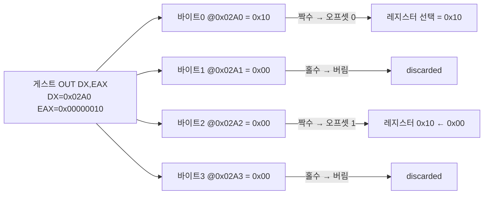
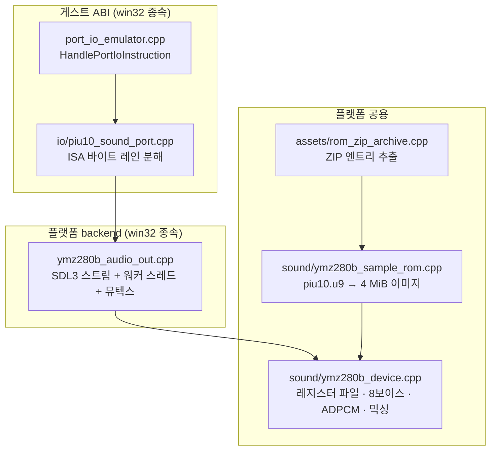
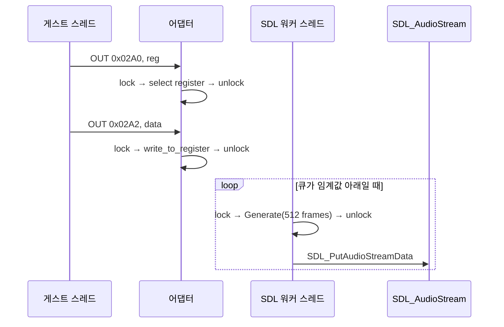

# 20260725-290 YMZ280B 사운드 에뮬레이션 / YMZ280B sound emulation

## 한국어

### 1. 배경

`pumpit1`(Pump It Up 1st Dance Floor, MK-3 하드웨어)의 효과음과 시스템 음성은 CD-DA가
아니라 **PIU10 ISA 보드에 실장된 Yamaha YMZ280B**가 재생합니다. 배경 음악은 CHD의
CD-DA 트랙에서 나오고(Task 249 계열, `CdAudioWaveOut`), 코인 투입음·메뉴 효과음 같은
짧은 음원은 보드에 붙은 4 MiB 샘플 ROM에서 나옵니다.

현재 구현은 이 경로가 통째로 비어 있습니다. `HandlePortIoInstruction`
([port_io_emulator.cpp:397](../../src/platform/win32/io/port_io_emulator.cpp#L397))은
`0x02A0`/`0x02A2` 쓰기를 `IsObservedPortInitializationWrite` 또는
`deferred-ignored`로 분류한 뒤 **원본 `OUT` 명령을 NOP으로 덮어씁니다**. 즉 게스트의
사운드 레지스터 쓰기는 무시될 뿐 아니라 최초 1회 실행 후 명령 자체가 파괴되어 이후
영구히 재실행되지 않습니다. 읽기 역시 `0x02A0`~`0x02AF` 전체가 JAMMA 입력 분기로
빨려 들어가 항상 `0xFF`를 반환합니다.

이 작업은 그 공백을 메워 **코인 투입 시 SDL 오디오 장치로 실제 소리가 나오는
지점까지** 구현합니다.

### 2. 하드웨어 사실 확인

MAME 드라이버 [src/mame/misc/xtom3d.cpp](https://github.com/mamedev/mame/blob/master/src/mame/misc/xtom3d.cpp)
(BSD-3-Clause)의 `isa16_xtom3d_io_sound`가 근거입니다. `pumpit1`은 이 보드를
`isa16_pumpitup_io_sound`로 상속해 입력 포트 정의만 교체합니다.

| 항목 | 확인된 값 | 출처 |
| :--- | :--- | :--- |
| 칩 | Yamaha YMZ280B, 8보이스 PCM/ADPCM | `YMZ280B(config, m_ymz, XTAL(16'934'400))` |
| 마스터 클럭 | 16.9344 MHz | 동일 |
| 샘플 ROM | `piu10.u9` 2 MiB, 영역 크기 4 MiB, 나머지 `0xFF` | `ROM_REGION(0x400000, "isa1:pumpitup_io_sound:ymz", ROMREGION_ERASEFF)` |
| 출력 | 스테레오 2채널 | `add_route(0, "speaker", 0.5, 0)` / `add_route(1, ..., 1)` |
| IRQ | 미배선 | `device_add_mconfig`에 irq handler 없음 |

`piu10.u8`은 사운드가 아니라 `board1:pumpitup_piu10:flash_u8` 영역의 별도 플래시이며
YMZ280B와 무관합니다.

#### 2.1 포트 디코드

ISA 16-bit 버스의 io_map은 다음과 같습니다.

```
map(0x00, 0x03).rw("ymz", read, write).umask16(0x00ff);
```

`umask16(0x00ff)`는 각 16비트 워드의 **하위 바이트만** 라우팅한다는 뜻입니다. 보드
베이스가 `0x02A0`이므로 실제 디코드는 다음과 같습니다.

| 게스트 포트 | YMZ280B 오프셋 | 쓰기 의미 | 읽기 의미 |
| :--- | :--- | :--- | :--- |
| `0x02A0` | 0 | 레지스터 번호 선택 | 외부 메모리 readback 래치 |
| `0x02A1` | — | 미디코드(버림) | 미디코드(`0xFF`) |
| `0x02A2` | 1 | 선택된 레지스터에 데이터 기록 | 상태 레지스터 |
| `0x02A3` | — | 미디코드(버림) | 미디코드(`0xFF`) |

기존 트레이스가 `0x02A0`에 width 4(`OUT DX, EAX`)로 `0x00000010`을 쓰는 것을
관찰했는데, 위 디코드 규칙과 정확히 맞습니다. 32비트 OUT은 바이트 레인 4개로 분해되어
`0x02A0`(레지스터 번호 `0x10`), `0x02A1`(버림), `0x02A2`(데이터 `0x00`),
`0x02A3`(버림)이 되므로 **레지스터 `0x10`에 `0x00`을 쓰는 1회 트랜잭션**입니다.
따라서 어댑터는 폭을 특별 취급하지 않고 바이트 레인 단위로 순차 분해합니다.



### 3. 설계 원칙과 계층 분리

AGENTS.md 구현 규칙("플랫폼 공용 상태/정책, 플랫폼 backend, guest ABI 연결처럼 책임이
다른 부분을 별도 header/source로 분리한다")에 따라 네 계층으로 나눕니다. 칩 코어는
SDL·Win32·게스트 개념을 전혀 모르고, 포트 어댑터는 오디오를 전혀 모릅니다.



| 파일 | 책임 | 플랫폼 종속 |
| :--- | :--- | :--- |
| `src/assets/rom_zip_archive.cpp` | `pumpit1.zip`에서 엔트리 1개를 메모리로 추출 | 없음 |
| `src/sound/ymz280b_sample_rom.cpp` | `piu10.u9`를 4 MiB `0xFF` 이미지에 배치 | 없음 |
| `src/sound/ymz280b_device.cpp` | 칩 상태·디코드·믹싱, 스테레오 s16 생성 | 없음 |
| `src/platform/win32/ymz280b_audio_out.cpp` | SDL3 출력, 워커 스레드, 잠금 | SDL3 |
| `src/platform/win32/io/piu10_sound_port.cpp` | ISA 포트 ↔ 칩 오프셋 변환 | 게스트 ABI |

### 4. 칩 코어

MAME `src/devices/sound/ymz280b.cpp`(BSD-3-Clause, Aaron Giles)의 알고리즘을 그대로
이식합니다. 프로젝트 기본 라이선스가 BSD-3-Clause이므로 라이선스 충돌이 없습니다.

#### 4.1 주소 단위

레지스터에 기록되는 주소는 **바이트 주소를 1비트 왼쪽 시프트한 "니블 단위"**입니다.
상위/중위/하위 바이트가 각각 `<<17`, `<<9`, `<<1`로 합성되므로 `position`은 항상
니블 단위이고, ROM 접근은 `read_byte(position / 2)`입니다. ADPCM은 샘플당 1,
PCM8은 2, PCM16은 4씩 전진합니다. 이 단일 규칙이 세 모드를 모두 덮으므로 모드별 주소
변환을 따로 두지 않습니다.

#### 4.2 샘플레이트와 보간

- 내부 스트림 레이트 = `master_clock / 384 * 2` = `16'934'400 / 384 * 2` = **88200 Hz**
- 보이스 전진량 `output_step` = ADPCM이면 `(fnum & 0xFF) + 1`, PCM이면 `(fnum & 0x1FF) + 1`
- `FRAC_BITS = 9`(`FRAC_ONE = 512`)이므로 소스 레이트 = `88200 * output_step / 512`
- 결과: ADPCM 최대 44.1 kHz, PCM 최대 88.2 kHz — 데이터시트 사양과 일치

출력은 88200 Hz로 고정 생성하고, 장치 샘플레이트 변환은 SDL3
`SDL_AudioStream`에 맡깁니다. 코어가 리샘플러를 따로 갖지 않습니다.

#### 4.3 믹싱 스케일

MAME는 보이스마다 `interp * vol / 2`를 `32768 * 256` 정규화로 누산합니다. 따라서
s16 변환은 `누산 / 256` 후 클램프입니다. MAME는 여기에 스피커 route 이득 `0.5`를
추가로 적용하지만, 이는 다른 사운드 소스와 섞기 위한 여유분이므로 본 구현은 **장치
출력 그대로**를 기준으로 하고 `REPIU_YMZ_VOLUME`으로 조정 가능하게 둡니다. 이 차이는
의도된 것이며 문서에 남깁니다.

#### 4.4 미구현 범위

- DSP 레지스터(`0x80`~`0x82`): MAME도 미구현. 로그만 남기고 무시.
- IRQ 전달: 실기 배선이 없으므로 상태 레지스터만 유지하고 인터럽트는 발생시키지 않음.
- 외부 RAM 쓰기(`0x87`): ROM 전용 구성이므로 무시.

### 5. 스레드 모델

게스트 스레드가 포트 트랩에서 레지스터를 쓰고, SDL 워커 스레드가 샘플을 생성합니다.
칩 상태는 뮤텍스 하나로 보호합니다.



MAME는 레지스터 쓰기 직전에 `m_stream->update()`로 그 시점까지의 샘플을 확정하지만,
본 구현은 게스트가 실제 하드웨어 속도로 도는 실시간 모델이므로 이미 큐에 들어간
블록에는 소급 적용되지 않습니다. 큐 깊이를 약 40 ms로 제한해 이 지연을 흡수합니다.

### 6. 수명과 배선

`CdAudioWaveOut`이 이미 확립한 패턴을 그대로 따릅니다.

- `ThreadContext`가 `Ymz280bAudioOut ymz_audio`와 `ymz_audio_available`을 소유
- `RunWin32ExecutionThread`에서 `cd_audio.Open` 바로 옆에서 `ymz_audio.Open(rom_zip)` 호출
- `SDL_InitSubSystem(SDL_INIT_AUDIO)`는 SDL3에서 참조 계수 방식이므로 CD-DA 경로와
  독립적으로 init/quit 쌍을 맞추면 안전합니다. 기존 파일은 건드리지 않습니다.
- ROM ZIP 경로는 `cd_chd_path`와 같은 방식으로 호출 계층에 파라미터를 추가해 전달

### 7. 포트 라우팅 변경

`HandlePortIoInstruction`에서 `0x02A0`~`0x02A3`을 **JAMMA 분기보다 먼저** 가로챕니다.

- 쓰기: NOP 패치하지 않고 EIP만 전진시켜 매번 재트랩합니다. EEPROM·JAMMA 경로가
  Task 327에서 같은 이유로 이미 이 방식으로 바뀌었습니다. 사운드 레지스터는 곡마다
  수천 번 갱신되므로 NOP 패치는 곧 무음을 의미합니다.
- 읽기: `0x02A0`은 readback 래치, `0x02A2`는 상태 레지스터를 반환합니다.

`IsObservedPortInitializationWrite`가 특별 취급하던 `0x02A0`/`0x02A2` 초기화 쓰기는
이제 정식 사운드 경로가 처리하므로 해당 분류는 제거합니다.

### 8. 검증 전략

소리는 자동 판정이 어려우므로 **객관적 증거를 남기는 계측**을 함께 넣습니다.

1. 빌드: `scripts/build_win32_x86.ps1` 성공
2. ROM 적재 로그: `[repiu-ymz] rom loaded entry=piu10.u9 bytes=2097152 crc=...`
3. 레지스터 트래픽 로그: 최초 쓰기 1회와 key-on마다
   `[repiu-ymz] keyon voice=N mode=... start=0x... rate=...Hz level=... pan=...`
4. 믹서 계측: 생성 블록 중 비무음(non-zero) 샘플 수 누적. 0이면 소리가 안 난 것
5. `REPIU_YMZ_WAV_PATH` 지정 시 생성된 스테레오 88200 Hz PCM을 WAV로 캡처 →
   파일 크기와 진폭으로 무음 여부를 사후 확인
6. 실행: 로더 구동 후 `F5`(COIN1) 입력 → 3·4·5의 증거가 동시에 나타나는지 확인

### 9. 비대상

- CD-DA 경로 변경, Glide/렌더 경로 변경
- AOT/DBT 실행 정책 변경
- YMZ280B IRQ 전달, DSP 레지스터, 외부 RAM 쓰기
- `piu10.u8` 플래시 영역 해석

---

## English

### 1. Background

Sound effects and system voices in `pumpit1` (Pump It Up 1st Dance Floor, MK-3
hardware) come from a **Yamaha YMZ280B on the PIU10 ISA board**, not from CD-DA.
Background music plays from the CHD's CD-DA tracks (`CdAudioWaveOut`), while short
cues such as the coin sound come from a 4 MiB sample ROM on the board.

That path is currently empty. `HandlePortIoInstruction`
([port_io_emulator.cpp:397](../../src/platform/win32/io/port_io_emulator.cpp#L397))
classifies `0x02A0`/`0x02A2` writes as `IsObservedPortInitializationWrite` or
`deferred-ignored` and then **overwrites the original `OUT` instruction with NOPs**.
Guest sound register writes are therefore not merely ignored — the instruction is
destroyed after its first execution and never runs again. Reads fall into the JAMMA
input branch for the whole `0x02A0`–`0x02AF` range and always return `0xFF`.

This task closes that gap **up to the point where inserting a coin produces audible
output through the SDL audio device**.

### 2. Confirmed hardware facts

The evidence is `isa16_xtom3d_io_sound` in the MAME driver
[src/mame/misc/xtom3d.cpp](https://github.com/mamedev/mame/blob/master/src/mame/misc/xtom3d.cpp)
(BSD-3-Clause). `pumpit1` inherits it as `isa16_pumpitup_io_sound`, replacing only
the input port definitions.

| Item | Confirmed value | Source |
| :--- | :--- | :--- |
| Chip | Yamaha YMZ280B, 8-voice PCM/ADPCM | `YMZ280B(config, m_ymz, XTAL(16'934'400))` |
| Master clock | 16.9344 MHz | same |
| Sample ROM | `piu10.u9` 2 MiB in a 4 MiB region, remainder `0xFF` | `ROM_REGION(0x400000, "isa1:pumpitup_io_sound:ymz", ROMREGION_ERASEFF)` |
| Output | Stereo, 2 channels | `add_route(0, "speaker", 0.5, 0)` / `add_route(1, ..., 1)` |
| IRQ | Not wired | no irq handler in `device_add_mconfig` |

`piu10.u8` is a separate flash in the `board1:pumpitup_piu10:flash_u8` region and is
unrelated to the YMZ280B.

#### 2.1 Port decode

The ISA 16-bit io_map is `map(0x00, 0x03).rw("ymz", read, write).umask16(0x00ff)`.
`umask16(0x00ff)` routes only the **low byte of each 16-bit word**. With the board
base at `0x02A0`:

| Guest port | YMZ280B offset | Write meaning | Read meaning |
| :--- | :--- | :--- | :--- |
| `0x02A0` | 0 | select register number | external memory readback latch |
| `0x02A1` | — | undecoded (discarded) | undecoded (`0xFF`) |
| `0x02A2` | 1 | write data to selected register | status register |
| `0x02A3` | — | undecoded (discarded) | undecoded (`0xFF`) |

An existing trace observed a width-4 (`OUT DX, EAX`) write of `0x00000010` to
`0x02A0`, which matches this decode exactly: the 32-bit OUT decomposes into four byte
lanes, giving register number `0x10` at `0x02A0` and data `0x00` at `0x02A2` — a
single transaction writing `0x00` to register `0x10`. The adapter therefore never
special-cases width; it decomposes byte lanes sequentially.

### 3. Design principles and layering

Per the AGENTS.md implementation rule about separating platform-neutral state,
platform backends, and guest ABI glue, the feature is split into four layers. The
chip core knows nothing about SDL, Win32, or the guest; the port adapter knows
nothing about audio.

| File | Responsibility | Platform-specific |
| :--- | :--- | :--- |
| `src/assets/rom_zip_archive.cpp` | extract one entry from `pumpit1.zip` into memory | no |
| `src/sound/ymz280b_sample_rom.cpp` | place `piu10.u9` into a 4 MiB `0xFF` image | no |
| `src/sound/ymz280b_device.cpp` | chip state, decode, mixing, stereo s16 output | no |
| `src/platform/win32/ymz280b_audio_out.cpp` | SDL3 output, worker thread, locking | SDL3 |
| `src/platform/win32/io/piu10_sound_port.cpp` | ISA port ↔ chip offset translation | guest ABI |

### 4. Chip core

The algorithm is ported from MAME `src/devices/sound/ymz280b.cpp` (BSD-3-Clause,
Aaron Giles). The project's baseline license is BSD-3-Clause, so there is no conflict.

**Address units.** Register-programmed addresses are **byte addresses shifted left by
one**, i.e. nibble units: the high/mid/low bytes compose as `<<17`, `<<9`, `<<1`.
`position` is therefore always in nibble units and ROM access is
`read_byte(position / 2)`. ADPCM advances by 1 per sample, PCM8 by 2, PCM16 by 4.
This single rule covers all three modes, so no per-mode address conversion exists.

**Sample rate and interpolation.** Internal stream rate is
`master_clock / 384 * 2` = 88200 Hz. The per-voice advance `output_step` is
`(fnum & 0xFF) + 1` for ADPCM and `(fnum & 0x1FF) + 1` for PCM, with `FRAC_BITS = 9`
(`FRAC_ONE = 512`), giving a source rate of `88200 * output_step / 512` — a maximum
of 44.1 kHz for ADPCM and 88.2 kHz for PCM, matching the datasheet. Output is
generated at a fixed 88200 Hz and device rate conversion is delegated to SDL3
`SDL_AudioStream`; the core contains no resampler.

**Mixing scale.** MAME accumulates `interp * vol / 2` per voice against a
`32768 * 256` normalization, so the s16 conversion is `accumulator / 256` followed by
a clamp. MAME additionally applies a `0.5` speaker route gain as headroom for mixing
with other sources; this implementation uses the **raw device output** instead and
exposes `REPIU_YMZ_VOLUME` for adjustment. The difference is deliberate and recorded.

**Out of scope inside the core.** DSP registers (`0x80`–`0x82`) are logged and
ignored (MAME does not implement them either); IRQ delivery is omitted because the
line is unwired on real hardware, though the status register is maintained; external
RAM writes (`0x87`) are ignored in a ROM-only configuration.

### 5. Thread model

The guest thread writes registers from the port trap while an SDL worker thread
generates samples; one mutex protects chip state. MAME calls `m_stream->update()`
immediately before each register write to freeze samples up to that instant. This
implementation runs the guest in real time, so writes cannot apply retroactively to
blocks already queued; queue depth is capped at roughly 40 ms to absorb the latency.

### 6. Lifetime and wiring

Following the pattern `CdAudioWaveOut` already established: `ThreadContext` owns
`Ymz280bAudioOut ymz_audio` and `ymz_audio_available`; `RunWin32ExecutionThread`
opens it next to `cd_audio.Open`; `SDL_InitSubSystem(SDL_INIT_AUDIO)` is reference
counted in SDL3, so matched init/quit pairs are safe alongside the CD-DA path and no
existing file needs to change. The ROM ZIP path is threaded through the call layers
the same way `cd_chd_path` is.

### 7. Port routing change

`HandlePortIoInstruction` intercepts `0x02A0`–`0x02A3` **before** the JAMMA branch.
Writes advance EIP and re-trap each time instead of NOP-patching — the same reason
the EEPROM and JAMMA paths changed in Task 327, and sound registers are updated
thousands of times per song, so NOP-patching would mean silence. Reads return the
readback latch for `0x02A0` and the status register for `0x02A2`. The
`IsObservedPortInitializationWrite` special case for these ports is removed because
the real sound path now handles them.

### 8. Verification strategy

Audio is hard to assert automatically, so instrumentation that leaves objective
evidence ships with the feature:

1. Build via `scripts/build_win32_x86.ps1`.
2. ROM load log: `[repiu-ymz] rom loaded entry=piu10.u9 bytes=2097152 crc=...`.
3. Register traffic log: first write once, plus one line per key-on with voice, mode,
   start address, rate, level, and pan.
4. Mixer instrumentation: cumulative count of non-silent generated samples. Zero
   means nothing was audible.
5. With `REPIU_YMZ_WAV_PATH` set, capture generated 88200 Hz stereo PCM to a WAV file
   so silence can be confirmed after the fact from size and amplitude.
6. Run the loader and press `F5` (COIN1); evidence from 3, 4, and 5 must appear
   together.

### 9. Out of scope

CD-DA path changes, Glide/render path changes, AOT/DBT execution policy changes,
YMZ280B IRQ delivery, DSP registers, external RAM writes, and interpretation of the
`piu10.u8` flash region.
