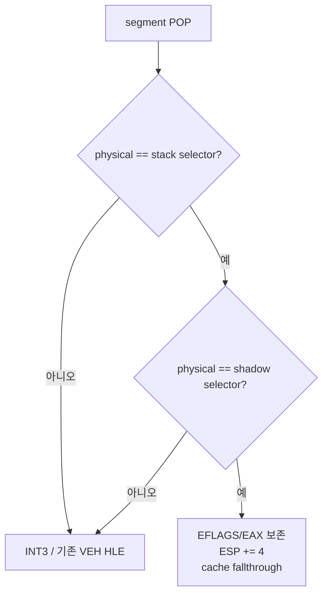

# 20260725-291 guarded segment-pop fast path 설계 / Guarded segment-pop fast-path design

## 한국어

### 1. 배경과 목표

Task 289의 60초 기본 `aot-dbt` 실행은 cache breakpoint provenance를
HLE/segment/inline/retired로 분리했고, planner HLE와 selector guard가 각각
`22,248`회와 `7,064`회임을 확인했습니다. arbitrary miss/fallthrough 모집단은 0이므로
다음 성능 레버는 남은 planner HLE/segment 명령의 충실한 번역입니다.

기존 Task 263 opcode census와 최근 장기 실행은 segment-pop, 특히 `0x07`(`POP ES`)가
고빈도 경계임을 반복해서 보여 줍니다. 이 명령은 guest selector를 실제 host segment
register에 무조건 적재할 수 없으므로 현재 planner HLE boundary와 VEH shadow emulation을
사용합니다.

이번 작업은 selector 값을 바꾸는 일반 segment load를 번역하지 않습니다. 대신
**현재 물리 selector, 현재 shadow selector, guest stack의 pop 대상 selector가 이미 같은
경우**만 상태 변경 없는 segment-pop으로 증명하고 cache 안에서 처리합니다. 하나라도
다르면 기존 HLE로 fail-closed합니다.

### 2. 대상 명령

- `07`: `POP ES`
- `1F`: `POP DS`
- `0F A1`: `POP FS`
- `0F A9`: `POP GS`

`POP SS`는 interrupt-inhibit 의미와 stack-segment 교체 위험이 있으므로 범위에서
제외합니다. operand/address-size prefix가 붙은 형태도 첫 단계에서는 제외합니다.

### 3. 방출 계약

planner는 정확히 위 네 plain opcode만 새 `kGuardedSegmentPop` record로 분류합니다.
record는 segment register 번호와 guest fallthrough를 보존하고 block을 끝냅니다.

emitter는 다음 의미의 코드를 방출합니다.

```text
pushfd
push eax
mov ax, Sreg
cmp ax, word [original_guest_esp]
jne fallback
cmp ax, word [shadow_selector]
jne fallback
pop eax
popfd
lea esp, [esp+4]
jmp translated_fallthrough
fallback:
pop eax
popfd
int3
```

- `pushfd`와 `push eax` 뒤 원래 guest `[ESP]`는 `[ESP+8]`입니다.
- 성공 조건은 `physical == stack == shadow`입니다. selector 값과 descriptor 상태가
  바뀌지 않으므로 `RecordGuestSegmentLoad`/descriptor 등록/segment override 재해석이
  필요 없습니다.
- `lea esp,[esp+4]`는 guest flags를 바꾸지 않고 원본 32-bit pop의 stack 효과만
  적용합니다.
- EAX와 EFLAGS는 성공·fallback 양쪽에서 보존됩니다.
- fallback `INT3`에 도달할 때 guest ESP와 모든 guest register/flags는 진입 상태와
  같으므로 기존 `HandleSegmentPopInstruction`이 원본 명령을 그대로 처리합니다.
- shadow selector 절대 주소는 Win32 placement에서 patch합니다. 주소를 결정할 수 없으면
  slot 시작을 `INT3`로 바꿔 기존 HLE만 사용합니다.



### 4. 정확성 경계

- guest byte, selector table, descriptor generation, quarantine/SMC 정책을 바꾸지 않습니다.
- 실제 selector 변경과 physical/shadow divergence는 기존 HLE boundary에 남습니다. stack
  word read는 원본 POP와 같은 guest stack mapping을 사용하며 별도 주소를 합성하지 않습니다.
- cache image의 fallback `INT3`는 별도 segment-pop provenance로 인덱싱하지 않고
  planner HLE로 집계하여 기존 정확성 회계를 유지합니다.
- 정적 image와 dynamic append 모두 같은 site patch와 address-map 계약을 사용합니다.
- whole-CFG HLE coverage 검증은 guarded segment-pop의 시작 opcode, 두 guard, fallback
  `INT3`, fallthrough fixup을 구조적으로 확인합니다.

### 5. 검증과 판정

1. synthetic probe에서 네 opcode 분류, 방출 decode, patch 위치, fallback layout,
   unsupported `POP SS`/prefixed form의 HLE 유지 여부를 확인합니다.
2. Win32 x86 Debug 전체 빌드와 기존 AOT/DBT/selector/coherence probe를 통과합니다.
3. 같은 binary와 격리 EEPROM으로 명시적 OFF/ON 교차 A/B를 수행합니다.
4. fast-path success/fallback, planner HLE/segment provenance, single-step, progress,
   texture/draw/swap, fatal/legacy fallback, EEPROM hash를 비교합니다.

성공 조건은 모든 정확성 불변식과 late milestone을 유지하면서 success가 실제로
관찰되고 single-step 또는 wall-clock progress가 반복 개선되는 것입니다. 모집단이
없거나 성능 이득이 재현되지 않으면 기본 OFF로 유지합니다.

### 6. 측정 결과와 기본 정책

동일한 Win32 x86 Debug binary, `aot-dbt`, native linear span ON, 4-slot indirect cache,
격리 EEPROM으로 OFF/ON을 비교했습니다.

| 실행 | 항목 | OFF | ON | 변화 |
|---|---|---:|---:|---:|
| 20초 | progress | 8,399 | 8,671 | +3.24% |
| 20초 | single-step | 59,418 | 45,175 | -23.97% |
| 55초 | progress | 37,606 | 39,571 | +5.23% |
| 55초 | triangle draw | 412 | 468 | +13.59% |
| 55초 | AOT boundary | 74,724 | 59,334 | -20.60% |
| 55초 | single-step | 252,701 | 246,644 | -2.40% |

55초 ON의 guarded segment-pop은 success/fallback `21,011/1,593`, 성공률
`92.95%`였습니다. 두 장기 실행 모두 exit 0의 graceful timeout, fatal 0,
AOT legacy fallback 0이었고 EEPROM SHA-256은 fixture와 일치했습니다.

따라서 `aot-dbt`에서 환경 변수 미지정은 guarded segment-pop ON으로 승격합니다.
`REPIU_AOT_GUARDED_SEGMENT_POP=0|off|false`와 알 수 없는 값은 진단과 회귀
bisect용 fail-closed opt-out입니다.
다른 backend는 계속 비활성입니다.

## English

### 1. Background and goal

Task 289 separated cache-breakpoint provenance and measured 22,248 planner-HLE and 7,064
selector-guard exits in a 60-second baseline `aot-dbt` run. It found no arbitrary
miss/fallthrough population, making faithful translation of the remaining HLE/segment
instructions the next performance lever. Earlier opcode census and recent long runs repeatedly
identify segment pops, especially `07` (`POP ES`), as frequent boundaries.

This task does not translate a general selector-changing load. It recognizes only a
no-state-change segment pop: the physical segment selector, shadow selector, and selector at
the top of the guest stack must already be equal. Any mismatch falls closed to the existing
INT3/VEH shadow emulation.

### 2. Scope and emitted contract

The initial scope is plain `POP ES`, `POP DS`, `POP FS`, and `POP GS`. `POP SS` and prefixed
forms remain HLE boundaries. A new `kGuardedSegmentPop` record ends its block and carries the
segment register and guest fallthrough.

The emitted slot preserves EFLAGS and EAX, reads the physical segment into AX, compares it
with both the original guest stack word and the absolute shadow-selector word, then either:

- restores EAX/EFLAGS, advances ESP by four with `lea`, and jumps to the translated
  fallthrough; or
- restores the exact entry state and reaches INT3 so the existing
  `HandleSegmentPopInstruction` processes the original instruction.

Because the success predicate proves that selector state does not change, it skips
`RecordGuestSegmentLoad`, descriptor registration, and selector-site re-resolution without
changing their semantics. Placement patches the shadow and success/fallback counter
addresses; an unavailable shadow address turns the slot start into an HLE boundary.

### 3. Correctness and verification

Guest bytes, selector tables, descriptor generations, quarantine, and SMC policy remain
unchanged. Real selector changes and physical/shadow divergence retain the existing HLE path.
The stack-word read uses the same guest-stack mapping as the original POP and synthesizes no
alternate address. Static placement and dynamic append use the same site contract, and
whole-CFG validation structurally verifies both guards, fallback INT3, and fallthrough.

Synthetic probes cover classification, layout, patch offsets, fallback, and rejected forms.
The full Win32 x86 Debug build and existing AOT/DBT/selector/coherence probes must pass.
Alternating same-binary, isolated-EEPROM OFF/ON runs compare fast-path success/fallback,
provenance, single-step, progress, late Glide milestones, fatal/fallback state, and EEPROM
hash. Default promotion requires an observed population and repeated throughput improvement
without any correctness or milestone regression.

### 4. Measured result and default policy

With the same Win32 x86 Debug binary, isolated EEPROM, `aot-dbt`, native linear spans, and a
four-entry indirect cache, the 20-second ON run improved progress by 3.24% and reduced
single-step by 23.97%. In the reversed-order 55-second comparison, ON improved progress from
37,606 to 39,571 (+5.23%) and triangle draws from 412 to 468 (+13.59%), while reducing AOT
boundaries from 74,724 to 59,334 (-20.60%). Guarded success/fallback was 21,011/1,593, a
92.95% success rate. Both long runs exited through graceful timeout with zero fatal and AOT
legacy fallback counts, and their EEPROM hashes matched the fixture.

The path is therefore default-on for `aot-dbt` when the environment variable is unset.
`REPIU_AOT_GUARDED_SEGMENT_POP=0|off|false` and unknown values are fail-closed
diagnostic/bisect opt-outs. Other backends remain disabled.