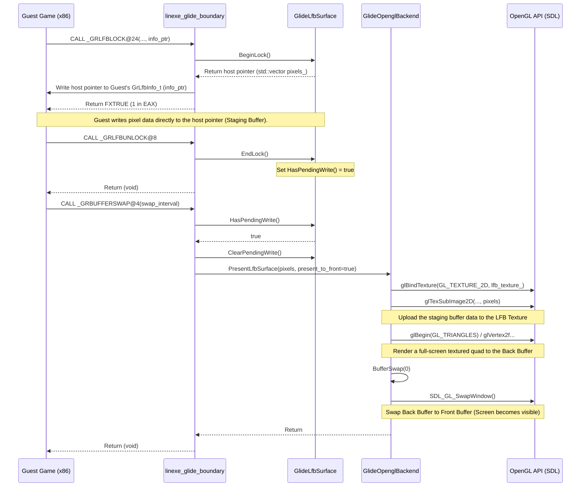

# Glide LFB to OpenGL Sequence Diagram

이 문서는 Guest 어플리케이션이 Glide LFB(Linear Frame Buffer) API를 호출하여 화면에 픽셀을 직접 쓰고, 이것이 내부적으로 OpenGL 텍스처로 변환되어 최종 화면에 출력(SwapBuffers)되기까지의 전체 흐름을 정리한 것입니다.

This document summarizes the overall flow from when a Guest application calls the Glide LFB API to directly write pixels to the screen, to how this is internally converted into an OpenGL texture and finally presented to the screen via SwapBuffers.

## Sequence Diagram

## 동작 상세 설명 (Detailed Explanation)

1. **`grLfbLock` 호출 (Lock Phase)**
   - Guest가 프론트 버퍼(또는 백 버퍼)에 직접 접근하기 위해 `grLfbLock`을 호출합니다.
   - `linexe_glide_boundary`는 이를 가로채어 `GlideLfbSurface`에 락을 요청합니다.
   - 호스트 측에 할당된 안전한 메모리 공간(`std::vector<uint8_t> pixels_`)의 포인터를 획득하여, Guest가 전달한 구조체 포인터(`info_ptr`)에 기록한 뒤 `FXTRUE`를 반환합니다.

2. **픽셀 기록 (Pixel Writing Phase)**
   - Guest는 반환받은 포인터(실제로는 Win32 가상 메모리에 매핑된 호스트 메모리)에 memcpy 등으로 직접 픽셀을 씁니다. 에뮬레이터 개입 없이 직접 기록되므로 속도가 빠릅니다.

3. **`grLfbUnlock` 호출 (Unlock Phase)**
   - 픽셀 기록을 마친 Guest가 락을 해제합니다.
   - `GlideLfbSurface::EndLock()`이 호출되며, 내부에 "대기 중인 LFB 데이터가 있음(`HasPendingWrite() = true`)"을 표시합니다.

4. **`grBufferSwap` 호출 및 화면 렌더링 (Swap & Presentation Phase)**
   - Guest가 최종적으로 프레임을 완성하여 화면을 전환하기 위해 `grBufferSwap`을 호출합니다.
   - 바운더리 레이어에서 먼저 `HasPendingWrite()`를 확인합니다. LFB에 쓰인 데이터가 있다면 `GlideOpenglBackend::PresentLfbSurface()`를 호출합니다.
   - **OpenGL 처리**: LFB의 픽셀 데이터를 `glTexSubImage2D`를 통해 OpenGL 텍스처로 업로드합니다. 그런 다음, 이 텍스처를 씌운 거대한 화면 크기의 사각형(Quad/Triangles)을 현재의 **백 버퍼(Back Buffer)**에 그립니다.
   - **SwapBuffers**: 프론트 버퍼로의 출력을 요구받았으므로(`present_to_front = true`), `BufferSwap(0)`(내부적으로 `SDL_GL_SwapWindow`)을 호출하여 백 버퍼와 프론트 버퍼를 교체합니다. 이 순간 Guest가 쓴 LFB 픽셀이 최종적으로 화면에 표시됩니다.
