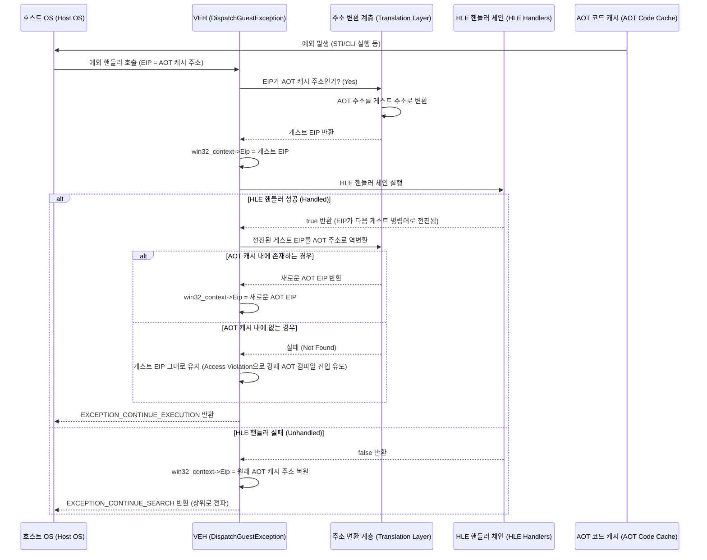
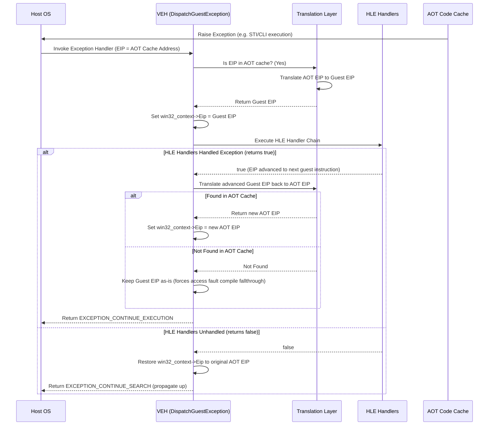

# 20260725-295 AOT HLE 트랩 주소 변환 설계 / AOT HLE trap address translation design

## 한국어

### 1. 배경과 목표

AOT DBT(dynamic binary translation) 모드(`aot-dbt`)에서는 게스트 코드가 AOT 코드 캐시 안에서 네이티브로 실행됩니다. 이때 게스트 실행 중에 `STI`, `CLI` 같은 특권 명령어나 세그먼트 레지스터 로드 명령어 등 HLE 트랩 대상 명령어가 실행되면 호스트 CPU에서 일반 보호 오류(#GP, `0xC0000096`)나 세그먼트 한계 오류(Access Violation, `0xC0000005`) 등의 예외가 발생합니다.

예외 발생 시 벡터 예외 처리기(VEH)인 `DispatchGuestException`이 트리거되나, 이 시점의 `win32_context->Eip`는 AOT 코드 캐시 영역 내의 주소를 가리키고 있습니다. 이 영역은 게스트 메모리 범위(`IsGuestInstructionPointer`가 참을 반환하는 영역) 외부이므로, 기존의 HLE 예외 처리 핸들러들(`HandlePrivilegedTrapInstruction`, `HandleDosMemoryAccess` 등)이 게스트 명령어 번역 및 상태 전이 처리에 실패(가독성 검증 실패로 `false` 반환)하게 되어 최종적으로 프로세스가 비정상 종료됩니다.

본 설계의 목표는 `DispatchGuestException` 내부에서 HLE 예외 처리 핸들러들을 호출하기 직전에 예외 발생 주소(AOT 캐시 주소)를 대응되는 게스트 주소로 변환하여 핸들러가 정상적으로 명령어를 분석하고 가상 레지스터 및 메모리 상태를 수정할 수 있도록 지원하는 것입니다. 또한, 핸들러가 해당 예외를 성공적으로 처리하여 EIP를 다음 게스트 명령어로 전진시킨 경우, 이를 다시 AOT 캐시 주소로 역변환하여 AOT 실행 흐름을 네이티브 상에서 중단 없이 지속할 수 있도록 합니다.

---

### 2. 예외 처리 주소 변환 흐름

1. **AOT 주소 판별 및 변환**:
   - `win32_context->Eip`가 AOT 캐시 영역 내의 주소인지 판별합니다.
   - AOT 주소인 경우 `FindAotGuestAddress`를 사용하여 대응되는 게스트 주소(`guest_eip`)를 찾습니다.
   - 찾은 경우 `win32_context->Eip`를 `guest_eip`로 일시적으로 업데이트하고 주소 변환이 발생했음을 기록합니다.

2. **HLE 핸들러 호출**:
   - 게스트 주소로 변환된 컨텍스트를 사용하여 기존 HLE 핸들러 체인을 호출합니다.
   - 핸들러들은 게스트 주소의 게스트 메모리 내용을 읽어 분석을 수행하고, EIP를 적절히 전진시킵니다.

3. **EIP 복원 및 역변환**:
   - **HLE 핸들러가 예외를 처리한 경우 (`true` 반환)**:
     - 전진된 `win32_context->Eip`(게스트 주소)를 `FindAotCacheAddress`를 사용하여 AOT 코드 캐시 주소(`new_cache_eip`)로 역변환합니다.
     - 역변환에 성공한 경우 `win32_context->Eip`를 `new_cache_eip`로 업데이트하여 AOT 실행을 연속합니다.
     - 만약 다음 게스트 주소가 아직 번역되지 않아 역변환에 실패한 경우, `win32_context->Eip`를 게스트 주소 상태로 둡니다. 이 경우 다음 게스트 코드 실행 시 게스트 페이지 보호 가드에 의해 새로운 컴파일 및 DBT 진입 인터셉트가 정상적으로 동작하게 됩니다.
   - **HLE 핸들러가 예외를 처리하지 못한 경우 (`false` 반환)**:
     - `win32_context->Eip`를 원래의 AOT 캐시 발생 주소로 복원하여 예외 분석 및 텔레메트리 덤프가 정확히 수행되도록 합니다.

---

### 3. 처리기 동작 시퀀스

---

### 4. 검증 계획

1. **AOT/DBT 활성화 테스트**:
   - `REPIU_EXECUTION_BACKEND=aot-dbt` 환경변수를 설정하고 부팅을 수행합니다.
   - 게스트 진입 후 첫 `STI` 명령어 위치에서 예외를 정상 포착하고 AOT EIP -> 게스트 EIP -> 다음 AOT EIP 변환이 연속적으로 수행되는지 검증합니다.
2. **HLE 연속성 검증**:
   - `STI`, `CLI`, 포트 I/O, DPMI 인터럽트 및 세그먼트 로드 예외가 AOT 캐시 실행 중 발생했을 때 정상적으로 HLE 로직이 수행되어 충돌 없이 계속 전진하는지 관찰합니다.
   - `grLfbLock` 및 `grLfbUnlock` 구간 도달과 `build/texture_dumps/` 내의 BMP 덤프 생성을 검증합니다.

---
---

## English

### 1. Background and Goals

In AOT DBT (dynamic binary translation) mode (`aot-dbt`), guest code executes natively inside the AOT code cache. During guest execution, HLE trap candidate instructions such as `STI`, `CLI`, or segment register loads trigger exceptions like General Protection Fault (#GP, `0xC0000096`) or Access Violation (`0xC0000005`) on the host CPU.

When an exception occurs, the Vectored Exception Handler (VEH) `DispatchGuestException` is triggered, but at this moment `win32_context->Eip` points inside the AOT code cache. Because this cache address is outside the guest memory range (where `IsGuestInstructionPointer` returns true), existing HLE trap handlers (`HandlePrivilegedTrapInstruction`, `HandleDosMemoryAccess`, etc.) fail to analyze the instruction (returning `false` due to readability check failures), eventually causing the process to crash.

The goal of this design is to translate the exception address (AOT cache address) to the corresponding guest address right before invoking the HLE handlers in `DispatchGuestException`. This allows the handlers to successfully decode instructions and update the virtual registers and memory state. If a handler successfully processes the instruction and advances EIP, we translate the advanced guest EIP back to the AOT code cache address using `FindAotCacheAddress`, allowing native AOT execution to continue seamlessly.

---

### 2. Exception Address Translation Flow

1. **AOT Address Detection & Translation**:
   - Determine if `win32_context->Eip` points inside the AOT cache.
   - If it is an AOT address, resolve the corresponding guest address (`guest_eip`) using `FindAotGuestAddress`.
   - Update `win32_context->Eip` to `guest_eip` temporarily and record that translation has occurred.

2. **HLE Handler Invocation**:
   - Invoke the HLE handler chain using the translated context.
   - Handlers read the guest memory at the translated address, analyze it, and advance the EIP as appropriate.

3. **EIP Restoration & Reverse Translation**:
   - **If an HLE handler successfully processes the exception (returns `true`)**:
     - Translate the advanced `win32_context->Eip` (guest address) back to the AOT code cache address (`new_cache_eip`) using `FindAotCacheAddress`.
     - On successful reverse translation, update `win32_context->Eip` to `new_cache_eip` to continue native AOT execution.
     - If reverse translation fails (because the next block has not been compiled yet), leave `win32_context->Eip` as the guest address. The next execution attempt will hit a guest memory guard, triggering DBT translation and interception as designed.
   - **If HLE handlers fail to process the exception (returns `false`)**:
     - Restore `win32_context->Eip` to the original AOT cache address to ensure exception reporting and telemetry capturing remain accurate.

---

### 3. Handler Execution Sequence

---

### 4. Verification Plan

1. **AOT/DBT Boot Test**:
   - Set environment variable `REPIU_EXECUTION_BACKEND=aot-dbt` and boot the loader.
   - Verify that when the guest hits the first `STI` instruction, the exception is caught, and the sequence AOT EIP -> Guest EIP -> Next AOT EIP occurs correctly.
2. **HLE Continuity Verification**:
   - Monitor that HLE handlers handle `STI`/`CLI`, Port I/O, DPMI interrupts, and segment loads cleanly during AOT execution without crashes.
   - Verify that execution reaches Glide Frame Loops (`grLfbLock` / `grLfbUnlock`) and correctly dumps BMP files into `build/texture_dumps/`.
