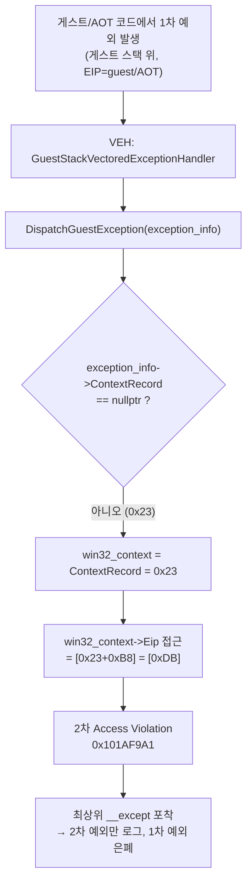
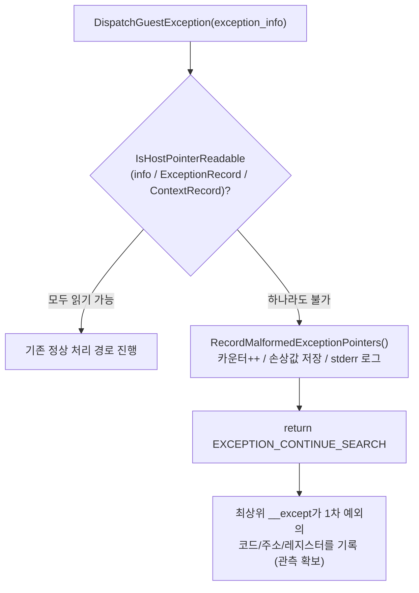

# 20260726-296 DispatchGuestException 관측 견고화 / DispatchGuestException observability hardening

## 한국어

### 1. 배경 (Background)

`feature/glide-lfb-fix` 브랜치의 선점형 INT 8 타이머 주입(작업 294) 도입 이후, 게스트가 타이머 폴링 busy-wait를 돌파하여 Glide 초기화 시퀀스를 훨씬 멀리 진행하게 되었다. 그러나 실행 후반부에서 호스트가 다음 예외로 조기 종료된다.

```
Win32 minimal execution exception address: 0x101AF9A1
  → repiu::platform::win32::DispatchGuestException + 0xB1
    execution_trampoline.cpp:2379
exception code: 0xC0000005 (Access Violation)
fault VA: 0x000000DB, ECX=0x00000023, EAX=0x00000023
faulting bytes: 83 B9 B8 00 00 00 00 (CMP dword ptr [ECX+0xB8], 0)
```

x86 `CONTEXT` 구조체에서 `Eip` 필드 오프셋은 정확히 `0xB8`이다. 즉 이 명령은
[execution_trampoline.cpp:2379](../../src/platform/win32/execution/execution_trampoline.cpp)의
`if (win32_context->Eip == 0U)`이며, 이때 `win32_context`(= `exception_info->ContextRecord`)가
`0x23`이라는 쓰레기 비-null 포인터였다. `0x23 + 0xB8 = 0xDB`가 fault VA와 정확히 일치한다.

즉 이 크래시는 **Glide 함수의 크래시가 아니라 예외 디스패처 자신의 2차 크래시**이다. 원본(1차)
게스트 예외를 처리하러 진입한 VEH가 손상된 `EXCEPTION_POINTERS`를 역참조하며 죽었고, 이 2차
예외가 최상위 `__except`에 잡혀 로그에 기록되었다. **정작 원인이 되는 1차 예외는 완전히 가려졌다.**

### 2. 근인 분석 (Root cause)

`DispatchGuestException` 진입부의 가드는 `exception_info->ContextRecord == nullptr`만 확인한다.

```cpp
if (context == nullptr ||
    exception_info == nullptr || exception_info->ContextRecord == nullptr)
{
    return EXCEPTION_CONTINUE_SEARCH;
}
...
CONTEXT* win32_context = exception_info->ContextRecord;
if (win32_context->Eip == 0U)   // 2379: ContextRecord=0x23 이면 여기서 AV
```

`0x23`은 비-null이므로 이 가드를 통과하고 2379에서 역참조되어 죽는다.

`ContextRecord`가 `0x23` 같은 값이 되는 배경은 이미 `docs/analysis/current-execution-frontier.md`에
기록된 **게스트 스택 / TIB 경계 불일치** 문제와 맞닿아 있다. 게스트 전용 스택으로 전환된 상태에서
예외가 발생하면, TIB의 Stack Base/Limit이 여전히 호스트 스택을 가리켜 Windows의 예외 디스패치가
게스트 스택 위에서 정상적인 `EXCEPTION_POINTERS`/`CONTEXT`를 구성하지 못하는 상황이 발생할 수 있다.
로그의 AOT return trace가 6000건 이상 전부 mismatch(expected `0x030F688D` vs actual `0x0301A8EC`)인
점, ContextRecord 손상값 `0x23`이 선점 주입이 스택에 푸시하는 `segcs`(`0x23`)와 동일한 점은 게스트
스택/리턴 손상이라는 근인을 뒷받침한다.

이 문서(296)는 근인 자체를 고치는 것이 아니라, **2차 크래시를 제거하여 가려진 1차 예외를 관측
가능하게 만드는 견고화**를 다룬다. 근인(선점 주입의 IF 게이트/중첩 방지, 게스트 스택 TIB 정합)은
1차 예외가 노출된 뒤 후속 작업으로 다룬다.

### 3. 인과 사슬 (Causal chain)



### 4. 설계 (Design)

진입부에서 `EXCEPTION_POINTERS`, `ExceptionRecord`, `ContextRecord`를 **역참조 전에 읽기 가능
여부로 검증**하고, 손상 시 진단을 남기고 `EXCEPTION_CONTINUE_SEARCH`로 fail-closed 한다. 이렇게
하면 1차 예외가 그대로 전파되어 기존 최상위 `__except`가 **원본 예외의 코드/주소/레지스터**를
기록하게 된다.

- **호스트 포인터 읽기 검증 헬퍼** `IsHostPointerReadable(const void*, size_t)` 추가.
  - `IsGuestRangeReadable`는 게스트 아레나 `[runtime_base, runtime_base+runtime_size)`만 검사하므로
    Windows가 할당한 호스트 `CONTEXT` 검증에는 사용할 수 없다.
  - `VirtualQuery`로 대상 범위의 모든 region이 `MEM_COMMIT`이고 읽기 가능(`PAGE_GUARD`/`PAGE_NOACCESS`
    아님)인지 확인한다. `0x23`은 NULL 예약 영역(비-`MEM_COMMIT`)이므로 즉시 거부된다.
- **진단 필드** 3개를 `ThreadContext`에 추가하고 실행 종료 요약에 출력한다.
  - `exception_dispatch_malformed_count` — 손상 `EXCEPTION_POINTERS` 포착 횟수.
  - `exception_dispatch_last_bad_context` — 마지막 손상 `ContextRecord` 값.
  - `exception_dispatch_last_bad_record` — 마지막 손상 `ExceptionRecord` 값.
- **즉시 stderr 진단** 1줄(`[repiu-live] Malformed EXCEPTION_POINTERS ...`)을 남겨 실시간 관측한다.

### 5. 처리 흐름 (After fix)



### 6. 검증 절차 (Verification)

1. `cmake --build build/win32_x86_debug --config Debug` 빌드 성공.
2. `aot-dbt` 백엔드로 `pumpit1` 구동 시, 기존 `0x101AF9A1` 2차 크래시 대신
   - `[repiu-live] Malformed EXCEPTION_POINTERS ...` 진단이 출력되거나,
   - 최상위 `__except`가 **1차 예외의 실제 주소**(게스트/AOT 주소로 추정)를 기록하는지 확인.
3. 실행 종료 요약에 `Win32 exception dispatch malformed count`가 노출되는지 확인.

### 7. 범위 밖 (Out of scope)

- 선점/비선점 INT 8 주입의 IF 게이트 및 중첩 방지 (근인, 후속 작업).
- 게스트 스택 TIB Base/Limit 정합.
- 디버그 스캐폴딩 정리(CMakeLists `resolve_sym`, main.cpp fprintf 등)는 별도 정리.

---

## English

### 1. Background

After the preemptive INT 8 timer injection (task 294) landed on `feature/glide-lfb-fix`, the guest
breaks out of the timer-poll busy-wait and advances much further through Glide initialization. Late in
the run the host terminates early with:

```
exception address 0x101AF9A1 → DispatchGuestException + 0xB1 (execution_trampoline.cpp:2379)
code 0xC0000005, fault VA 0x000000DB, ECX=0x23, bytes CMP dword ptr [ECX+0xB8], 0
```

In the x86 `CONTEXT` struct the `Eip` field sits exactly at offset `0xB8`, so the faulting instruction
is line 2379's `if (win32_context->Eip == 0U)` where `win32_context` (= `exception_info->ContextRecord`)
is a garbage non-null `0x23` (`0x23 + 0xB8 = 0xDB` matches the fault VA). This is **not a Glide crash but
a secondary crash inside the exception dispatcher itself**, which masks the original (primary) guest
exception.

### 2. Root cause

The dispatcher entry guard only tests `ContextRecord == nullptr`; a non-null garbage `0x23` slips through
and is dereferenced at line 2379. The malformed `EXCEPTION_POINTERS` stems from the already-documented
guest-stack / TIB boundary mismatch (see `docs/analysis/current-execution-frontier.md`): when a fault is
dispatched while running on the guest stack, the TIB Stack Base/Limit still point at the host stack, so
Windows may fail to build a proper `EXCEPTION_POINTERS`/`CONTEXT`. The all-mismatched AOT return trace and
the fact that the corrupt `0x23` equals the `segcs` value the injection pushes both point at guest stack /
return corruption as the underlying disease. Task 296 does **not** fix that disease; it removes the
secondary crash so the masked primary exception becomes observable.

### 3./4./5. Design

Validate `EXCEPTION_POINTERS`, `ExceptionRecord`, and `ContextRecord` for readability **before any
dereference** and fail closed with `EXCEPTION_CONTINUE_SEARCH` when malformed, so the primary exception
propagates to the existing outer `__except` which records its real code/address/registers.

- Add `IsHostPointerReadable(const void*, size_t)` (VirtualQuery-based). `IsGuestRangeReadable` only covers
  the guest arena and cannot validate the Windows-allocated host `CONTEXT`.
- Add `exception_dispatch_malformed_count` / `_last_bad_context` / `_last_bad_record` to `ThreadContext`
  and surface them in the end-of-run summary.
- Emit a one-line `[repiu-live] Malformed EXCEPTION_POINTERS ...` stderr diagnostic for live observation.

### 6. Verification

1. Debug build succeeds.
2. Running `pumpit1` under `aot-dbt`, confirm the `0x101AF9A1` secondary crash is replaced by either the
   malformed diagnostic or the outer `__except` recording the **primary** exception's real address.
3. Confirm `Win32 exception dispatch malformed count` appears in the summary.

### 7. Out of scope

IF-gating / nesting prevention of INT 8 injection (the root cause, follow-up), guest-stack TIB alignment,
and removal of debug scaffolding (`resolve_sym`, debug fprintf).
