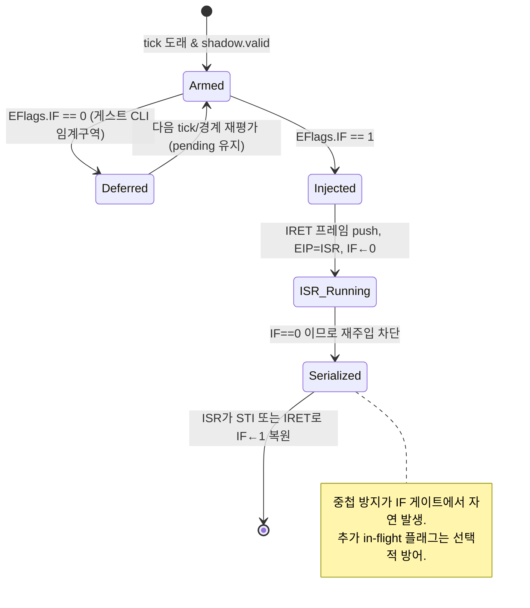

# 20260726-297 타이머 주입 IF 게이트 및 중첩 방지 / Timer injection IF-gating and nesting prevention

## 한국어

### 1. 배경 (Background)

Task 296에서 `DispatchGuestException`의 2차 크래시를 제거한 결과, aot-dbt에서 계속되는 크래시의 근본 원인이
**게스트 스택 / 리턴 주소 / EIP 손상**임이 드러났다. 여러 크래시가 모두 같은 병의 다른 발현이다:

| 크래시 | 증상 |
|---|---|
| `DispatchGuestException` (0x101AF9A1) | `ContextRecord=0x23` (셀렉터값을 포인터로) |
| `HandleTracedDosInterrupt21` (2696) | 게스트 `Eip=0x287` 역참조 |
| Watcom 스택검사 루틴 `C3`(RET) | 리턴 주소 / ESP 손상으로 RET fault |
| AOT return trace | 6000+건 리턴 예측 불일치 |

**유력 범인 = 선점형 INT 8h 타이머 주입 (task 294)**. 이 문서는 그 주입을 하드웨어에 충실하게 고쳐
근본 원인을 제거하는 계획(방안 B)이다. 참고: [[task296-crash-frontier]], design/20260726-296.

### 2. 현재 코드 (Current state)

INT 8h(IRQ0 타이머) 주입 경로가 **둘** 있고, 둘 다 게스트 스택에 IRET 프레임(EFLAGS/CS/EIP, 12바이트)을
쓰고 EIP를 ISR로 돌린다.

1. **선점 경로** — `live_telemetry_snapshot.cpp` `PollThreadUntilExit` (라인 277~347).
   폴링 스레드가 55ms(1 tick)마다 `SuspendThread`→`GetThreadContext`로 게스트를 멈추고, EIP가 게스트/AOT
   범위면 스택에 프레임을 쓰고 `SetThreadContext`로 ISR 진입.
2. **VEH 경로** — `execution_trampoline.cpp` `InjectPendingInterrupts` (라인 2256~2305).
   `timer_interrupt_pending`이 서 있으면 VEH 경계에서 동일하게 주입.

**결함 (둘 다 해당):**
- **게스트 IF(인터럽트 플래그)를 확인하지 않는다.** 게스트가 CLI로 임계구역에 있어도 주입 → 규약 위반.
- **중첩 방지가 없다.** 로그상 ESP가 연속 하강(6864→6838→6834→6800)하며 ISR이 IRET하기 전에 재주입됨.
- 주입은 진입 시 IF/TF를 클리어한다(`EFlags &= ~(0x200|0x100)`), 이는 하드웨어 인터럽트 게이트와 동일해 올바르다.

### 3. 핵심 사실: EFlags.IF가 진실의 원천 (Key fact)

`HandlePrivilegedTrapInstruction` (execution_trampoline.cpp:1314)에서:
- 게스트 **CLI(0xFA)** → `win32_context->EFlags &= ~0x200` (IF 클리어)
- 게스트 **STI(0xFB)** → `win32_context->EFlags |= 0x200` (IF 세트)

즉 가상 IF가 아니라 **실제 `EFlags.IF`(bit 0x200)가 게스트의 인터럽트 허용 상태를 정확히 반영**한다.
따라서 IF 게이트는 `win32_context->EFlags & 0x200`을 검사하면 된다.

### 4. 설계 (Design)

하드웨어 IRQ0는 IF=1일 때만 전달된다. 이를 그대로 구현한다.

- **IF 게이트 (두 경로 모두):** `(EFlags & 0x200) == 0`이면 **주입하지 않는다.**
- **중첩 방지 (IF 게이트에서 자연히 파생):** 주입 시 IF를 클리어하므로 ISR은 IF=0으로 실행된다.
  IF 게이트가 있으면 ISR이 STI를 하거나 IRET로 **저장된 EFLAGS(IF=1)를 복원**할 때까지 재주입이 차단된다.
  → 하나의 ISR이 끝나기 전에는 다음 주입이 불가능 = 중첩 없음.
- **지연 (Deferral):** IF=0이면 주입을 건너뛰되 `timer_interrupt_pending`은 유지(coalesce, bool이라 최대 1건)하여
  IF=1이 되는 다음 경계에서 전달. 이는 마스크된 IRQ0가 하나로 합쳐져 대기하는 하드웨어 동작과 같다.

- **(선택) 명시적 in-flight 가드:** 방어적으로 "타이머 ISR 진행 중" 플래그를 두어 IRET가 주입 프레임을
  소비할 때까지 재주입을 막을 수 있다. 다만 IF 게이트만으로 충분하므로 1차 구현에서는 IF 게이트만 적용하고,
  검증에서 중첩이 남으면 추가한다.

### 5. 변경 지점 (Change points)

1. `src/platform/win32/execution/execution_trampoline.cpp` `InjectPendingInterrupts` (2256~):
   기존 EIP 게이트(2270) 뒤에 `if ((win32_context->EFlags & 0x200U) == 0) return;` 추가.
   **주의:** `timer_interrupt_pending`을 **클리어하기 전에** 검사하여, IF=0이면 pending을 유지한 채 반환(지연).
2. `src/platform/win32/telemetry/live_telemetry_snapshot.cpp` 선점 경로 (294~340):
   EIP 게이트(294) 통과 후 프레임을 쓰기 전에 `if ((win32_context.EFlags & 0x200U) != 0)`로 감싼다.
   IF=0이면 `preemptive_injected=false` 유지 → 기존 로직대로 `timer_interrupt_pending=true`(지연).
3. 공통 상수화: 매직넘버 `0x200`에 `kEFlagsInterruptEnable` 같은 이름을 부여(선택).

### 6. 리스크 및 검증 근거 (Risk)

- **busy-wait가 여전히 깨지는가?** 이 게임의 타이머 폴링 대기는 BIOS tick 카운터(0x0046C)가 INT 8 ISR로
  갱신되기를 기다린다. 따라서 그 구간은 **반드시 IF=1**이어야 한다(IF=0이면 카운터가 영영 안 올라 무한 정지).
  그러므로 IF 게이트는 busy-wait 구간에서 여전히 주입을 허용한다 → **294의 효과(busy-wait 돌파)를 유지**한다.
  이것이 곧 주입이 정당한 지점임을 확증한다.
- **회귀 위험 낮음:** IF 게이트는 하드웨어에 더 충실하므로 정상 경로를 해치지 않는다.

### 7. 검증 절차 (Verification)

절차상 인과를 먼저 못박고(A) 근본 수정(B)을 검증한다.

0. **(A, 선택) 인과 확정:** 선점 주입을 임시 비활성화하여 크래시가 사라지는지 확인 → 범인 확정.
1. **빌드:** `cmake --build build/win32_x86_debug --config Debug --target repiu_loader_win32` 성공.
2. **크래시 소멸:** aot-dbt로 `pumpit1` 구동 시 296에서 보인 RET/`0x287`류 크래시가 사라지거나
   진행이 더 나아가는지 확인. `exception dispatch malformed count`도 함께 관찰.
3. **중첩 없음:** `REPIU_TIMER_INJECT_LOG=1`에서 주입 간 ESP가 ISR 사이클 단위로 **단조 복원**되는지 확인
   (연속 하강 6864→6800 패턴이 사라져야 함).
4. **busy-wait 유지:** 게임이 이전처럼 glide 초기화를 계속 진행(gate 수 ≥ 74)하는지 확인 → 지연이 과도하지 않음.

주의(작업 방식): 실행이 필요한 검증은 최소 횟수로, 사용자 확인 후. [[prefer-log-analysis-over-runs]]

### 8. 범위 밖 (Out of scope)

- AOT 리턴 예측 불일치 자체의 개선(별개 가능성).
- 게스트 스택 TIB Base/Limit 정합.
- `HandleTracedDosInterrupt21` 등 traced 핸들러의 Eip 역참조 가드(별도 견고화, 296 후속).

---

## English

### 1. Background
Task 296 removed the secondary crash in `DispatchGuestException`, revealing that the continuing aot-dbt
crashes share one root cause: **guest stack / return-address / EIP corruption** (ContextRecord=0x23, guest
Eip=0x287, RET fault in a Watcom stack-check routine, 6000+ mismatched AOT returns). The prime suspect is
the preemptive INT 8h timer injection (task 294). This document plans the hardware-faithful fix (plan B).

### 2. Current state
Two INT 8h injection paths both write an IRET frame (EFLAGS/CS/EIP) to the guest stack and redirect EIP to
the ISR: the **preemptive** path (`live_telemetry_snapshot.cpp` `PollThreadUntilExit`, ~277-347, from the
poll thread via SuspendThread every 55ms) and the **VEH** path (`execution_trampoline.cpp`
`InjectPendingInterrupts`, 2256-2305). Both **fail to check the guest IF flag** and have **no nesting
prevention** (log shows ESP marching down 6864→6800 as the ISR is re-entered before IRET). Both correctly
clear IF/TF on ISR entry.

### 3. Key fact: EFlags.IF is authoritative
`HandlePrivilegedTrapInstruction` (execution_trampoline.cpp:1314) makes guest **CLI (0xFA)** clear
`EFlags & 0x200` and **STI (0xFB)** set it. So the real `EFlags.IF` (bit 0x200), not a virtual IF, reflects
the guest's interrupt-enable state; the IF gate checks `win32_context->EFlags & 0x200`.

### 4. Design
Hardware delivers IRQ0 only when IF=1; implement exactly that.
- **IF gate (both paths):** do not inject when `(EFlags & 0x200) == 0`.
- **Nesting prevention (falls out of the IF gate):** injection clears IF, so the ISR runs with IF=0; the IF
  gate then blocks re-injection until the ISR does STI or IRET restores the saved EFLAGS (IF=1) — one ISR
  cannot be nested.
- **Deferral:** when IF=0, skip injection but keep `timer_interrupt_pending` (coalesced to one) so it fires
  at the next IF=1 boundary — matching how a masked IRQ0 stays pending.
- **(Optional) explicit in-flight guard** for defense in depth; add only if verification still shows nesting.

### 5. Change points
1. `InjectPendingInterrupts`: after the existing EIP gate, add `if ((EFlags & 0x200) == 0) return;`
   **before** clearing `timer_interrupt_pending` (so IF=0 defers).
2. Preemptive path: wrap the frame-write in `if ((EFlags & 0x200) != 0)`; on IF=0 leave
   `preemptive_injected=false` so the existing `timer_interrupt_pending=true` defers it.
3. Optionally name the `0x200` magic constant.

### 6. Risk
Does the busy-wait still break? The game's timer-poll wait spins on the BIOS tick counter (0x0046C) that
INT 8 updates, so that region **must** run with IF=1 (else the counter never advances and it hangs). Thus
the IF gate still injects there → the task-294 benefit is preserved, and this confirms injection is
legitimate at that point. Regression risk is low since IF-gating is strictly more hardware-faithful.

### 7. Verification
0. (A, optional) Temporarily disable preemptive injection to confirm crashes vanish → confirm causation.
1. Build succeeds.
2. The 296-era RET/`0x287` crashes disappear or progress improves; watch `exception dispatch malformed
   count`.
3. No nesting: with `REPIU_TIMER_INJECT_LOG=1`, injected-frame ESP is restored per ISR cycle (the
   6864→6800 monotonic descent is gone).
4. Busy-wait escape preserved: Glide init keeps progressing (gate count ≥ 74).
Keep runtime verification minimal and user-confirmed. [[prefer-log-analysis-over-runs]]

### 8. Out of scope
AOT return-prediction mismatch, guest-stack TIB alignment, and Eip-dereference guards in traced handlers
like `HandleTracedDosInterrupt21`.
