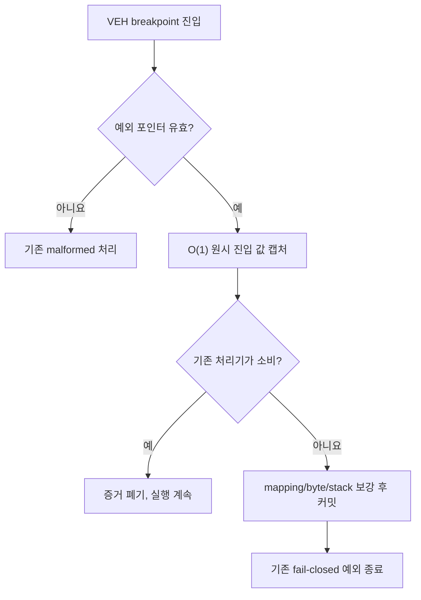

# 20260726-298 AOT orphan breakpoint 증거 캡처 / AOT orphan-breakpoint evidence capture

## 한국어

### 1. 배경

Task 297의 INT 8 IF 게이트를 적용한 뒤 약 128초 장기 실행에서 새로운 종료 지점이
관찰되었습니다. 종료 예외는 `STATUS_BREAKPOINT(0x80000003)`이고, 원시 예외 주소와
최종 EIP는 모두 `0x03042EAD`였습니다. 해당 주소의 live guest byte는 정상적인
`RET(C3)`이며 `[ESP]`는 AOT code-cache 주소 `0x0DB7073E`였습니다.

같은 실행에서 malformed exception dispatch는 0건이고, INT 8 chain HLE는 1,750회
완료됐습니다. AOT return telemetry의 마지막 source는 다른 주소에 머물렀으므로 이
`RET`는 기존 반환 처리기에 소비되지 않았습니다. 다만 현재 로그는 breakpoint가
실제로 어느 물리 주소에서 발생했는지, Windows가 보고한 주소가 `INT3` 바이트인지 그
다음 주소인지, 진입 당시 `aot_reentry_pending`이 어떤 값이었는지 구분할 증거가
부족합니다.

### 2. 목표

처리되지 않은 breakpoint 한 건이 다음 실행에서 자체 완결 증거 패킷을 남기게 합니다.
계측은 원본 실행 의미를 변경하지 않으며 `INT3` 또는 `RET`를 자동으로 건너뛰거나
복구하지 않습니다.

### 3. 설계

`DispatchGuestException` 진입 직후 포인터 유효성을 확인한 다음,
`EXCEPTION_BREAKPOINT`에 한해 원시 주소와 레지스터, 실행 상태 같은 O(1) 값만 고정 크기
진입 스냅샷에 보존합니다. 예외가 기존 AOT, HLE, fatal-breakpoint 또는 single-step
처리기에 의해 소비되면 스냅샷은 폐기합니다. 모든 처리기를 통과한 경우에만 보존된
주소를 사용해 AOT mapping/provenance와 byte/stack window를 보강하고 `ThreadContext`에
커밋합니다. 따라서 정상적으로 처리되는 고빈도 AOT breakpoint에는 address-map 검색이나
Win32 메모리 조회 비용을 추가하지 않습니다.

증거 패킷에는 다음을 포함합니다.

1. 원시 exception code/address와 진입/최종 `EIP`, `ESP`, `EFLAGS`, `DR6`, `DR7`
2. 진입 시 `aot_reentry_pending`, single-step trace, native fast path,
   native linear span, native region 상태
3. 진입/최종 AOT return dispatch count와 마지막 return source/target, 진입 cache boundary
4. exception address와 entry EIP 각각의 AOT-cache 포함 여부
5. 두 주소의 exact 및 `address - 1` guest-address 매핑 결과
6. 두 주소 주변의 고정 32-byte window와 읽기 성공 바이트 수
7. 진입 스택 상단 4 dword와 읽기 성공 mask
8. cache 주소로 분류 가능한 후보의 breakpoint provenance

`address - 1` 후보를 함께 기록하는 이유는 x86 `INT3`가 1-byte trap이며 Windows
예외 문맥에서 보고 주소와 재개 EIP의 관계를 로그만으로 가정하지 않기 위해서입니다.

### 4. 구조

공개 실행 결과 구조에 `Win32UnhandledBreakpointEvidence`를 추가하고,
Win32 예외 하위 시스템의 전용 `breakpoint_evidence_win32.h/.cpp`가 캡처와 커밋을
담당합니다. `execution_trampoline.cpp`에는 호출 순서만 남깁니다.

고정 배열과 값 타입만 사용하여 VEH에서 heap 할당, 파일 I/O, 문자열 생성은 하지
않습니다. 메모리 창과 스택은 `ReadProcessMemory`로 fail-closed하게 읽고, 읽지 못한
부분은 유효 길이 또는 mask로 구분합니다.

### 5. 출력

최종 loader summary에는 증거의 유효 여부와 다음 줄을 출력합니다.

- raw address / entry EIP / final EIP
- entry/final ESP, EFLAGS, DR6/DR7
- 진입/최종 상태 bit mask
- AOT cache 포함 및 exact/previous mapping 결과
- exception-address 및 entry-EIP byte window
- stack top 4 dwords와 valid mask
- exact/previous provenance

주소 창이 동일해도 두 필드는 독립적으로 출력하여 원시 예외 주소와 context EIP가
달라지는 재현을 손실 없이 비교합니다.

### 6. 검증

1. Win32 x86 Debug `repiu_loader_win32` 빌드가 성공해야 합니다.
2. 새 구조가 값 타입이며 VEH 경로에 동적 할당이나 복구 동작을 추가하지 않았음을
   정적으로 확인합니다.
3. 기존 `repiu_log.txt`의 `0x03042EAD` 형태를 기준으로 새 출력이 raw/entry/final,
   `-1` 후보, 상태와 byte window를 모두 구분할 수 있는지 검토합니다.
4. 실제 장기 재현은 사용자가 다음 실행에서 생성한 로그로 확인합니다.

### 7. 범위 밖

- orphan breakpoint 자동 복구
- AOT return 정책 또는 quarantine 정책 완화
- INT 8 in-flight guard 추가
- 원본 `INT3` fatal 의미 변경

---

## English

### 1. Background

After Task 297 added the INT 8 IF gate, a roughly 128-second run ended at a new
frontier. The exception was `STATUS_BREAKPOINT (0x80000003)`; both the raw
exception address and final EIP were `0x03042EAD`. The live guest byte there is
a normal `RET (C3)`, while `[ESP]` contains AOT code-cache address
`0x0DB7073E`.

Malformed exception dispatch remained zero and INT 8 chain HLE completed 1,750
times. The last AOT return source remained at another address, so the existing
return handler did not consume this `RET`. The current log cannot distinguish
the physical breakpoint site, whether Windows reported the `INT3` byte or its
successor, or the entry value of `aot_reentry_pending`.

### 2. Goal

Make the next unhandled breakpoint emit a self-contained evidence packet. This
task does not change original execution semantics and does not automatically
skip or recover an `INT3` or `RET`.

### 3. Design

Immediately after validating exception pointers, `DispatchGuestException`
captures only O(1) raw address, register, and execution-state values for
`EXCEPTION_BREAKPOINT`. If any existing AOT, HLE, fatal-breakpoint, or
single-step handler consumes the event, the snapshot is discarded. Only an
event that reaches the final unhandled path performs AOT mapping/provenance and
byte/stack memory reads before committing to `ThreadContext`. Normal high-rate
AOT breakpoints therefore gain no address-map search or Win32 memory-query
overhead.

The packet records raw exception and register state, AOT/native execution
flags, entry/final AOT return-dispatch state, exact and minus-one AOT mappings
for both the exception address and entry EIP, two 32-byte memory windows, four
stack dwords, and cache-breakpoint provenance. Minus-one candidates avoid assuming the reporting convention for
the one-byte x86 `INT3` trap.

### 4. Structure

Add `Win32UnhandledBreakpointEvidence` to the public execution result. A
dedicated Win32 exception subsystem, `breakpoint_evidence_win32.h/.cpp`, owns
capture and commit; `execution_trampoline.cpp` keeps orchestration only.

The VEH path uses fixed arrays and value types only. Memory windows and stack
words use fail-closed `ReadProcessMemory`; valid byte counts and masks identify
partial or failed reads.

### 5. Output

The final loader summary prints validity, raw/entry/final addresses and
register state, entry/final state masks, cache membership and exact/previous
mappings, both byte windows, stack words, and exact/previous provenance.

### 6. Verification

1. Build Win32 x86 Debug target `repiu_loader_win32`.
2. Statically confirm that the VEH change adds no heap allocation or recovery.
3. Check that the new fields distinguish raw, entry, final, minus-one, state,
   and byte-window evidence for the observed `0x03042EAD` shape.
4. Confirm runtime contents with the next user-produced long-run log.

### 7. Out of scope

- Automatic orphan-breakpoint recovery
- Relaxing AOT return or quarantine policy
- Adding an INT 8 in-flight guard
- Changing the fatal meaning of an original `INT3`
