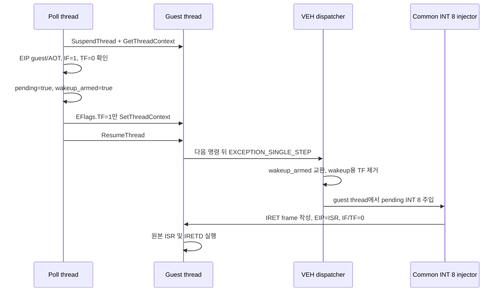

# 20260726-299 타이머 선점 VEH rendezvous / Timer-preemption VEH rendezvous

## 한국어

### 1. 배경과 새 증거

Task 297은 두 INT 8 주입 경로에 guest `EFlags.IF` 게이트를 추가해 ISR 중첩을
막았습니다. 이후 `REPIU_TIMER_INJECT_LOG=1` 장기 실행은 약 29초에 다음 형태로
종료했습니다.

1. 마지막 guest `RET`는 `0x030D8BB2`, `ESP=0x035D6CFC`입니다.
2. `[ESP]`의 `0x43F00000`은 IEEE-754 `480.0f`입니다.
3. 정상 반환주소 `0x030F2739`는 정확히 `[ESP+12]`에 남아 있습니다.
4. 원본 `0x030F2734: call 0x030D8B84`와 wrapper의
   `call [edx+0x2C4]; add esp,8; ret`, 실제 대상 `0x03062560`의 `ret 8`은
   정적으로 ABI 균형이 맞습니다.
5. 종료 직전 마지막 선점 주입은 `return frame=0x035D6CEC`였습니다.

따라서 이번 실패는 임의 AOT 반환 예측 오류가 아니라, **한 개의 12바이트 INT 8
IRET 프레임에 해당하는 ESP 차이**가 남아 wrapper의 `RET`이 반환주소 대신 인자를
꺼낸 것입니다. Task 297의 IF 게이트는 중첩을 제거했지만, poll thread가
`SuspendThread` 상태에서 guest 스택, ESP, EIP, CS를 직접 바꾸는 선점 경로의
원자성 문제는 남아 있습니다.

그 뒤 발생한 host access violation은 2차 실패입니다. PDB상
`HandleTracedDosInterrupt21`의 opcode probe가 이미 비정상인
`EIP=0x43F00000`을 역참조했습니다. 이 fail-closed 견고화는 별도 작업으로
분리합니다.

### 2. 목표

poll thread의 역할을 “틱 감지와 안전 경계 요청”으로 제한하고, 실제 INT 8 IRET
프레임 작성과 ISR 전환은 guest thread의 VEH 문맥에서만 수행합니다.

원본 ISR `0x03042EAE`와 원본 `IRETD` 실행, guest IF 의미, pending coalescing은
그대로 유지합니다.

### 3. 설계

선점 경로는 직접 주입 대신 one-instruction trap rendezvous를 사용합니다.

#### Poll thread

- guest 스택에 쓰지 않습니다.
- `ESP`, `EIP`, `CS`를 변경하지 않습니다.
- guest/AOT EIP이고 IF=1, TF=0일 때 pending과 wakeup armed를 설정하고 TF만
  `SetThreadContext`로 설정합니다.
- `SetThreadContext` 실패 시 armed를 되돌리고 pending은 유지합니다.
- 이미 TF=1이면 기존 single-step 소유권을 침범하지 않고 pending만 유지합니다.

#### VEH guest thread

- armed 상태의 `EXCEPTION_SINGLE_STEP`만 wakeup event로 소비합니다.
- 주입 전에 wakeup용 TF를 제거하여 IRET 프레임에 TF=1이 저장되지 않게 합니다.
- 기존 `InjectPendingInterrupts`를 호출하므로 EIP/IF/stack-range 검증과 pending
  소비 순서는 한 곳에 유지됩니다.
- wakeup 뒤 IF가 0이면 pending을 보존한 채 wakeup 예외만 소비합니다.
- wakeup보다 다른 예외가 먼저 오면 armed와 wakeup용 TF만 해제하고 원래 예외
  dispatch를 계속합니다.

### 4. 상태와 진단

`ThreadContext`에 `std::atomic<bool> timer_interrupt_wakeup_armed`를 추가합니다.
`REPIU_TIMER_INJECT_LOG=1`에서는 poll thread의 arm source EIP/ESP와 VEH의 실제
주입 frame을 각각 출력합니다. 기본 실행에는 로그를 추가하지 않습니다.

### 5. 안전 조건

- 원본 executable 코드와 ISR 코드를 수정하지 않습니다.
- poll thread는 guest memory를 쓰지 않습니다.
- 기존 TF가 이미 설정된 실행 상태를 가로채지 않습니다.
- 실패 시 pending을 보존하고 원래 예외를 감추지 않습니다.
- 실제 프레임 작성은 기존 공통 주입기 하나만 사용합니다.

### 6. 검증

1. Win32 x86 Debug `repiu_loader_win32` 빌드
2. `aot-dbt`, `REPIU_TIMER_INJECT_LOG=1` 제한 실행
3. poll 로그는 `Armed`, 실제 frame 로그는 VEH `Injected`로만 나타나는지 확인
4. `Preemptively Injected` 직접 frame-write 로그가 0인지 확인
5. `RET 0x030D8BB2 -> 0x43F00000` 및 정확한 `ESP-12` 실패가 재현되지 않는지 확인
6. busy-wait 돌파와 INT 8 chain HLE 진행 확인

### 7. 범위 밖

- 비정상 EIP를 역참조하는 개별 HLE decoder의 fail-closed guard
- AOT call-stack 예측 정확도
- 원본 ISR 로직 변경 또는 host-side timer callback으로 대체

---

## English

### Background and goal

After Task 297 removed timer nesting, a timer-logged run ended with guest
`RET 0x030D8BB2` reading `0x43F00000` (`480.0f`) while the correct return
`0x030F2739` remained exactly at `[ESP+12]`. Static disassembly confirms that
the caller, wrapper, and indirect callee have a balanced `call`, `add esp,8`,
and `ret 8` contract. The exact displacement matches one INT 8 IRET frame, and
the final timer event was preemptive.

Restrict the poll thread to tick detection and safe-boundary requests. Create
the IRET frame and redirect to the ISR only on the guest thread inside VEH,
while preserving the original ISR, `IRETD`, IF semantics, and pending
coalescing.

### Design

The poll thread no longer writes guest memory or changes ESP/EIP/CS. When EIP
is guest/AOT, IF is set, and TF is clear, it sets pending and an atomic
`timer_interrupt_wakeup_armed` flag, then sets TF only. The next instruction
raises `EXCEPTION_SINGLE_STEP`; VEH recognizes the private wakeup, removes the
wakeup-only TF, and invokes the existing common `InjectPendingInterrupts`.

If another exception arrives first, VEH disarms the wakeup and removes only
the injected TF before continuing normal dispatch. If IF becomes clear by the
rendezvous, the wakeup exception is consumed while the pending tick remains
deferred.

### Safety and verification

The original executable and ISR remain unchanged. Existing TF ownership is
not intercepted, failed arming preserves pending state, and all frame writes
go through the existing common injector. Build Win32 x86 Debug and run a
bounded `aot-dbt` smoke test with timer logging. The log must show poll-side
arming followed by VEH-side injection, no direct preemptive frame writes, no
recurrence of the exact `ESP-12` failure, and continued busy-wait/INT 8 chain
progress.
