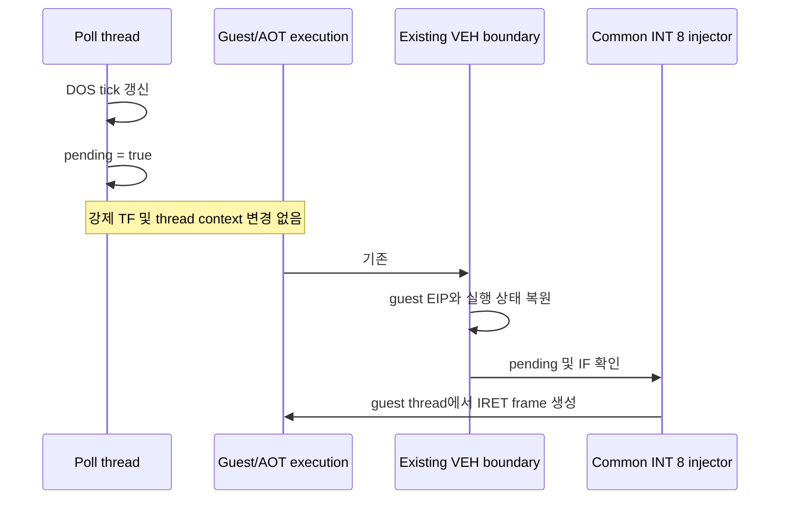

# 20260726-301 타이머 pending 안전 VEH 경계 전달 / Timer pending delivery at safe VEH boundaries

## 한국어

### 1. 문제와 확인 증거

Task 299는 poll thread가 guest stack을 직접 수정하지 않도록 바꾸고, `EFlags.TF`를 설정해
다음 `EXCEPTION_SINGLE_STEP`에서 guest thread의 VEH가 INT 8을 주입하도록 했습니다.
그러나 장시간 실행 세 번이 모두 다음 형태로 종료됐습니다.

- 로그의 마지막 사건은 `Armed INT 8 VEH wakeup`입니다.
- 대응하는 `INT 8 VEH wakeup`과 loader 종료 요약은 없습니다.
- Windows Application Error는 세 번 모두 `0x80000004`와 fault 주소
  `0x6FAC40B1`을 기록했습니다.
- 마지막 arm의 guest EIP는 실행마다 달랐지만 Windows fault 주소는 같았습니다.
- AOT cache는 `0x0DB70000`에 있으므로 `0x6FAC40B1`은 guest 또는 AOT 주소가 아닙니다.
- 기존의 단조로운 `ESP-12` 누수는 재현되지 않았습니다.

따라서 원본 guest 명령이나 ISR이 아니라 poll thread가 강제로 만든 TF rendezvous가
프로세스 밖으로 새는 것이 현재 직접적인 종료 원인입니다.

### 2. 설계 결정

poll thread는 DOS tick 갱신과 `timer_interrupt_pending=true` 설정만 담당합니다.
`SuspendThread`, `GetThreadContext`, `SetThreadContext`, TF 설정을 타이머 전달에 사용하지
않습니다.

pending IRQ0는 이미 guest thread에서 발생한 VEH 경계 중 guest EIP로 복원된 안전 지점에서
전달합니다. 공용 single-step 처리기는 HLE 처리와 AOT 주소 변환이 끝난 뒤, 다음 native
fast path/linear span을 시작하기 전에 `InjectPendingInterrupts`를 호출합니다.

주입기가 guest EIP, IF, stack 범위를 계속 검증하므로 안전하지 않은 경계에서는 pending을
소비하지 않습니다. bool pending은 기존처럼 여러 tick을 한 건으로 합칩니다.

### 3. 변경 범위

- `live_telemetry_snapshot.cpp`: TF wakeup arming과 thread context 조작 제거
- `execution_trampoline.cpp`: Task 299 wakeup 소비 분기 제거, 공용 single-step guest
  경계에서 pending 전달
- `thread_context.h`: `timer_interrupt_wakeup_armed` 제거
- 관련 analysis 및 작업 로그 갱신

원본 실행 파일, ISR `0x03042EAE`, `IRETD`, IF gate는 변경하지 않습니다.

### 4. 위험과 완화

VEH 경계가 전혀 없는 완전한 native/AOT 무한 루프에서는 pending 전달이 늦어질 수 있습니다.
현재 장시간 로그는 125초 동안 single-step 경계 603,745회와 INT 8 주입 1,742회를 기록해
안전 경계가 충분히 존재함을 보여 줍니다. 검증에서 진행 정체가 나타나면 poll thread의 TF를
복구하지 않고 AOT/native code에 명시적인 guest-thread safe point를 추가하는 별도 설계를
사용합니다.

### 5. 검증

1. Win32 x86 Debug loader를 빌드합니다.
2. `aot-dbt`, `REPIU_TIMER_INJECT_LOG=1`로 이전 125초 종료 지점을 넘겨 실행합니다.
3. `Armed INT 8 VEH wakeup`이 0건인지 확인합니다.
4. INT 8 주입, chain HLE, diagnostic progress가 계속 증가하는지 확인합니다.
5. Windows Application Error에 새 `0x80000004`가 생기지 않는지 확인합니다.
6. exception, malformed dispatch, 단조로운 12바이트 stack 하강이 없는지 확인합니다.

---

## English

### Problem and decision

Task 299 stopped cross-thread IRET-frame writes and used a poll-thread TF arm
followed by a guest-thread VEH rendezvous. Three long runs nevertheless ended
immediately after an unmatched `Armed INT 8 VEH wakeup`. Windows recorded the
same unhandled `0x80000004` and `0x6FAC40B1` fault address each time, even
though the final guest EIP varied. The address is neither guest memory nor the
`0x0DB70000` AOT cache. The former monotonic 12-byte stack leak did not recur.

Remove forced TF rendezvous entirely. The poll thread only updates the DOS
tick and sets the coalesced pending flag. Existing guest-thread VEH boundaries
deliver the pending interrupt after AOT/HLE state has been reconciled and
before another native fast path or linear span begins. The common injector
retains its guest-EIP, IF, and stack checks.

### Risk and verification

A native loop with no VEH boundary could defer delivery. The reproducing
125-second log recorded 603,745 single-step boundaries and 1,742 successful
INT 8 injections, so the observed path has ample natural safe points. If a
true no-boundary loop is later found, add an explicit guest-thread safe point
to generated/native code rather than restoring cross-thread TF injection.

Build Win32 x86 Debug and run beyond the former 125-second frontier with timer
logging. There must be no wakeup arms, while INT 8 delivery, chain completion,
and diagnostic progress continue without a new Windows `0x80000004`, malformed
dispatch, or 12-byte stack leak.
