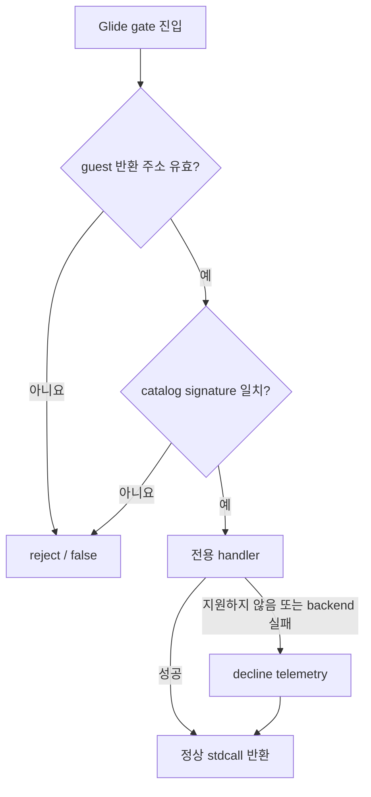

# 20260726-302 Glide 깊이 비교와 게이트 안전 반환 / Glide depth comparison and safe gate return

## 한국어

### 1. 문제와 확인 증거

`repiu_log.txt`의 약 880초 실행에서 `_GRDEPTHBUFFERFUNCTION@4`가 인자 `3`으로
호출됐습니다. 현재 `GlideOpenGlBackend::SetDepthBufferFunction`은
`GR_CMP_ALWAYS(7)`만 지원하므로 backend 실패를 반환했고, gate handler는
`reject_gate`를 통해 `false`를 반환했습니다.

이 호출은 유효한 catalog signature와 guest 반환 주소를 가진 `void __stdcall`
호출이었지만 ESP를 정리하지 않은 채 일반 예외 복구로 넘어갔습니다. 직후 stack
telemetry에는 다음 프레임이 함께 남았습니다.

```text
0x0304F5C0 0x00000001 0x0304F5A5 0x00000003
|-- grDepthMask frame --| |-- leaked grDepthBufferFunction frame --|
```

이후 `EAX=3`인 상태에서 guest `0x03058AA4`의
`cmp byte ptr [eax+0x21F9], 0`가 `0x000021FC`를 읽어 `0xC0000005`로
종료했습니다. 이는 Tasks 246-248에서 확인한 미처리 Glide gate의 stdcall frame
누수와 같은 구조입니다.

### 2. 설계 결정

#### 2.1 유효 비교 함수의 실제 의미 구현

Glide 비교 함수 값 `0..7`을 OpenGL의 연속 비교 함수
`GL_NEVER..GL_ALWAYS`로 변환합니다. 값이 `7`이어도 depth test 자체를 끄지
않습니다. depth test 활성 여부는 기존 `grDepthBufferMode` 책임이고,
`grDepthBufferFunction`은 비교 함수만 선택합니다.

backend는 열린 context와 `0..7` 범위를 검증하고, dummy mode에서는 같은 범위를
상태 적용 성공으로 취급합니다. `glDepthFunc` 실패는 backend 실패로 남깁니다.

#### 2.2 ABI가 검증된 gate의 안전 반환

반환 주소가 guest 범위이고 catalog signature가 asset의 `@N`과 일치한 뒤 발생한
handler decline은 일반 예외 복구로 넘기지 않습니다. 공용 안전 반환 helper가 다음을
수행합니다.

- decline 사유를 bounded telemetry로 기록
- catalog 반환 kind가 `kVoid`가 아니면 보수적 기본값 `EAX=0` 설정
- `EIP=return_address`
- `ESP += 4 + argument_byte_count`
- handled count 증가 후 `true` 반환

반환 주소가 guest 범위가 아니거나 signature가 일치하지 않는 경우는 ABI를 신뢰할 수
없으므로 기존 `reject_gate(false)`를 유지합니다. 이 구분으로 잘못된 ABI를 숨기지
않으면서, ABI가 이미 검증된 specialized handler 실패가 stdcall frame을 누수시키는
구조를 제거합니다.



### 3. 변경 범위

- `glide_opengl_backend.cpp`: depth comparison `0..7` 변환
- `linexe_glide_boundary.cpp`: ABI 검증 이후 공용 decline 반환과 기존 handler
  실패 경로 연결
- `ARCHITECTURE.md`, 기존 Glide 설계·analysis: 확인된 장기 실행 frontier와
  안전 반환 계약 반영

원본 `PIU.EXE`, guest 게임 로직, Glide logical-state 소유권은 변경하지 않습니다.

### 4. 검증

1. Win32 x86 Debug loader를 빌드합니다.
2. 소스 검증으로 depth compare가 `0..7`만 허용하고 `GL_NEVER + function`을
   적용하는지 확인합니다.
3. 모든 specialized handler의 ABI 검증 이후 실패가 `decline_gate`로 귀결되는지
   검색 검증합니다.
4. 가능한 범위에서 `pumpit1` smoke run을 수행해 초기 Glide 호출과 OpenGL 오류,
   gate reject, caught exception을 확인합니다.
5. 완전 재현에는 기존 약 880초 frontier 이상의 장시간 실행이 필요함을 작업 로그에
   구분해 기록합니다.

---

## English

### Problem and decision

At about 880 seconds, the captured run calls `_GRDEPTHBUFFERFUNCTION@4` with
argument `3`. The backend currently accepts only `GR_CMP_ALWAYS(7)`, so the
specialized handler rejects an otherwise valid `void __stdcall` gate. The
subsequent telemetry retains `0x0304F5A5, 3` beneath the next depth-mask frame,
and guest code later faults at `0x03058AA4` while reading
`EAX(3) + 0x21F9 = 0x21FC`. This is the same unhandled-gate stdcall frame leak
class confirmed in Tasks 246-248.

Map every valid Glide comparison value `0..7` to the contiguous OpenGL
comparison functions `GL_NEVER..GL_ALWAYS`. Depth-buffer mode remains
responsible for enabling depth testing; the function setter only selects the
comparison.

After both the guest return address and catalog signature have been validated,
a specialized-handler decline must return through a common ABI-preserving
path. It records bounded telemetry, supplies conservative `EAX=0` for non-void
returns, advances EIP to the caller, cleans `4 + argument_byte_count` bytes
from ESP, increments the handled count, and returns true. Invalid return
addresses and signature mismatches remain hard rejects because their ABI is not
trustworthy.

### Scope and verification

Change the Win32 OpenGL depth-function mapping and the Win32 Glide gate
dispatcher, then update architecture, design, and cumulative analysis. Build
Win32 x86 Debug, verify every post-signature handler failure reaches the safe
decline path, and run the available pumpit1 smoke coverage. Reproducing the
original terminal frontier requires a run beyond approximately 880 seconds and
is reported separately from build and short-run verification.
