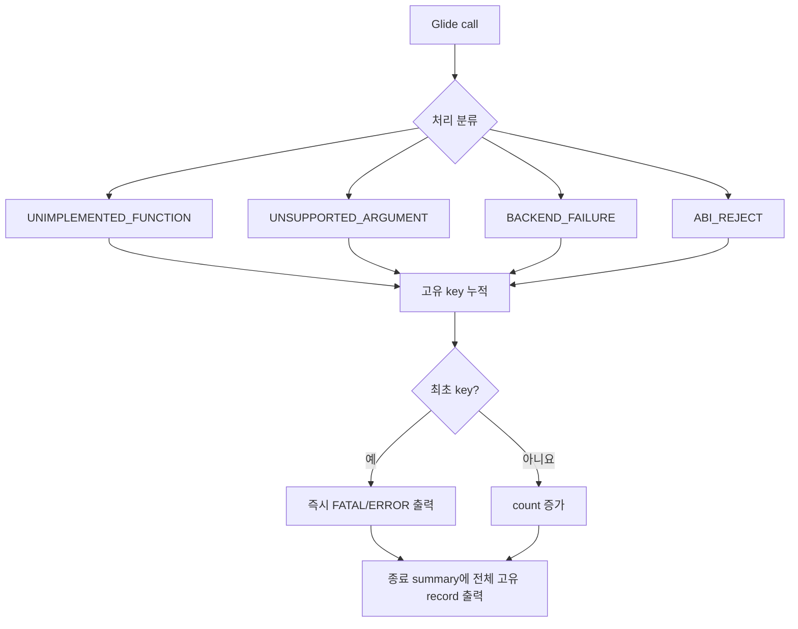

# 20260726-303 Glide 미구현 fatal 보고 / Glide implementation-gap fatal reporting

## 한국어

### 1. 문제

현재 Glide 미구현 경로는 `glide gate unhandled (default)`, `glide gate declined
safely`, 일부 retain 정책과 명시적 ABI no-op으로 나뉩니다. 앞의 두 로그는 실행 전체
32건 제한이고, retain/no-op 경로는 미구현임을 별도로 출력하지 않습니다. 종료 요약의
`entries/handled`에는 안전 반환도 handled로 포함되므로 미구현 여부를 판별할 수 없습니다.

### 2. 분류와 심각도

| 분류 | 의미 | 로그 심각도 | 실행 정책 |
|---|---|---|---|
| `GLIDE_UNIMPLEMENTED_FUNCTION` | catalog에는 있으나 default/no-op 처리 | `FATAL` | ABI 정리 후 계속 |
| `GLIDE_UNSUPPORTED_ARGUMENT` | 함수는 있으나 해당 인자 조합 미지원 | `FATAL` | 보수적 반환 후 계속 |
| `GLIDE_BACKEND_FAILURE` | 구현 경로의 host/backend 처리 실패 | `ERROR` | 보수적 반환 후 계속 |
| `GLIDE_ABI_REJECT` | 반환 주소 또는 signature를 신뢰할 수 없음 | `FATAL` | 기존 hard reject |

여기서 `FATAL`은 구현 완성도 판단을 위한 로그 등급입니다. guest 반환 주소와 signature가
검증된 미구현 호출은 프로그램을 종료하지 않고 Task 302의 안전 반환을 유지합니다.

### 3. 공용 추적기

플랫폼 공용 HLE 계층에 `GlideImplementationIssueTracker`를 둡니다. 고유 키는 분류,
ordinal, 함수명, 이유, argument byte count, 최초 8개 인자 값입니다. 같은 키의 반복은
count만 증가시키고, 새 키는 최초 한 번 즉시 로그를 남깁니다.

- 고유 record 용량: 128
- 분류별 total count는 용량 초과와 무관하게 계속 증가
- overflow count 별도 기록
- record: 분류, ordinal, 이름, 이유, 상세 backend 메시지, argument bytes, 인자,
  발생 횟수



### 4. 출력 계약

즉시 로그는 다음 안정된 prefix를 사용합니다.

```text
[repiu-fatal] GLIDE_UNIMPLEMENTED_FUNCTION ... action=continue
[repiu-fatal] GLIDE_UNSUPPORTED_ARGUMENT ... action=continue
[repiu-error] GLIDE_BACKEND_FAILURE ... action=continue
[repiu-fatal] GLIDE_ABI_REJECT ... action=terminate
```

종료 요약은 분류별 total, unique/overflow와 모든 고유 record를 출력합니다. spdlog에는
미구현·미지원·ABI reject를 `critical`로 기록하면서 메시지에 `FATAL`을 명시하고,
backend failure는 `error`로 기록합니다. 전역 first-N 제한은 사용하지 않습니다.

### 5. 적용 범위와 검증

- catalog default handler
- Task 302 safe decline
- alpha/color combine과 alpha blend retain 정책
- 코드에 명시된 ABI no-op 함수
- signature 미등록/불일치와 guest 밖 반환 주소

공용 tracker 합성 probe에서 중복 병합, 다른 인자 분리, 분류별 total, fatal 판정,
capacity overflow와 실제 경계·종료 요약이 함께 쓰는 공용 문자열 formatter의 정확한
출력을 검증합니다. 이후 Win32 x86 Debug 전체 빌드와 pumpit1 smoke에서
즉시 fatal line과 종료 summary가 같은 record/count를 내는지 확인합니다.

---

## English

### Problem and policy

Current implementation gaps are split among globally capped default/decline
logs, silent retain policies, and explicit ABI no-ops. Since safe returns count
as handled, the final entries/handled summary cannot reveal them.

Introduce a platform-neutral `GlideImplementationIssueTracker` with four stable
categories: `GLIDE_UNIMPLEMENTED_FUNCTION` and `GLIDE_UNSUPPORTED_ARGUMENT` are
reported as `FATAL` but continue through Task 302 ABI-safe return;
`GLIDE_BACKEND_FAILURE` is an `ERROR` and continues conservatively; and
`GLIDE_ABI_REJECT` is `FATAL` and retains the existing hard reject.

The unique key contains category, ordinal, name, reason, argument byte count,
and the first eight arguments. Repeats increment a count. A 128-record bounded
store retains every unique item until capacity while per-category totals and an
overflow count always advance. The first occurrence prints immediately with a
stable `[repiu-fatal]` or `[repiu-error]` prefix, and the final spdlog summary
prints totals plus every unique record. No global first-N suppression remains.

### Scope and verification

Instrument catalog defaults, Task 302 safe declines, unsupported combine/blend
retain paths, explicit ABI no-ops, and ABI/signature rejects. A synthetic probe
verifies deduplication, argument separation, totals, fatal classification,
overflow, and the exact shared formatter used by the boundary and final
summary. Then build Win32 x86 Debug and run pumpit1 smoke coverage, requiring
the immediate and final summaries to agree while execution continues after
known-ABI implementation gaps.
