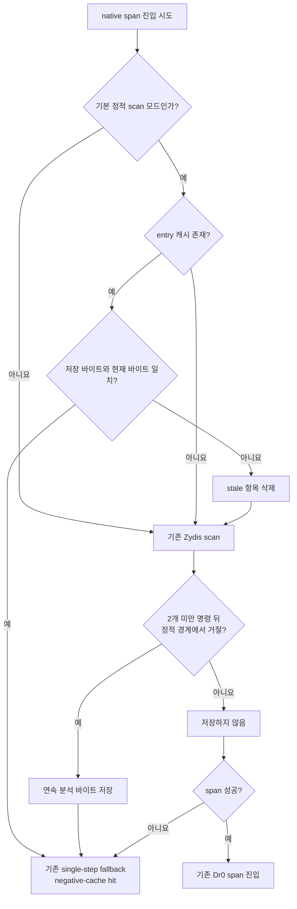

# 20260726-304 설계: 네이티브 span 음성 캐시 / Design: native-span negative cache

## 한국어

### 배경

`repiu_log.txt`의 약 881초 `aot-dbt` 실행은 네이티브 직선 span
`entry/boundary/reject=1,982,870/1,967,120/2,747,330`을 기록했습니다. 현재
`REPIU_NATIVE_LINEAR_SPAN_CACHE`는 활성 generation에서 성공한 span만 저장하며 기본값도
꺼져 있습니다. 따라서 기본 실행의 모든 거절은 같은 entry EIP여도
`ScanNativeLinearSpanWithZydis`를 다시 호출합니다.

Task 288의 generation 기반 성공 캐시는 실제 hot fallback이 retired/quarantined page에
집중되어 hit가 0이었습니다. 반면 거절 캐시는 새 네이티브 실행을 허용하지 않고 기존
single-step fallback을 그대로 선택하므로, 성공 캐시보다 보수적인 일관성 모델로 반복
decode 비용을 줄일 수 있습니다.

### 목표

- 기본 `aot-dbt` native-span 거절의 반복 Zydis decode를 줄입니다.
- 게스트 명령 실행, HLE 경계, self-modifying code(SMC), quarantine 및 AOT generation
  정책은 바꾸지 않습니다.
- 캐시 효과와 stale 무효화를 별도 telemetry로 확인할 수 있게 합니다.

### 설계

`NativeFastPathState`에 entry EIP별 음성 캐시를 둡니다. 항목은 최대 두 x86 명령 길이인
30바이트의 snapshot과 실제 길이를 저장합니다. 기본 scanner가 민감 명령, 명시적 memory
write 또는 control-transfer 경계를 0개 또는 1개 일반 명령 뒤에서 만난 경우에만
cacheable rejection 길이를 제공합니다. decode 실패, runtime-range 실패, 64명령 상한
도달은 저장하지 않습니다.

조회 시 snapshot과 guest 메모리를 `memcmp`합니다. 일치하면 Zydis scan 없이 기존
single-step fallback을 선택합니다. 불일치하면 항목을 삭제하고 즉시 재스캔합니다. 음성
캐시는 어떠한 명령도 네이티브 span으로 추가 허용하지 않으므로, 조회와 실제 다음 명령
사이에 코드가 다시 바뀌더라도 안전 측면에서는 기존 fallback보다 공격적이지 않습니다.

`REPIU_NATIVE_LINEAR_SPAN_WRITES` 또는 `REPIU_NATIVE_LINEAR_SPAN_JUMPS`가 켜진 scan은
register 값, page protection, target policy에 의존할 수 있으므로 음성 캐시를 사용하지
않습니다. 기존 성공 span cache와도 별도 정책으로 유지합니다.

캐시는 entry 수를 65,536개로 제한합니다. 한도에 도달하면 새 항목을 저장하지 않고 기존
scan을 유지하여 장시간 실행에서 host memory가 무제한 증가하지 않게 합니다.

### 정책과 telemetry

초기 구현은 `REPIU_NATIVE_LINEAR_SPAN_REJECT_CACHE=1|on|true`에서만 켭니다. A/B가 아래
게이트를 모두 통과하면 `aot-dbt` 기본값으로 승격하고 `0|off|false`로 끌 수 있게 합니다.
다른 backend 기본값은 바꾸지 않습니다.

최종 로그에 다음 배타적 계수를 추가합니다.

- hit: snapshot이 일치해 Zydis scan을 생략한 수
- miss: 항목이 없어 scan한 수
- stale: snapshot 불일치로 삭제하고 재스캔한 수
- store: cacheable rejection을 저장한 수
- capacity skip: 용량 한도로 저장하지 않은 수

### 검증과 승격 기준

- synthetic probe: 첫 조회 miss, 저장 후 hit, 바이트 변경 후 stale/miss, 용량 정책 검증.
- 기존 `linear_span_all`, `coherence_all` probe 통과.
- Win32 x86 Debug 전체 빌드 성공.
- 동일 runtime/EEPROM fixture로 OFF/ON 교차 실행.
- ON에서 fatal 0, legacy fallback 0, unexpected span cancel 증가 없음, EEPROM SHA-256 일치.
- Glide texture/draw/swap 등 의미 milestone이 OFF와 모순되지 않음.
- hit가 실제로 발생하고 같은 시간의 처리량 또는 milestone이 반복 측정에서 개선될 때만
  기본 승격.

### 최종 결정

세 번의 60초 OFF/ON 쌍에서 ON은 native-span 거절의 99.68~99.69%를 cache hit로
처리했습니다. progress 쌍별 변화는 `+1.20% / -1.08% / +0.02%`로 후반 처리량 차이는
없었지만, texture milestone은 모든 쌍에서 `46 / 1,078 / 1,031ms` 빨랐고 중앙값은
`1,031ms`(약 4.9%)였습니다. draw/swap은 실질적으로 같았습니다. fatal과 legacy
fallback은 모두 0이고 EEPROM hash가 일치했으며 기존 late span cancel도 OFF/ON에서
비슷했습니다.

반복된 초기 resource milestone 개선이 승격 기준을 충족하므로 `aot-dbt`에서 기본
ON으로 결정합니다. 다른 backend는 기본 OFF이며
`REPIU_NATIVE_LINEAR_SPAN_REJECT_CACHE=0|off|false` 또는 알 수 없는 값은 명시적으로
비활성화합니다.

## English

### Background

The supplied roughly 881-second `aot-dbt` run recorded native linear-span
`entry/boundary/reject=1,982,870/1,967,120/2,747,330`. The existing
`REPIU_NATIVE_LINEAR_SPAN_CACHE` stores only successful spans on active-generation pages and
is default-off, so every default-path rejection calls `ScanNativeLinearSpanWithZydis` again
even for a repeated entry EIP. Task 288 observed zero hits because the hot fallback was
concentrated on retired or quarantined pages.

### Goal and design

Add a conservative negative cache that reduces repeated Zydis decoding without changing
guest execution, HLE boundaries, SMC/quarantine policy, or AOT generations. An entry stores
at most 30 contiguous bytes, covering a static rejection reached after zero or one ordinary
instruction. Decode/range/64-instruction-limit failures are not cached.

On lookup, the saved bytes are compared with guest memory. A match immediately selects the
existing single-step fallback; a mismatch erases the stale entry and rescans. A negative hit
never permits additional native execution, so it cannot be more aggressive than the current
fallback. Register-, protection-, and target-dependent write/jump experiment modes bypass
the cache. The cache is separate from the successful-span cache and capped at 65,536 entries.

The initial candidate is enabled only by
`REPIU_NATIVE_LINEAR_SPAN_REJECT_CACHE=1|on|true`. It may become the `aot-dbt` default only
after controlled A/B validation, retaining an explicit disable setting. Final telemetry
reports hit, miss, stale, store, and capacity-skip counts.

### Verification and promotion gate

Synthetic probes cover miss/store/hit, byte-change invalidation, and capacity behavior.
Existing span and coherence probes must pass, as must a full Win32 x86 Debug build.
Alternating OFF/ON runs must keep zero fatal/legacy fallback, no increase in unexpected span
cancellation, matching EEPROM hashes, and consistent Glide milestones. Default promotion
requires observed hits plus repeatable throughput or milestone improvement.

### Final decision

Across three 60-second OFF/ON pairs, ON served 99.68-99.69% of native-span rejections from
the cache. Pairwise progress changed by `+1.20% / -1.08% / +0.02%`, showing no material
late-throughput change, while every texture milestone improved by `46 / 1,078 / 1,031ms`
(median `1,031ms`, about 4.9%). Draw/swap timing was effectively unchanged. Fatal and legacy
fallback stayed zero, EEPROM hashes matched, and the pre-existing late span cancellations
were comparable between modes.

The repeatable early resource milestone improvement satisfies the promotion gate, so the
cache is default-on for `aot-dbt`. Other backends remain default-off; `0|off|false` and
unknown values explicitly disable it.
