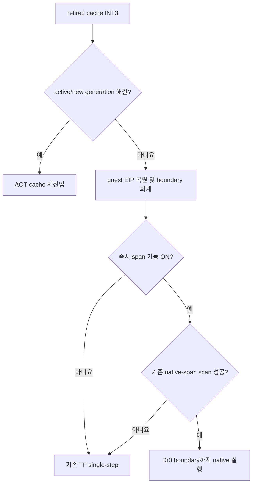

# 20260726-305 설계: retired trap 즉시 span 재진입 / Design: immediate span re-entry after retired traps

## 한국어

### 배경과 목표

장시간 `aot-dbt` 로그는 cache breakpoint provenance 중 retired/inactive entry가
`353,624`건으로 가장 컸습니다. 현재 `HandleAotReentry`는 retired `INT3`를 guest EIP로
복원한 뒤 active generation 또는 새 generation을 찾습니다. 해결에 실패하면 Trap Flag를
설정해 guest 명령 한 개를 실행하고, 다음 `EXCEPTION_SINGLE_STEP`에서야 일반 native
linear-span 진입을 시도합니다.

목표는 active-generation/SMC/quarantine 정책을 완화하지 않고, retired fallback 직후
이미 존재하는 보수적 native-span scanner를 호출하여 불필요한 첫 single-step을 줄이는
것입니다.

### 설계

`REPIU_AOT_RETIRED_SPAN_REENTRY=1|on|true`에서만 후보를 켭니다. retired entry이며 실행
trace sentinel이 아닌 경우, 기존 provenance/boundary/opcode 회계를 마친 뒤 guest EIP에서
`TryEnterNativeLinearSpan`을 호출합니다. 성공하면 Trap Flag만 Dr0 span 실행 동안 해제하고
`aot_reentry_pending`과 single-step trace 정책은 보존합니다. Dr0 경계에서는 기존
AOT/HLE single-step chain을 그대로 재개합니다. 실패하면 기존 TF 경로를 유지합니다.

scanner는 최소 두 개의 일반 명령 뒤 첫 민감 명령, control transfer 또는 memory write를
Dr0 경계로 삼습니다. 따라서 HLE/segment/RET/indirect/store 경계는 즉시 span에 들어가지
않고 기존 handler로 계속 전달됩니다. write/jump 실험 옵션은 기존 정책을 그대로 따르며
이 작업에서 기본값을 바꾸지 않습니다.

attempt/success 계수를 live/final telemetry에 추가합니다. 기능은 먼저 opt-in으로 측정하며,
성공 기회가 실제로 있고 single-step 또는 의미 milestone이 반복 개선될 때만 `aot-dbt`
기본 승격을 검토합니다.

### 검증

- resolver 정책과 synthetic retired-entry immediate-span probe.
- 기존 `linear_span_all`, `coherence_all`, breakpoint provenance probe.
- Win32 x86 Debug 전체 빌드.
- OFF/ON 교차 A/B: attempt/success, retired trap, single-step, progress, span lifecycle,
  Glide milestone, fatal/fallback, EEPROM hash.

### 최종 판정

초기 구현은 성공 시 pending/trace 상태까지 해제하여 첫 실제 span 경계의 `RET(C3)` 처리를
건너뛰었습니다. 60초 후보 실행은 `retired_span=1/1` 직후 약 19.5초에 종료됐습니다. 상태를
보존하도록 수정한 뒤 30초 smoke와 3쌍 교차 A/B는 모두 요청 시간을 채웠고 fatal 0,
EEPROM hash 일치였습니다.

ON 성공률 중앙값은 95.45%, single-step 감소 중앙값은 2.86%였지만 progress 변화는
`+0.35% / -0.03% / +0.45%`(중앙값 `+0.35%`)에 그쳤습니다. texture 변화 중앙값도
`-17ms`로 작았습니다. 반복 처리량 개선이 승격 기준에 미달하므로 기능은 opt-in으로
유지합니다.

## English

### Background and goal

The long `aot-dbt` run recorded 353,624 retired/inactive cache breakpoints, the largest
provenance bucket. `HandleAotReentry` first tries an active or new generation. On failure it
restores the guest EIP and executes one Trap-Flag instruction before the normal path can try
a native linear span.

This task keeps all generation, SMC, quarantine, and HLE rules unchanged and attempts the
existing conservative span scanner immediately after a retired fallback. Under the initial
opt-in `REPIU_AOT_RETIRED_SPAN_REENTRY=1|on|true`, a non-trace retired entry completes normal
boundary accounting, then calls `TryEnterNativeLinearSpan` at the restored guest EIP. Success
clears TF only while running to the existing Dr0 boundary. It preserves pending re-entry and
single-step policy so the boundary resumes the exact existing AOT/HLE chain. Failure keeps the
old TF path exactly.

The scanner still rejects sensitive instructions, control transfers, and memory writes, so
HLE/segment/RET/indirect/store boundaries continue through existing handlers. Live and final
telemetry expose attempt/success. Synthetic probes, the full Win32 x86 Debug build, existing
span/coherence/provenance probes, and alternating OFF/ON runtime measurements gate any default
promotion. Promotion requires real successes plus repeatable exception-count or semantic
milestone improvement with matching safety evidence.

The first implementation incorrectly cleared pending/trace state and skipped `RET(C3)`
handling at the first real span boundary; the candidate ended around 19.5 seconds immediately
after `retired_span=1/1`. Preserving that state removed the regression. A 30-second smoke and
three alternating pairs then completed with zero fatal events and matching EEPROM hashes.
Median success rate was 95.45% and single-step count fell 2.86%, but progress changed only
`+0.35% / -0.03% / +0.45%` (median `+0.35%`) and median texture change was `-17ms`.
The path therefore remains opt-in.
