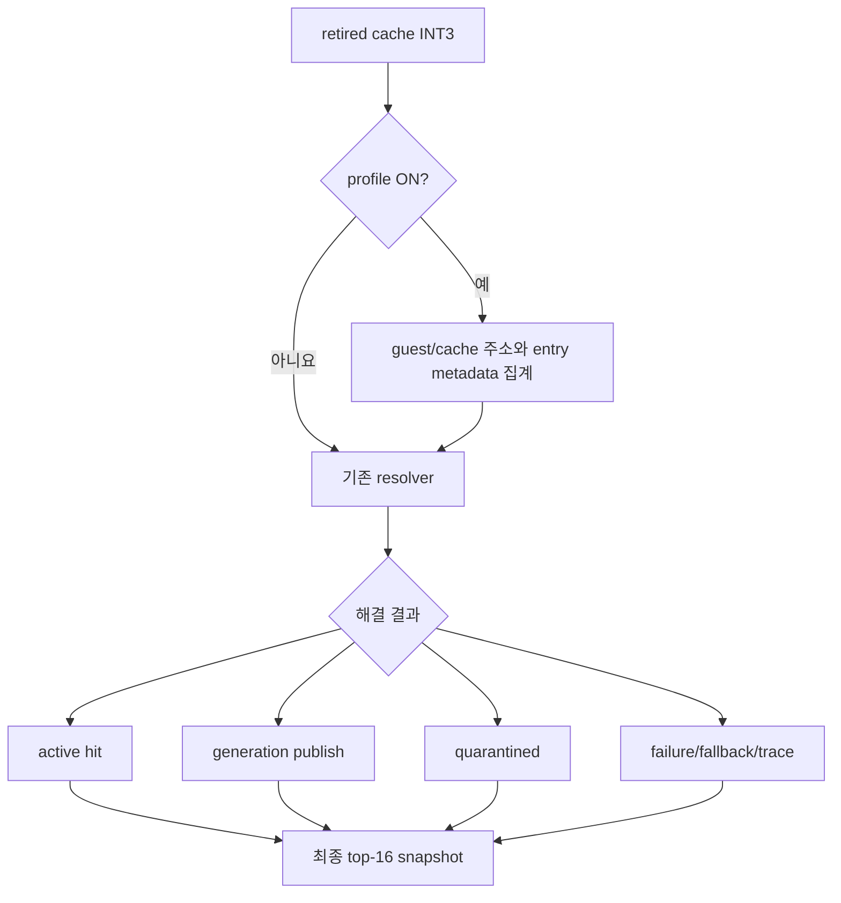

# 20260726-306 설계: retired trap hotset 및 해결 결과 계측 / Design: retired-trap hotset and resolution profiling

## 한국어

### 배경과 목표

Task 305는 unresolved retired trap 직후의 single-step 일부를 제거했지만 progress 개선
중앙값은 0.35%였습니다. retired `INT3` 예외 자체는 이미 발생했기 때문입니다. 장시간
로그의 retired provenance 353,624건을 줄이려면 어떤 guest/cache entry가 반복되는지,
해당 entry가 5바이트 relink 가능한지, trap 뒤 resolver가 무엇을 했는지 확인해야 합니다.

다음 질문에 답하는 실행 의미 불변 opt-in 진단을 추가합니다.

1. 상위 16개 guest 주소가 전체 retired trap의 몇 %를 차지하는가?
2. 동일 cache entry가 반복 trap하는가, 여러 generation으로 분산되는가?
3. trap entry는 `emitted_length >= 5`여서 relink 가능한가?
4. trap 뒤 결과는 active hit, generation publish, quarantine, generation failure,
   일반 fallback, trace sentinel 중 무엇인가?

### 구조

`REPIU_AOT_RETIRED_TRAP_PROFILE=1|on|true`에서만 활성화합니다. guest 주소별 횟수와
cache 주소별 상세 sample을 별도 hash map에 저장합니다. 각 cache sample은 guest 주소,
generation, guest/emitted length와 relink 가능 여부를 보존합니다. 주소 종류별 최대
65,536개로 제한하고 초과 횟수를 기록합니다.

resolver는 선택적 결과 포인터로 기존 분기 결과만 보고합니다. profiler OFF에서는 기존
호출과 제어 흐름이 같고 추가 histogram lookup이 없습니다. 종료 시 exact count를 정렬해
guest/cache top 16과 top-16 coverage, 결과별 횟수, short/relinkable trap 수를 최종 결과와
로그에 남깁니다.

### 검증

- 설정 parser의 default/ON/OFF/unknown fail-closed 검증.
- synthetic placement에서 short/relinkable entry, 여러 generation, 반복 count, 정렬,
  top coverage와 결과별 count 검증.
- 기존 `coherence_all`, `linear_span_all` 포함 전체 `repiu_aot_probe`.
- Win32 x86 Debug 전체 빌드.
- profiler ON 장시간 `aot-dbt` 실행에서 fatal/fallback/EEPROM 불변성과 hotset 확인.

## English

Task 305 skipped some single-step work after unresolved retired traps, but median progress
improved only 0.35% because the retired `INT3` exception had already occurred. Reducing the
353,624 retired-provenance events requires identifying repeated guest/cache entries, their
five-byte relink eligibility, and each resolver outcome.

The opt-in `REPIU_AOT_RETIRED_TRAP_PROFILE=1|on|true` profiler keeps separate exact histograms
for guest addresses and cache entries. Cache samples retain guest address, generation,
guest/emitted length, and relink eligibility. Each histogram is capped at 65,536 distinct
addresses with an overflow counter. The resolver reports its existing outcome through an
optional pointer: active hit, generation publish, quarantine, generation failure, ordinary
fallback, or trace sentinel. Profiling disabled avoids histogram lookup and keeps existing
control flow.

At completion, exact counts are sorted into guest/cache top 16 lists, top-16 guest coverage,
outcome counts, and short/relinkable totals. Synthetic probes, all existing probes, a full
Win32 x86 Debug build, and a bounded long `aot-dbt` run establish the next optimization target
without changing guest execution semantics.
