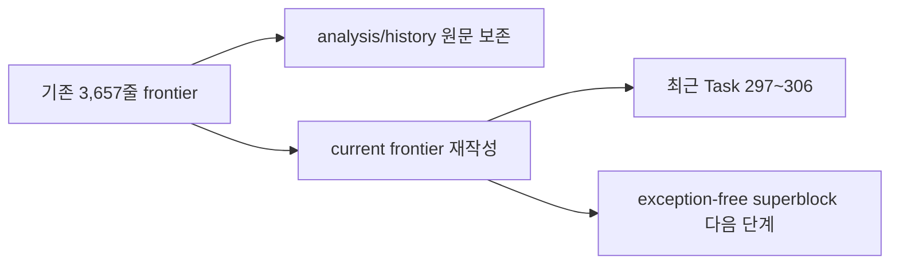

# 20260726-307 설계: current execution frontier 이력 분리 / Design: split current execution frontier history

## 한국어

### 목적

`docs/analysis/current-execution-frontier.md`는 3,657줄에 걸쳐 과거의 확정·정정·기각
기록과 현재 결론이 함께 누적되어 현재 작업 방향을 찾기 어렵습니다. 기존 내용은 분석
증거이므로 삭제하지 않고 `docs/analysis/history/`에 원문 그대로 보존합니다.

현재 frontier 문서는 최근 Task 297~306 약 10개 작업의 결과와 현재 성능 결론만
유지합니다. 각 요약은 상세 work log로 연결하고 확인됨·보류·다음 결정을 구분합니다.
현재 최상위 결정은 미세한 예외 감소를 중단하고 exception-free superblock으로
60배 성능 가능성을 검증하는 것입니다.

### 구조

`docs/analysis/README.md`는 current 문서와 history 색인을 모두 연결합니다. history
디렉터리에는 별도 `README.md`를 두어 archive 범위와 불변 목적을 설명합니다.

## English

The 3,657-line current execution frontier mixes historical confirmations, corrections,
rejected hypotheses, and active decisions. Preserve the complete file verbatim under
`docs/analysis/history/` instead of deleting evidence. Rewrite the current frontier to retain
roughly the latest ten tasks, Tasks 297-306, with links to detailed work logs and a clear
active decision: stop treating incremental exception reductions as a route to the 60x target
and validate an exception-free superblock. Update both the main analysis index and a dedicated
history index.
