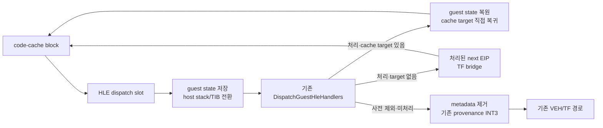

# 20260726-308 설계: exception-free superblock 아키텍처 검증 / Design: exception-free superblock architecture validation

## 한국어

### 배경

최신 30초 기준에서 `aot-dbt` progress는 `18,314`, `aot-dynamic`은 `17,720`으로
차이는 3.35%뿐입니다. `aot-dbt`는 single-step과 일부 return 비용을 줄였지만 아직
독립적인 연속 DBT 실행기가 아니며, HLE·segment·retired 경계마다 Windows 예외로
돌아갑니다.

기존 planner와 emitter를 다시 확인한 결과 direct call/jump, conditional branch,
fallthrough와 backward edge는 이미 코드 캐시 내부 `rel32`로 연결됩니다. 따라서 이번
검증의 핵심은 기본 블록을 다시 합치는 것이 아니라, planner HLE 경계의
`INT3 → VEH → guest HLE → cache re-entry` 왕복을 정상 함수 호출 기반 경계로 바꾸는
것입니다.

### 1차 검증 범위

`REPIU_AOT_DBT_SUPERBLOCK=1|on|true`일 때만 `aot-dbt`의 일반
`kHleBoundary`를 host-dispatch slot으로 생성합니다.

첫 slice는 세그먼트/ESP를 쓰는 명령과 `INT/IRET`를 정상 호출 경로에서 처리하지
않습니다. 이 명령은 Win32 exception return과 기존 segment 계약이 필요하기 때문입니다.
해당 명령, 미처리 opcode와 잘못된 site는 guest 상태를 바꾸기 전에 기존 `INT3`로
fail-closed합니다. HLE 처리 후 활성 cache target만 없는 경우에는 side effect를
중복 실행하지 않도록 처리된 다음 guest EIP에서 TF bridge를 사용합니다.

정상 경로는 다음 상태를 보존합니다.

- `pushfd/pushad`로 GPR과 EFLAGS를 저장합니다.
- C++ HLE가 clobber할 수 있는 x87/MMX/SSE 상태를 `fxsave/fxrstor`로 보존합니다.
- 기존 DBT thunk처럼 TIB stack base/limit와 ESP를 host stack으로 전환합니다.
- guest `CONTEXT`에는 shadow segment selector와 원래 guest ESP를 제공합니다.
- HLE가 처리하고 EIP를 전진시킨 뒤 활성 cache entry가 있으면 GPR/EFLAGS 결과를
  저장 frame에 반영하고 cache로 직접 복귀합니다.
- 정상 호출 경계는 SMC write-watch 정책을 바꾸지 않습니다. 실제 guest code write는
  기존 access-violation retirement/generation 경로를 사용합니다.

### 계측과 판정

최종 로그에 HLE host dispatch의 `entry/success/fallback`과 fallback 원인
`site/veh-required/unhandled/target/state/unknown`을 출력합니다. 다음 불변식을
검사합니다.

- `attempt = success + fallback`
- fallback `INT3`는 planner-HLE provenance로 집계됨
- exception/fatal/AOT legacy fallback 증가 없음
- 격리 EEPROM hash 일치
- Glide milestone과 progress가 정상 진행

아키텍처 가능성은 먼저 실제 `pumpit1` A/B로 판정합니다. 성공 횟수가 HLE provenance를
실질적으로 대체하고 전체 progress가 유의하게 증가하면 다음 slice에서 segment-write
복귀 ABI와 retired-entry gate를 확장합니다. 성공률 또는 wall-clock 효과가 낮으면
“기존 HLE 경계가 주병목”이라는 가설을 기각하고, hot address별 CPU/VEH 시간을 다시
계측합니다. 장기 목표인 60배와 별개로 1차 go/no-go 기준은 기존 frontier대로 hot-loop
20배 또는 전체 60초 progress 5배입니다. 이 기준에 미달한 결과는 성능 개선으로
과장하지 않고 구조 검증 결과로만 기록합니다.

## English

The latest 30-second baseline shows only a 3.35% progress difference:
`18,314` for `aot-dbt` versus `17,720` for `aot-dynamic`. Direct calls, jumps,
conditional branches, fallthroughs, and backward edges are already chained with
cache-local `rel32` transfers. The missing architectural step is therefore not
another basic-block merge; it is replacing the repeated
`INT3 → VEH → guest HLE → cache re-entry` round trip.

With `REPIU_AOT_DBT_SUPERBLOCK=1|on|true`, ordinary planner HLE records are emitted
as host-dispatch slots. A thunk saves GPR/EFLAGS and x87/MMX/SSE state, switches ESP
and the TIB stack bounds to the host stack, calls the existing
`DispatchGuestHleHandlers` chain, and returns directly to an active cache target.
Segment/ESP writes and `INT/IRET` are excluded because the established path relies on
Windows exception return and native segment semantics. Invalid sites, excluded instructions,
and unhandled HLE restore the entry state and reach the existing provenance-aware `INT3`.
A missing target after HLE is already committed resumes the handled next guest EIP through
the TF bridge instead of re-executing the source.

Telemetry reports entry, success, fallback, and exact fallback reasons. A real
`pumpit1` A/B must preserve zero new exception/fatal/legacy-fallback events, the
isolated EEPROM hash, and normal Glide progress. The first architecture go/no-go
remains a 20x hot-loop gain or a 5x whole-run 60-second gain. A smaller result is
recorded honestly as architectural evidence, not presented as meeting the 60x goal.

## 검증 결과 / Validation result

초기 unrestricted 구현은 30초 실행 중 `0x03042EBE`에서 AV를 재현했습니다. 마지막
직접 HLE는 `0x030F5D27: INT 21h`였으며 AH=25h INT 8 vector의 selector가 OFF의
`002B` 대신 `0023`으로 저장됐습니다. 따라서 software interrupt HLE는 단순
GPR/EFLAGS ABI가 아니라 기존 VEH/native segment 계약에 의존합니다.

안전 slice는 segment/ESP write뿐 아니라 `INT/INT1/INT3/INTO/IRET/IRETD/IRETQ`도
기존 VEH 경계에 남깁니다. HLE가 처리된 뒤 target만 없는 경우에는 side effect를
중복 실행할 수 없으므로 `INT3`로 돌아가지 않고 처리된 다음 guest EIP에서 TF bridge를
사용합니다. 사전 제외, invalid site와 미처리는 상태 변경 전 기존 `INT3`로
fail-closed합니다.

60초 OFF/ON에서 progress는 `44,977 → 45,716`(+1.64%), single-step은
`276,680 → 254,889`(-7.88%), AOT boundary는 `66,245 → 41,224`(-37.77%)였습니다.
ON은 직접 성공 25,134, fallback 19,196이었고 exception/legacy fallback 0,
Glide 4,582/4,582, EEPROM hash 일치를 유지했습니다. 정상 호출 HLE 경계의 정확성과
구현 가능성은 확인했지만 5배 whole-run go/no-go는 실패했습니다. 일반 HLE 예외 제거는
60배 목표의 주 아키텍처가 아닙니다.

The unrestricted prototype exposed an AV after direct `INT 21h AH=25h` registered the INT 8
selector as `0023` instead of the established `002B`. Software-interrupt HLE therefore depends
on the existing VEH/native segment contract, not only a GPR/EFLAGS ABI.

The safe slice keeps segment/ESP writes and all `INT/IRET` forms VEH-mediated. A missing target
after a committed HLE resumes the handled next guest EIP through the TF bridge; only
pre-dispatch exclusions and failures retain the original `INT3`.

In the 60-second OFF/ON pair, progress changed from 44,977 to 45,716 (+1.64%), single-step
fell 7.88%, and AOT boundaries fell 37.77%. ON directly handled 25,134 HLE sites with 19,196
fallbacks, no exception or legacy fallback, identical Glide activity, and a matching EEPROM.
The normal-call boundary is viable and correct for the safe subset, but fails the 5x
whole-run gate and is not the missing architecture for the 60x target.
