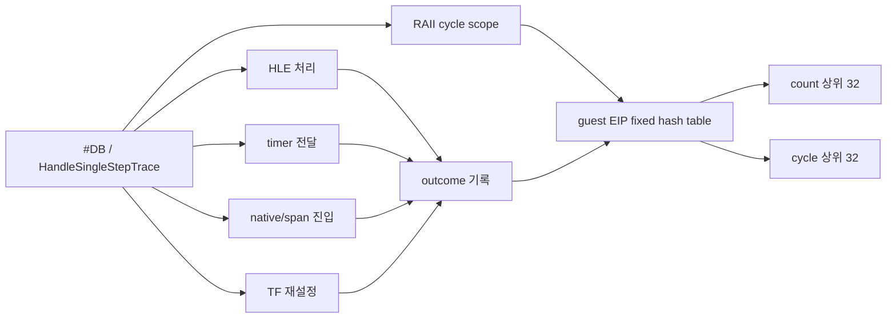

# 20260726-309 설계: single-step hotspot cycle 귀속 / Design: single-step hotspot cycle attribution

## 한국어

### 배경

Task 308의 60초 OFF/ON에서 guest 작업 단위당 single-step은
`6.15 → 5.58`로 약 9.4% 감소했지만 progress는 1.64%만 증가했습니다. 이는
single-step이 병목이 아니라는 뜻이 아니라, 제거한 HLE 연계 single-step이 남은
single-step과 같은 비용을 갖지 않는다는 뜻입니다. 다음 최적화 대상은 총 횟수가 아니라
남은 single-step의 guest EIP별 횟수와 실제 handler cycle로 결정해야 합니다.

### 범위

`REPIU_SINGLE_STEP_HOTSPOT_PROFILE=1|on|true`에서만 guest single-step을 계측합니다.
기능은 실행 결정을 바꾸지 않으며 기본 OFF입니다.

### hot-path 구조

- guest thread 한 곳만 profile을 기록합니다.
- 주소 table은 8,192개 고정 slot의 open-addressing 구조로 만들며 계측을 켠 실행만
  heap에 한 번 할당합니다. guest handler 실행 중에는 allocation과 lock을 사용하지
  않습니다.
- 함수 진입에서 profile이 켜졌고 EIP가 guest 범위일 때만 TSC를 읽습니다.
- RAII scope destructor가 모든 조기 반환을 포함해 cycle을 기록합니다.
- 주소별 `count`, `total_cycles`, `max_cycles`와 outcome별 count/cycle을 누적합니다.
- table이 가득 차면 실행 정책을 바꾸지 않고 overflow만 증가시킵니다.

outcome은 다음 네 가지입니다.

1. HLE 처리
2. pending timer 전달
3. native region/fast-path/span 진입
4. 일반 TF 재설정

### snapshot과 판정

종료 snapshot은 전체 count/cycle, distinct/overflow, outcome별 합계, count 상위 32와
cycle 상위 32를 별도로 제공합니다. 상위 32의 count coverage와 cycle coverage도
계산합니다. cycle은 TSC tick이며 벽시계 nanosecond로 과장하지 않습니다.

실게임 60초 profile에서 다음을 판정합니다.

- 상위 주소군이 single-step count의 70~80% 이상을 차지하는가
- 같은 주소군이 handler cycle의 80% 이상을 차지하는가
- count 순과 cycle 순이 일치하는가
- 상위 주소의 outcome이 TF 반복인지, HLE인지, native 진입인지
- 해당 주소들을 기본 블록/backedge 기준으로 하나의 loop로 묶을 수 있는가

상위 loop가 cycle의 80% 이상이면 다음 Task에서 loop 전체를 exception-free cache
generation으로 전환합니다. 그렇지 않으면 단일 loop로 5배를 만들 수 없다는 근거로
사용하고 범주를 넓힌 CPU profile로 이동합니다.

## English

Task 308 reduced single steps per progress unit from 6.15 to 5.58, about 9.4%, while
progress improved only 1.64%. This does not reject single stepping as a bottleneck; it shows
that removed HLE-associated steps need not have the same cost as the remaining population.

`REPIU_SINGLE_STEP_HOTSPOT_PROFILE=1|on|true` enables an observation-only profile. A fixed
8,192-slot open-addressing table records guest EIP count, total/max TSC cycles, and four
outcomes: handled HLE, pending timer delivery, native execution entry, and ordinary TF
re-arm. Enabled runs allocate the table once on the heap; the guest-thread hot path performs
no allocation or locking. An RAII cycle scope
covers every early return from `HandleSingleStepTrace`.

The final snapshot independently sorts the top 32 addresses by count and by cycles and reports
coverage for both. TSC values remain cycle ticks and are not mislabeled as nanoseconds.
A guest loop qualifies for the next exception-free generation experiment only if its address
group accounts for roughly 70-80% of events and at least 80% of measured handler cycles.
