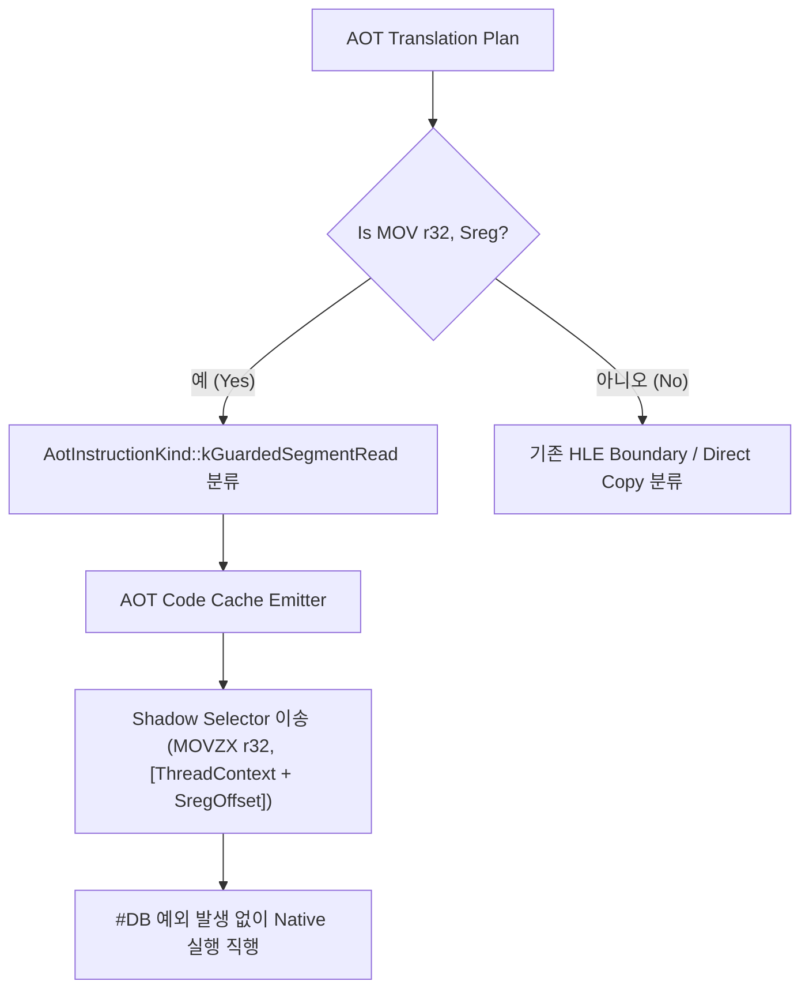

# 20260726-310 AOT 세그먼트 레지스터 읽기 Fast-Path 설계 / Design: AOT segment register read fast-path

## 한국어

### 개요

Task 309의 single-step hotspot profile에서 1위와 2위를 차지한 `mov edx, ds` (`0x030F940E`, 11.10% cycles) 및 `mov eax, ds` (`0x030F536A`, 9.32% cycles)는 60초 실행 동안 각각 3,512회, 4,837회 트랩되어 전체 핸들러 라텐시의 **20.42%**를 차지했습니다.

과거 Task 264 Phase 2에서 `mov r32, Sreg`를 단순 native `mov r32, Sreg`로 방출했을 때, 호스트 32비트 DS 셀렉터(Win32 `0x2B`)가 범용 레지스터로 이송되어 게스트 shadow selector(예: DOS4G LDT 셀렉터)와 일치하지 않아 런타임 교착이 발생했습니다.

본 설계는 #DB 예외 트랩을 발생시키지 않으면서 게스트 shadow selector 정합성을 보장하는 **Guarded Segment Register Read Fast-Path (`AotInstructionKind::kGuardedSegmentRead`)**를 도입합니다.

---

### 구조 및 흐름

---

### 핵심 설계 상세

1. **AOT Instruction Kind 추가:**
   - `AotInstructionKind::kGuardedSegmentRead` 추가.
   - `AotInstructionRecord`에 `segment_register` (0=ES, 1=CS, 2=SS, 3=DS, 4=FS, 5=GS) 및 대상 범용 레지스터(`table_index_register` 또는 dedicated `target_register`)를 기록.

2. **디코딩 및 분류 (`aot_translation_plan.cpp`):**
   - `IsHleBoundary` 호출 전 `mov r32, Sreg` (Zydis Mnemonic `MOV`, destination: `REGCLASS_GPR`, source: `REGCLASS_SEGMENT`) 패턴 감지.
   - 해당 명령을 `kHleBoundary`가 아닌 `kGuardedSegmentRead`로 분류하여 AOT Code Cache 생성 시 직행.

3. **코드 캐시 방출 (`aot_code_cache.cpp`):**
   - Single-step #DB 예외 없이, 게스트 `ThreadContext`의 shadow selector 레지스터 값(16-bit selector)을 대상 32비트 레지스터로 `movzx` 하거나 shadow DS 셀렉터를 전달하는 인라인 어셈블리 세그먼트 생성.

---

## English

### Overview

In Task 309's single-step hotspot profile, `mov edx, ds` (`0x030F940E`, 11.10% cycles) and `mov eax, ds` (`0x030F536A`, 9.32% cycles) ranked #1 and #2, accounting for **20.42%** of total handler latency across 3,512 and 4,837 traps in 60 seconds.

Task 264 Phase 2 previously attempted translating `mov r32, Sreg` directly to native `mov r32, Sreg`, which passed the host 32-bit DS selector (Win32 `0x2B`) instead of the guest shadow selector, causing a runtime stall.

This design introduces a **Guarded Segment Register Read Fast-Path (`AotInstructionKind::kGuardedSegmentRead`)** that eliminates #DB exception traps while preserving guest shadow selector consistency.

---

### Key Design Details

1. **AOT Instruction Kind Extension:**
   - Add `AotInstructionKind::kGuardedSegmentRead`.
   - Record target segment register and GPR in `AotInstructionRecord`.

2. **Decoding & Classification:**
   - Detect `mov r32, Sreg` before `IsHleBoundary` and classify as `kGuardedSegmentRead`.

3. **Emitter Implementation:**
   - Emit inline sequence fetching the guest shadow selector into the destination GPR without triggering #DB exceptions.
