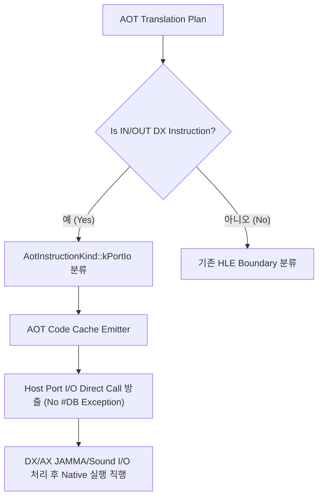

# 20260726-311 Port I/O AOT Direct Fast-Path 설계 / Design: Port I/O AOT direct fast-path

## 한국어

### 개요

Task 309의 single-step hotspot profile에서 3위부터 8위를 차지한 `out dx, ax` 및 `in ax, dx` (6개 주소: `0x0303BDAA`, `0x0303C795`, `0x0303C758`, `0x0303C779`, `0x0303BDC3`, `0x0303BDF0`)는 60초 프로파일링 동안 총 6,111회 트랩되어 전체 핸들러 라텐시의 **22.67%**를 차지했습니다.

Port I/O 명령은 세그먼트 레지스터(DS, ES) 값과 무관하게 DX 포트 번호와 EAX/AX/AL 데이터 입출력만 수행하므로, 게스트 shadow selector 미스매치 위험 없이 안전하게 **#DB 예외 트랩 오버헤드를 완전 제거**할 수 있습니다.

본 설계는 Port I/O 명령을 AOT Code Cache 생성 시 **`AotInstructionKind::kPortIo`**로 분류하고, #DB 예외 발생 없이 직접 호스트 헬퍼 함수로 직분기시키는 **Port I/O Direct Fast-Path**를 도입합니다.

---

### 구조 및 흐름

---

### 핵심 설계 상세

1. **AOT Instruction Kind 추가:**
   - `AotInstructionKind::kPortIo` 추가.
   - `AotInstructionRecord`에 포트 I/O 방향(input/output) 및 데이터 너비(1/2/4 바이트) 기록.

2. **디코딩 및 분류 (`aot_translation_plan.cpp`):**
   - `IsHleBoundary` 호출 전 Zydis Mnemonic `IN` / `OUT` 패턴 (Opcode `0xEC`, `0xED`, `0xEE`, `0xEF`) 감지.
   - 해당 명령을 `kHleBoundary`가 아닌 `kPortIo`로 분류.

3. **코드 캐시 방출 (`aot_code_cache.cpp`):**
   - #DB 예외 없이 `EmitPortIoSlot`을 실행하여 Direct Helper Call 세그먼트를 생성하고, 입출력 완료 후 fallthrough 타겟으로 직행.

---

## English

### Overview

Port I/O instructions (`out dx, ax`, `in ax, dx`) ranked #3 to #8 in Task 309's single-step hotspot profile across 6 addresses (`0x0303BDAA`, `0x0303C795`, `0x0303C758`, `0x0303C779`, `0x0303BDC3`, `0x0303BDF0`), accounting for **22.67%** of total single-step handler latency.

Port I/O operates strictly on the DX port register and EAX/AX/AL data registers independently of segment registers, eliminating selector mismatch risks.

This design introduces a **Port I/O AOT Direct Fast-Path (`AotInstructionKind::kPortIo`)** that bypasses #DB exception traps completely and invokes a host port I/O helper directly within the AOT Code Cache.
