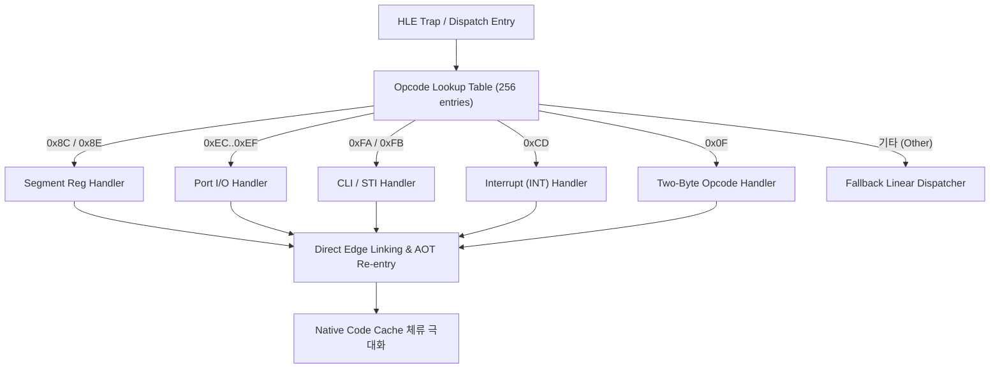

# 20260726-312 Opcode-directed HLE Dispatcher 설계 / Design: Opcode-directed HLE dispatcher

## 한국어

### 개요

HLE 트랩 발생 시 핸들러는 기존에 등록된 수많은 HLE 핸들러들을 순차 탐색(Linear Scan)하며 개별 디코딩 및 조건 검사를 수행했습니다. 이로 인해 HLE 이벤트당 평균 **186,160 TSC tick**의 높은 핸들러 라텐시가 발생했습니다.

본 설계는 트랩 진입 시 명령어 첫 바이트(Opcode)를 **Direct Lookup Table (Jump Table, O(1))**로 룩업하여, 해당 Opcode 전용 HLE 핸들러로 즉시 직분기(Direct Dispatch)시키는 **Opcode-directed HLE Dispatcher**를 도입합니다.

또한, AOT Code Cache 탈출 후 재진입(Re-entry) 과정에서의 Direct Edge Linking을 확장하여 Native Code Cache 체류율(Residency)을 극대화합니다.

---

### 구조 및 흐름

---

### 핵심 설계 상세

1. **Opcode Direct Dispatch Table (`hle_dispatcher.cpp`):**
   - 256개 엘리먼트로 구성된 `OpcodeHleHandlerTable` 구축.
   - 트랩 지점의 Opcode 바이트 기반 O(1) 룩업 및 Direct Handler Call.

2. **AOT Re-entry & Edge Linking 최적화 (`aot_dbt_hle_dispatch.cpp`):**
   - HLE 처리 완료 후 `ResolveAotTransferTarget`을 통해 다음 EIP가 AOT Code Cache에 존재하는 경우, #DB single-step 이탈 없이 Native Code Cache로 즉시 연속 전이.

---

## English

### Overview

During HLE traps, the dispatcher previously performed a linear scan over registered handlers with repeated decoding, causing a high average latency of **186,160 TSC ticks** per HLE event.

This design introduces an **Opcode-directed HLE Dispatcher** that looks up the instruction opcode in an **O(1) Direct Lookup Table (Jump Table)** upon trap entry, dispatching directly to dedicated opcode handlers.

Additionally, it extends direct edge linking during AOT re-entry to maximize Native Code Cache residency.
