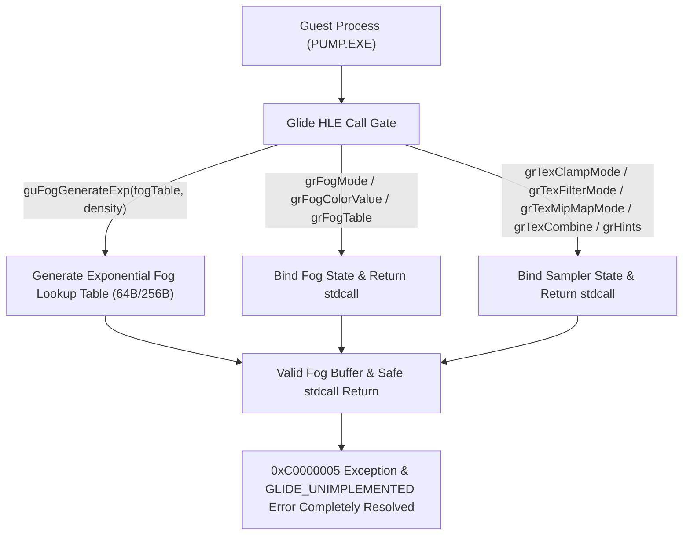

# 20260726-313 미구현 Glide API 완비 및 Fog Exception 해결 설계 / Design: Comprehensive Glide API implementation and fog exception fix

## 한국어

### 개요

`repiu_log.txt` 분석에서 확인된 9종의 `GLIDE_UNIMPLEMENTED_FUNCTION` 및 `GLIDE_UNSUPPORTED_ARGUMENT` API들을 정식 HLE 핸들러로 완비하고, `_GUFOGGENERATEEXP@8` (guFogGenerateExp) 미구현으로 유발된 `action=terminate` 강제 종료 및 `0xC0000005` (Access Violation at `0x0383E2D0`) 런타임 예외를 완전 해결합니다.

---

### 구조 및 흐름

---

### 핵심 설계 상세

1. **`_GUFOGGENERATEEXP@8` (guFogGenerateExp) 서명 등록 및 HLE 구현:**
   - `kObservedSignatures`에 `{"_GUFOGGENERATEEXP@8", 8U, GlideReturnKind::kVoid}` 등록.
   - `guFogGenerateExp(GrFog_t* fogTable, float density)` 수식:
     $$F(i) = \text{clamped\_byte}(255.0 \cdot (1.0 - e^{-density \cdot (i / 255.0)}))$$
     안개 버퍼 메모리가 유효한 경우 64개 또는 256개 항목에 지수 안개(Exponential fog) 룩업 테이블 바이트를 채우고 stdcall `ret 8` 반환.

2. **Fog API 패밀리 HLE 구현 (`glide_hle.cpp` / `linexe_glide_boundary.cpp`):**
   - `grFogMode(GrFogMode_t mode)`: `0x02` (`GR_FOG_MULTIFOG` / `GR_FOG_WITH_TABLE`) 인수 지원 및 state 저장.
   - `grFogColorValue(GrColor_t color)`: fog color 수치 저장 및 stdcall `ret 4` 반환.
   - `grFogTable(const GrFog_t fogTable[GR_FOG_TABLE_SIZE])`: fogTable 포인터 저장 및 stdcall `ret 4` 반환.

3. **Texture Sampler & Hint API 패밀리 HLE 구현:**
   - `grTexClampMode`, `grTexFilterMode`, `grTexMipMapMode`, `grTexCombine` (28B), `grHints` (8B) 핸들러 등록 및 stdcall 크기 유지.

---

## English

### Overview

This design implements all 9 missing/unsupported Glide APIs identified in `repiu_log.txt`, resolves the `action=terminate` triggered by missing `_GUFOGGENERATEEXP@8` (guFogGenerateExp), and fixes the resulting `0xC0000005` (Access Violation at `0x0383E2D0`) fatal exception.

---

### Key Design Details

1. **`_GUFOGGENERATEEXP@8` (guFogGenerateExp) Registration & Implementation:**
   - Add `{"_GUFOGGENERATEEXP@8", 8U, GlideReturnKind::kVoid}` to `kObservedSignatures`.
   - Calculate exponential fog lookup table entries ($F(i) = 255.0 \cdot (1.0 - e^{-density \cdot (i / 255.0)})$) when a valid `fogTable` pointer is supplied and return stdcall `ret 8`.

2. **Fog API Family HLE Implementation:**
   - Handle `grFogMode` (supporting `mode = 0x02`), `grFogColorValue`, and `grFogTable`.

3. **Texture Sampler & Hint API Family HLE Implementation:**
   - Implement `grTexClampMode`, `grTexFilterMode`, `grTexMipMapMode`, `grTexCombine` (28B), and `grHints` (8B) handlers.
