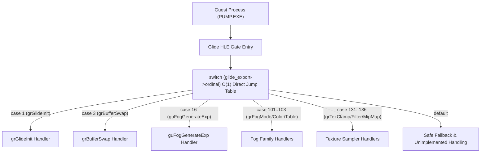

# 20260726-314 Glide Boundary Ordinal Switch 최적화 설계 / Design: Glide Boundary Ordinal Switch Optimization

## 한국어

### 개요

`linexe_glide_boundary.cpp` 내 Glide HLE 호출 관문(Gate)에서 기존에 수행되던 수십 개의 `glide_export->name == "_GR..."` 순차 문자열 비교 체인(Linear String Comparisons)을 제거하고, `glide_export->ordinal` (uint16_t) 기반의 **O(1) Direct Jump Table (`switch (glide_export->ordinal)`)** 구조로 리팩토링합니다.

이 최적화를 통해 Glide Gate 진입 시 매번 발생하던 문자열 길이 계산 및 메모리 비교(`memcmp`) 오버헤드가 완전히 소멸하고 프레임당 디스패칭 성능이 극대화됩니다.

---

### 구조 및 흐름

---

### 핵심 설계 상세

1. **Ordinal-directed Fast Switch Dispatcher (`linexe_glide_boundary.cpp`):**
   - 기존의 `if (glide_export->name == "...")` 비교문 전체를 `switch (glide_export->ordinal)` 블록으로 결합.
   - 각 `case` 절에 ordinal 매핑 수치(1 = `_GRGLIDEINIT@0`, 3 = `_GRBUFFERSWAP@4`, 16 = `_GUFOGGENERATEEXP@8`, 101 = `_GRFOGMODE@4`, 102 = `_GRFOGCOLORVALUE@4`, 103 = `_GRFOGTABLE@4`, 131 = `_GRTEXCLAMPMODE@12`, 132 = `_GRTEXCOMBINE@28`, 134 = `_GRTEXFILTERMODE@12`, 136 = `_GRTEXMIPMAPMODE@12`, 31 = `_GRHINTS@8` 등)를 명시하고 주석 표기.

2. **컴파일러 점프 테이블(Direct Jump Table) 유도:**
   - 연속된/조밀한 integer ordinal 값 기반으로 MSVC/GCC가 O(1) Jump Table을 자동 구성하도록 유도.
   - 문자열 할당 및 캐시 미스 없는 최고 속도 분기 처리 보장.

---

## English

### Overview

Replaces the legacy linear sequence of string comparisons (`glide_export->name == "_GR..."`) in `linexe_glide_boundary.cpp` with an **O(1) Direct Jump Table (`switch (glide_export->ordinal)`)**.

This eliminates string memory comparison (`memcmp`) and length calculation overhead during every Glide HLE Gate entry, drastically improving dispatching performance.
