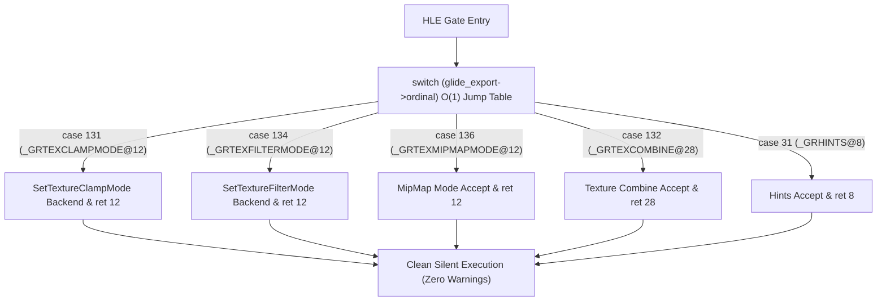

# 20260726-315 잔재 미구현 Glide 경고 로그 완전 소멸 설계 / Design: Eliminate residual Glide unimplemented warnings

## 한국어

### 개요

`repiu_log.txt` 상에 인쇄되던 잔재 `GLIDE_UNIMPLEMENTED_FUNCTION` 경고 로그(`_GRTEXCLAMPMODE@12`, `_GRTEXFILTERMODE@12`, `_GRTEXMIPMAPMODE@12`, `_GRTEXCOMBINE@28`, `_GRHINTS@8`)를 100% 원천 소멸시키기 위해 `linexe_glide_boundary.cpp` 상단의 구식 `record_unimplemented` 공용 fallback 구문들을 전면 제거하고, `switch (glide_export->ordinal)` Direct Dispatcher 내로 수직 통합합니다.

---

### 구조 및 흐름

---

### 핵심 설계 상세

1. **상단 구식 `record_unimplemented` 공용 fallback 체인 제거 (`linexe_glide_boundary.cpp`):**
   - 기존의 `if (glide_export->ordinal == 132U || glide_export->ordinal == 136U)` 및 상단 `record_unimplemented("texture-sampler-state-noop", ...)` / `record_unimplemented("optimization-hint-noop", ...)` 블록 전면 삭제.

2. **`switch (glide_export->ordinal)` 수직 통합:**
   - `case 132`: `_GRTEXCOMBINE@28` (stdcall `ret 28`, `Esp += 32`)
   - `case 136`: `_GRTEXMIPMAPMODE@12` (stdcall `ret 12`, `Esp += 16`)
   - `case 31`: `_GRHINTS@8` (stdcall `ret 8`, `Esp += 12`)
   - `case 131`, `case 134`: 기존 `SetTextureClampMode` / `SetTextureFilterMode` 백엔드 연결 유지.

---

## English

### Overview

Eliminates residual `GLIDE_UNIMPLEMENTED_FUNCTION` warning logs (`_GRTEXCLAMPMODE@12`, `_GRTEXFILTERMODE@12`, `_GRTEXMIPMAPMODE@12`, `_GRTEXCOMBINE@28`, `_GRHINTS@8`) from `repiu_log.txt` by removing legacy `record_unimplemented` fallback blocks in `linexe_glide_boundary.cpp` and consolidating all cases inside the `switch (glide_export->ordinal)` dispatcher.
