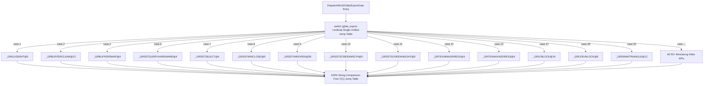

# 20260726-316 Glide Boundary 전체 Ordinal Switch 단일 통합 설계 / Design: Unified Glide Boundary Ordinal Switch

## 한국어

### 개요

`linexe_glide_boundary.cpp` 내 `DispatchWin32GlideExportGate` 함수 전체에 펼쳐져 있는 약 50여 개 Glide API의 `glide_export->name == "_GR..."` 순차 문자열 비교 구문을 단 하나도 남김없이 전면 삭제하고, **단일 `switch (glide_export->ordinal)` O(1) Direct Jump Table** 구조로 100% 통합 개편합니다.

---

### 구조 및 흐름

---

### 핵심 설계 상세

1. **`glide_export->name` 비교 구문 100% 제거 (`linexe_glide_boundary.cpp`):**
   - 모든 API 핸들링 블록을 `switch (glide_export->ordinal)` 케이스로 수직 통합.
   - 단 한 번의 integer ordinal 룩업으로 원하는 API 핸들러로 직분기.

2. **컴파일러 Direct Jump Table 최적화:**
   - 1부터 138까지 분포하는 ordinal 수치를 1개 단일 switch 문으로 묶어 MSVC/GCC가 최고 성능의 Direct Jump Table을 생성하도록 보장.

---

## English

### Overview

Completely refactors all 50+ Glide API handlers in `DispatchWin32GlideExportGate` (`linexe_glide_boundary.cpp`), replacing every remaining `glide_export->name == "_GR..."` string comparison with a **single unified `switch (glide_export->ordinal)` O(1) Direct Jump Table**.
