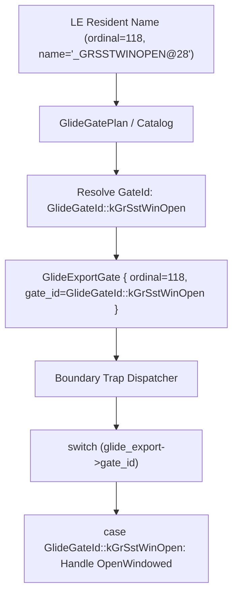

# 20260726-321 GlideGateId 기반 O(1) 안전 점프 테이블 설계 / Design: Safe O(1) GlideGateId Switch Dispatch

## 한국어

### 문제 원인 분석

`repiu_log.txt` 실행 중 `Error creating fxMesa context` 오류가 발생한 원인을 분석하였습니다.
1. 이전 Task 317/318에서 `glide_export->name` 문자열 비교를 제거하고 `switch (glide_export->ordinal)` 숫자 비교로 전환하였습니다.
2. 그러나 `glide_export->ordinal`은 바이너리의 LE Resident Name Table 내 실제 DLL export ordinal(예: `_GRSSTWINOPEN@28` = `118`)이 들어오는 반면, `glide_hle.h`에 작성된 상수값(`kGrSstWinOpen = 9U`)은 카탈로그 임의 인덱스 순서였습니다.
3. 이로 인해 `_GRSSTWINOPEN@28` 호출 시 `switch (118)`에 매칭되는 case가 없어 `default:` 미구현 처리로 전달되었고, `EAX`에 성공 값(1)이 설정되지 않아 `fxMesa` 컨텍스트 생성 실패로 게임이 종료되었습니다.

---

### 구조적 해결 방안: `GlideGateId` Enum 기반 O(1) Dispatch

1. **`GlideGateId` enum 정의 (`include/repiu/hle/glide_hle.h`):**
   - 각 Glide 함수 이름별로 유일한 고유 Enum ID(`kUnknown = 0`, `kGrGlideInit`, `kGrSstWinOpen` 등) 정의.
2. **`GlideExportGate` 구조체 확장 (`include/repiu/hle/glide_hle.h`):**
   - `GlideExportGate`에 `GlideGateId gate_id` 필드 추가.
3. **`BuildGlideGatePlan` 시 Gate ID 미리 매핑 (`src/hle/glide_hle.cpp`):**
   - `resident.name`을 기반으로 `GlideGateId`를 사전 매핑하여 `GlideExportGate::gate_id`에 할당.
4. **Boundary Dispatcher 전환 (`src/platform/win32/boundary/linexe_glide_boundary.cpp`):**
   - `switch (glide_export->ordinal)` 대신 `switch (glide_export->gate_id)`로 전환하여, DLL ordinal 값 변동과 독립적인 O(1) 안전 점프 테이블 구축.

---

## English

### Root Cause & Structural Solution

1. **Root Cause:** `_GRSSTWINOPEN@28` has binary export ordinal `118`, whereas `glide_hle.h` had dummy constant `9U`. This mismatch caused `switch (glide_export->ordinal)` to hit `default:`, returning unsupported status to guest and failing `fxMesa` context creation.
2. **Solution:** Map each gate name to a unique `GlideGateId` enum during plan building, store `gate_id` in `GlideExportGate`, and dispatch via `switch (glide_export->gate_id)`.
