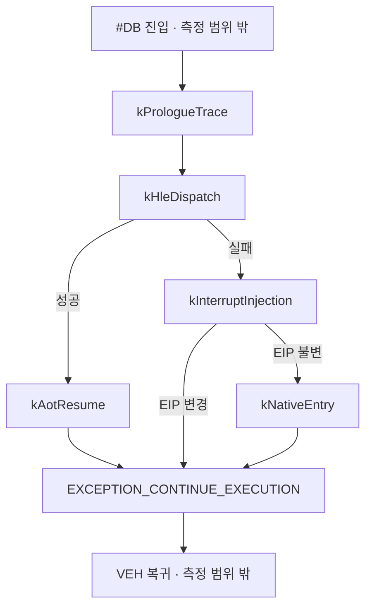

# 20260727-322 설계: Single-step handler 단계별 비용 귀속 / Design: Single-step handler stage attribution

> **정정 (Task 323):** 아래 1절이 `kAotResume` 비용의 원인으로 지목한 "동적 번역"은
> 사실이 아닙니다. `TryResumeAotAfterHandledHle`의 cache miss 경로는 opt-in
> `REPIU_AOT_DBT_POST_HLE_TRANSLATE`가 꺼져 있으면 `PostHleTranslationEnabled()`에서
> 즉시 반환하며, Task 322의 두 실행 모두 `posthle=0/0`이었습니다. 즉
> `ResolveAotTransferTarget`은 호출되지 않았습니다. 6절 gate 표 첫 행이 도출한
> "다음 작업은 로드맵 1단계" 결론도 함께 철회합니다. 측정값(74.05%) 자체는
> 유효합니다. 후속 분석은
> [20260727-323-whole-run-execution-time-attribution.md](20260727-323-whole-run-execution-time-attribution.md).
>
> **Correction (Task 323):** Section 1's attribution of `kAotResume` cost to dynamic
> translation is false; the cache-miss path returns at the opt-in
> `PostHleTranslationEnabled()` gate and both runs recorded `posthle=0/0`, so
> `ResolveAotTransferTarget` was never called. The section 6 gate conclusion selecting
> roadmap stage 1 is withdrawn. The 74.05% measurement itself stands.

## 한국어

### 1. 목적

Task 309는 `HandleSingleStepTrace` 안에서 guest EIP별 count와 TSC tick을 기록해
HLE가 event의 33.60%지만 handler tick의 84.82%이며 평균 `186,160 tick/event`라는
사실을 확인했습니다. 그러나 같은 문서는 이 값이 무엇의 비용인지는 **미확정**으로
남겼습니다.

`186,160 tick`은 약 60us입니다. `mov eax, ds` 한 개를 shadow selector에서 읽어
전달하는 emulate 본체 비용으로는 설명되지 않는 규모입니다. 현재 HLE 성공 경로는
emulate 직후 [`TryResumeAotAfterHandledHle`](../../src/platform/win32/execution/execution_trampoline.cpp)를
호출하고, 그 안의 `ResolveAotTransferTarget`은 cache miss 시 **동적 번역**을
유발할 수 있습니다. `docs/analysis/aot-code-cache-emission.md`가 기록한 cache 생성
비용은 평균 `7,847.2us`이므로, 낮은 확률의 번역만 섞여도 평균을 지배합니다.

이 작업의 목적은 단 하나입니다 — **HLE tick 84.82%가 emulate 본체인지 AOT 재진입
경로인지 판정**하는 것입니다. 이 판정이 TF/VEH 제거 로드맵의 착수 순서를 결정합니다.

### 2. 범위와 비범위

범위:

* `HandleSingleStepTrace` 내부를 상호 배타적인 5개 단계로 분할해 count와 TSC tick을
  전역 및 guest EIP별로 누적한다.
* 기존 `REPIU_SINGLE_STEP_HOTSPOT_PROFILE` opt-in 스위치와 기존 outcome 분류를
  그대로 재사용한다.
* 보고 경로(`repiu_loader_win32` 종료 summary, `repiu_aot_probe`)를 확장한다.

비범위:

* 실행 의미 변경. 이 작업은 **관측 전용**이며 guest에게 보이는 동작을 바꾸지 않는다.
* kernel `#DB` 진입 비용과 VEH 복귀 이후 비용. 이 범위는 Task 309와 동일하게
  handler 본문 안쪽으로 한정한다. 밖의 비용은 residual로도 잡히지 않는다.
* HLE handler 내부의 추가 세분화(예: `HandlePortIoInstruction` 안쪽).

### 3. 단계 정의

`HandleSingleStepTrace`의 본문을 실행 순서대로 다섯 구간으로 나눕니다. 구간은
중첩되지 않고 순차적이므로 단순 합산이 성립합니다.

| 단계 | 대응 코드 | 측정 의도 |
|---|---|---|
| `kPrologueTrace` | `RecordExecutionProbe`, `RecordExecutionTrace`, LINEXE EIP 사다리, single-step shadow 레지스터 store, `ClassifyRouteASensitive` | 매 step마다 무조건 실행되는 진단 계측의 고정 비용 |
| `kHleDispatch` | `DispatchGuestHleHandlers` | 후보 판정 + decode + emulate 본체 |
| `kAotResume` | `TryResumeAotAfterHandledHle` | cache 조회와 **동적 번역** 비용 |
| `kInterruptInjection` | `InjectPendingInterrupts` | 타이머 주입 경계 비용 |
| `kNativeEntry` | `TryEnterNativeRegion` / `TryEnterNativeFastPath` / `TryEnterNativeLinearSpan` | Zydis span scan과 Dr0 설정 비용 |

여섯 번째 값 `residual`은 저장하지 않고 보고 시점에 파생합니다.

```text
residual = total_cycles - sum(stage_cycles)
```

`residual`은 단계 사이의 분기, 프로파일 자체 오버헤드, 그리고 preemption을 포함합니다.



### 4. 자료 구조

`include/repiu/platform/win32/single_step_hotspot_profile.h`를 확장합니다.

```cpp
enum class SingleStepProfileStage : std::uint32_t
{
    kPrologueTrace = 0,
    kHleDispatch,
    kAotResume,
    kInterruptInjection,
    kNativeEntry,
    kCount,
};
```

`Win32SingleStepHotspotEntry`, `Win32SingleStepHotspotProfile`,
`Win32SingleStepHotspotSample`, `Win32SingleStepHotspotProfileSnapshot`에 각각
`stage_counts`(`std::uint32_t`)와 `stage_cycles`(`std::uint64_t`) 배열을 추가합니다.

entry 하나당 증가량은 `5 * (4 + 8) = 60`바이트이고 capacity가 8,192이므로 profile
구조체는 약 `480KB` 증가합니다. profile은 opt-in이며 기본 OFF이므로 상시 실행
경로의 메모리 상주 비용은 없습니다.

기존 outcome 분류(`kHandledHle`, `kTimerInterrupt`, `kNativeExecution`,
`kTrapFlagRearm`)와 그 회계는 변경하지 않습니다. 단계 축은 outcome 축과 직교하며,
같은 표본이 양쪽에 각각 기록됩니다.

### 5. 계측 방식

`SingleStepHotspotCycleScope`에 단계 누적 API를 추가하고, 구간마다 RAII
`SingleStepHotspotStageScope`를 둡니다.

```cpp
class SingleStepHotspotStageScope
{
public:
    SingleStepHotspotStageScope(SingleStepHotspotCycleScope& parent,
                                SingleStepProfileStage stage);
    ~SingleStepHotspotStageScope();
};
```

부모 scope가 비활성(`profile_ == nullptr`)이면 단계 scope도 `__rdtsc`를 호출하지
않습니다. 따라서 profile OFF 상태의 추가 비용은 분기 하나입니다.

`__rdtsc` 한 쌍의 비용은 대략 `20~60 tick`입니다. 5개 단계 전부가 실행되는 최악의
경우에도 약 `300 tick`이 더해집니다. 판정 대상인 `186,160 tick` 대비 0.2% 미만이고,
가장 짧은 `kTrapFlagRearm` 경로(`9,338 tick`)에서도 3% 수준입니다. 이 수치는 보고에
함께 남겨 해석 시 참고합니다.

### 6. 판정 기준

이 작업은 관측 전용이지만, **결과에 따른 다음 행동을 착수 전에 고정**합니다.
그래야 Task 308처럼 사후에 결과를 재해석하는 일을 피할 수 있습니다.

HLE outcome 표본에 한정해 `kHleDispatch`와 `kAotResume`의 tick 비중을 비교합니다.

| 관측 | 해석 | 다음 작업 |
|---|---|---|
| `kAotResume` >= HLE tick의 50% | 병목은 emulate가 아니라 **번역 캐시 미스**다 | 로드맵 1단계(block entry 패딩 + 범용 dispatch stub)를 최우선으로 착수 |
| `kHleDispatch` >= HLE tick의 50% | 병목은 **HLE 본체**다 | 로드맵 2단계(Task 308 slot의 selector 경로 통합 후 기본 활성)를 최우선으로 착수 |
| 둘 다 50% 미만이고 `residual` >= 50% | handler 안에 지배적 비용이 없다 | 부분 최적화를 중단하고 TF 전면 제거(로드맵 1~3 동시)로 직행 |
| `kPrologueTrace` >= 전체 tick의 20% | 진단 계측이 상시 경로에 남아 있다 | 계측을 런타임 플래그 뒤로 이동하는 별도 소작업을 선행 |

여러 조건이 동시에 성립하면 위 표의 위쪽 행이 우선합니다.

### 7. 검증 절차

1. Win32 x86 Debug 빌드가 통과한다.
2. `repiu_aot_probe`의 single-step hotspot probe를 확장해 다음을 검증한다.
   * 단계 count/cycle이 entry와 전역 양쪽에서 동일하게 누적된다.
   * `sum(stage_cycles) <= total_cycles`가 성립한다(residual 음수 불가).
   * profile 비활성 시 단계 누적이 발생하지 않는다.
3. 실게임 60초 `aot-dbt` 실행을 `REPIU_SINGLE_STEP_HOTSPOT_PROFILE=1`로 수행하고
   종료 summary에서 단계별 분포를 확보한다.
4. 동일 조건 profile OFF 실행과 EEPROM hash가 일치하고 fatal이 0인지 확인한다.

Task 309와 동일하게 진행도(progress) 비교는 판정 근거로 쓰지 않습니다. 이 작업은
성능 개선이 아니라 귀속 측정이기 때문입니다.

### 8. 한계

* TSC는 preemption과 주파수 변동에 노출됩니다. 단일 표본의 최댓값이 아니라 합계
  비중으로만 해석합니다.
* 측정 범위는 handler 본문입니다. kernel `#DB` 진입과 `EXCEPTION_CONTINUE_EXECUTION`
  이후 복귀 비용은 여전히 범위 밖이며, 이 값은 `residual`에도 포함되지 않습니다.
  따라서 "handler 안에 지배적 비용이 없다"는 결론이 나오면 그 자체가 밖의 전이
  비용이 지배한다는 간접 근거가 됩니다.
* Debug 빌드 측정입니다. Release 대비 emulate 본체가 상대적으로 비싸게 보일 수
  있으므로, 단계 간 비율은 Debug 조건에서의 상대값으로만 사용합니다.

---

## English

### 1. Purpose

Task 309 established that HLE accounts for 33.60% of single-step events but 84.82%
of TSC ticks measured inside `HandleSingleStepTrace`, averaging `186,160 ticks per
event`. It explicitly left unresolved *what* that time is spent on.

`186,160 ticks` is roughly 60us, which is not plausible as the cost of emulating a
single `mov eax, ds` from a shadow selector. The HLE success path calls
`TryResumeAotAfterHandledHle` immediately after emulation, and its
`ResolveAotTransferTarget` can trigger **dynamic translation** on a cache miss.
`docs/analysis/aot-code-cache-emission.md` records an average cache-generation cost
of `7,847.2us`, so even a low rate of translation would dominate the mean.

This task answers exactly one question: **is the 84.82% HLE tick share the emulation
body or the AOT re-entry path?** The answer fixes the starting order of the TF/VEH
removal roadmap.

### 2. Scope

In scope: split `HandleSingleStepTrace` into five mutually exclusive stages and
accumulate count and TSC ticks per stage, both globally and per guest EIP, reusing
the existing `REPIU_SINGLE_STEP_HOTSPOT_PROFILE` opt-in switch and outcome
classification; extend the loader summary and `repiu_aot_probe` reporting.

Out of scope: any change to execution semantics (this is observation-only), kernel
`#DB` entry and post-VEH return cost (same boundary as Task 309), and finer
attribution inside individual HLE handlers.

### 3. Stage definition

The handler body is divided in execution order into `kPrologueTrace` (unconditional
diagnostic instrumentation), `kHleDispatch` (`DispatchGuestHleHandlers`),
`kAotResume` (`TryResumeAotAfterHandledHle`), `kInterruptInjection`
(`InjectPendingInterrupts`), and `kNativeEntry` (native region, fast path, and
linear span entry). The stages are sequential rather than nested, so their sum is
well defined. A sixth value, `residual = total_cycles - sum(stage_cycles)`, is
derived at report time and covers inter-stage branching, profiling overhead, and
preemption.

### 4. Data structures

`SingleStepProfileStage` is added alongside the existing outcome enum, and
`stage_counts`/`stage_cycles` arrays are added to the entry, profile, sample, and
snapshot structures. This adds 60 bytes per entry, about 480KB across the 8,192-slot
capacity. The profile is opt-in and off by default, so there is no resident cost on
the normal path. The stage axis is orthogonal to the existing outcome axis; each
sample is recorded on both.

### 5. Instrumentation

A RAII `SingleStepHotspotStageScope` accumulates into the parent
`SingleStepHotspotCycleScope`. When the parent is inactive the stage scope issues no
`__rdtsc`, so the profile-off path costs one branch. A worst-case step executing all
five stages adds roughly `300 ticks`, under 0.2% of the `186,160` figure under
examination but around 3% of the shortest `kTrapFlagRearm` path (`9,338 ticks`);
this ratio is reported alongside the data.

### 6. Decision gates

The follow-up action is fixed before measurement to avoid reinterpreting results
after the fact. Restricted to HLE-outcome samples: if `kAotResume` holds at least 50%
of HLE ticks, the bottleneck is translation cache misses and roadmap stage 1 (block
entry padding plus a general dispatch stub) starts first. If `kHleDispatch` holds at
least 50%, the bottleneck is the HLE body and roadmap stage 2 (enabling the Task 308
slot after unifying the selector path) starts first. If neither reaches 50% and
`residual` exceeds 50%, no dominant cost lives inside the handler, and partial
optimization stops in favor of full TF removal. Independently, if `kPrologueTrace`
exceeds 20% of total ticks, moving diagnostics behind a runtime flag becomes a
prerequisite sub-task. Earlier rows win when multiple conditions hold.

### 7. Verification

The Win32 x86 Debug build must pass; `repiu_aot_probe` must verify that stage counts
accumulate identically at entry and global scope, that `sum(stage_cycles) <=
total_cycles` holds, and that a disabled profile accumulates nothing. A 60-second
live `aot-dbt` run with the profile enabled must produce the stage distribution, with
a matching EEPROM hash and zero fatal events against a profile-off run. Progress is
not used as evidence, because this task measures attribution rather than performance.

### 8. Limitations

TSC is exposed to preemption and frequency variation, so only aggregate shares are
interpreted, never single-sample maxima. The measurement boundary is the handler body;
kernel `#DB` entry and post-`EXCEPTION_CONTINUE_EXECUTION` return cost stay outside and
are not captured by `residual` either, which is why a "no dominant cost inside the
handler" result is itself indirect evidence that transition cost dominates. The
measurement is taken on a Debug build, so inter-stage ratios are valid only as relative
values under that configuration.
