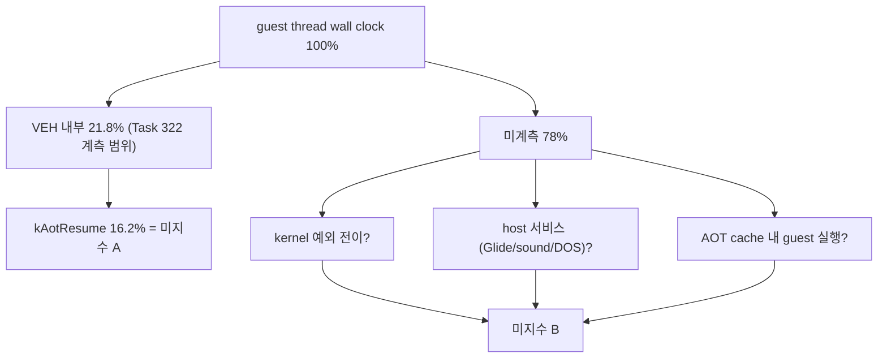

# 20260727-323 설계: 전체 실행 시간 귀속과 kAotResume 분해 / Design: Whole-run execution time attribution and kAotResume decomposition

## 한국어

### 1. 배경과 Task 322 결론 정정

Task 322는 `HandleSingleStepTrace` 내부를 5단계로 나누어 `kAotResume`이 handler
tick의 74.05%임을 확인했습니다. 그 측정은 유효합니다. 그러나 설계 문서가 그 원인으로
지목한 **"동적 번역"은 사실이 아닙니다.**

[`TryResumeAotAfterHandledHle`](../../src/platform/win32/aot/aot_dbt_dispatch.cpp)의
cache miss 경로는 `PostHleTranslationEnabled()`에서 즉시 반환합니다. 이는
`REPIU_AOT_DBT_POST_HLE_TRANSLATE` opt-in이며 Task 322의 두 실행 모두 설정하지
않았습니다. live telemetry는 두 실행 모두 `posthle=0/0`을 기록했습니다. 즉
`ResolveAotTransferTarget`은 **한 번도 호출되지 않았습니다.**

따라서 Task 322가 gate 첫 행에 근거해 확정한 "다음 작업은 로드맵 1단계"라는 결론도
철회합니다. 그 gate는 `kAotResume`이 dispatch/예외 왕복 비용이라는 암묵적 전제 위에
쓰였고, 그 전제가 성립하지 않습니다. `INT3`를 dispatch stub으로 바꿔도 stub이 호출할
해석 경로가 그대로면 비용은 줄지 않습니다.

### 2. 문제 재정의 — 두 개의 미지수

TSC 공칭 주파수 2.5GHz(i5-7200U) 기준으로 Task 322의 60초 실행을 wall-clock으로
환산하면 다음과 같습니다.

| 항목 | TSC tick | wall-clock 비율 |
|---|---:|---:|
| handler 전체 | 32.73e9 | 21.8% |
| └ `kAotResume` | 24.23e9 | 16.2% |
| └ `kHleDispatch` | 7.72e9 | 5.1% |
| **미계측 잔여** | 약 117e9 | **약 78%** |

여기서 두 가지가 동시에 미지수입니다.

* **미지수 A** — `kAotResume` 16.2%의 내역. 동적 번역이 아니라면 무엇인가.
* **미지수 B** — 미계측 78%의 내역. 60배 목표가 달성 가능한 곳이 있다면 여기다.

미지수 A만 풀면 상한 1.19배짜리 작업을 정확히 고르게 될 뿐입니다. 미지수 B를 함께
풀어야 다음 구현 작업의 규모를 판단할 수 있습니다. 두 계측 모두 관측 전용이고 서로
독립적이므로 하나의 Task로 묶습니다.



### 3. Part A — `kAotResume` 4구간 분해

`TryResumeAotAfterHandledHle` 본문을 실행 순서대로 나눕니다. 코드 판독 결과 후보
원인이 이미 좁혀져 있으므로, 계측은 그 후보를 확인하거나 기각하도록 배치합니다.

| 하위 단계 | 대응 코드 | 코드 판독으로 확인한 비용 구조 |
|---|---|---|
| `kSegmentWriteProbe` | `DoesGuestInstructionWriteSegmentRegister` | 매 호출 `ZydisDecoderInit` 재초기화 후 decode. 모든 early-out보다 먼저 실행 |
| `kQuarantineCheck` | `IsGuestInstructionPointer`, `IsWin32AotGuestPageQuarantined` | 상수 시간으로 추정 |
| `kCacheLookup` | `FindAotCacheAddress` | `placement.address_map` **선형 스캔**. O(n) |
| `kSpanSafety` | `IsImmediateHleReentrySpanSafe` | `ZydisDecoderInit` 재초기화 + 최대 64회 반복. 각 반복이 `IsAotHleBoundaryAddress`(**선형 스캔**)와 decode |

가설은 `kCacheLookup` 지배입니다. PIU plan 레코드는 26,710개이고 런타임 cache는
정적 image 118,701바이트에서 348,442바이트로 커졌으므로 `address_map`은 그 이상입니다.
MSVC Debug의 `std::vector` 순회를 원소당 20 cycle로 잡으면 `26,000 x 20 = 520,000`으로
관측 평균 `616,079`와 같은 자릿수입니다. 사실이면 해결책은 dispatch 아키텍처 변경이
아니라 해시 자료구조 한 개입니다.

이 계측은 가설을 **기각할 수 있어야** 의미가 있습니다. `kCacheLookup`이 지배적이지
않으면 위 추론 전체를 폐기하고 실제 상위 구간을 따릅니다.

`FindAotCacheAddress`는 AOT boundary 경로에서도 호출되므로(Task 322 실행에서 boundary
45,899회) 같은 스캔이 계측 범위 밖에서도 발생합니다. Part B가 그 몫을 잡습니다.

### 4. Part B — guest thread wall-clock 귀속

guest thread의 전체 실행 시간을 소수의 명명된 bucket으로 나눕니다.

| bucket | 대응 지점 | 의미 |
|---|---|---|
| `kGuestRunTotal` | `GuestEntryThreadProc`의 guest 진입/복귀 | 분모 |
| `kVehTotal` | `DispatchGuestException` 진입/반환 | 모든 예외 처리(단일 step, `INT3` boundary, AV 포함) |
| `kGlideGate` | `HandleGlideGateBoundary` | Glide gate. **렌더 큐 대기 시간을 포함** |
| `kPortIoDevice` | `HandlePortIoInstruction`과 AOT `kPortIo` thunk | 사운드/EEPROM 장치 emulation |
| `kDosService` | traced DOS/DPMI/mouse interrupt handler | 파일 I/O 등 |

**중첩 처리:** `kGlideGate`, `kPortIoDevice`, `kDosService`는 VEH 안에서 도달할 수도
있고(단일 step HLE 경로) 밖에서 도달할 수도 있습니다(AOT fast-path thunk). 따라서
bucket을 상호 배타로 강제하지 않고 각각 총량으로 기록하며, VEH 안/밖 진입 횟수를
따로 셉니다. 보고 시 다음을 파생합니다.

```text
kVehExclusive   = kVehTotal - (VEH 안에서 소비된 서비스 bucket 합)
kUnaccounted    = kGuestRunTotal - kVehTotal - (VEH 밖 서비스 bucket 합)
```

`kUnaccounted`는 **AOT cache 내 guest 실행 시간과 kernel 예외 전이 시간의 합**입니다.
이 둘은 handler 안에서 관측할 수 없으므로 Part B-2로 분리합니다.

### 5. Part B-2 — kernel 예외 전이 비용 교정

`kUnaccounted`를 guest 실행과 kernel 전이로 나누려면 전이 1회의 가격이 필요합니다.
`repiu_aot_probe`에 합성 교정 probe를 추가합니다.

* 알려진 횟수의 `#DB`(TF 설정 후 `nop`)와 `INT3`를 발생시키고 사소한 VEH로 즉시
  `EXCEPTION_CONTINUE_EXECUTION`합니다.
* 전체 wall clock을 횟수로 나누어 전이 1회 비용을 구합니다.
* 실행 시 관측된 예외 횟수를 곱해 `kKernelTransitionEstimate`를 얻습니다.

이 값은 **추정**입니다. 실제 실행은 handler 본문이 더 크고 cache/TLB 상태가 달라
교정값보다 비쌀 수 있으므로 하한으로만 사용하며, `docs/analysis/`에도 추정으로
표기합니다.

### 6. 판정 기준

착수 전에 결과별 다음 행동을 고정합니다.

**Part A**

| 관측 | 다음 작업 |
|---|---|
| `kCacheLookup` >= `kAotResume`의 50% | `FindAotCacheAddress`를 guest 주소 해시 맵으로 교체. AOT boundary 경로도 같은 이득을 받음 |
| `kSpanSafety` >= 50% | `IsAotHleBoundaryAddress`를 정렬 범위 이진 탐색 또는 페이지 비트맵으로 교체하고 decoder 재초기화를 제거 |
| `kSegmentWriteProbe` >= 50% | guest 주소별 1비트 캐시로 decode 결과를 기억 |
| 어느 구간도 50% 미만 | 분산 원인이므로 개별 최적화 대신 `kAotResume` 호출 자체를 줄이는 방향으로 전환 |

**Part B**

| 관측 | 해석과 다음 작업 |
|---|---|
| `kGlideGate` >= 30% | 병목은 실행 엔진이 아니라 **렌더 경로 또는 큐 대기**다. TF/VEH 로드맵보다 렌더 파이프라인이 우선 |
| `kKernelTransitionEstimate` >= 30% | 예외 **횟수**가 실제 지배 요인이다. TF/VEH 전면 제거가 정당화됨 |
| `kUnaccounted` 잔여(guest 실행 추정) >= 50% | 이미 대부분 네이티브 실행 중이며 60배는 실행 엔진에서 나오지 않는다. 목표 재검토 |
| 위 어느 것도 30% 미만 | 비용이 host 서비스에 분산. 서비스별 세부 계측을 다음 Task로 |

Task 322에서 배운 교훈에 따라, gate가 전제하는 인과를 함께 명시합니다. 위 표의 해석은
"해당 bucket이 그 이름의 작업을 실제로 수행한다"는 전제 위에 있으며, 결과가 나오면
전제부터 코드로 재확인한 뒤 결론을 확정합니다.

### 7. 검증 절차

1. Win32 x86 Debug 빌드 통과.
2. `repiu_aot_probe` 전체 통과. 신규 교정 probe와 bucket 회계 불변식
   (`sum(sub-stage) <= kAotResume`, `kVehTotal <= kGuestRunTotal`) 검증.
3. 60초 `aot-dbt` 실행으로 Part A/B 분포 확보. Task 322와 동일 조건.
4. 계측 OFF 대조 실행과 EEPROM hash 일치, fatal 0 확인.

Part A는 기존 `REPIU_SINGLE_STEP_HOTSPOT_PROFILE` opt-in에 종속시키고, Part B는
`REPIU_EXECUTION_TIME_PROFILE` opt-in을 새로 둡니다. Part B는 예외당 2회가 아니라
구간당 2회 `__rdtsc`이므로 부담이 작지만, 기본 OFF를 유지합니다.

### 8. 한계

* TSC는 preemption과 주파수 변동에 노출됩니다. 합계 비중으로만 해석합니다.
* guest thread만 계측합니다. SDL 메인 스레드와 오디오 스레드의 비용은 범위 밖이며,
  guest thread가 그 결과를 기다리는 시간은 `kGlideGate` 등에 대기로 나타납니다.
* `kKernelTransitionEstimate`는 합성 교정 기반 추정이며 하한입니다.
* Debug 빌드 측정입니다. 선형 스캔은 Release에서 상대적으로 싸지므로 Part A의 비중은
  Release에서 줄어들 수 있습니다. 이 점은 결과 해석에 함께 남깁니다.

---

## English

### 1. Correcting the Task 322 conclusion

Task 322 correctly measured that `kAotResume` holds 74.05% of handler ticks, but the
design attributed it to dynamic translation, which is false. The cache-miss path in
`TryResumeAotAfterHandledHle` returns immediately at `PostHleTranslationEnabled()`, an
opt-in gated on `REPIU_AOT_DBT_POST_HLE_TRANSLATE` that neither Task 322 run set; both
runs recorded `posthle=0/0`, so `ResolveAotTransferTarget` was never called. The
follow-on conclusion that roadmap stage 1 is next is therefore withdrawn: that gate
assumed `kAotResume` was dispatch and exception round-trip cost, and replacing `INT3`
with a dispatch stub cannot help if the stub still calls the same resolution path.

### 2. Two unknowns

At the 2.5GHz nominal TSC of this i5-7200U, the Task 322 60-second run spent 21.8% of
wall clock inside the handler (16.2% in `kAotResume`, 5.1% in `kHleDispatch`), leaving
roughly 78% unmeasured. Unknown A is the composition of `kAotResume`; unknown B is the
composition of the unmeasured 78%, which is where a 60x target would have to come from.
Solving A alone only selects a task bounded at 1.19x, so both are measured together.

### 3. Part A

`TryResumeAotAfterHandledHle` is split into `kSegmentWriteProbe`
(`DoesGuestInstructionWriteSegmentRegister`, which re-initializes a Zydis decoder and
decodes before every early-out), `kQuarantineCheck`, `kCacheLookup`
(`FindAotCacheAddress`, a linear scan of `placement.address_map`), and `kSpanSafety`
(`IsImmediateHleReentrySpanSafe`, a re-initialized decoder plus up to 64 iterations
each performing a linear `IsAotHleBoundaryAddress` scan and a decode).

The hypothesis is that `kCacheLookup` dominates: the PIU plan holds 26,710 records and
the runtime cache grew from a 118,701-byte static image to 348,442 bytes, so at roughly
20 cycles per element in an MSVC Debug `std::vector` walk, 26,000 elements give about
520,000 cycles against the observed 616,079 average. If true, the fix is one hash
structure rather than a dispatch redesign. The instrumentation must be able to reject
this hypothesis; if `kCacheLookup` is not dominant, the reasoning is discarded and the
measured leader is followed instead.

### 4. Part B

Guest-thread wall clock is divided into `kGuestRunTotal` (the denominator, around guest
entry and return in `GuestEntryThreadProc`), `kVehTotal` (`DispatchGuestException`,
covering single steps, `INT3` boundaries, and access violations), `kGlideGate`
(`HandleGlideGateBoundary`, including any render-queue wait), `kPortIoDevice`, and
`kDosService`. Service buckets are reachable both inside the VEH via the single-step
HLE path and outside it via AOT fast-path thunks, so they are recorded as totals with
separate inside/outside entry counts rather than forced to be mutually exclusive.
Reporting derives `kVehExclusive` and `kUnaccounted`, where `kUnaccounted` is the sum of
guest execution inside the AOT cache and kernel exception transition time.

### 5. Part B-2

Splitting `kUnaccounted` requires a price for one transition, so a synthetic calibration
probe raises a known number of `#DB` and `INT3` exceptions through a trivial VEH that
immediately continues execution, divides wall clock by count, and multiplies by the
observed exception counts. The result is an estimate and a lower bound, because live
handler bodies are larger and cache and TLB state differ; it is recorded as inferred
rather than confirmed.

### 6. Decision gates

For Part A: `kCacheLookup` at or above 50% means replacing `FindAotCacheAddress` with a
guest-address hash map, which also benefits the AOT boundary path; `kSpanSafety` means
replacing the linear `IsAotHleBoundaryAddress` with a sorted-range binary search or page
bitmap and removing decoder re-initialization; `kSegmentWriteProbe` means caching the
decode result per guest address; and no dominant sub-stage redirects effort toward
reducing `kAotResume` call frequency instead.

For Part B: `kGlideGate` at or above 30% means the bottleneck is the render path or
queue wait rather than the execution engine, and the render pipeline outranks the TF/VEH
roadmap; `kKernelTransitionEstimate` at or above 30% justifies full TF/VEH removal
because exception count genuinely dominates; a residual guest-execution estimate at or
above 50% means execution is already mostly native and a 60x will not come from the
execution engine, so the target itself is revisited; and no bucket above 30% means cost
is spread across host services and per-service attribution follows.

Following the Task 322 lesson, each gate states the causal premise it assumes. The
interpretations hold only if each bucket actually performs the work its name implies, so
the premise is re-checked against the code before any conclusion is fixed.

### 7. Verification

The Win32 x86 Debug build must pass, `repiu_aot_probe` must pass including the new
calibration probe and the accounting invariants `sum(sub-stage) <= kAotResume` and
`kVehTotal <= kGuestRunTotal`, a 60-second `aot-dbt` run under Task 322 conditions must
produce both distributions, and a profile-off control must match the EEPROM hash with
zero fatal events. Part A is gated on the existing `REPIU_SINGLE_STEP_HOTSPOT_PROFILE`
switch and Part B on a new `REPIU_EXECUTION_TIME_PROFILE` switch, both off by default.

### 8. Limitations

TSC is exposed to preemption and frequency variation, so only aggregate shares are
interpreted. Only the guest thread is measured; SDL main-thread and audio-thread cost is
out of scope and appears only as waiting inside buckets such as `kGlideGate`. The kernel
transition figure is a synthetic lower-bound estimate. The measurement is a Debug build,
where linear scans are relatively more expensive than in Release, and that caveat is
carried into the result.
