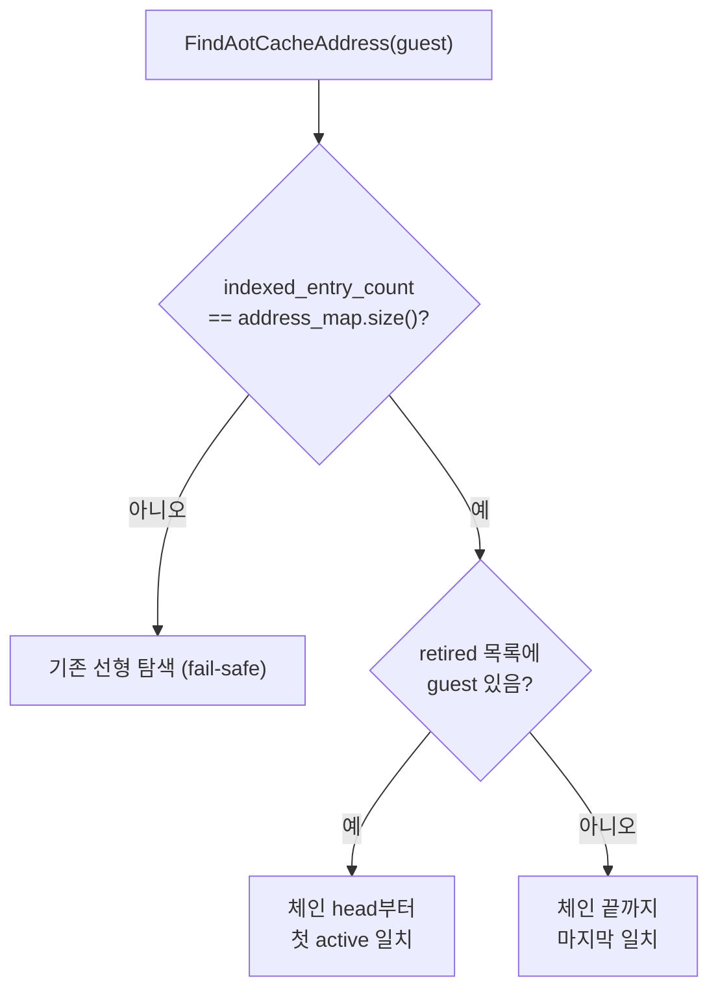

# 20260727-324 설계: AOT cache 주소 해시 색인 / Design: AOT cache address hash index

## 한국어

### 1. 배경

Task 323은 `FindAotCacheAddress`가 `kAotResume`의 87.75%를 차지하고 호출당 평균
`1,047,784 tick`(2.5GHz 기준 약 419us)임을 확인했습니다. 원인은
`placement.address_map`(PIU 기준 26,710 레코드 이상)에 대한 선형 탐색입니다.

같은 함수는 `ResolveAotTransferTarget`을 통해 AOT boundary 경로에서도 호출됩니다.
Task 323은 VEH 내부이면서 single-step handler 밖인 구간이 전체 wall-clock의 73.76%
임을 측정했지만 그 내역은 귀속하지 않았습니다. 같은 탐색이 원인이라는 것은 **가설**
이며, 이 작업의 A/B가 그것을 직접 검증합니다.

### 2. 보존해야 할 의미

현재 구현은 세 갈래지만 실제 규칙은 두 개입니다.

```text
1. retired_guest_addresses가 비어 있으면
       address_map을 앞에서부터 훑어 첫 일치 항목  (active 검사 없음)
2. 아니면 guest_address가 retired 목록에 있으면
       address_map을 뒤에서부터 훑어 첫 active 일치 항목
3. 아니면
       address_map을 앞에서부터 훑어 첫 일치 항목  (active 검사 없음)
```

1과 3은 동일하므로 규칙은 다음과 같이 압축됩니다.

| 조건 | 반환해야 할 항목 |
|---|---|
| 해당 guest 주소에 retired 세대가 있음 | **가장 최신의 active** 항목 |
| 그 외 | **가장 오래된**(최초 삽입) 항목, active 여부 무관 |

`address_map`에는 같은 guest 주소가 여러 번 나타납니다(세대별 재번역). 따라서 색인은
단순 key→value가 아니라 **삽입 순서를 보존하는 다중값 구조**여야 합니다. 이 두 규칙을
그대로 재현하지 못하면 잘못된 세대로 점프하므로, 이 작업의 성패는 성능이 아니라
의미 보존입니다.

### 3. 자료 구조

버킷 체인 색인을 둡니다. 별도 할당 컨테이너 대신 `address_map`과 평행한 정수 배열
두 개만 사용합니다.

```cpp
struct Win32AotCacheAddressIndex
{
    // address_map.size()와 같을 때만 색인이 유효하다.
    std::uint32_t indexed_entry_count = 0;
    // 2의 거듭제곱 크기. 값은 체인의 head map index 또는 sentinel.
    std::vector<std::uint32_t> buckets;
    // address_map과 평행. 같은 버킷의 다음(=더 오래된) map index.
    std::vector<std::uint32_t> next_in_bucket;
};
```

체인은 **최신을 head로** 연결합니다(삽입 시 head에 push). 그러면 두 규칙이 모두
한 번의 체인 순회로 처리됩니다.

* 최신 active 항목 — head부터 훑어 **처음** 만나는 `guest_address` 일치 && `active`
* 최초 삽입 항목 — 체인을 끝까지 훑어 **마지막**으로 만난 `guest_address` 일치

버킷에는 해시 충돌로 다른 guest 주소도 섞이므로 순회 중 `guest_address` 비교는
반드시 유지합니다. load factor는 1 이하로 유지하고 초과 시 버킷 수를 두 배로 늘려
재구축합니다. 해시는 기존 profile과 같은 `guest_address * 2654435761u` 후 마스크입니다.



### 4. 갱신 지점

`address_map`을 바꾸는 production 경로는 두 곳뿐이며, 각각 이미 정규 후처리 훅을
가지고 있습니다.

| 변경 | 기존 훅 | 색인 처리 |
|---|---|---|
| `placement->address_map = image.address_map` (최초 배치) | `InitializeWin32AotPageCoherence` | 전체 재구축 |
| `placement->address_map.push_back(entry)` (동적 append) | `RegisterWin32AotAddressMap` | 증분 append |

`address_map_states[].active`의 변경은 색인 구조에 영향을 주지 않습니다. 색인은
인덱스만 담고 active 여부는 조회 시점에 `address_map_states`에서 읽기 때문입니다.

### 5. Fail-safe

색인은 **필수 전제가 아니라 캐시**입니다. `indexed_entry_count != address_map.size()`
이면 기존 선형 탐색 코드를 그대로 실행합니다. 이유는 두 가지입니다.

* `repiu_aot_probe`의 여러 probe가 placement를 직접 `push_back`으로 구성하고 위 두
  훅을 거치지 않습니다. 이 경로는 자동으로 기존 동작으로 되돌아갑니다.
* 앞으로 새 변경 경로가 추가되어도 잘못된 결과가 아니라 느린 결과로 degrade합니다.

스레드 안전성은 현재와 동일합니다. 색인 쓰기는 `address_map` 쓰기와 같은 지점에서만
일어나므로 새로운 경합은 생기지 않습니다.

### 6. 검증

성능이 아니라 **의미 동등성**이 1차 검증 대상입니다.

1. **차등 probe** — 중복 guest 주소, retired 세대, 혼합 active 플래그를 포함한 합성
   placement를 구성하고, 모든 guest 주소에 대해 색인 결과와 선형 탐색 결과가
   **완전히 일치**함을 확인합니다. 최소한 다음을 포함합니다.
   * retired 목록이 빈 경우
   * retired 세대가 있는 주소와 없는 주소가 섞인 경우
   * 같은 주소의 최신 항목이 inactive이고 이전 항목이 active인 경우
   * 해시 충돌이 강제되는 주소 쌍
   * 색인 무효 상태(`indexed_entry_count` 불일치)에서 fallback이 같은 답을 주는 경우
2. Win32 x86 Debug 빌드와 기존 probe 전체 통과.
3. 60초 `aot-dbt` A/B. EEPROM hash 일치, fatal 0, legacy fallback 0, malformed 0.
4. Task 323 profile로 전후 비교.

### 7. 기대 결과

| 지표 | 기대 |
|---|---|
| `kCacheLookup` | 87.75% → 소멸 수준 |
| VEH 내부 미귀속 73.76% | **가설 검증 대상.** 같이 줄면 같은 원인 확정, 안 줄면 별도 계측 필요 |
| wall-clock | Debug 기준 큰 폭 개선 기대. 다만 아래 한계 참조 |

### 8. 한계

* **Debug 빌드 왜곡.** MSVC Debug의 iterator debug check가 `std::vector` 순회를 크게
  늦춥니다. Release에서는 선형 탐색 자체가 훨씬 싸므로 이 교체의 상대 이득은
  Debug보다 작습니다. O(n) → O(1)이라는 점근 개선은 빌드 구성과 무관하지만,
  **Debug A/B 수치를 Release 이득으로 인용하지 않습니다.**
* 이 작업은 `FindAotCacheAddress`만 다룹니다. `IsAotHleBoundaryAddress`의 선형 탐색
  (`kSpanSafety` 5.20%)과 `ZydisDecoderInit` 재초기화는 범위 밖이며, 이번 A/B 이후
  프로파일에서 다시 판단합니다.
* 색인은 메모리를 추가로 씁니다. 버킷 + next 배열로 항목당 약 8바이트, 26,710 항목
  기준 약 214KB입니다.

---

## English

### 1. Background

Task 323 measured `FindAotCacheAddress` at 87.75% of `kAotResume`, averaging
`1,047,784` ticks (about 419us at 2.5GHz) per call, caused by a linear scan of
`placement.address_map` (26,710+ records for PIU). The same function is reached from the
AOT boundary path through `ResolveAotTransferTarget`. Task 323 measured 73.76% of wall
clock inside the VEH but outside the single-step handler without attributing it; that the
same scan causes it is a hypothesis this task's A/B tests directly.

### 2. Semantics to preserve

The current three branches reduce to two rules: when the guest address has a retired
generation, return the newest **active** entry; otherwise return the oldest (first
inserted) entry regardless of its active flag. Because `address_map` holds the same guest
address multiple times across regenerations, the index must be an insertion-order-preserving
multi-value structure rather than a plain key-to-value map. Failing to reproduce both rules
jumps to the wrong generation, so this task succeeds or fails on semantic preservation, not
on speed.

### 3. Data structure

A bucket-chain index uses two integer arrays parallel to `address_map` rather than an
allocating container: `indexed_entry_count` (valid only when equal to `address_map.size()`),
a power-of-two `buckets` array holding chain heads, and `next_in_bucket`. Chains link
newest-first, so the newest active entry is the first chain match with `active` set, and the
oldest entry is the last chain match. Buckets mix guest addresses under collision, so the
`guest_address` comparison is retained during traversal. Load factor stays at or below one,
doubling and rebuilding when exceeded, using the same `* 2654435761u` multiplicative hash as
the existing profile.

### 4. Update points

Only two production paths mutate `address_map`, and each already has a canonical hook: the
initial bulk assignment is followed by `InitializeWin32AotPageCoherence` (full rebuild), and
each dynamic append calls `RegisterWin32AotAddressMap` (incremental append). Changes to
`address_map_states[].active` do not affect index structure, because the index stores only
indices and the active flag is read from `address_map_states` at query time.

### 5. Fail-safe

The index is a cache, not a precondition. When `indexed_entry_count != address_map.size()`
the original linear scan runs unchanged. This keeps the several `repiu_aot_probe` probes that
build placements by direct `push_back` working, and makes any future mutation path degrade to
a slow answer rather than a wrong one. Thread-safety is unchanged, since index writes happen
only where `address_map` writes already happen.

### 6. Verification

Semantic equivalence is the primary check, not speed. A differential probe builds synthetic
placements containing duplicate guest addresses, retired generations, mixed active flags,
forced hash collisions, and an invalidated index, then asserts the index result matches the
linear scan for every guest address. The Win32 x86 Debug build and all existing probes must
pass, a 60-second `aot-dbt` A/B must keep the EEPROM hash with zero fatal, legacy fallback,
and malformed dispatch, and the Task 323 profile provides the before/after comparison.

### 7. Expected outcome

`kCacheLookup` should collapse from 87.75%. Whether the unattributed 73.76% inside the VEH
falls with it is the hypothesis under test: if it does, the shared cause is confirmed; if it
does not, that region needs its own instrumentation.

### 8. Limitations

MSVC Debug iterator checks inflate `std::vector` traversal, so the relative gain here is
larger in Debug than in Release; Debug A/B numbers must not be quoted as Release gains, even
though the O(n) to O(1) change is build-independent. This task covers only
`FindAotCacheAddress`; the linear `IsAotHleBoundaryAddress` scan behind `kSpanSafety` (5.20%)
and the repeated `ZydisDecoderInit` are out of scope and re-decided on the profile taken
afterward. The index costs roughly eight bytes per entry, about 214KB at 26,710 entries.
