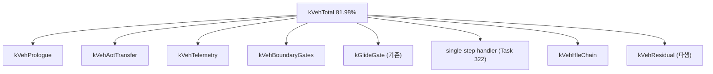

# 20260727-325 설계: VEH boundary 경로 비용 귀속 / Design: VEH boundary path attribution

## 한국어

### 1. 배경

Task 323은 guest thread wall-clock의 86.38%가 `DispatchGuestException` 본문임을
측정했고, Task 322의 single-step handler 계측과 합쳐 **VEH 내부이면서 single-step
handler 밖인 구간이 73.76%** 임을 도출했습니다.

Task 324는 그 구간이 `FindAotCacheAddress` 선형 탐색 때문이라는 가설을 A/B로
**기각**했습니다. 해시 색인 교체 후 single-step 경로는 크게 빨라졌지만(호출당
-99.3%, progress 2.66배) 해당 구간의 비율은 73.76% → **74.34%** 로 오히려 유지됐습니다.

즉 전체 실행 시간의 4분의 3을 차지하는 단일 블록의 내부를 이 프로젝트는 아직 한 번도
들여다보지 않았습니다. 이 작업이 그것을 합니다.

### 2. 계측 대상 구조

`DispatchGuestException` 본문은 실행 순서대로 다음과 같습니다. 굵은 항목이 현재
완전히 미계측입니다.

| 순서 | 구간 | 현재 상태 |
|---|---|---|
| 1 | 포인터 검증, 스레드 확인, breakpoint evidence, zero-EIP fail-closed | **미계측** |
| 2 | `HandleAotDbtCallStepProbe` | **미계측** |
| 3 | native linear span teardown | **미계측** |
| 4 | Route A native region | **미계측** |
| 5 | `HandleAotGuestCodeWrite{Completion,Fault}` (SMC) | **미계측** |
| 6 | `HandleAotReentry` | **미계측** |
| 7 | `HandleAotIndirectTransfer` | **미계측** |
| 8 | `HandleAotConditionalTransfer` | **미계측** |
| 9 | `HandleAotReturnTransfer` | **미계측** |
| 10 | live telemetry `InterlockedExchange` 9회 + allocator 기록 | **미계측** |
| 11 | `HandleGlideGateBoundary` | Task 323에서 계측 |
| 12 | `HandleTimerInterruptChainBoundary` | **미계측** |
| 13 | `HandleLinexeFarTransferBoundary` | **미계측** |
| 14 | `HandleSingleStepTrace` | Task 322에서 5단계 계측 |
| 15 | single-step 이후 HLE 핸들러 체인(약 20개 순차 호출) | **미계측** |

5~9번(AOT transfer 해석)과 15번(HLE 체인)이 크기와 성격 면에서 주 후보입니다. 5~9번은
`ResolveAotTransferTarget`과 동적 번역을 포함하고, 15번은 매 호출마다 guest 명령을
다시 decode하는 순차 술어 체인입니다.

### 3. bucket 정의

기존 `ExecutionTimeBucket`에 VEH 하위 bucket을 **append**합니다(기존 인덱스와 로그
필드 순서 보존).

| bucket | 대응 구간 |
|---|---|
| `kVehPrologue` | 1~4 (검증, call-step probe, span/region teardown) |
| `kVehAotTransfer` | 5~9 (SMC write, reentry, indirect, conditional, return) |
| `kVehTelemetry` | 10 (live telemetry 기록, allocator 기록) |
| `kVehBoundaryGates` | 12~13 (timer chain, LINEXE far transfer) |
| `kVehHleChain` | 15 (single-step 이후 HLE 핸들러 체인) |

11번과 14번은 이미 각각 `kGlideGate`와 Task 322 stage 축으로 계측돼 있으므로 새
bucket을 만들지 않습니다. 보고 시 다음을 파생합니다.

```text
kVehResidual = kVehTotal
             - (kVehPrologue + kVehAotTransfer + kVehTelemetry
                + kVehBoundaryGates + kVehHleChain)
             - (VEH 안에서 소비된 kGlideGate)
             - (single-step handler 합계)
```



### 4. 중첩 처리

`kVehHleChain` 내부에서 `HandlePortIoInstruction`과 `HandleTracedDosInterrupt21`이
호출될 수 있고 두 함수는 이미 자체 bucket을 가집니다. Task 323이 정한 정책을 유지해
bucket 간 배타성을 강제하지 않고 각각 총량으로 기록하며, 배타 값은 보고 시점의
파생값으로만 표현합니다. 새 VEH 하위 bucket은 `kVehTotal`의 **분해**이므로 기존
`kVehExclusive`/`kUnaccounted` 계산식에 더하지 않습니다.

### 5. 판정 기준

착수 전에 결과별 다음 행동을 고정합니다. 각 gate가 전제하는 인과도 함께 적습니다.
Task 322에서 전제를 적지 않아 잘못된 결론을 낸 적이 있기 때문입니다.

| 관측 | 전제 | 다음 작업 |
|---|---|---|
| `kVehAotTransfer` >= `kVehTotal`의 50% | 해당 bucket이 실제로 transfer 해석과 동적 번역을 수행함 | 내부를 `ResolveAotTransferTarget` / 동적 번역 / inline-cache publication으로 재분해 |
| `kVehHleChain` >= 50% | 체인이 순차 술어와 반복 decode로 비용을 만듦 | Task 312의 opcode-directed dispatch를 이 체인에도 적용 |
| `kVehPrologue` >= 30% | 검증·teardown이 매 예외 고정 비용을 만듦 | 고정 비용 항목을 조건부로 이동 |
| `kVehTelemetry` >= 20% | `InterlockedExchange` 9회가 실제 비용 | 기록을 샘플링 또는 non-atomic 미러로 전환 |
| `kVehResidual` >= 50% | 위 구간 밖에 비용이 있음 | 분해 경계가 잘못됐으므로 라인 단위 재계측 |

여러 조건이 성립하면 위쪽 행이 우선합니다. 결과가 나오면 gate가 전제한 인과를
**코드로 다시 확인한 뒤** 결론을 확정합니다.

### 6. 검증

1. Win32 x86 Debug 빌드 통과.
2. `repiu_aot_probe` 전체 통과. bucket 회계 불변식
   (`sum(VEH 하위 bucket) <= kVehTotal`) 검증 추가.
3. `REPIU_EXECUTION_TIME_PROFILE=1 REPIU_SINGLE_STEP_HOTSPOT_PROFILE=1`
   60초 `aot-dbt` 실행으로 분포 확보.
4. 두 profile OFF 대조 실행과 EEPROM hash 일치, fatal 0, malformed 0.

Task 324가 워크로드 이동을 겪었으므로, 이번에도 progress/heartbeat/phase를 함께
기록하고 구성비 비교 시 같은 작업량이 아닐 수 있음을 명시합니다.

### 7. 한계

* 관측 전용이며 실행 의미를 바꾸지 않습니다.
* Debug 빌드 측정입니다. 순차 decode와 `std::vector` 순회는 Release에서 상대적으로
  싸지므로 구성비는 Debug 조건의 상대값입니다.
* bucket 하나당 `__rdtsc` 2회가 추가됩니다. VEH 진입당 최대 5개 bucket이 열리므로
  약 300 tick이 더해지며, 진입당 평균이 약 68만 tick인 현재 규모에서는 0.05% 미만입니다.

---

## English

### 1. Background

Task 323 measured 86.38% of guest-thread wall clock inside `DispatchGuestException` and,
combined with Task 322's single-step attribution, derived 73.76% sitting inside the VEH but
outside the single-step handler. Task 324's A/B rejected the hypothesis that this was the
`FindAotCacheAddress` linear scan: after the hash index the single-step path got far faster
(per-call cost down 99.3%, progress up 2.66x) yet the share held at 74.34%. A single block
holding three quarters of execution time has never been examined from the inside, and this
task does that.

### 2. Structure under measurement

The VEH body runs, in order: pointer and thread validation with breakpoint evidence and a
zero-EIP fail-closed path; `HandleAotDbtCallStepProbe`; native linear span teardown; Route A
native region handling; `HandleAotGuestCodeWrite{Completion,Fault}`; `HandleAotReentry`;
`HandleAotIndirectTransfer`; `HandleAotConditionalTransfer`; `HandleAotReturnTransfer`; nine
live-telemetry `InterlockedExchange` writes plus allocator recording; `HandleGlideGateBoundary`
(already bucketed); `HandleTimerInterruptChainBoundary`; `HandleLinexeFarTransferBoundary`;
`HandleSingleStepTrace` (already staged by Task 322); and a roughly twenty-call sequential HLE
handler chain for exceptions the single-step path did not take. Everything except the two
already-instrumented items is unmeasured. The AOT transfer group and the HLE chain are the
leading candidates: the former contains `ResolveAotTransferTarget` and dynamic translation, and
the latter re-decodes the guest instruction across a sequential predicate chain.

### 3. Buckets

`kVehPrologue`, `kVehAotTransfer`, `kVehTelemetry`, `kVehBoundaryGates`, and `kVehHleChain` are
appended to `ExecutionTimeBucket`, preserving existing indices and log field order. The Glide
gate and the single-step handler keep their existing instrumentation, and reporting derives
`kVehResidual` by subtracting all measured parts from `kVehTotal`.

### 4. Nesting

The HLE chain can call `HandlePortIoInstruction` and `HandleTracedDosInterrupt21`, which already
own buckets. Task 323's policy holds: buckets may nest, each records its own total, and
exclusivity appears only as a derived reporting value. The new VEH sub-buckets decompose
`kVehTotal` rather than adding to it, so they do not enter the existing `kVehExclusive` and
`kUnaccounted` formulas.

### 5. Decision gates

Fixed before measurement, each stating the causal premise it assumes, because Task 322 drew a
wrong conclusion from a gate whose premise went unstated. `kVehAotTransfer` at or above 50%
means re-decomposing it into resolution, dynamic translation, and inline-cache publication;
`kVehHleChain` at or above 50% means extending the Task 312 opcode-directed dispatch to that
chain; `kVehPrologue` at or above 30% means moving fixed per-exception work behind conditions;
`kVehTelemetry` at or above 20% means sampling or de-atomizing the telemetry writes; and
`kVehResidual` at or above 50% means the decomposition boundaries are wrong and need line-level
re-measurement. Earlier rows win, and every result is re-checked against the code before a
conclusion is fixed.

### 6. Verification

The Win32 x86 Debug build and `repiu_aot_probe` must pass, including a new accounting invariant
that the VEH sub-buckets sum to no more than `kVehTotal`. A 60-second `aot-dbt` run with both
profiles enabled produces the distribution, and a profiles-off control must match the EEPROM
hash with zero fatal and malformed dispatch. Because Task 324 saw the workload move as
execution got faster, progress, heartbeat, and phase are recorded alongside so composition
comparisons are not presented as equal-work comparisons.

### 7. Limitations

Observation only. Debug-build shares are relative to that configuration, since sequential
decoding and `std::vector` traversal are cheaper in Release. Each bucket adds two `__rdtsc`
calls, so at most five buckets per VEH entry add roughly 300 ticks against a current average
near 680,000 ticks per entry, under 0.05%.
