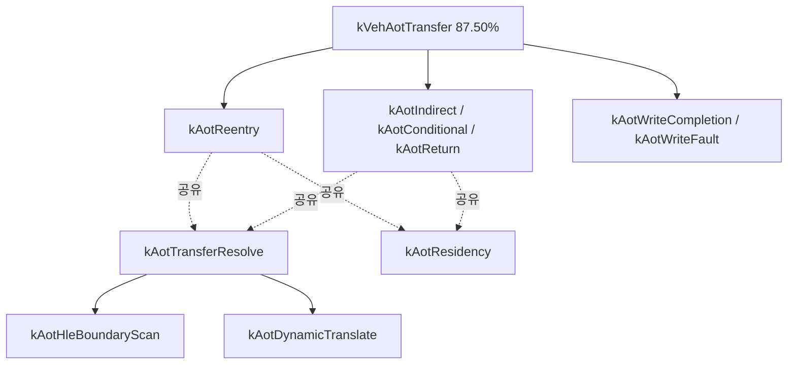

# 20260727-326 설계: AOT transfer 해석부 재분해 / Design: AOT transfer resolution decomposition

## 한국어

### 1. 배경

Task 325는 `kVehAotTransfer`가 VEH 내부의 87.50%, guest thread wall-clock의 71.31%를
차지하며 호출당 평균이 `1,269,368 tick`(약 508us)임을 확인했습니다. 이 bucket은 여섯
handler를 묶은 덩어리이므로 그 자체로는 무엇을 고쳐야 하는지 알려주지 않습니다.

이 작업은 두 축으로 동시에 분해합니다. 어느 handler가 지배적인지 모른 채 한 축씩
측정하면 실행 두 번이 필요하고, 그 사이 워크로드가 이동하면 두 측정을 붙여 해석할
수 없기 때문입니다.

### 2. 두 축

**handler 축** — VEH 안에서 순차 실행되므로 상호 배타적입니다.

| bucket | 대상 |
|---|---|
| `kAotWriteCompletion` | `HandleAotGuestCodeWriteCompletion` |
| `kAotWriteFault` | `HandleAotGuestCodeWriteFault` |
| `kAotReentry` | `HandleAotReentry` |
| `kAotIndirect` | `HandleAotIndirectTransfer` |
| `kAotConditional` | `HandleAotConditionalTransfer` |
| `kAotReturn` | `HandleAotReturnTransfer` |

**function 축** — 여러 handler가 공유하는 함수이므로 정의부에 계측해 모든 호출자를
한 bucket으로 모읍니다. handler 축과 **중첩**됩니다.

| bucket | 대상 | 코드 판독으로 본 비용 구조 |
|---|---|---|
| `kAotTransferResolve` | `ResolveAotTransferTarget` 전체 | 아래 셋을 포함 |
| `kAotHleBoundaryScan` | `IsAotHleBoundaryAddress` | `aot_excluded_guest_ranges` 선형 탐색 |
| `kAotDynamicTranslate` | `RequestAotDynamicTranslation` | 동적 번역(plan 생성 평균 7,847us) |
| `kAotResidency` | `AccumulateAotResidency` | `ZydisDecoderInit` 재초기화 + 최대 64회 decode. **순수 통계 목적** |

두 축을 함께 보면 "어느 handler에서" 와 "무슨 작업 때문에" 를 한 번의 실행으로
얻습니다.

### 3. 중첩 처리

Task 323이 정한 정책을 유지합니다. bucket 간 배타성을 강제하지 않고 각각 총량과
진입 횟수를 기록하며, 배타 값은 보고 시점의 파생값으로만 표현합니다. 두 축은
의도적으로 중첩하므로 **handler 축 합계와 function 축 합계를 서로 더하지 않습니다.**
각 축은 `kVehAotTransfer`에 대해 독립적으로 비율을 냅니다.

`AccumulateAotResidency`는 `aot_dbt_dispatch.cpp`와 `aot_dbt_hle_dispatch.cpp`에서도
호출됩니다. 정의부 계측이므로 `kVehAotTransfer` 밖 호출까지 포함하며, 그 몫은 handler
축 합계와의 차이로 드러납니다.

### 4. 판정 기준

착수 전에 결과별 다음 행동과 각 gate가 전제하는 인과를 함께 고정합니다.

| 관측 (`kVehAotTransfer` 대비) | 전제 | 다음 작업 |
|---|---|---|
| `kAotResidency` >= 50% | 이 함수가 통계 외 실행 의미를 갖지 않음 | 호출을 opt-in 뒤로 옮기거나 샘플링. 실행 의미가 없으므로 가장 싼 수정 |
| `kAotDynamicTranslate` >= 50% | bucket이 실제 plan 생성/emit을 수행 | 번역 빈도를 줄이는 방향(캐시 보존, quarantine churn)으로 전환 |
| `kAotHleBoundaryScan` >= 30% | 선형 탐색이 비용의 원인 | 정렬 범위 이진 탐색 또는 페이지 비트맵으로 교체 |
| `kAotTransferResolve` >= 50%인데 위 셋이 모두 30% 미만 | 해석부 자체에 분산 비용 | `ResolveAotTransferTarget`을 라인 단위로 재계측 |
| 위 어느 것도 아님 | handler 고유 작업이 지배 | handler 축 1위 함수를 단독으로 재분해 |

여러 조건이 성립하면 위쪽 행이 우선합니다. 결과가 나오면 gate가 전제한 인과를
**코드로 다시 확인한 뒤** 결론을 확정합니다. Task 322에서 전제를 확인하지 않아 잘못된
결론을 낸 적이 있습니다.

`kAotResidency`가 1위일 것이라는 예상이 있지만, 이는 Task 325 작업 로그에 미검증
가설로 기록한 것이며 이 계측이 기각할 수 있어야 의미가 있습니다.

### 5. 검증

1. Win32 x86 Debug 빌드 통과.
2. `repiu_aot_probe` 전체 통과. 열거 인덱스 안정성과 bucket 회계 검증 확장.
3. `REPIU_EXECUTION_TIME_PROFILE=1 REPIU_SINGLE_STEP_HOTSPOT_PROFILE=1`
   60초 `aot-dbt` 실행으로 두 축 분포 확보.
4. 두 profile OFF 대조 실행과 EEPROM hash 일치, fatal 0, malformed 0.

### 6. 한계

* 관측 전용이며 실행 의미를 바꾸지 않습니다.
* Task 325에서 확인했듯 실행 간 처리량 편차가 큽니다. 단일 쌍으로 계측 부담을
  측정하지 않으며, 구성비만 해석합니다.
* Debug 빌드 측정입니다. Zydis decode와 선형 탐색은 Release에서 상대적으로 싸므로
  구성비는 Debug 조건의 상대값입니다.
* bucket 10개가 추가되지만 한 VEH 진입에서 동시에 열리는 것은 최대 4~5개이므로
  `__rdtsc` 추가분은 진입당 약 200~300 tick, 현재 진입당 평균 대비 0.05% 미만입니다.

---

## English

### 1. Background

Task 325 measured `kVehAotTransfer` at 87.50% of VEH time and 71.31% of guest-thread wall
clock, averaging `1,269,368` ticks per call. That bucket groups six handlers, so on its own it
does not say what to fix. This task decomposes along two axes at once, because measuring one
axis per run would need two runs, and the workload drift observed in Tasks 324 and 325 would
make the two measurements unjoinable.

### 2. Two axes

The handler axis is mutually exclusive because the six handlers run sequentially inside the
VEH: `kAotWriteCompletion`, `kAotWriteFault`, `kAotReentry`, `kAotIndirect`,
`kAotConditional`, and `kAotReturn`.

The function axis covers functions shared across handlers, instrumented at their definitions
so every caller lands in one bucket: `kAotTransferResolve` for all of
`ResolveAotTransferTarget`, `kAotHleBoundaryScan` for the linear `IsAotHleBoundaryAddress`
scan, `kAotDynamicTranslate` for `RequestAotDynamicTranslation`, and `kAotResidency` for
`AccumulateAotResidency`, which re-initializes a Zydis decoder and decodes up to 64
instructions purely for statistics. Together the axes answer both which handler and what work
in a single run.

### 3. Nesting

Task 323's policy holds: buckets may nest, each records its own total and entry count, and
exclusivity appears only as a derived reporting value. The two axes nest deliberately, so
handler-axis and function-axis totals are never added together; each is expressed as a share
of `kVehAotTransfer` independently. `AccumulateAotResidency` is also called from
`aot_dbt_dispatch.cpp` and `aot_dbt_hle_dispatch.cpp`, and definition-site instrumentation
includes those calls, which surfaces as a difference against the handler-axis total.

### 4. Decision gates

Fixed before measurement, each stating its causal premise. `kAotResidency` at or above 50% of
`kVehAotTransfer`, given that the function carries no execution semantics beyond statistics,
means moving it behind an opt-in or sampling it — the cheapest possible fix.
`kAotDynamicTranslate` at or above 50% means shifting to reducing translation frequency
through cache retention and quarantine churn. `kAotHleBoundaryScan` at or above 30% means
replacing the linear scan with a sorted-range binary search or page bitmap.
`kAotTransferResolve` at or above 50% while all three stay below 30% means re-measuring
`ResolveAotTransferTarget` line by line. Otherwise the leading handler is decomposed on its
own. Earlier rows win, and every premise is re-checked against the code before a conclusion is
fixed, because Task 322 drew a wrong conclusion from an unexamined premise. The expectation
that `kAotResidency` leads is an unverified hypothesis recorded in the Task 325 log, and this
measurement must be able to reject it.

### 5. Verification

The Win32 x86 Debug build and `repiu_aot_probe` must pass with extended enumeration-stability
and accounting checks, a 60-second `aot-dbt` run with both profiles enabled must produce both
axes, and a profiles-off control must match the EEPROM hash with zero fatal and malformed
dispatch.

### 6. Limitations

Observation only. As Task 325 showed, run-to-run throughput varies widely, so a single pair is
not used to measure profiling overhead and only composition is interpreted. Debug-build shares
are relative to that configuration, since Zydis decoding and linear scans are cheaper in
Release. At most four or five of the ten new buckets open per VEH entry, adding roughly 200 to
300 ticks against the current per-entry average, under 0.05%.
