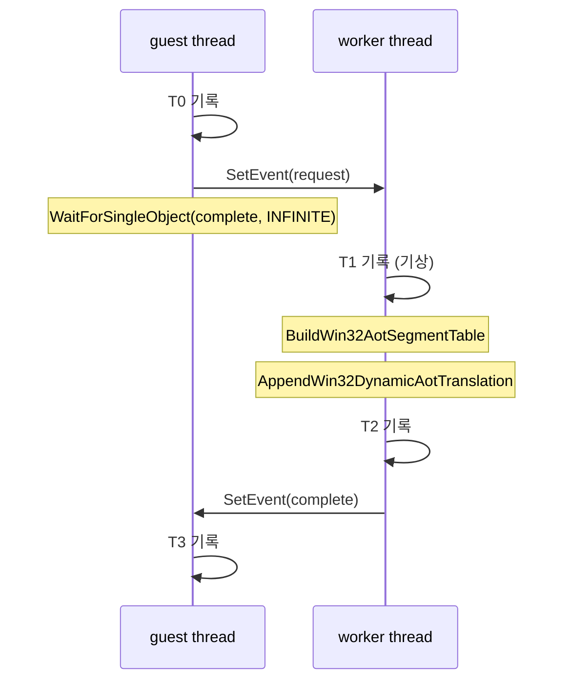

# 20260727-327 설계: 번역 워커 타이밍 계측 / Design: Translation worker timing

## 한국어

### 1. 배경과 이 작업이 넘는 경계

Task 326은 동적 번역 230회가 guest thread wall-clock의 61.6%, 호출당 약 175ms를
소비함을 확인했습니다. 그리고 `RequestAotDynamicTranslation`이 워커 스레드에
`SetEvent`를 보낸 뒤 `WaitForSingleObject(INFINITE)`로 **동기 대기**한다는 것도
확인했습니다.

따라서 측정된 175ms는 guest thread가 **차단된 시간**이며, 실제 작업은 워커 스레드에
있습니다. Task 323 이래 모든 계측은 guest thread만 보았으므로 이 175ms의 내역은
현재 구조로는 알 수 없습니다. **이 작업은 처음으로 guest thread 밖을 계측합니다.**

175ms의 정체에 따라 해법이 정반대입니다.

* 워커 CPU 작업이면 → 번역 단위를 줄이거나 번역 자체를 싸게 만든다
* 스케줄링 지연이면 → rendezvous를 없애거나(guest thread에서 직접 번역) 비동기화한다

두 가설 모두 근거가 있습니다. 정적 plan 생성 평균은
`docs/analysis/aot-code-cache-emission.md` 기준 `7,847.2us`로 175ms와 22배 차이가
나고, 이 기기는 2코어인데 guest thread, 워커, SDL 메인, 오디오, poll thread가
경합합니다.

### 2. 측정 지점

rendezvous 한 번을 네 구간으로 나눕니다.

| 구간 | 정의 | 의미 |
|---|---|---|
| `wake_latency` | `T1 - T0` | guest가 신호한 뒤 워커가 실제로 실행되기까지의 스케줄링 지연 |
| `segment_table` | `BuildWin32AotSegmentTable` | 워커 CPU |
| `append` | `AppendWin32DynamicAotTranslation` | 워커 CPU. plan 생성·emit·placement·page protection 포함 |
| `complete_latency` | `T3 - T2` | 워커가 완료 신호를 보낸 뒤 guest가 재개되기까지의 스케줄링 지연 |
| `guest_total` | `T3 - T0` | Task 326의 `kAotDynamicTranslate`와 대조할 값 |

`guest_total`과 네 구간 합의 차이는 잔여로 보고합니다. 두 값이 크게 어긋나면 계측
경계가 잘못된 것이므로 결론을 내지 않습니다.

### 3. 스레드 안전성

기존 `Win32ExecutionTimeProfile`은 guest thread 전용이고 `veh_depth` 같은 가변 상태를
가지므로 워커가 함께 쓰면 안 됩니다. 전용 구조체
`Win32AotWorkerTimingProfile`을 새로 둡니다.

* `T0`는 guest가 `SetEvent(request)` **직전에** 기록하고 워커가 기상 후 읽습니다.
* `T2`는 워커가 `SetEvent(complete)` **직전에** 기록하고 guest가 복귀 후 읽습니다.
* 누적기는 워커 구간은 워커가, guest 구간은 guest가 갱신합니다.

`SetEvent`/`WaitForSingleObject` 쌍이 happens-before를 제공하므로 이 접근은 경합이
아닙니다. 원자 연산이나 잠금을 추가하지 않으며, 따라서 계측이 측정 대상인 지연
자체를 바꾸지 않습니다.

### 4. 다른 워커 작업

같은 event 쌍을 `kPatchInlineCache`와 `kRetireGuestPage`도 사용합니다. 워커는 기상
직후 operation을 읽으므로 분기할 수 있습니다. 번역 구간만 누적하고, 나머지는
`other_operation_count`로 횟수만 셉니다. 이 값이 크면 rendezvous 비용이 번역 밖에도
있다는 뜻이므로 함께 보고합니다.

### 5. 판정 기준

착수 전에 결과별 다음 행동과 전제를 고정합니다.

| 관측 (`guest_total` 대비) | 전제 | 다음 작업 |
|---|---|---|
| `wake_latency + complete_latency` >= 50% | 두 값이 스케줄링 지연을 반영함 | rendezvous 제거 방향. guest thread에서 직접 번역하거나 비동기 + fallback |
| `append` >= 50% | 이 구간이 실제 plan 생성·emit·placement를 수행 | 번역을 싸게/작게. `append` 내부를 다시 분해 |
| `segment_table` >= 20% | — | `BuildWin32AotSegmentTable` 단독 최적화 |
| 잔여 >= 30% | — | 계측 경계 오류. 결론 보류하고 재계측 |

여러 조건이 성립하면 위쪽 행이 우선합니다. 결과가 나오면 gate가 전제한 인과를
코드로 다시 확인한 뒤 결론을 확정합니다. Task 326에서 gate 전제가 틀려 후속 계획을
수정해야 했습니다.

**주의:** `wake_latency`가 크더라도 그것이 곧 "스케줄링이 나쁘다"는 뜻은 아닙니다.
워커가 이전 요청을 처리 중이면 기상이 늦습니다. 따라서 이번 계측에는
`other_operation_count`와 함께 요청 간격도 남겨, 지연이 경합 때문인지 큐잉 때문인지
구분할 수 있게 합니다.

### 6. 검증

1. Win32 x86 Debug 빌드 통과.
2. `repiu_aot_probe` 전체 통과. 신규 타이밍 구조의 누적과 비활성 시 무누적 검증.
3. `REPIU_EXECUTION_TIME_PROFILE=1` 60초 `aot-dbt` 실행으로 분포 확보.
   `guest_total`이 Task 326의 `kAotDynamicTranslate`와 같은 자릿수인지 대조합니다.
4. profile OFF 대조 실행과 EEPROM hash 일치, fatal 0, malformed 0.

### 7. 한계

* 관측 전용이며 실행 의미를 바꾸지 않습니다.
* TSC를 두 스레드에서 읽습니다. Windows의 invariant TSC는 코어 간 동기화되지만,
  마이그레이션 시 작은 오차가 가능하므로 개별 표본이 아니라 합계로만 해석합니다.
  음수가 나올 수 있는 차분은 0으로 clamp하고 그 횟수를 보고합니다.
* 표본이 230회 규모로 작습니다. 평균과 최댓값을 함께 남깁니다.
* Debug 빌드 측정입니다. 워커 CPU 작업은 Release에서 줄지만 스케줄링 지연은 빌드
  구성과 무관하므로, 이 구분은 Release에서 오히려 더 뚜렷해질 수 있습니다.

---

## English

### 1. Background

Task 326 established that 230 dynamic translations consume 61.6% of guest-thread wall clock
at about 175ms each, and that `RequestAotDynamicTranslation` signals a worker thread then
blocks in `WaitForSingleObject(INFINITE)`. The measured time is therefore guest-thread blocked
time, and every measurement since Task 323 has observed only the guest thread. This task
crosses that boundary for the first time.

The remedy depends entirely on what the 175ms contains: worker CPU work points at shrinking or
cheapening translation, while scheduling latency points at removing or asynchronizing the
rendezvous. Both are plausible — the documented static plan build averages `7,847.2us`, a 22x
gap, and this two-core machine runs the guest thread, worker, SDL main thread, audio, and poll
thread concurrently.

### 2. Measurement points

One rendezvous splits into `wake_latency` (guest timestamp before `SetEvent` to the worker's
timestamp after waking), `segment_table` and `append` (worker CPU, the latter covering plan
construction, emission, placement, and page protection), and `complete_latency` (worker
timestamp before signalling completion to the guest's timestamp after resuming). `guest_total`
spans the whole rendezvous and is cross-checked against Task 326's `kAotDynamicTranslate`. The
difference between `guest_total` and the four parts is reported as a residual; a large residual
means the boundaries are wrong and no conclusion is drawn.

### 3. Thread safety

`Win32ExecutionTimeProfile` is guest-thread-only and holds mutable state such as `veh_depth`,
so a dedicated `Win32AotWorkerTimingProfile` is added instead. The guest records `T0` just
before `SetEvent(request)` and the worker reads it after waking; the worker records `T2` just
before `SetEvent(complete)` and the guest reads it after resuming. The event pair supplies
happens-before, so this is not a race, and no atomics or locks are added — which matters,
because they would perturb the very latency being measured.

### 4. Other worker operations

`kPatchInlineCache` and `kRetireGuestPage` share the same event pair. The worker reads the
operation immediately after waking and so can branch, accumulating only translation intervals
and counting the rest in `other_operation_count`, which is reported because a large value means
rendezvous cost exists outside translation too.

### 5. Decision gates

Fixed before measurement with premises stated. Combined wake and complete latency at or above
50% of `guest_total` points at removing the rendezvous, translating on the guest thread or
going asynchronous with a fallback; `append` at or above 50% points at cheaper or smaller
translation and a further decomposition; `segment_table` at or above 20% isolates that
function; and a residual at or above 30% means the boundaries are wrong and the conclusion is
withheld. Earlier rows win, and premises are re-checked against the code, because Task 326's
gate premise proved wrong and forced its follow-up to be revised.

A large `wake_latency` does not by itself mean scheduling is poor: the worker may still be
serving an earlier request. Request spacing and `other_operation_count` are therefore recorded
so contention can be told apart from queueing.

### 6. Verification

Build, pass `repiu_aot_probe` with accumulation and disabled-state checks for the new
structure, capture the distribution from a 60-second `aot-dbt` run, cross-check `guest_total`
against Task 326's `kAotDynamicTranslate`, and confirm a matching EEPROM hash with zero fatal
and malformed dispatch against a profile-off control.

### 7. Limitations

Observation only. TSC is read from two threads; Windows keeps invariant TSC synchronized across
cores, but migration can introduce small error, so only aggregates are interpreted and any
negative difference is clamped to zero with the occurrence counted. The sample is small at
roughly 230 events, so maxima accompany the means. These are Debug-build figures, where worker
CPU work shrinks in Release while scheduling latency does not, so the distinction may be
sharper in Release.
