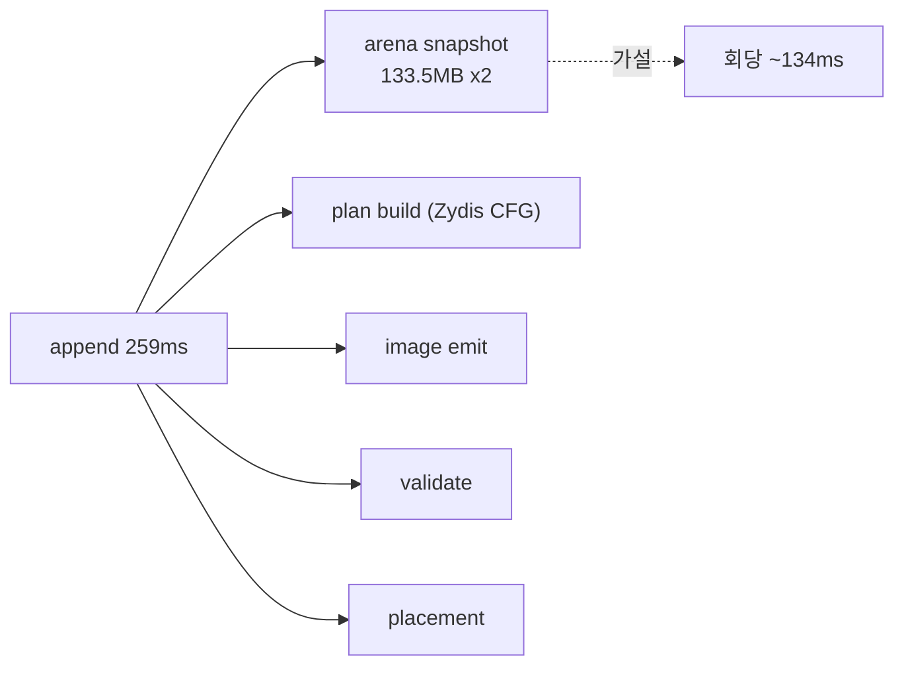

# 20260727-328 설계: 동적 append 단계 분해 / Design: Dynamic append phase decomposition

## 한국어

### 1. 배경

Task 327은 번역 rendezvous의 101.00%가 `AppendWin32DynamicAotTranslation`이고 wake와
complete 지연은 합쳐 0.04%임을 확인했습니다. 번역 1회 평균은 약 259ms, 최댓값은 약
702ms입니다. 이제 그 259ms 안을 봅니다.

### 2. 코드 판독으로 좁힌 후보

`AppendWin32DynamicAotTranslation`은 번역 대상 주변만 다루지 않습니다. 진입 직후
**guest arena 전체를 스냅샷합니다.**

```cpp
object.memory.resize(runtime_size);          // 할당 + 0으로 채움
ReadProcessMemory(GetCurrentProcess(), ...,  // 전체 복사
                  object.memory.data(), runtime_size, &bytes_read);
```

이 실행의 `runtime_size`는 `placed_size = 0x085D7000` = **140,004,352바이트
(약 133.5MB)** 입니다. 따라서 번역 1회마다 133.5MB zero-fill과 133.5MB 복사가
일어나며 왕복 약 267MB입니다. 60초 155회면 약 41GB입니다.

거칠게 2GB/s로 환산하면 회당 약 134ms로, 관측 평균 259ms의 절반을 넘습니다. 번역이
실제로 필요로 하는 것은 `guest_entry` 주변 범위이지 arena 전체가 아닙니다.

**이는 가설이며 이 작업이 기각할 수 있어야 합니다.** 이번 세션에서 코드 판독으로 세운
가설이 두 번(`AccumulateAotResidency`, `IsAotHleBoundaryAddress`) 기각됐습니다.

다만 이 항목은 다른 후보와 성격이 다릅니다. `memset`/`memcpy` 133.5MB와
`ReadProcessMemory` syscall은 최적화 수준과 무관하므로, **Debug 빌드 과대평가 우려가
이 항목에는 적용되지 않습니다.**

### 3. 측정 단계

`AppendWin32DynamicAotTranslation` 본문을 실행 순서대로 다섯 구간으로 나눕니다.

| 단계 | 대상 |
|---|---|
| `kAppendArenaSnapshot` | `object.memory.resize` + `ReadProcessMemory` |
| `kAppendPlanBuild` | `BuildAotTranslationPlanFromEntry` (Zydis CFG 순회) |
| `kAppendImageEmit` | `BuildAotCodeCacheImage` |
| `kAppendValidate` | `ValidateAotCodeCacheHleCoverage` |
| `kAppendPlacement` | 나머지 — cache 복사, fixup, address map 등록, page protection |

잔여는 보고 시점에 파생합니다.

### 4. 규모 축

"번역 단위를 줄인다"가 유효한 선택지인지 판단하려면 1회가 무엇을 커버하는지 알아야
합니다. 다음을 함께 누적합니다.

* plan의 `block_count`, `instruction_count`
* image의 emit 바이트 수
* `runtime_size`(스냅샷 크기)

번역 1회가 수천 명령을 다루면 단위 축소가 유효하고, 수십 명령뿐이면 비용은 **번역당
고정 오버헤드**이므로 해법이 달라집니다.



### 5. 스레드 안전성

이 함수는 **워커 스레드에서만** 실행됩니다. Task 327의
`Win32AotWorkerTimingProfile`을 확장해 워커가 단독으로 갱신하며, guest는 완료 이벤트
이후에만 읽습니다. `SetEvent`/`WaitForSingleObject`가 happens-before를 제공하므로
원자 연산이나 잠금을 추가하지 않습니다. 계측이 측정 대상을 바꾸면 안 됩니다.

`AppendWin32DynamicAotTranslation`은 `repiu_aot_probe`에서도 호출되므로 profile
포인터가 없는 경로를 허용해야 합니다. 시그니처에 선택적 profile 인자를 추가하고
기본값을 `nullptr`로 둡니다.

### 6. 판정 기준

착수 전에 결과별 다음 행동과 전제를 고정합니다.

| 관측 (`append` 대비) | 전제 | 다음 작업 |
|---|---|---|
| `kAppendArenaSnapshot` >= 50% | 이 구간이 실제로 전체 arena를 복사 | 필요한 범위만 읽도록 수정. 같은 프로세스이므로 복사 없이 직접 참조도 검토 |
| `kAppendPlanBuild` >= 50% | CFG 순회가 비용 | 순회 범위 제한 또는 번역 단위 축소. 규모 축이 어느 쪽인지 결정 |
| `kAppendImageEmit` >= 50% | emit 자체가 비용 | 증분 emit 또는 재사용 |
| `kAppendPlacement` >= 50% | placement 자료구조 또는 `VirtualProtect` | Task 324와 같은 유형인지 확인 후 재분해 |
| 어느 것도 40% 미만 | 비용 분산 | 번역 **횟수**를 줄이는 방향으로 전환 |

여러 조건이 성립하면 위쪽 행이 우선합니다. 결과가 나오면 gate가 전제한 인과를
코드로 다시 확인한 뒤 결론을 확정합니다.

### 7. 검증

1. Win32 x86 Debug 빌드 통과.
2. `repiu_aot_probe` 전체 통과. 신규 단계 누적과 profile 없는 호출 경로 검증.
3. `REPIU_EXECUTION_TIME_PROFILE=1` 60초 `aot-dbt` 실행으로 단계와 규모 분포 확보.
4. 단계 합계가 Task 327의 `append`와 같은 자릿수인지 대조.
5. profile OFF 대조 실행과 EEPROM hash 일치, fatal 0, malformed 0.

### 8. 한계

* 관측 전용이며 실행 의미를 바꾸지 않습니다.
* Debug 빌드 측정입니다. 다만 arena 스냅샷은 메모리 대역폭과 syscall 비용이므로
  이 항목만은 Release에서도 크게 다르지 않습니다. plan build와 emit은 Release에서
  줄어들 수 있으므로, 결과 해석 시 두 성격을 구분해 기록합니다.
* 표본이 155회 규모로 작습니다. 평균과 최댓값을 함께 남깁니다.
* 실행 간 처리량 편차가 크므로(Task 325~327) 구성비만 해석하고 ON/OFF 쌍을 계측
  부담 측정에 쓰지 않습니다.

---

## English

### 1. Background

Task 327 established that `AppendWin32DynamicAotTranslation` accounts for 101.00% of the
translation rendezvous while wake and completion latency total 0.04%, at about 259ms average
and 702ms peak per translation. This task looks inside that 259ms.

### 2. Candidate narrowed by code reading

The function does not work only near its target. Immediately on entry it snapshots the entire
guest arena: `object.memory.resize(runtime_size)` allocates and zero-fills, then
`ReadProcessMemory` copies the whole range. In this run `runtime_size` is the placed size
`0x085D7000`, or 140,004,352 bytes — about 133.5MB. Every translation therefore performs a
133.5MB zero-fill and a 133.5MB copy, roughly 267MB of traffic, about 41GB across 155
translations in 60 seconds. At a rough 2GB/s that is about 134ms per translation, more than
half the observed mean, while translation actually needs only the range around `guest_entry`.

This is a hypothesis the measurement must be able to reject, since two hypotheses formed by
code reading in this session were already rejected. It does differ from those in one respect:
a 133.5MB `memset`/`memcpy` and a `ReadProcessMemory` syscall cost roughly the same regardless
of optimization level, so the Debug-inflation caveat that applies to the rest of this
measurement chain does not apply here.

### 3. Phases

The body splits in execution order into `kAppendArenaSnapshot` (resize plus
`ReadProcessMemory`), `kAppendPlanBuild` (`BuildAotTranslationPlanFromEntry`, the Zydis CFG
walk), `kAppendImageEmit` (`BuildAotCodeCacheImage`), `kAppendValidate`
(`ValidateAotCodeCacheHleCoverage`), and `kAppendPlacement` (cache copy, fixups, address map
registration, page protection), with the residual derived at report time.

### 4. Size axis

Judging whether shrinking the translation unit is even available requires knowing what one
translation covers, so plan block and instruction counts, emitted image bytes, and the
snapshot size are accumulated alongside. Thousands of instructions per translation would make
unit reduction viable; a few dozen would mean the cost is fixed per-translation overhead and
the remedy differs.

### 5. Thread safety

This function runs only on the worker thread, so the Task 327
`Win32AotWorkerTimingProfile` is extended and updated by the worker alone, with the guest
reading only after the completion event, whose happens-before makes atomics and locks
unnecessary — and instrumentation must not perturb what it measures. Because
`repiu_aot_probe` also calls this function, the profile argument is optional and defaults to
null.

### 6. Decision gates

Fixed before measurement with premises stated. `kAppendArenaSnapshot` at or above 50% means
reading only the needed range, possibly referencing guest memory directly since this is the
same process; `kAppendPlanBuild` means limiting CFG traversal or shrinking the unit, with the
size axis deciding which; `kAppendImageEmit` means incremental emission or reuse;
`kAppendPlacement` means checking whether it is the same data-structure class as Task 324; and
nothing above 40% redirects effort toward reducing the number of translations. Earlier rows
win, and premises are re-checked against the code before any conclusion is fixed.

### 7. Verification

Build, pass `repiu_aot_probe` including the new phase accumulation and the profile-free call
path, capture phase and size distributions from a 60-second `aot-dbt` run, cross-check the
phase total against Task 327's `append`, and confirm a matching EEPROM hash with zero fatal and
malformed dispatch against a profile-off control.

### 8. Limitations

Observation only. These are Debug-build figures, but the arena snapshot is memory bandwidth and
syscall cost and so is largely build-independent, while plan build and emission are not; the
two kinds are distinguished when interpreting the result. The sample is small at roughly 155
events, so maxima accompany means. Given the run-to-run throughput variance seen in Tasks 325
through 327, only composition is interpreted and the on/off pair is not used to measure
instrumentation cost.
