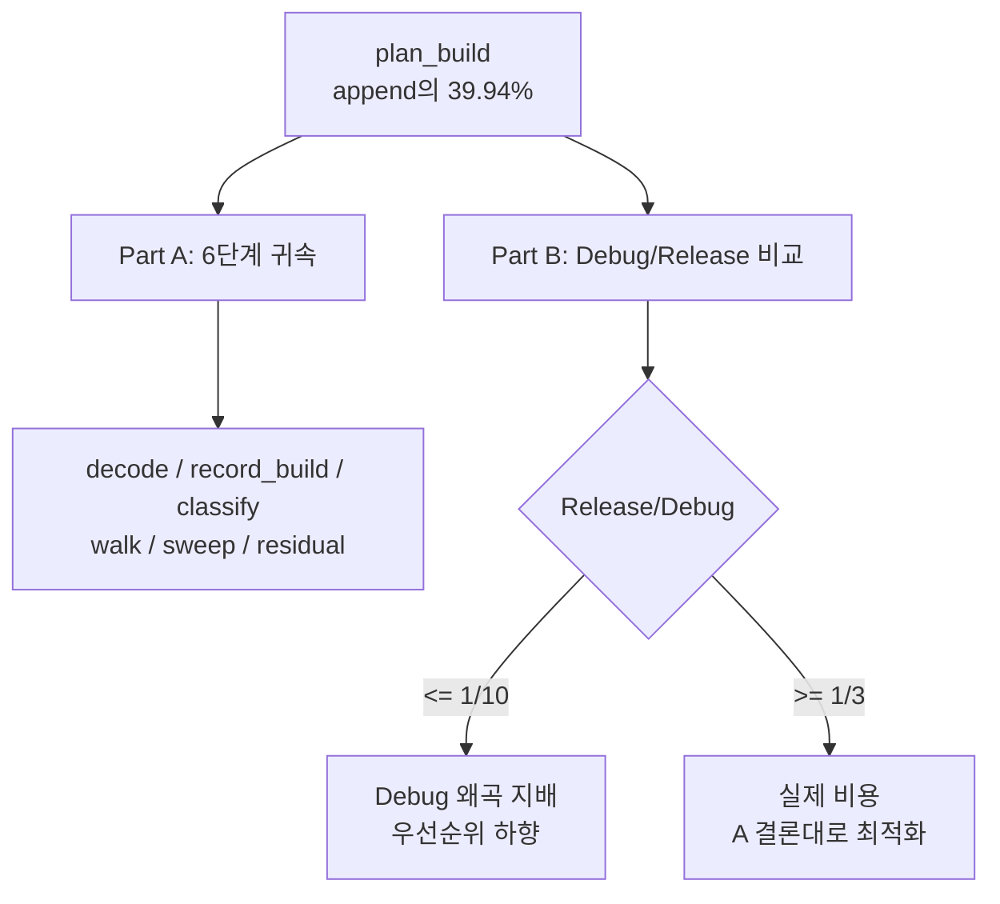

# 20260728-330 설계: plan build 귀속과 Debug 왜곡 분리 / Design: Plan-build attribution and Debug-distortion separation

## 한국어

### 1. 배경

Task 329가 arena 스냅샷을 제거한 뒤 `plan_build`가 append의 최대 항목이 됐습니다.
회당 `26,907,556 tick`, 명령당 약 `25,433 tick`(2.5GHz 기준 약 **10.2us**)입니다.

명령 하나를 decode하는 데 10us는 Zydis의 통상 비용보다 두 자릿수 큽니다. 따라서
경합하는 가설이 둘입니다.

* **H1 — 내부 구조:** plan builder 안의 특정 단계(decode, record 생성, sweep 등)가
  지배한다.
* **H2 — Debug 왜곡:** MSVC Debug의 미인라인·iterator debugging·checked STL이
  지배하며, 실제(Release) 비용은 훨씬 작다.

Task 329의 부수 관측이 H2를 뒷받침합니다. 스냅샷만 제거했는데 `plan_build`가 67%,
`image_emit`이 64% 싸졌습니다. plan builder 코드는 한 줄도 바뀌지 않았으므로 그 감소는
할당기·working set 같은 **상수 환경 비용**이었습니다.

**예비 관측(설계 착수 전, 기존 카운터):** 같은 PIU 이미지·같은 코드 경로로 probe를
Debug와 Release로 각각 실행하면 plan build `elapsed_us`가 `311,062`와 `25,781`,
image emit이 `136,195`와 `14,238`입니다. 즉 **Debug 계수 12.06배와 9.57배**입니다.
이것은 정식 측정이 아니라 기존 `elapsed_microseconds` 필드의 값이며, 정식 측정은 아래
Part B가 수행합니다.

**이 작업의 목적은 최적화가 아니라 판단입니다.** H2가 지배하면 `plan_build`를
최적화하는 것은 Debug에서만 의미가 있고, 남은 실제 병목은 다른 곳입니다.

### 2. 확인된 사실 (코드 기준)

**(F1)** 명령마다 `ZydisDecoderDecodeFull` 1회를 호출하고, 그 전에
`ZydisDecodedOperand operands[ZYDIS_MAX_OPERAND_COUNT] = {}`를 **매번 zero-init**
합니다.

**(F2)** 명령마다 최소 한 번 힙을 씁니다. `record.bytes.assign(bytes, bytes + len)`이
할당하고, `block.instructions.push_back(std::move(record))`가 vector를 성장시킵니다.
`AotInstructionRecord`는 `std::vector` 두 개를 갖습니다.

**(F3)** 명령마다 `visited_instructions.insert`(`unordered_set`) 1회, 블록마다
`visited_blocks.insert` 1회입니다.

**(F4)** 명령마다 `IsExcludedGuestAddress`가 `excluded_ranges`를 선형 스캔합니다.

**(F5)** jump-table sweep은 재분류가 일어날 때마다 **모든 블록의 모든 명령을 다시
순회**하며, 최초 1회는 무조건 실행됩니다. 다만 `TryReclassifyJumpTable`은 kind 검사와
해시 조회로 즉시 반환하므로 record당 비용은 작습니다. **패스 수는 미측정입니다.**

**(F6)** `plan_build` 구간에는 decode뿐 아니라 위 (F2)~(F5)가 모두 들어 있습니다.
지금까지 "명령당 32us(현재 10.2us)는 Zydis치고 크다"고 말했지만, 그 구간이 decode만이
아니라는 사실은 확인된 적이 없습니다.

### 3. Part A — plan build 내부 6단계 귀속

`BuildAotTranslationPlanFromEntry`를 다음으로 나눕니다. 관측 전용이며 profile 포인터가
`nullptr`이면 기존과 완전히 동일하게 동작합니다.

| 단계 | 범위 |
|---|---|
| `decoder_init` | `ZydisDecoderInit` 1회 |
| `decode` | operand 배열 초기화 + `ZydisDecoderDecodeFull` |
| `record_build` | `AotInstructionRecord` 생성·`bytes.assign`·`push_back` |
| `classify` | 경계/분기 분류, jump table guard 판정, target 읽기 |
| `walk` | pending/visited 자료구조, `FindBytes`, 제외 범위 검사 |
| `sweep` | jump-table 재분류 순회 전체 |
| residual | 합계와 총 시간의 차 |

규모 축도 함께 기록합니다. `decode_count`, `record_count`, `sweep_pass_count`,
`sweep_record_visit_count`. (F5)의 패스 수는 이 값으로 처음 확인됩니다.

`plan_build`는 **플랫폼 공용 파일**이므로 계측은 공용이어야 합니다. 공용
`AotPlanBuildProfile` POD와 공용 `ReadCycleCounter()`(x86 MSVC/GCC는 `rdtsc`,
그 외는 `steady_clock`)를 두고, Win32 worker timing은 이 값을 **누적만** 합니다.

계측 부담: 명령당 timestamp 약 6회, 회당 약 200 cycle 수준으로 명령당 25,433 tick의
1% 미만입니다. OFF/ON 대조로 확인합니다.

### 4. Part B — Debug/Release 분리 (게임 실행 불필요)

probe에 실제 PIU 이미지와 동적 경로와 같은 entry로 plan build를 반복 측정하는
benchmark를 추가하고, **같은 probe를 Debug와 Release로 빌드해 비교**합니다.
게임을 실행하지 않고 Debug 계수를 얻는 것이 이 Part의 핵심입니다.

보고 값: 반복 횟수, 명령 수, 총 tick, **명령당 tick**, 그리고 Part A의 단계 분포.
Release는 같은 코드·같은 입력이므로 비율이 곧 Debug 계수입니다.

### 5. 사전 등록 gate

Part A (Debug 실행 기준):

| gate | 조건 | 따라오는 결론 |
|---|---|---|
| A1 | `decode` >= 50% | decode 비용 축소(operand 불필요 경로 분리 등)가 다음 후보 |
| A2 | `record_build` >= 30% | 명령당 힙 할당 제거가 다음 후보 |
| A3 | `sweep` >= 20% | sweep 재순회 구조 변경이 다음 후보 |
| A4 | 어느 것도 30% 미만 | 단일 hotspot 없음. 구조가 아니라 상수 비용이므로 Part B의 결론을 따름 |

Part B:

| gate | 조건 | 따라오는 결론 |
|---|---|---|
| B1 | Release/Debug <= 1/10 | `plan_build`는 **Debug 왜곡이 지배**. 최적화 우선순위에서 내리고, 이후 성능 판단 기준을 Release로 옮기는 작업을 제안 |
| B2 | Release/Debug >= 1/3 | 실제 비용. Part A의 gate 결론대로 진행 |
| B3 | 그 사이 | 양쪽 다 유효. Release 기준 명령당 비용을 기록하고 A 결론을 Release에서 재확인 |

**gate 해석 주의:** B1이 성립해도 "plan_build가 공짜"라는 뜻은 아닙니다. Release
기준 명령당 비용을 그대로 기록하고, 그 값이 Zydis 통상 비용 대비 여전히 크면 A의
결론이 Release에서도 유효한지 별도로 확인해야 합니다.

### 6. 안전 조건

* 관측 전용입니다. plan 결과는 계측 ON/OFF에서 **바이트 단위로 동일**해야 합니다.
* profile 인자는 후행 기본값 `nullptr`이므로 기존 호출 지점은 바뀌지 않습니다.
* 공용 파일에 Win32 헤더를 들이지 않습니다. 플랫폼 분기는 `cycle_clock.h` 안에만
  둡니다.
* 워커 스레드 전용 경로이므로 원자 연산이나 잠금을 추가하지 않습니다.

---

## English

### 1. Background

After Task 329 removed the arena snapshot, `plan_build` became the largest phase of an append at
`26,907,556` ticks per call and about `25,433` ticks per instruction, roughly 10.2us at 2.5GHz.
Ten microseconds to decode one instruction is two orders of magnitude above Zydis's usual cost,
so two hypotheses compete: that some stage inside the plan builder dominates, or that MSVC Debug
distortion does and the real cost is far smaller. Task 329's side observation supports the
second: removing the snapshot alone made `plan_build` 67% and `image_emit` 64% cheaper without
touching a line of either, so that share was environmental — allocator and working-set cost.

A preliminary reading from the existing `elapsed_microseconds` counter, taken before this design,
puts the probe's plan build at 311,062us in Debug against 25,781us in Release, and image emit at
136,195us against 14,238us — Debug factors of 12.06x and 9.57x. Part B replaces that incidental
reading with a proper measurement. The goal of this task is a judgment, not an optimization: if
Debug distortion dominates, optimizing `plan_build` only helps Debug and the real bottleneck lies
elsewhere.

### 2. Established facts

Every instruction costs one `ZydisDecoderDecodeFull` preceded by a zero-initialized
`ZydisDecodedOperand` array (F1); at least one heap operation, since `record.bytes.assign`
allocates and `push_back` grows a vector of records that each hold two vectors (F2); one
`unordered_set` insert, plus one per block (F3); and a linear scan of the excluded ranges (F4).
The jump-table sweep re-walks every instruction of every block whenever a reclassification
happens and always runs at least once, though its per-record test returns immediately for most
records, and its pass count has never been measured (F5). The `plan_build` region therefore
contains all of this, not just decoding — a fact never verified while describing the per-
instruction cost as large for Zydis (F6).

### 3. Part A — six-stage attribution

`BuildAotTranslationPlanFromEntry` is split into `decoder_init`, `decode`, `record_build`,
`classify`, `walk`, `sweep`, and a derived residual, with scale counters for decode calls,
records, sweep passes, and sweep record visits, the last two answering (F5) for the first time.
Because the plan builder is platform-neutral, the instrumentation must be too: a neutral
`AotPlanBuildProfile` POD and a neutral `ReadCycleCounter()` that uses `rdtsc` on x86 MSVC and
GCC and `steady_clock` elsewhere, with the Win32 worker timing merely accumulating the result.
The overhead is about six timestamps per instruction, under 1% of 25,433 ticks, confirmed by an
off/on control.

### 4. Part B — separating Debug distortion without running the game

A probe benchmark builds a plan repeatedly from the real PIU image at the same kind of entry the
dynamic path uses, reporting repetitions, instruction count, total ticks, ticks per instruction,
and the Part A distribution. Building the same probe in Release and comparing gives the Debug
factor directly, with no game run involved.

### 5. Pre-registered gates

For Part A in Debug: `decode` at or above 50% makes decode reduction the next candidate;
`record_build` at or above 30% makes removing the per-instruction heap allocation the next
candidate; `sweep` at or above 20% makes the re-walk structure the next candidate; and if none
reaches 30% there is no single hotspot and Part B's conclusion governs. For Part B: a
Release-to-Debug ratio at or below 1/10 means Debug distortion dominates, so `plan_build` drops
in priority and moving the performance baseline to Release becomes the proposal; at or above 1/3
the cost is real and Part A's conclusion applies; in between, both hold and Part A's conclusion
must be re-checked in Release. Note that B1 does not mean `plan_build` is free: the Release
per-instruction cost is recorded as-is, and if it still exceeds Zydis's usual cost, Part A's
conclusion has to be re-verified there.

### 6. Safety

Observation only: plans must be byte-for-byte identical with instrumentation on and off. The
profile argument is trailing and defaults to `nullptr`, so existing call sites are unchanged. No
Win32 header enters platform-neutral code; the platform branch lives only inside `cycle_clock.h`.
No atomics or locks are added, since this runs on the worker thread.
