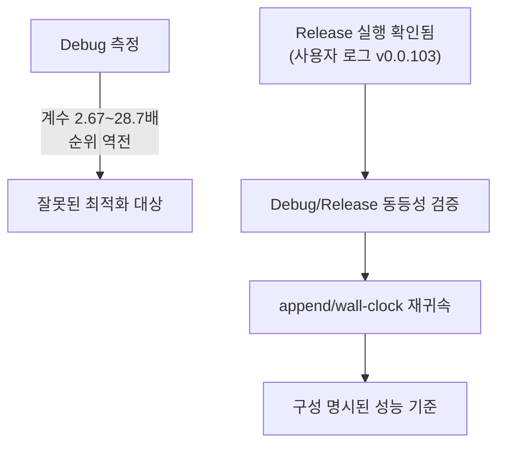

# 20260728-331 설계: 성능 기준의 Release 이전 / Design: Moving the performance baseline to Release

## 한국어

### 1. 왜 필요한가

Task 330이 `plan_build`의 Debug 계수를 **11.34배**로 측정했고, 더 중요하게는 **단계
순위가 구성에 따라 뒤집힌다**는 것을 확인했습니다. Debug에서는 `classify` 40.71%가
1위지만 Release에서는 `decode` 44.02%가 1위입니다. 단계별 Debug 계수가 2.67배에서
28.7배까지 다르기 때문입니다.

즉 **Debug 측정만으로 최적화 대상을 고르면 틀린 대상을 고릅니다.** Tasks 322~328이
Debug에서 얻은 "어느 단계가 지배하는가"류 결론은 모두 이 위험에 노출돼 있습니다.

영향을 받지 않는 결론도 분명히 해 둡니다. 알고리즘 복잡도(Task 323의
`FindAotCacheAddress` O(n) 선형 탐색)와 대역폭·syscall 비용(Task 329의 133.8MB
스냅샷)은 최적화 수준과 무관하므로 그대로 유효합니다.

### 2. 선결 질문은 이미 답이 나왔습니다

Task 330 작성 시점에는 "게임이 Release 빌드로 구동되는가"가 미확정이었습니다.
**사용자가 제공한 `repiu_log.txt`가 그 답을 줍니다.**

* 로더 경로: `build\win32_x86_debug\Release\repiu_loader_win32.exe`
* 창 제목: `rePIU v0.0.103 - Build Jul 28 2026 - Glide 2 OpenGL [aot-dbt]`
* 실행 시간: `01:22:03` ~ `01:25:51`(약 3분 48초), 종료 사유는
  `minimal execution stopped by SDL exit request`
* `Win32 original fatal halt reached: false`, Glide 구현 공백은 `_GRHINTS@8` 1건

**확인됨: Release 로더는 MUSIC SELECT 화면까지 정상 구동하며 스스로 죽지 않습니다.**
따라서 이 작업의 리스크는 "구동 가능성"이 아니라 "타이밍 변화로 드러나는 문제"로
좁혀집니다.

**미확정:** 그 실행의 FPS는 `0.3`이었습니다. Release인데도 낮으므로, Release 전환이
곧 성능 해결이 아님을 분명히 해야 합니다. 병목은 여전히 별도로 귀속해야 합니다.

### 3. 작업 범위

1. **Release 실행 계약 확정.** Release 빌드 스크립트를 추가하거나 기존 스크립트에
   구성 인자를 넣어, Debug와 동일한 절차로 Release 로더를 만들 수 있게 합니다.
2. **동등성 검증.** 같은 시나리오를 Debug와 Release로 각각 60초 실행해
   EEPROM SHA-256 일치, malformed dispatch 0, fatal 0, Glide 공백 목록 동일을
   확인합니다. 값이 갈리면 그 자체가 다음 조사 대상입니다.
3. **재귀속.** append 내부 분포(`plan_build` 39.94%, `placement` 39.84%,
   `image_emit` 19.01%)와 guest wall-clock 상위 bucket을 **Release 기준으로 다시**
   측정합니다. 현재 상위 bucket은 중첩 때문에 합이 100%를 넘어(veh 90.89%,
   glide-gate 56.56%) 그대로 해석할 수 없으므로 이때 분해 경계도 함께 고칩니다.
4. **문서 갱신.** 이후 성능 수치는 구성을 명시합니다. 구성 표기가 없는 성능 결론은
   더 이상 남기지 않습니다.

### 4. 주의

* Debug를 버리지 않습니다. assertion과 iterator debugging은 정확성 검증에 유용하므로
  **정확성은 Debug, 성능은 Release**로 역할을 나눕니다.
* Release는 `-O2`와 인라인으로 스택 프레임이 접히므로, VEH/AOT 경로의 진단 로그와
  스택 스캔 휴리스틱이 Debug와 다르게 동작할 수 있습니다. 동등성 검증에서 이 부분을
  특히 봅니다.
* Task 329의 결론(스냅샷 제거)은 재검증 대상이 아닙니다. 대역폭·syscall 비용이므로
  구성과 무관하다고 이미 명시했습니다.

### 5. append 재귀속을 게임 없이 수행하는 방법

60초 실게임 A/B는 사용자만 수행할 수 있으므로, append 재귀속은 **probe로 먼저**
수행합니다. 근거는 Task 330에서 이미 확인된 사실입니다. probe의 Debug 명령당
`24,512 tick`은 실게임의 `25,433 tick`과 3.6% 차이였습니다. 즉 probe는 in-situ
비용을 잘 대표합니다.

측정 대상은 제품 코드가 이미 갖고 있는 `Win32AotWorkerTimingProfile`의 다섯 단계
(`arena_snapshot`, `plan_build`, `image_emit`, `validate`, `placement`)입니다. probe는
새 계측을 만들지 않고 그 계측을 그대로 읽으므로, 측정값은 로더가 보고하는 값과 같은
정의입니다.

Task 329 이후 append는 **guest 바이트가 자기 주소에 살아 있어야** 동작합니다(스냅샷
대신 직접 참조). 따라서 probe는 arena를 예약하고 그 주소로 이미지를 재배치해 실제
append를 구동합니다.

**번역 크기를 통제합니다.** 이미지 entry 번역은 명령 47,692개로 실게임 평균
1,039개보다 45배 큽니다. 그 분포를 그대로 "append의 분포"라고 부르면 명령당 비용
단계(`plan_build`, `image_emit`)가 과대평가되고 append당 고정 비용(16MB
`VirtualProtect` 2회 등)이 과소평가됩니다. 그래서 두 크기를 잽니다.

1. **small** — `[entry, entry + window)` 밖을 전부 excluded range로 두어 walk를
   경계에서 끊고, 실게임 평균에 가장 가까운 window를 후보 중에서 고릅니다. 이는
   로더가 guest 기록 영역에 쓰는 것과 같은 기존 메커니즘입니다.
2. **large** — 이미지 entry 전체.

두 점으로 단계별 1차 적합을 만들면 기울기는 **명령당 비용**, 절편은 **번역량과
무관한 append당 고정 비용**입니다. 절편이 지배하는 단계는 "번역을 작게" 만들어서는
줄일 수 없다는 뜻이므로, 이 구분이 다음 최적화 대상을 고르는 판정 기준이 됩니다.

**사전 등록 gate.** 다음 중 무엇이 성립하는지를 측정 전에 고정합니다.

| gate | 조건 | 의미하는 다음 작업 |
|---|---|---|
| G1 | Release small에서 `placement` >= 50% | placement 내부 재분해(고정 syscall 대 항목별 비용) |
| G2 | Release small에서 `plan_build` >= 50% | Task 330의 Release `decode` 44.02%가 다음 대상 |
| G3 | Release small에서 `image_emit` >= 50% | emit 재분해 |
| G4 | 어느 단계도 50% 미만 | 단계가 아니라 append 호출 횟수 자체가 대상 |
| G5 | `placement` 고정 절편이 small `placement`의 >= 70% | 번역 단위 축소는 무효, 고정 비용 제거가 대상 |

**판정 대상이 아닌 것.** probe는 실행 시간 전체 축(veh/glide-gate 중첩 문제)을 다루지
않습니다. 그것은 실게임 60초 Release 실행이 필요하며 별도 Task로 남깁니다.

---

## English

### 1. Why

Task 330 measured an 11.34x Debug factor for `plan_build` and, more importantly, found that the
stage ranking inverts between configurations: `classify` leads at 40.71% in Debug while `decode`
leads at 44.02% in Release, because the per-stage Debug factor ranges from 2.67x to 28.7x.
Selecting an optimization target from Debug measurements therefore selects the wrong one, and
every "which stage dominates" conclusion from Tasks 322-328 carries that exposure. Conclusions
about algorithmic complexity, such as Task 323's linear `FindAotCacheAddress` scan, and about
bandwidth and syscall cost, such as Task 329's 133.8MB snapshot, are independent of optimization
level and remain valid.

### 2. The gating question is already answered

Task 330 left open whether the game runs in a Release build. The user-supplied `repiu_log.txt`
answers it: the Release loader at `build\win32_x86_debug\Release\repiu_loader_win32.exe`, titled
`rePIU v0.0.103 - Build Jul 28 2026 - Glide 2 OpenGL [aot-dbt]`, ran from 01:22:03 to 01:25:51 and
stopped only on an SDL exit request, with `original fatal halt reached: false` and a single Glide
gap. The Release loader therefore reaches the MUSIC SELECT screen and does not die on its own, so
the risk narrows from feasibility to what changed timing exposes. Unresolved: that run reported
0.3 FPS, so moving to Release is not itself a performance fix and the bottleneck still has to be
attributed separately.

### 3. Scope

Fix a Release execution contract by making the build script take a configuration, verify
equivalence by running the same scenario for 60 seconds in each configuration and comparing the
EEPROM SHA-256, malformed dispatch, fatal count, and the Glide gap list, then re-attribute the
append distribution (`plan_build` 39.94%, `placement` 39.84%, `image_emit` 19.01%) and the
guest wall-clock buckets in Release, fixing the decomposition boundaries at the same time since
the current top-level shares overlap past 100%. Afterwards, every performance figure states its
configuration, and no configuration-less performance conclusion is recorded again.

### 4. Cautions

Debug is not abandoned: assertions and iterator debugging remain useful, so correctness stays on
Debug while performance moves to Release. Because `-O2` and inlining fold stack frames, the
VEH/AOT diagnostic logging and stack-scan heuristics may behave differently, which the equivalence
check should watch specifically. Task 329's conclusion is not up for re-verification, having
already been recorded as configuration-independent.

### 5. Re-attributing the append without running the game

Only the user can run the 60-second in-game A/B, so the append re-attribution is done first in a
probe, which Task 330 already established as representative: its Debug cost of 24,512 ticks per
instruction sat 3.6% from the 25,433 measured live. The probe adds no instrumentation of its own
and reads the product's existing `Win32AotWorkerTimingProfile` phases, so the quantities are the
ones the loader reports. Since Task 329 the append requires guest bytes living at their own
addresses, so the probe reserves an arena, relocates the image into it, and drives real appends.

Translation size is a controlled input rather than an accident. The image entry covers 47,692
instructions against the 1,039-instruction in-game mean, and quoting that distribution as "the"
append distribution would overstate the per-instruction phases and understate the per-append fixed
cost such as the two 16MB `VirtualProtect` calls. Two sizes are therefore measured: a small one
where everything outside a window is excluded, using the same mechanism the loader applies to
guest-written ranges and choosing the window whose plan lands nearest the in-game mean, and the
whole image entry. Two points give a per-phase linear fit whose slope is the per-instruction cost
and whose intercept is the cost incurred regardless of how much is translated; a phase dominated
by its intercept cannot be improved by translating less, which is what decides the next target.

The pre-registered gates are: G1, Release `placement` at or above 50% of the small append, which
selects decomposing placement into fixed syscalls versus per-entry work; G2, `plan_build` at or
above 50%, which selects Task 330's Release `decode` at 44.02%; G3, `image_emit` at or above 50%,
which selects decomposing emission; G4, no phase reaching 50%, which makes the append count itself
the target rather than any phase; and G5, the `placement` intercept at or above 70% of the small
append's placement, which rejects shrinking the translation unit and selects removing the fixed
cost. The whole-run axis, where the top-level buckets still overlap past 100%, is out of scope
here because it needs a live 60-second Release run.
