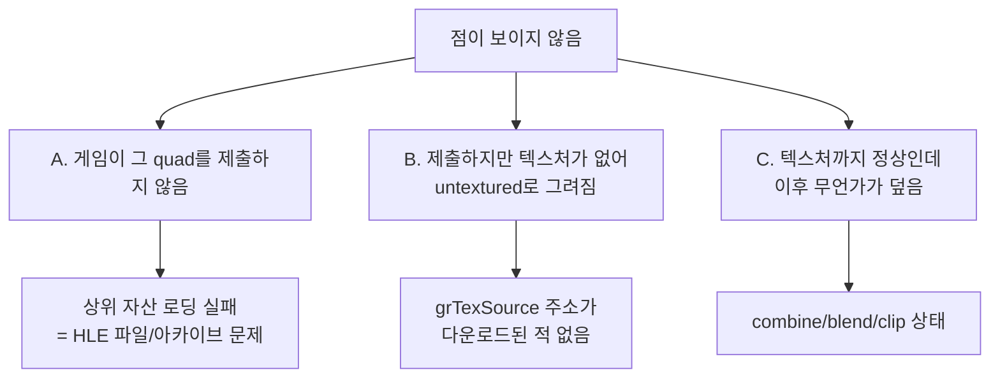

# 20260728-332 설계: grHints 구현과 난이도 점 미표시 진단 / Design: grHints and the missing difficulty dots

## 한국어

### 1. 배경

사용자가 두 가지를 제기했습니다.

1. `repiu_log.txt`의 critical 로그에 남은 미구현 Glide API를 구현할 것.
2. MUSIC SELECT 화면의 **난이도 표시 점이 제대로 그려지지 않음**. 실제 기판 캡처와
   rePIU 캡처를 비교하면 실제에는 붉은 점 기둥이 선명하지만 rePIU에는 거의 보이지
   않습니다.

### 2. 로그에서 확인된 사실

사용자 제공 로그(Release 로더, v0.0.103, `aot-dbt`, 약 3분 48초)에서 확인했습니다.

**(F1) 미구현 Glide API는 `_GRHINTS@8`(ordinal 31) 하나뿐입니다.** 호출 298회이며
`action=continue`로 처리됐습니다. 다른 critical 항목은 없습니다.

**(F2) 게임이 사용하는 드로잉 primitive는 `grDrawTriangle` 하나뿐입니다.** 호출
8,706회. `grDrawPoint`, `grDrawLine`, `grDrawPolygon`, `grLfbLock`은 **한 번도 호출되지
않았습니다.** 따라서 현재 no-op으로 남아 있는 point/line/polygon 경로는 이번 증상의
원인이 아닙니다.

**(F3) 텍스처 다운로드는 42회, `grTexSource`는 3,070회입니다.** 즉 소수의 텍스처를
반복 바인딩합니다.

**(F4) `chdir C:\PIU\datas\texture` 실패는 정상입니다.** 원본 CHD의 ISO9660 트리에
그 디렉터리가 없고, 마운트 추출기는 트리 전체를 필터 없이 복사합니다. 게임이 로컬
디렉터리를 먼저 찾고 아카이브로 폴백하는 정상 경로이므로 **오진하지 않도록 기록해
둡니다.**

**(F5) 난이도 점 자산은 존재합니다.** `SPR.RES`가 `level.tga`를 참조하고
`DATAS/PIU.DAT`에 `LEVEL.PTX`(38,619바이트, offset 3,455,310)가 있으며 헤더는
`PTX\0` + version `0x0100`으로 정상입니다.

### 3. grHints — 구현 판단

`grHints(GrHint_t type, FxU32 mask)`는 **드라이버 최적화 선언**입니다.

| type | 의미 |
|---|---|
| `GR_HINT_STWHINT`(0) | 어떤 w·s/t 값이 TMU마다 다른지 선언 |
| `GR_HINT_FIFOCHECKHINT`(1) | Glide가 명령 FIFO를 확인하는 빈도 |
| `GR_HINT_FPUPRECISION`(2) | Glide 내부 연산의 x87 정밀도 |
| `GR_HINT_ALLOW_MIPMAP_DITHER`(3) | mipmap dithering 허용 여부 |

**핵심:** `GrVertex` 레이아웃은 ABI로 고정돼 있습니다. STWHINT는 하드웨어에 어떤
필드를 전송할지를 정할 뿐 구조체 안의 필드 위치를 바꾸지 않으므로, 구조체를 직접
읽는 소프트웨어 렌더러에게는 **어떤 값이 와도 결과가 같습니다.** 따라서 값을 기록하는
것이 이 backend에서는 stub이 아니라 **완결된 구현**입니다.

`GR_HINT_FPUPRECISION`만 주의가 필요합니다. 실제 Glide는 x87 제어 워드를 바꾸지만,
호스트는 guest의 부동소수 연산을 대신 수행하지 않으며 제어 워드를 바꾸면 guest 연산
결과가 달라집니다. "최적화보다 정확성" 원칙에 따라 **기록만 하고 변경하지 않습니다.**

알 수 없는 hint type은 계속 구현 공백으로 보고합니다. 그것은 진짜 공백이기 때문입니다.

### 4. 난이도 점 — 가설과 판별 설계

증상을 만들 수 있는 원인은 셋이며 고칠 곳이 각각 다릅니다.

정적 분석만으로는 셋을 가를 수 없습니다. 근거는 다음과 같습니다.

* B는 코드로 확인된 실제 가능성입니다. `SourceTexture`가 주소를 찾지 못하면
  `current_texture_`를 `nullptr`로 만들고, 그 뒤 draw는 텍스처 없이 그려집니다.
  `grTexSource`는 `GrTexInfo*` 인자를 사용하지 않고 **주소만으로** 바인딩합니다.
* 그러나 그 상황이 실제로 일어나는지는 로그에 없습니다. 기존 진단
  (`REPIU_GLIDE_TRI_CENSUS`)은 combine 모드별 집계와 **최대** 크기만 남기므로 작은
  quad의 존재 여부를 답하지 못합니다.

따라서 **판별 전용 계측**을 추가합니다(`REPIU_GLIDE_DRAW_CENSUS`).

* 모든 draw를 bounding box 크기로 분류하고, 48px 이하 quad를 "작은 quad"로 셉니다.
* 작은 quad 40개를 개별 표본으로 남깁니다. 위치, 크기, 텍스처 바인딩 여부, 바인딩된
  텍스처 주소와 크기, s/t, 정점 색, constant color, color combine을 함께 남깁니다.
* 500 draw마다 누계를 남깁니다. 작은 quad 수, 그중 untextured 수, 저장된 텍스처 수,
  `grTexSource` 미스 횟수와 마지막 미스 주소.

**판정 규칙(사전 등록):**

| 관측 | 결론 |
|---|---|
| 작은 quad가 거의 0 | 원인 A. 자산/로딩 상위 경로를 조사 |
| 작은 quad는 많은데 대부분 untextured | 원인 B. `grTexSource` 주소 해석을 수정 |
| 작은 quad가 텍스처까지 정상 | 원인 C. combine/blend/clip 상태를 조사 |

### 5. 결과 (2026-07-28 확정)

**판정 규칙 적용 결과 A와 B가 모두 기각되고 C로 확정됐으며, 실제 원인은 둘이었습니다.**

1. **텍스처 좌표 정규화.** Glide 좌표 공간은 텍셀 단위가 아니라 LOD와 무관하게 긴 축이
   256이고 짧은 축만 aspect가 줄입니다. 32×32 점 스프라이트도 `st`가 `0..256`으로
   오므로 픽셀 크기(32)로 나누면 8배 초과가 되어 CLAMP로 quad의 1/8만 덮였습니다.
2. **`GrColor_t` 형식.** `grSstWinOpen`이 `GR_COLORFORMAT_ABGR`을 선택하는데 ARGB로
   읽어 빨강과 파랑이 뒤바뀌었습니다. 게임 상수색이 대부분 회색이라 가려져 있었습니다.

두 규칙 모두 [docs/kb/glide-texture-lod-and-formats.md](../kb/glide-texture-lod-and-formats.md)에
누적했습니다. 상세 경과와 자기 정정은
[작업 로그](../work-logs/20260728-332-glide-hints-and-difficulty-dots.md)에 있습니다.

### 6. 안전 조건

* 계측은 전부 env-gated이며 기본 OFF입니다. 렌더링 경로의 동작은 바꾸지 않습니다.
* `grHints`는 stdcall 프레임(인자 2개 + 반환 주소)을 그대로 정리합니다. Task 302에서
  확인된 gate 누수 클래스를 반복하지 않습니다.

---

## English

### 1. Background

Two issues were raised: implement the unimplemented Glide API left in the critical log, and fix
the MUSIC SELECT difficulty dots, which are crisp red columns on real hardware but nearly
invisible in rePIU.

### 2. What the log establishes

From the user-supplied log (Release loader, v0.0.103, `aot-dbt`, about 3m48s): the only
unimplemented Glide API is `_GRHINTS@8` at 298 calls (F1); the game's only drawing primitive is
`grDrawTriangle` at 8,706 calls, with `grDrawPoint`, `grDrawLine`, `grDrawPolygon`, and
`grLfbLock` never called, so the no-op point and line paths are not this symptom's cause (F2);
texture downloads number 42 against 3,070 `grTexSource` calls (F3); the repeated
`chdir C:\PIU\datas\texture` failure is normal, because that directory does not exist in the CHD's
ISO9660 tree and the mount extractor copies the tree unfiltered, so it must not be misdiagnosed
(F4); and the asset exists, with `SPR.RES` referencing `level.tga` and `PIU.DAT` holding a valid
`LEVEL.PTX` of 38,619 bytes (F5).

### 3. grHints

`grHints` declares driver optimizations: which w and s/t values differ per TMU, how often Glide
checks the command FIFO, what x87 precision Glide may use internally, and whether mipmap dithering
is allowed. Because the `GrVertex` layout is fixed by the ABI, the hint changes what the driver
sends to hardware, not where fields live, so a renderer reading the structure directly produces
identical output for any hint value. Recording the declaration is therefore a complete
implementation for this backend rather than a stub. `GR_HINT_FPUPRECISION` is the one to be
careful with: real Glide changes the x87 control word, but the host does not execute the guest's
floating point and changing it would alter guest results, so it is recorded and not applied,
following accuracy over optimization. An unknown hint type still reports a gap, because that would
be one.

### 4. The dots

Three causes produce the symptom and need different fixes: the game never submits those quads, it
submits them with a texture address that was never downloaded so they draw untextured, or they
draw correctly and something later covers them. Static analysis cannot separate them. The second
is a verified possibility in code, since `SourceTexture` clears the binding on a miss and
`grTexSource` binds by address alone without consulting the `GrTexInfo` argument, but whether it
happens is not in the log, and the existing `REPIU_GLIDE_TRI_CENSUS` records only per-combine
counts and maximum sizes, so it cannot answer whether small quads exist at all. A dedicated
`REPIU_GLIDE_DRAW_CENSUS` therefore buckets every draw by bounding box, samples the first forty
quads of 48px or less with their binding, texture dimensions, coordinates, colors, and combine
mode, and prints a running total every 500 draws. The pre-registered reading is: almost no small
quads means the asset path is at fault; many small quads mostly untextured means `grTexSource`
address resolution is; and small quads with valid textures means combine, blend, or clip state is.

### 5. Outcome (confirmed 2026-07-28)

Both A and B were rejected and C confirmed, with two distinct causes: texture coordinates are not
in texel units but span 256 along the longer axis whatever the LOD, so normalizing a 32x32 sprite
by its pixel size overshot eightfold and clamped away seven eighths of each quad; and `GrColor_t`
follows the `GR_COLORFORMAT_ABGR` selected at `grSstWinOpen`, so reading it as ARGB swapped red
and blue behind a screen full of symmetric greys. Both rules are recorded in
[docs/kb/glide-texture-lod-and-formats.md](../kb/glide-texture-lod-and-formats.md).

### 6. Safety

All instrumentation is environment-gated and off by default, and no rendering behavior changes.
`grHints` cleans its stdcall frame of two arguments plus the return address, so it does not repeat
the gate-leak class identified in Task 302.
