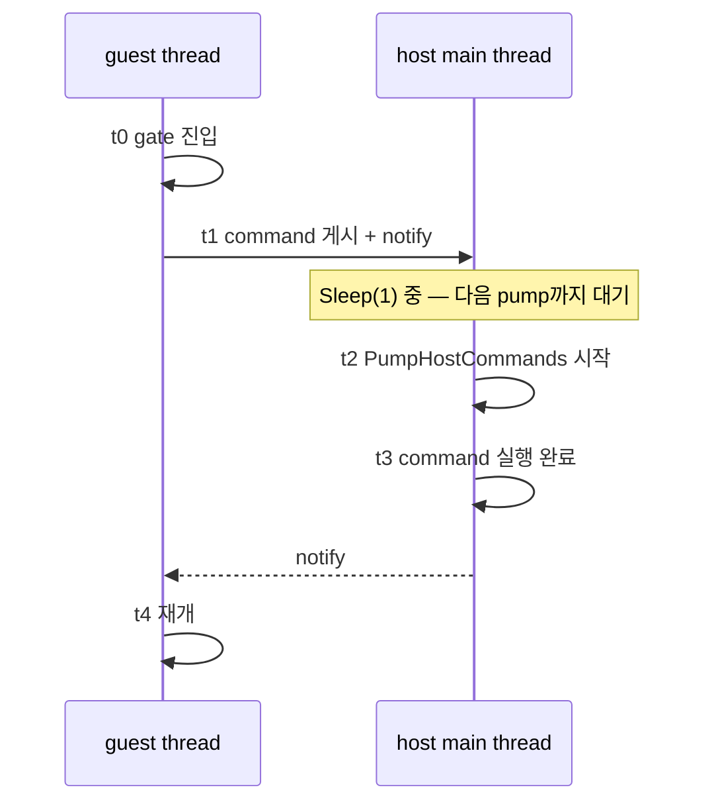

# 20260728-333 설계: Glide gate rendezvous 분해 / Design: Decomposing the Glide gate rendezvous

## 한국어

### 1. 왜 필요한가

Task 331이 Release 기준 전체 실행을 귀속했고 **Glide gate가 guest wall-clock의
60.78%** 로 단독 1위였습니다. 60초에 gate 진입 21,381회가 `98,941,888,040 tick`,
호출당 약 **1.85ms**입니다. 같은 60초의 프레임은 275개뿐입니다.

그러나 그 1.85ms가 무엇인지는 모릅니다. 후보는 둘이고 **처방이 완전히 다릅니다.**

1. **host CPU 작업** — OpenGL 호출, 텍스처 변환, LFB 복사. 이 경우 작업 자체를 줄이거나
   배치해야 합니다.
2. **rendezvous 대기** — guest thread가 host main thread를 기다리는 시간. 이 경우
   작업량을 줄여도 소용없고 **깨우는 방식**을 고쳐야 합니다.

Task 326→327에서 같은 형태의 질문을 이미 겪었습니다. 그때도 "175ms"의 정체가 워커 CPU
작업인지 스케줄링인지 몰랐고, 재보니 워커 CPU 작업이어서 rendezvous 제거는 답이
아니었습니다. **같은 실수를 반대 방향으로 하지 않으려면 재야 합니다.**

### 2. 코드 읽기가 만드는 사전 가설

`GlideOpenGlBackend::InvokeOnHostThread`는 guest thread에서 호출되면 command를 큐에
넣고 `host_command_cv_`에서 완료를 기다립니다. host thread는 그 command를
`PumpHostCommands`에서만 집어 갑니다. 그리고 그 호출자인 진단 poll loop는
매 iteration 끝에서 **`Sleep(1)`** 합니다.

즉 guest는 평균적으로 **다음 pump까지** 기다립니다. 실측 poll iteration은 60초에
31,506회로 **iteration당 약 1.90ms**이고, 관측된 gate 호출당 비용 약 1.85ms와
거의 같습니다. Windows의 `Sleep(1)`은 timer 해상도에 따라 1~15.6ms이므로 이 값은
`Sleep(1)`의 실제 주기로 설명됩니다.

또한 gate 진입 직후 `context->glide_backend.PumpEvents()`가 불리는데, 이것도 guest
thread에서는 rendezvous입니다. 따라서 **gate 1회가 rendezvous를 2회 이상** 치를 수
있습니다.

**그러나 이것은 가설입니다.** 코드 읽기는 Task 322에서 이미 한 번 틀린 인과를
지목했으므로 측정으로 확정합니다.

### 3. 측정 설계

`Win32AotWorkerTimingProfile`(Task 327)과 같은 구조로 rendezvous를 네 구간으로
나눕니다. 새 계측을 만들되 기존 opt-in `REPIU_EXECUTION_TIME_PROFILE`을 그대로
씁니다. 새 환경변수를 늘리지 않습니다.

| 구간 | 정의 | 의미 |
|---|---|---|
| `queue` | `t1 - t0` | 앞선 command가 끝나기를 기다린 시간 |
| `wake` | `t2 - t1` | 게시 후 host가 집어 갈 때까지 — **pump 주기** |
| `work` | `t3 - t2` | host의 실제 command 실행 — **CPU 작업** |
| `complete` | `t4 - t3` | 완료 통지 후 guest 재개까지 |

host thread에서 직접 호출된 경우(`IsHostThread()`)는 rendezvous가 없으므로 별도
`direct` 축으로 셉니다. 이 값이 크면 gate 비용의 일부는 애초에 대기가 아닙니다.

동기화는 기존 mutex/condition_variable이 제공하는 happens-before에 의존하고 atomic을
추가하지 않습니다. 대기 시간이 측정 대상이므로 계측이 그것을 흔들면 안 됩니다.
in-flight command는 항상 1개이므로 handoff 타임스탬프는 스칼라 3개로 충분합니다.

### 4. 사전 등록 gate

| gate | 조건 | 성립 시 다음 작업 |
|---|---|---|
| **G1** | `wake` >= rendezvous의 60% | pump 주기 제거: host loop가 `Sleep(1)` 대신 command를 기다리게 한다 |
| G2 | `work` >= 60% | GL 작업 축소·배치가 대상 |
| G3 | `queue` >= 20% | command 직렬화가 대상 |
| G4 | `complete` >= 20% | guest 기상 경로가 대상 |
| G5 | gate 1회당 rendezvous >= 2 | `PumpEvents`를 gate 경로에서 제거 |
| G6 | 어느 구간도 60% 미만 | 분해 경계가 틀렸으므로 재설계 |

G1이 성립하면 그 수정은 **같은 Task에서** 수행하고 60초 A/B로 확인합니다. 수정이
단순하고(대기 방식 교체) 측정과 분리할 이유가 없기 때문입니다. G2가 성립하면 수정은
별도 Task입니다. 작업량 축소는 렌더링 의미를 건드리므로 설계가 따로 필요합니다.

### 5. 정확성 경계

* command 실행 순서와 host thread 소유권은 바뀌지 않습니다. OpenGL context는 계속
  host thread 전용입니다.
* `Sleep(1)`을 command 대기로 바꿀 때 **poll loop의 다른 주기 작업**(타이머 주입 55ms,
  SDL 이벤트, 종료 확인, 1초 telemetry)이 늦어지면 안 되므로 대기에는 1ms 상한을
  둡니다. 즉 최악의 경우 기존과 동일하고, command가 오면 즉시 깹니다.
* 동등성은 Task 331과 같은 축으로 확인합니다: malformed 0, fatal 0, Glide 공백 0,
  60초 정상 timeout.

---

## English

### 1. Why

Task 331 attributed the whole Release run and found the Glide gate alone holding 60.78% of guest
wall clock: 21,381 gate entries consuming `98,941,888,040` ticks in 60 seconds, about 1.85ms each,
against only 275 frames. What that 1.85ms consists of is unknown, and the two candidates have
opposite remedies — host CPU work such as GL calls and texture conversion would have to be reduced
or batched, while rendezvous waiting would be unaffected by doing less work and would instead
require changing how the host thread is woken. Tasks 326 and 327 already posed this exact question
about a 175ms figure, where the answer turned out to be worker CPU work and removing the rendezvous
would have been the wrong fix, so this one is measured rather than assumed.

### 2. The prior from reading the code

`GlideOpenGlBackend::InvokeOnHostThread` queues a command and waits on a condition variable, and
the host thread only picks it up inside `PumpHostCommands`, whose caller — the diagnostic poll loop
— ends every iteration with `Sleep(1)`. The guest therefore waits, on average, for the next pump.
The measured poll loop ran 31,506 iterations in 60 seconds, about 1.90ms each, which is nearly the
1.85ms observed per gate entry, and `Sleep(1)` on Windows lasts between 1 and 15.6ms depending on
the timer resolution. The gate also calls `PumpEvents` immediately on entry, which is itself a
rendezvous from the guest thread, so one gate entry may pay two or more. This remains a hypothesis:
code reading already named a wrong cause once, in Task 322.

### 3. Measurement design

The rendezvous is split the way Task 327 split the translation one, reusing the existing
`REPIU_EXECUTION_TIME_PROFILE` opt-in rather than adding another switch. `queue` is the wait for a
previous command to finish, `wake` is publication to host pickup and therefore the pump cadence,
`work` is the host executing the command and therefore real CPU work, and `complete` is completion
to guest resumption. Calls already on the host thread take no rendezvous and are counted on a
separate `direct` axis. Synchronization relies on the happens-before the existing mutex and
condition variable already provide, with no added atomics, because the quantity under measurement
is waiting and instrumentation must not perturb it; a single in-flight command means three scalar
handoff timestamps suffice.

### 4. Pre-registered gates

G1 holds if `wake` is at least 60% of the rendezvous, selecting removal of the pump cadence by
making the host loop wait for a command instead of sleeping; G2 if `work` is at least 60%,
selecting GL work reduction; G3 if `queue` is at least 20%, selecting command serialization; G4 if
`complete` is at least 20%, selecting the guest wake path; G5 if there are two or more rendezvous
per gate entry, selecting removal of `PumpEvents` from the gate path; and G6 if no interval reaches
60%, which would mean the decomposition boundaries are wrong. If G1 holds the fix lands in this
same task with a 60-second A/B, since swapping a wait is simple and there is no reason to separate
it from the measurement; if G2 holds the fix is a separate task, because reducing work touches
rendering semantics and needs its own design.

### 5. Correctness boundaries

Command ordering and host-thread ownership do not change, and the OpenGL context stays exclusive to
the host thread. Replacing `Sleep(1)` with a command wait must not delay the poll loop's other
periodic work — timer injection every 55ms, SDL events, exit checks, and the one-second telemetry
line — so the wait carries a 1ms bound, making the worst case identical to today while a posted
command wakes it immediately. Equivalence is checked on Task 331's axes: zero malformed dispatch,
no fatal halt, no Glide gap, and a normal 60-second timeout.
