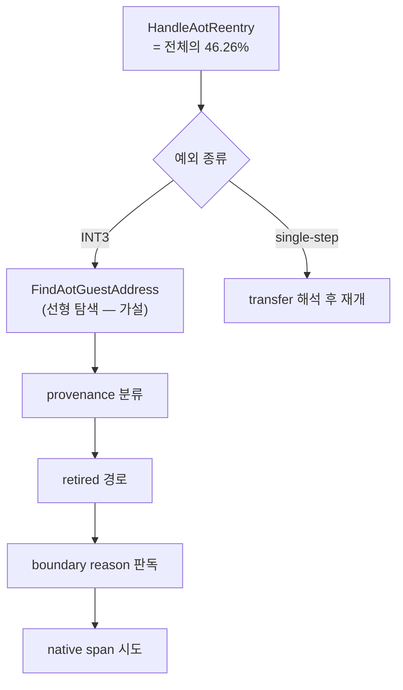

# 20260728-334 설계: AOT reentry 핸들러 재분해 / Design: Decomposing the AOT reentry handler

## 한국어

### 1. 왜 필요한가

Task 333이 Glide gate를 60.18%에서 8.88%로 내린 뒤, 같은 실행의 Release 축은 이렇게
남았습니다.

| bucket | guest wall-clock 대비 |
|---|---:|
| VEH | 62.99% |
| — 그중 **AOT transfer** | **46.26%** (VEH의 73.45%) |
| — 그중 VEH residual | 7.50% (VEH의 11.91%) |
| AOT 캐시 내 guest 실행 | 37.01% |
| Glide gate | 8.88% |

**확인됨:** AOT transfer 안에서 handler 축은 `HandleAotReentry`가 97.48%로 단독
지배입니다(`return` 27.22%는 그 안에 중첩). 호출 681,369회, 호출당
`110,543 tick`(2.5GHz 기준 약 44us)입니다.

**그런데 function 축은 그 중 7.84%밖에 설명하지 못합니다.** `resolve` 2.93%,
`dynamic-translate` 2.44%, `residency` 2.44%, `hle-boundary-scan` 0.03%입니다.
**즉 전체 wall-clock의 약 42%가 이름 없는 구간입니다.** Task 325가 VEH 안에서 겪은
상황이 한 단계 아래에서 그대로 반복됩니다.

### 2. 코드 읽기가 만드는 사전 가설

`HandleAotReentry`는 breakpoint 경로 진입 즉시 `FindAotGuestAddress`를 부릅니다.
그 함수는 **`placement.address_map` 전체를 선형 탐색**합니다.

Task 324가 고친 것은 반대 방향(`FindAotCacheAddress`, guest→cache)뿐이고, 이
cache→guest 방향은 그대로 남아 있습니다. 같은 실행에서 address map은 정적 47,750개에
동적 번역 240회분이 더해져 10만 개 규모이며, 호출당 `110,543 tick`은 그 규모의 선형
탐색과 자릿수가 맞습니다.

**그러나 이것은 가설입니다.** 다른 후보도 같은 경로에 있습니다: provenance 분류,
boundary 명령 4바이트 판독과 분류, retired 경로, native span 진입 시도,
single-step 재개 경로입니다. 측정으로 가릅니다.

### 3. 측정 설계

`kAotReentry` 안에 서로 배타적인 여섯 구간을 넣습니다. 기존 handler/function 축과
같은 방식이며 새 환경변수 없이 `REPIU_EXECUTION_TIME_PROFILE`을 씁니다.

| 구간 | 내용 |
|---|---|
| `guest-lookup` | `FindAotGuestAddress` |
| `provenance` | 추적 sentinel 판정, provenance 분류·기록, retired 여부 |
| `retired` | retired entry 처리와 재해석 |
| `boundary-reason` | boundary 바이트 판독·분류와 두 probe |
| `native-span` | `TryEnterRetiredTrapNativeSpan` |
| `single-step` | single-step 재개 경로 전체 |

residual = `kAotReentry` − 여섯 구간. residual이 크면 분해 경계가 틀린 것이므로 그
사실이 그대로 보이게 둡니다.

### 4. 사전 등록 gate

| gate | 조건 | 성립 시 다음 작업 |
|---|---|---|
| **G1** | `guest-lookup` >= 60% | cache→guest 색인 도입(Task 324의 반대 방향) |
| G2 | `boundary-reason` >= 30% | 진단용 분류를 hot path에서 제거 |
| G3 | `native-span` >= 30% | span 진입 정책 재검토 |
| G4 | `retired` >= 30% | retired 경로 재설계 |
| G5 | `single-step` >= 30% | 재개 경로 분해 |
| G6 | residual >= 30% | 분해 경계가 틀렸으므로 재설계 |

G1이 성립하면 **같은 Task에서** 색인을 도입하고 60초 A/B로 확인합니다. 근거는 Task
324입니다. 같은 자료구조의 반대 방향 색인을 이미 만들었고 의미 동등성 검증 방법도
확립돼 있습니다.

### 5. 정확성 경계

* 색인을 넣더라도 반환값은 기존 선형 탐색과 **동일해야** 합니다. 현재 규칙은
  "cache offset이 `[cache_offset, cache_offset + emitted_length)`에 드는 첫 entry"
  이며, 색인이 없거나 낡았을 때는 기존 탐색으로 되돌아갑니다(Task 324와 같은 정책).
* probe는 차등 검증으로 기존 구현을 oracle로 두고 경계 조건에서 동등성을 확인합니다.
* 동등성은 실행 축에서도 확인합니다: malformed 0, fatal 0, Glide 공백 0, 60초 정상
  timeout.

---

## English

### 1. Why

After Task 333 moved the Glide gate from 60.18% to 8.88%, the Release axis in that same run leaves
the VEH at 62.99% of guest wall clock, of which AOT transfer is 73.45% — 46.26% of the whole run —
with AOT cache execution at 37.01%. Inside AOT transfer the handler axis is dominated by
`HandleAotReentry` at 97.48%, called 681,369 times at `110,543` ticks each, about 44us at 2.5GHz.
The function axis explains only 7.84% of that: 2.93% resolve, 2.44% dynamic translate, 2.44%
residency, and 0.03% boundary scan. Roughly 42% of all wall clock therefore sits in an unnamed
region, which is exactly the situation Task 325 faced one level higher.

### 2. The prior from reading the code

`HandleAotReentry` calls `FindAotGuestAddress` immediately on the breakpoint path, and that
function scans `placement.address_map` linearly. Task 324 replaced the opposite direction —
`FindAotCacheAddress`, guest to cache — and left this one untouched. In the same run the address
map holds the static 47,750 entries plus 240 dynamic translations, on the order of a hundred
thousand entries, and `110,543` ticks per call is the right order of magnitude for scanning that.
Other candidates sit on the same path — provenance classification, reading and classifying the
boundary instruction's bytes, the retired path, the native span attempt, and the single-step
resumption — so this is settled by measurement.

### 3. Measurement design

Six mutually exclusive intervals go inside `kAotReentry`, following the existing handler and
function axes and reusing `REPIU_EXECUTION_TIME_PROFILE` with no new switch: `guest-lookup` for
`FindAotGuestAddress`, `provenance` for the tracked-sentinel test and provenance classification
plus the retired test, `retired` for retired-entry handling and its re-resolution,
`boundary-reason` for reading and classifying the boundary bytes and the two probes,
`native-span` for `TryEnterRetiredTrapNativeSpan`, and `single-step` for the whole resumption path.
The residual against `kAotReentry` stays visible so wrong boundaries show up instead of being
absorbed.

### 4. Pre-registered gates

G1 holds if `guest-lookup` reaches 60%, selecting a cache-to-guest index, the mirror of Task 324;
G2 if `boundary-reason` reaches 30%, selecting removal of diagnostic classification from the hot
path; G3 if `native-span` reaches 30%; G4 if `retired` reaches 30%; G5 if `single-step` reaches
30%; and G6 if the residual reaches 30%, which would mean the boundaries are wrong. If G1 holds the
index lands in this same task with a 60-second A/B, because Task 324 already built the same index
for the opposite direction and established how to verify semantic equivalence.

### 5. Correctness boundaries

An index must return exactly what the linear scan returns — the first entry whose offset falls in
`[cache_offset, cache_offset + emitted_length)` — and must fall back to that scan when it is absent
or stale, as Task 324's does. A differential probe treats the existing implementation as the oracle
across boundary conditions, and the run-level equivalence axes stay the same: zero malformed
dispatch, no fatal halt, no Glide gap, and a normal 60-second timeout.
