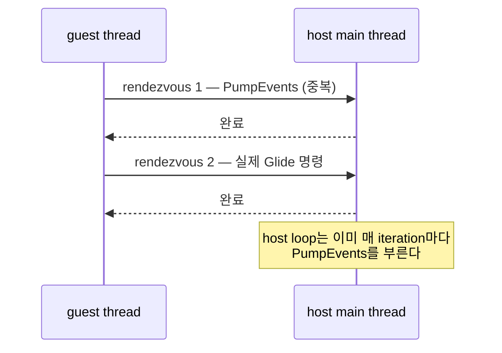

# 20260728-335 설계: gate 진입 pump rendezvous 제거 / Design: Removing the per-gate pump rendezvous

## 한국어

### 1. 왜 필요한가

Task 334 이후 Release 축은 이렇게 남았습니다.

| bucket | guest wall-clock 대비 |
|---|---:|
| AOT 캐시 내 guest 실행 | 65.87% |
| **Glide gate** | **17.14%** |
| VEH residual(이름 없음) | 11.19% |
| AOT transfer | 5.10% |
| 그 외(prologue/telemetry/gates/hle-chain/port-io/dos) | 약 2.4% |

**Glide gate가 다시 2위이자 지목 가능한 최대 항목입니다.** Task 333이 대기의 원인
하나(`Sleep(1)`)를 없앤 뒤에도 rendezvous 1회는 평균 `204,044 tick`(약 82us)이고 그중
`wake` 37.43% + `complete` 31.15% = **68.58%가 여전히 스레드 전환 지연**입니다.
`work`는 30.48%뿐입니다.

**확인됨(Task 333에서 기록):** gate 진입 1회당 rendezvous가 **1.92회**입니다. 최근
실행에서도 진입 67,733회에 rendezvous 129,981회로 같은 비율입니다.

### 2. 두 번째 rendezvous의 정체

`HandleLinexeGlideBoundary`는 gate 진입 직후 `context->glide_backend.PumpEvents()`를
부릅니다. guest thread에서 부르면 `PumpEvents`는 자기 자신을
`InvokeOnHostThread`로 감싸므로 **Glide 함수 본체와 무관한 rendezvous가 하나 더**
발생합니다.

그런데 host poll loop는 이미 매 iteration에서 `PumpEvents()`를 부릅니다. Task 333
이후 그 loop는 60초에 88,696회 이상 돌고(약 0.68ms마다), command가 게시되면 즉시
깨어납니다. **즉 gate 경로의 pump는 중복입니다.**

### 3. 사전 등록 예측과 gate

제거 대상은 gate 진입 1회당 정확히 1회의 rendezvous입니다. 최근 실행 값으로 환산하면
`67,733 × 204,044 tick ≈ 13.8e9`, 전체 wall-clock의 **약 8.5%** 입니다.

| gate | 조건 | 판정 의미 |
|---|---|---|
| **G1** | gate 진입당 rendezvous <= 1.05 | 중복 pump가 실제로 사라졌다 |
| G2 | Glide gate 비중이 17.14%에서 3%p 이상 감소 | 예측대로 비용이 줄었다 |
| G3 | 프레임 수 증가 | 처리량으로 이어졌다 |
| G4 | G1은 성립하나 G2가 기각 | rendezvous 수가 아니라 다른 것이 비용이므로 재측정 |

### 4. 정확성 경계

* SDL 이벤트는 계속 host thread에서만 처리됩니다. 바뀌는 것은 **누가 언제 부르는가**
  뿐이며, host loop가 약 0.68ms마다, 그리고 command가 올 때마다 부릅니다. 따라서
  이벤트 지연 상한은 기존 poll 주기와 같습니다.
* 종료 요청(`exit_requested`)은 gate가 아니라 host loop가 읽으므로 경로가 그대로입니다.
* guest가 gate 직후 입력 상태를 읽더라도 최신성 손실은 1ms 미만입니다.
* `REPIU_GLIDE_GATE_PUMP=1`로 기존 동작을 되돌릴 수 있게 해 A/B를 한 바이너리에서
  수행합니다.
* 동등성은 기존 축으로 확인합니다: malformed 0, fatal 0, Glide 공백 0, 60초 정상
  timeout.

---

## English

### 1. Why

After Task 334 the Release axis is 65.87% AOT cache execution, 17.14% Glide gate, 11.19% unnamed
VEH residual, 5.10% AOT transfer, and about 2.4% for everything else, so the Glide gate is again the
largest nameable item. Even after Task 333 removed one cause of waiting, a rendezvous still averages
`204,044` ticks, about 82us, of which `wake` at 37.43% plus `complete` at 31.15% — 68.58% — is
thread-switch latency against only 30.48% of host work. Task 333 also recorded 1.92 rendezvous per
gate entry, and the latest run repeats it at 129,981 rendezvous for 67,733 entries.

### 2. What the second rendezvous is

`HandleLinexeGlideBoundary` calls `PumpEvents` immediately on gate entry, and from the guest thread
`PumpEvents` wraps itself in `InvokeOnHostThread`, so every gate entry pays a rendezvous that has
nothing to do with the Glide call itself. The host poll loop already pumps events every iteration,
and since Task 333 that loop runs over 88,696 times per 60 seconds — roughly every 0.68ms — and
wakes immediately whenever a command is posted. The pump on the gate path is therefore redundant.

### 3. Pre-registered prediction and gates

Exactly one rendezvous per gate entry is removed, which by the latest run's numbers is
`67,733 × 204,044` ticks, roughly 8.5% of guest wall clock. G1 holds if rendezvous per gate entry
falls to 1.05 or below, showing the duplicate is gone; G2 if the Glide gate's share falls at least
3 percentage points from 17.14%; G3 if the frame count rises; and G4 covers G1 holding while G2 is
rejected, which would mean the cost is not the rendezvous count and needs re-measuring.

### 4. Correctness boundaries

SDL events are still processed only on the host thread; what changes is who calls it and when, and
the host loop calls it roughly every 0.68ms and on every posted command, so the event-latency bound
is the same as the existing poll cadence. The exit request is read by the host loop rather than the
gate, so that path is unchanged, and a guest reading input right after a gate loses less than a
millisecond of freshness. `REPIU_GLIDE_GATE_PUMP=1` restores the old call so the A/B runs from one
binary, and equivalence is checked on the usual axes: zero malformed dispatch, no fatal halt, no
Glide gap, and a normal 60-second timeout.
