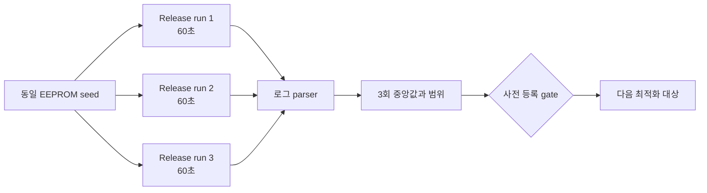

# 20260729-347 설계: 현재 Release 실행 축 재귀속 / Design: Current Release execution-axis re-attribution

## 한국어

### 1. 목적

Task 346 이후 post-HLE 복귀 경로가 사실상 열렸고, Task 348은 AOT back-edge 타이머
safe point를 추가했으며 Task 349는 IRQ0 게시 주기를 원본 PIT 설정인 240Hz로
복원했습니다. 따라서 Task 336·337의 예외 수와 실행 시간 분포는 현재 코드의 비용
구성을 나타내지 않습니다.

이 작업은 새 최적화를 구현하지 않습니다. 현재 Release 실행을 60초씩 세 번 측정하여
실행 축을 다시 귀속하고, 사전 등록한 gate로 다음 최적화 대상만 선정합니다.

### 2. 현재 계측 계약

기존 runtime 계측을 그대로 사용합니다.

| 축 | 기존 출력 | 의미 |
|---|---|---|
| 전체 실행 시간 | `execution time cycles` | `guest-run`, VEH, Glide, port I/O, DOS |
| 배타 예외 census | `exception census` | single-step, `INT3`, AV, other |
| TF 구간 | `single-step run buckets` | 비-single-step 경계 사이의 연속 TF 길이 |
| post-HLE 복귀 | `hle reentry funnel` | 현재 복귀 성공과 거절 사유 |
| 타이머 safe point | `timer safe-point trap/injected/deferred` | Task 348이 새로 만든 `INT3` 인구 |
| 동등성 | Glide call/gate, LINEXE get-proc, malformed/fatal | 렌더링과 종료 상태 보존 |

`REPIU_EXECUTION_TIME_PROFILE=1`만 활성화합니다. 예외 census와 TF 구간, 복귀 funnel은
상시 계측입니다. `REPIU_SINGLE_STEP_HOTSPOT_PROFILE`은 추가 TSC 비용과 per-EIP
집계를 만들며 이번 범위에 필요하지 않으므로 끕니다.

### 3. 실행 경로

supervisor는 제한 시간에 child process 전체를 종료하므로 loader의 최종
`ExecutionAttempt` summary를 남기지 않습니다. 이번 작업은 Release direct loader에
`REPIU_EXECUTION_TIMEOUT_MS=60000`을 전달하여 기존 timeout snapshot과 최종 summary를
회수합니다.

각 실행은 같은 seed에서 복사한 별도 EEPROM 파일을 사용합니다. 실행 순서에 따른
영속 상태 오염을 막되, 원본 실행 파일과 guest 로직은 바꾸지 않습니다.



### 4. 재현 가능한 측정 도구

`scripts/task347_release_axis_reattribution.ps1`을 추가합니다.

* Release loader 존재 여부를 검사합니다.
* 실행마다 격리 EEPROM과 stdout/stderr 로그를 만듭니다.
* backend를 `aot-dbt`, timeout을 60초, execution-time profile을 ON으로 고정합니다.
* 기존 로그 문구에서 원시 counter와 cycle 값을 추출합니다.
* 실행별 JSON과 전체 CSV를 `build/benchmarks/release-axis/` 아래에 기록합니다.
* 필수 metric 누락, 비정상 exit, census 합계 불일치, malformed/fatal 비영(非零)을
  실패로 처리합니다.

측정 도구는 runtime 의미를 바꾸지 않으며 `build/` 결과는 Git에 포함하지 않습니다.

### 5. 계산

실행별 파생값은 다음과 같습니다.

```text
service_outside =
    (glide - glide_inside_veh) +
    (port_io - port_io_inside_veh) +
    (dos - dos_inside_veh)

veh_exclusive =
    veh - (glide_inside_veh + port_io_inside_veh + dos_inside_veh)

unaccounted = guest_run - veh - service_outside

kernel_transition_cycles =
    single_step_count * single_step_cycles_per_transition +
    (breakpoint_count + av_count + other_count) * int3_cycles_per_transition

guest_execution_estimate = unaccounted - kernel_transition_cycles
```

전이 가격은 Task 336의 같은 기계 교정값인 single-step `37,885`, `INT3` `34,521`
cycle을 우선 사용합니다. 실행 전에 Release `repiu_aot_probe`의 교정 probe를 다시
실행하여 값이 유효한지 확인하고, 새 값이 나오면 새 값을 사용합니다. AV와 other는
별도 교정값이 없으므로 `INT3` 가격을 적용한 추정으로 명시합니다.

Task 348 safe-point trap은 전체 `INT3`에 포함되지만 별도 counter로도 보고합니다.
따라서 타이머 safe point가 현재 breakpoint 인구에서 차지하는 비중을 함께 계산하되,
같은 예외를 전이 총계에 두 번 더하지 않습니다.

### 6. 판정 gate

| gate | 조건 | 다음 작업 |
|---|---|---|
| G1 | 커널 전이 추정 >= 전체의 30% | 예외 자체 축소 설계. emitter 계약 포함 |
| G2 | 실제 guest 실행 추정 >= 전체의 60% | 번역 품질 또는 guest pacing 분석 |
| G3 | Glide gate >= 전체의 20% | 렌더 경로 재분해 |
| G4 | VEH-exclusive >= 전체의 20% | VEH 내부 재분해 |
| G5 | 위 항목이 모두 20% 미만 | 현재 분해 경계를 재설계 |

여러 gate가 동시에 성립하면 비중이 큰 축을 우선하되, 파생 추정치보다 직접 측정
bucket을 우선합니다. `span-unsafe` 수정은 이번 작업 범위 밖이며 현재 funnel에서
비중을 다시 확인한 후 후속 작업으로 남깁니다. `SUPERBLOCK`은 far-call emitter 계약이
정리될 때까지 계속 보류합니다.

### 7. 검증

1. Release 전체 빌드와 `repiu_aot_probe` 통과.
2. Release direct-loader 60초 실행 세 번.
3. 각 실행에서:
   * 정상 timeout과 summary 회수
   * census 합계와 execution-time profile의 VEH scope count 차이가 0 또는 1
   * malformed 0, fatal 0, Glide 공백 0
   * `grBufferSwap`, Glide gate, LINEXE get-proc가 세 실행에서 모두 비영이고 범위가 겹침
   * 커널 전이 추정이 `unaccounted`를 넘지 않음
4. 성능 및 대상 판정은 `grBufferSwap` 3회 중앙값과 세 실행의 cycle 비중 중앙값으로
   결정합니다. `progress`는 판정에 사용하지 않습니다.

`exception_dispatch_entry_count`는 전체 VEH 진입 계수가 아닙니다. 현재 코드는 AOT
write completion/fault, 타이머 safe point, reentry와 transfer handler 뒤에서
`ExceptionDispatchScope`를 생성하므로 그 전에 처리된 예외를 세지 않습니다. Task 346
이후 early return이 증가해 Task 337의 우연한 일치가 더는 성립하지 않습니다. 이번
작업은 VEH 함수 진입부에서 시작하는 `kVehTotal` profile count를 배타 census의
대조값으로 사용하고, `census - late dispatch entry`를 pre-dispatch early-return
진단값으로만 보고합니다. timeout snapshot 순간 한 VEH scope가 열려 있으면 census는
이미 증가했지만 profile count는 scope 소멸 전이므로 1 작을 수 있습니다. guest thread는
하나이므로 허용 차이는 0 또는 1입니다.

### 8. 한계

* TSC 합계는 preemption과 실행 간 편차를 포함하므로 절대 시간보다 비중으로 해석합니다.
* 커널 전이 비용은 합성 probe 가격을 곱한 추정입니다.
* Task 349의 240Hz cadence는 guest가 실제로 요청한 동작이므로 이전 55ms 기준과
  성능 수치를 직접 비교하지 않습니다.
* direct-loader timeout 종료 경로는 측정 summary 회수를 위한 개발 경로이며, 장시간
  제품 실행의 종료 정책을 바꾸지 않습니다.

---

## English

### 1. Purpose

The current execution axis is stale. Task 346 effectively opened post-HLE
re-entry, Task 348 added AOT back-edge timer safe points, and Task 349 restored
the original PIT-programmed 240 Hz IRQ0 cadence. The exception counts and time
shares from Tasks 336 and 337 therefore do not describe the current build.

This task implements no optimization. It measures the current Release build in
three 60-second runs, re-attributes the execution axis, and selects only the
next target through pre-registered gates.

### 2. Existing instrumentation

The runtime already reports the required axes: whole-run execution-time
buckets, an exclusive exception census, single-step run lengths, the post-HLE
re-entry funnel, Task 348 timer-safe-point counters, and the Glide/get-proc/
malformed/fatal equivalence indicators. Only
`REPIU_EXECUTION_TIME_PROFILE=1` is enabled. The per-EIP single-step hotspot
profile is unnecessary for this task and remains off.

### 3. Execution path

The supervisor terminates the child at its deadline and cannot preserve the
loader's final `ExecutionAttempt` summary. The measurement therefore uses the
Release direct loader with `REPIU_EXECUTION_TIMEOUT_MS=60000`. Each run receives
an EEPROM copied from the same seed, preventing persistent-state contamination
without changing original guest code or logic.

### 4. Reproducible harness

Add `scripts/task347_release_axis_reattribution.ps1`. It validates the Release
loader, creates per-run EEPROM and log files, fixes the backend to `aot-dbt`,
enables the execution-time profile, parses existing log records, and emits
per-run JSON plus aggregate CSV below `build/benchmarks/release-axis/`. Missing
required metrics, abnormal exit, census mismatch, or nonzero malformed/fatal
counts fail the harness. The harness changes no runtime semantics.

### 5. Derivation

The script derives service-outside, VEH-exclusive, unaccounted time, estimated
kernel-transition cycles, and estimated real guest execution using the formulas
shown in the Korean section. It first refreshes the same-machine transition
calibration through the Release AOT probe; Task 336's `37,885` single-step and
`34,521` `INT3` cycles are only the fallback. AV and other exceptions use the
`INT3` price and remain explicitly inferred.

Task 348 timer-safe-point traps are a subset of the breakpoint census. Their
share is reported separately but never added twice to the transition total.

### 6. Decision gates

G1 selects exception-count reduction when estimated kernel transitions reach
30%. G2 selects translation quality or guest pacing when estimated real guest
execution reaches 60%. G3 selects render-path decomposition when the Glide gate
reaches 20%. G4 selects VEH decomposition when VEH-exclusive reaches 20%. G5
redesigns the boundaries if none reaches 20%. If several gates hold, the larger
axis wins and directly measured buckets outrank derived estimates.

Fixing `span-unsafe` remains a follow-up after its current funnel share is
measured. `SUPERBLOCK` remains deferred until the far-call emitter contract is
understood.

### 7. Verification

Build Release and pass the full AOT probe, then run three 60-second direct-loader
measurements. Every run must return a normal timeout summary, have a census sum
that differs from the execution-time profile's whole-VEH scope count by at
most one, preserve zero
malformed/fatal/Glide-gap outcomes, retain
nonzero and overlapping frame/gate/get-proc ranges, and keep the derived kernel
transition estimate within `unaccounted`. Judgement uses the median of three
frame counts and median time shares, never `progress`.

`exception_dispatch_entry_count` is a late-dispatch counter, not a whole-VEH
entry count: its scope begins after AOT write, timer-safe-point, re-entry, and
transfer handlers. Task 346 increased early returns and ended Task 337's
incidental equality. The harness therefore validates the census against the
`kVehTotal` profile count and reports their difference from late dispatch only
as a pre-dispatch early-return diagnostic. A timeout snapshot can observe one
open VEH scope after the census increment but before the profile count is
committed. With one guest thread, the accepted census/profile-count delta is
therefore zero or one.

### 8. Limits

TSC totals include preemption and run variance, so shares matter more than
absolute time. Kernel transition time remains a synthetic-probe estimate. The
restored 240 Hz PIT cadence is original guest behavior, so the result is not
directly comparable with the old fixed-55ms baseline. The direct-loader timeout
path is a measurement path and does not change long-run product shutdown policy.
