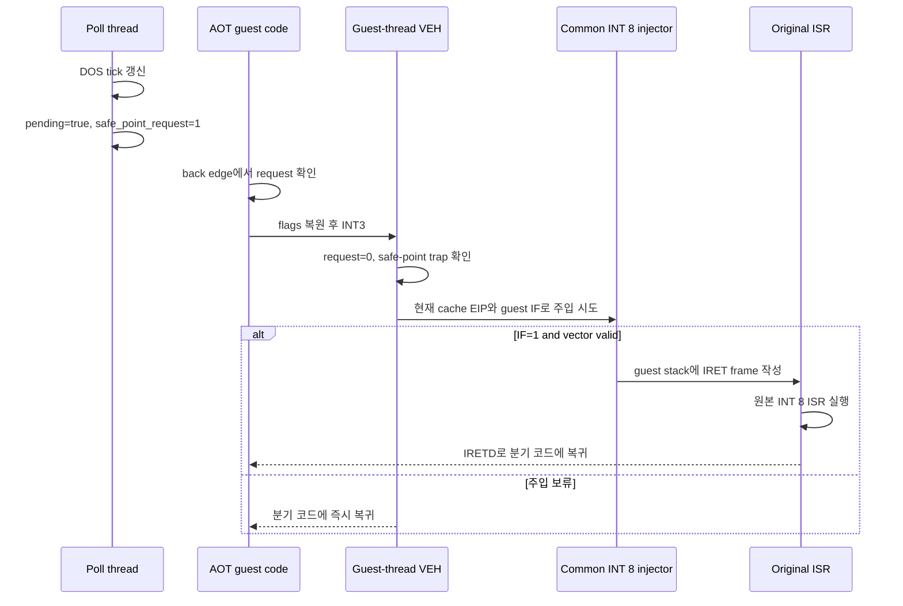

# 20260729-348 AOT busy-wait 타이머 safe point / AOT busy-wait timer safe point

## 한국어

### 1. 배경과 확인된 실패

사용자 입력을 포함한 `pumpit1` 실행은 약 37.4초부터 종료 시점까지
`heartbeat=423464`, `dispatch=211732`, `progress=7523`에서 완전히 정지했습니다.
정지 샘플은 게스트 `0x0304318E`와 Watcom stack-check helper
`0x030F5684..0x030F56A7`만 반복했습니다.

정적 분석으로 다음 실행 경로를 확인했습니다.

```text
0x0302F9B7  call 0x0304316A       ; tick = 0
...
0x0302FA08  call 0x0304317F       ; eax = tick
0x0302FA0D  cmp eax, 2
0x0302FA10  jl  0x0302FA08
```

`0x0304317F`는 전역 tick `0x032D9C84`를 반환하고, 원본 INT 8 ISR의
`0x03042F36`이 이 값을 증가시킵니다. 정지 중 반환값은 계속 1이었습니다.
즉 첫 번째 INT 8 뒤 AOT 코드 캐시 안의 순수 back-edge 루프에 들어갔고, 자연 VEH
경계가 더 이상 생기지 않아 두 번째 pending INT 8을 전달하지 못했습니다.

Task 301은 poll thread가 TF를 강제로 설정하던 Task 299 경로가 host 주소에서
처리되지 않은 `0x80000004`를 만들었기 때문에 제거했습니다. Task 301 설계는 실제
무경계 루프가 발견되면 cross-thread TF를 복구하지 말고 생성 코드에 guest-thread
safe point를 추가하도록 명시했습니다. 이번 실행이 그 조건을 처음 확정했습니다.

### 2. 목표

1. 원본 실행 파일과 원본 INT 8 ISR을 수정하지 않습니다.
2. poll thread는 시간 감지와 coalesced 요청 게시만 담당합니다.
3. AOT 무경계 루프에서도 guest thread가 자기 VEH 문맥으로 진입할 수 있게 합니다.
4. IRET frame 작성, IF gate, pending 소비는 기존 공용 INT 8 주입기 하나만 사용합니다.
5. 초기 AOT 이미지와 동적 append 이미지에 같은 정책을 적용합니다.
6. pending이 없을 때 guest GPR, EFLAGS, ESP와 분기 의미를 보존합니다.

### 3. 설계

#### 3.1 생성 위치

AOT emitter는 다음 loop back edge 앞에 safe point를 생성합니다.

- direct jump의 target이 source 이하인 경우
- conditional branch의 taken target이 source 이하인 경우
- block fallthrough target이 tail source 이하인 경우

현재 재현 루프는 `0x0302FA10: jl 0x0302FA08`이므로 conditional back edge로
포함됩니다. 간접 분기와 return은 이번 범위에서 제외하며, 이후 별도 무경계 루프가
확인되면 같은 metadata/handler 구조로 확장합니다.

#### 3.2 생성 코드

safe point의 정상 경로는 guest flags와 stack을 정확히 복원한 뒤 기존 분기를
실행합니다.

```text
pushfd
cmp dword ptr [request_address], 0
jne trap
popfd
jmp continue
trap:
popfd
int3
continue:
<original translated branch>
```

`request_address`는 코드 이미지 생성 시 placeholder이며 Win32 placement 단계에서
`Win32AotCodeCachePlacement`가 소유한 32-bit request word의 절대 주소로 해결합니다.
placement는 실행보다 오래 살아 있고 초기 이미지와 동적 append가 같은 request word를
사용합니다. poll thread는 새 55ms tick을 게시할 때 `InterlockedExchange`로 request를
1로 설정합니다.

#### 3.3 guest-thread VEH 처리

safe-point `INT3`는 일반 AOT fallback보다 먼저 식별합니다.



handler는 trap마다 request word를 0으로 되돌리고, 소유한 Win32 `INT3`의 resume EIP를
`ExceptionAddress + 1`로 명시합니다. IF=0 등으로 주입이 보류되어도
기존 `timer_interrupt_pending`은 소비하지 않습니다. 다음 55ms tick이 request를 다시
게시하므로 masked loop에서 매 명령마다 예외가 발생하지 않습니다.

### 4. 안전성

- poll thread는 `SuspendThread`, `GetThreadContext`, `SetThreadContext`, TF 변경,
  guest stack write를 하지 않습니다.
- safe point 정상 경로는 `pushfd/popfd`가 균형이고 GPR을 사용하지 않습니다.
- trap 경로도 `INT3` 전에 flags와 ESP를 원상 복원합니다.
- VEH는 exception address가 placement에 등록된 safe-point trap과 정확히 일치할 때만
  소비합니다.
- 실제 주입은 기존 `InjectPendingInterrupts`의 guest/AOT EIP, vector, IF 검사를
  그대로 통과해야 합니다.
- 원본 guest tick, ISR, `IRETD`, gameplay 코드는 바뀌지 않습니다.
- emitter option은 AOT-DBT에만 활성화하고 다른 backend의 기존 byte image는 유지합니다.

### 5. 관측

다음을 종료 요약에 추가합니다.

- 생성된 timer safe-point site 수
- safe-point trap 수
- trap에서 실제 INT 8을 주입한 수
- IF/vector 조건으로 보류한 수

이는 일반 AOT breakpoint provenance와 분리합니다. safe-point trap은 계획 실패나
retired entry가 아니라 의도한 협력적 선점 경계이기 때문입니다.

### 6. 검증

1. `repiu_aot_probe`에서 conditional/direct back edge의 byte layout, metadata,
   decode-validity를 검증합니다.
2. Win32 x86 Debug loader와 AOT probe를 빌드합니다.
3. 기존 무입력 smoke에서 fatal, malformed dispatch, stack leak이 없는지 확인합니다.
4. 사용자 재현과 같은 입력 경로에서 `0x0302FA08`의 tick=1 루프를 통과하는지 확인합니다.
5. safe-point trap/injection이 증가하고 heartbeat/dispatch/progress가 정지하지 않는지
   확인합니다.
6. `REPIU_TIMER_INJECT_LOG=1`에서 주입 frame이 guest thread에서만 생성되는지 확인합니다.

### 7. 구현 및 검증 결과

- initial placement와 dynamic append가 같은 request 주소와 trap index를 해결합니다.
- 독립 `--timer-safe-point` 합성 프로브가 on/off 생성, 15바이트 guard, 주소 해결을
  검증했습니다.
- 첫 live 검증에서 resume EIP를 전진하지 않아 1.2초에 trap 134,721회가 발생한 사실을
  확인했고, `ExceptionAddress + 1` 수정 뒤 5초 smoke는 trap 50회로 정상화됐습니다.
- 입력을 포함한 50초 실행은 37초 이후에도 heartbeat/dispatch가 계속 증가했고,
  trap/injected/deferred `518/452/66`, original fatal 0을 기록했습니다.

### 8. 범위 밖

- 원본 guest timer 함수를 host callback으로 교체
- 특정 주소 `0x0302FA08`만 우회하거나 tick 값을 강제로 변경
- poll thread의 TF 또는 직접 IRET-frame 작성 복구
- 간접 분기/return 전역 safe point

---

## English

### 1. Background and confirmed failure

An interactive `pumpit1` run froze from about 37.4 seconds until exit with
`heartbeat=423464`, `dispatch=211732`, and `progress=7523` unchanged. Samples
repeated only guest `0x0304318E` and the Watcom stack-check helper
`0x030F5684..0x030F56A7`.

Static analysis confirmed this path:

```text
0x0302F9B7  call 0x0304316A       ; tick = 0
...
0x0302FA08  call 0x0304317F       ; eax = tick
0x0302FA0D  cmp eax, 2
0x0302FA10  jl  0x0302FA08
```

`0x0304317F` returns global tick `0x032D9C84`; the original INT 8 ISR
increments it at `0x03042F36`. The value remained 1 during the freeze. The
guest therefore entered a pure AOT back-edge loop after one interrupt, and no
natural VEH boundary remained to deliver the second pending INT 8.

Task 301 removed Task 299's poll-thread TF forcing because it repeatedly
created an unhandled `0x80000004` at a host address. Its design explicitly
requires a generated guest-thread safe point if a true boundary-free loop is
later found. This run confirms that condition.

### 2. Goals

Preserve the original executable and ISR, keep the poll thread limited to
publishing time requests, and let boundary-free AOT loops rendezvous with VEH
on the guest thread. Reuse the one common INT 8 injector for IRET-frame
creation, IF gating, and pending consumption. Apply one policy to initial and
dynamically appended AOT images while preserving GPRs, EFLAGS, ESP, and branch
semantics when no request is pending.

### 3. Design

Emit a safe point before direct jumps, taken conditional branches, and block
fallthroughs whose target is at or below their guest source. The reproducing
`jl 0x0302FA08` is covered. Indirect branches and returns remain out of scope.

The emitted sequence saves flags, compares a placement-owned 32-bit request
word, restores flags on both paths, and executes `INT3` only when requested.
Win32 placement resolves the placeholder request address for both the initial
image and dynamic appends. Each new 55 ms host tick sets the request with
`InterlockedExchange`.

VEH recognizes registered timer-safe-point breakpoints before generic AOT
fallback. It clears the request and invokes the common injector using the
explicit `ExceptionAddress + 1` post-`INT3` cache EIP. Successful injection enters the original ISR,
whose `IRETD` returns to the translated branch. If IF or another injector
precondition defers delivery, VEH resumes the branch immediately while the
coalesced pending bit remains set; a later host tick rearms the safe point.

### 4. Safety and verification

The poll thread never suspends or edits guest context and never writes an IRET
frame. The normal and trap paths balance `pushfd/popfd`, use no GPR, and reach
VEH with restored ESP/EFLAGS. Exact placement metadata distinguishes these
breakpoints from ordinary AOT fallback. The common injector retains all
guest/AOT EIP, vector, and IF checks.

Verify emitted layout and decode validity in `repiu_aot_probe`, build Win32 x86
Debug targets, run a no-input smoke regression, and reproduce the interactive
tick=1 wait. The interactive run must show safe-point traps/injections and
continued heartbeat/dispatch/progress without fatal, malformed dispatch, or
stack leakage.

### 5. Implementation and verification result

Initial placement and dynamic appends resolve the same request address and trap index. The
standalone `--timer-safe-point` probe verifies enabled/disabled emission, the 15-byte guard,
and address resolution. An initial live run exposed 134,721 repeated traps in 1.2 seconds
when EIP was not advanced; explicit `ExceptionAddress + 1` reduced the five-second smoke run
to 50 traps. The 50-second interactive run continued heartbeat and dispatch past 37 seconds
and recorded trap/injected/deferred `518/452/66` with zero original fatal events.
