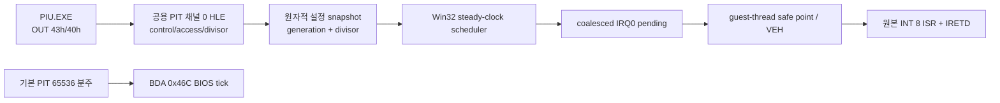

# 20260729-349 PIT 채널 0 타이머 HLE / PIT channel-0 timer HLE

## 한국어

### 1. 확인된 문제

`PIU.EXE`는 `0x030250C0`과 `0x0302559C`에서 `240`을 인자로 전달해
`0x030430B0` 타이머 초기화 함수를 호출합니다. 이 함수는 `1,193,280Hz` 기준
클럭을 사용해 분주값 `4,972`를 계산하고 다음 순서로 PIT 채널 0을 설정합니다.

```text
OUT 0x43, 0x36
OUT 0x40, 0x6C
OUT 0x40, 0x13
```

따라서 원본 게임이 요청한 IRQ0 주기는 정확히 `240Hz`(약 `4.167ms`)입니다.
현재 Win32 HLE는 이 포트 출력을 `unsupported-ignored`로 폐기하고, 별도 호스트
폴러가 `55ms` 고정 주기로 INT 8을 게시합니다. 게임 내부 tick 2개 대기는 원래
약 `8.33ms`여야 하지만 현재 명목상 약 `110ms`로 늘어납니다.

### 2. 목표와 원칙

- 원본 `PIU.EXE`의 PIT 설정과 원본 INT 8 ISR을 그대로 실행 경로에 둡니다.
- PIT 채널 0 제어/데이터 포트만 HLE 장치 상태로 모델링합니다.
- IRQ0 게시 주기는 게스트가 기록한 분주값에서 계산합니다.
- BIOS Data Area `0x46C`의 기본 tick과 게임이 재설정한 IRQ0 주기를 분리합니다.
- 포트 장치 상태와 주기 계산은 플랫폼 공용 HLE로 두고, Win32는 포트 trap과
  호스트 시계 연결만 담당합니다.
- 기존 IF gate, pending 병합, guest-thread safe point, 원본 ISR/IRETD 경로는
  변경하지 않습니다.

### 3. 구조



공용 `PitChannel0`은 제어어의 채널 선택과 access mode를 해석합니다. 관찰된
`0x36` low/high 쓰기에서는 첫 데이터 바이트를 보관하고 두 번째 바이트가 도착할
때만 새 분주값을 원자적으로 게시합니다. 16비트 reload 값 `0`은 실제 PIT 규칙대로
`65536`으로 해석합니다.

`PitIrqSchedule`은 설정 generation이 바뀌면 그 시각을 새 epoch로 삼습니다.
이후 단조 증가 호스트 경과 시간과 `1,193,280 / divisor` 비율로 만료 tick 수를
계산합니다. 폴러가 늦어 여러 tick이 만료된 경우 진단 카운트에는 수를 반영하되,
기존 가상 PIC 정책처럼 pending IRQ는 하나로 병합합니다.

PIT 포트 명령은 매 호출마다 다시 trap되어야 합니다. 공용 Watcom `OUT` helper의
명령을 NOP으로 바꾸면 첫 출력 이후 모든 후속 포트 쓰기가 사라지므로, PIT 처리
경로는 명령 바이트를 수정하지 않고 EIP만 전진시킵니다.

### 4. 지원 범위

- 채널 0 제어 포트 `0x43`
- 채널 0 데이터 포트 `0x40`
- low-only, high-only, low/high access mode
- 관찰된 mode 3 제어어 `0x36`
- 기본 reload `65536`과 게스트 재설정 generation

채널 1/2, counter latch readback, speaker 출력은 이번 범위에 포함하지 않습니다.
지원하지 않는 제어어는 기존 일반 포트 정책으로 넘기며 성공으로 과장하지 않습니다.

### 5. 검증

1. 공용 probe에서 `0x36`, `0x6C`, `0x13`이 divisor `4,972`와 `240Hz`를
   만드는지 확인합니다.
2. 설정이 완성되기 전에는 generation이 바뀌지 않는지 확인합니다.
3. scheduler가 약 `4.167ms`마다 tick을 만들고 지연 시 만료 수를 보존하는지
   확인합니다.
4. Win32 x86 Debug 빌드와 전체 AOT probe를 통과시킵니다.
5. 실제 `pumpit1` 실행 로그에서 PIT `divisor=4972`, `frequency=240Hz`를 확인하고,
   타이머 busy-wait가 fatal 없이 진행하는지 확인합니다.

---

## English

### 1. Confirmed problem

`PIU.EXE` calls timer initialization at `0x030430B0` with argument `240` from
`0x030250C0` and `0x0302559C`. The timer code divides its `1,193,280Hz`
reference clock by the requested rate, producing divisor `4,972`, then writes
`0x36` to port `0x43` and `0x6C`, `0x13` to port `0x40`. The requested IRQ0
rate is therefore exactly `240Hz` (about `4.167ms`).

The current Win32 HLE discards those writes as `unsupported-ignored` and
publishes INT 8 at a fixed `55ms` interval. A two-tick game wait that should
take about `8.33ms` consequently takes about `110ms` nominally.

### 2. Goals and policy

Preserve the original executable, INT 8 ISR, and IRETD path. Model only the
surrounding PIT channel-0 device state. Derive IRQ0 cadence from the guest
divisor, keep the BIOS BDA tick separate, and retain the existing IF gate,
coalesced pending request, and guest-thread safe-point delivery.

Place PIT state and time-ratio policy in shared HLE code. Win32 remains only
the port-trap and host-clock adapter.

### 3. Design

`PitChannel0` decodes channel-0 control and access modes. For the observed
low/high sequence, it publishes a new atomic generation-plus-divisor snapshot
only after both bytes arrive. Reload zero represents `65536`.

`PitIrqSchedule` starts a new epoch when the generation changes and computes
expired ticks from monotonic host elapsed time using
`1,193,280 / divisor`. Multiple expirations are counted for diagnostics but
coalesce into the existing single pending IRQ, matching the current virtual
PIC policy.

PIT writes advance EIP without NOP-patching the shared Watcom `OUT` helper.
Patching that helper after its first invocation would erase every later port
write.

### 4. Scope and verification

Support ports `0x43` and `0x40`, channel-0 low-only/high-only/low-high writes,
the observed mode-3 control word, default divisor `65536`, and configuration
generations. Channel 1/2, latch readback, and speaker output remain out of
scope.

Verify the exact `4,972`/`240Hz` configuration and scheduler cadence in a
shared probe, build Win32 x86 Debug, run the full AOT probe, and confirm the
real game logs the expected PIT configuration and continues through timer
busy-waits without a fatal event.
