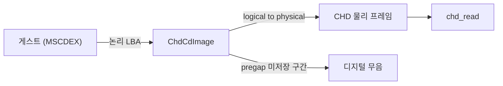

# 350 MSCDEX 재생 위치 보고와 CHD 논리 주소 공간 설계

## 배경

CD 재생 중 게스트에게 전달되는 위치 정보가 부정확하다는 보고가 있었다. 또한
`pumpit1` 인트로에서 트랙 2 음악이 처음이 아니라 중간부터 시작한다.

두 증상 모두 "CD 주소를 게스트에게 어떻게 보고하는가"라는 하나의 축에 걸려 있어
같은 작업에서 다룬다.

## 확인된 사실

### CHD TOC (probe `--metadata` / `--scan`, 2026-07-29)

`roms/pumpit1/19990930.chd`:

```
TRACK:1 TYPE:MODE2_RAW FRAMES:6954 PREGAP:0   PGTYPE:MODE1
TRACK:2 TYPE:AUDIO     FRAMES:820  PREGAP:150 PGTYPE:MODE1     <- V 접두어 없음
TRACK:3 TYPE:AUDIO     FRAMES:1983 PREGAP:149 PGTYPE:VAUDIO
TRACK:4 TYPE:AUDIO     FRAMES:1811 PREGAP:149 PGTYPE:VAUDIO
...
```

MAME/chdman 규약에서 `PGTYPE`가 `V`로 시작하면 pregap 프레임이 해당 트랙의
`FRAMES` 안에 **실제로 저장**되어 있고, 그렇지 않으면 pregap은 **논리적 간격일 뿐
파일에 없다**.

기존 `ChdCdImage::Open`은 `PGTYPE`를 보지 않고 항상
`start_lba = storage_lba + pregap`을 적용했다. 트랙 2는 pregap이 저장되어 있지
않으므로 이 계산이 **저장된 음악의 앞 150프레임(정확히 2.00초)을 건너뛴다**.

`--scan 2` 결과가 이를 뒷받침한다. 저장 시작(6956) 바로 다음 섹터부터 peak 32604
(풀스케일) 음악이 존재하며, 무음 구간이 전혀 없다. 트랙 2 전체 길이는 820프레임
= 10.93초이므로 2초 손실은 청감상 "중간부터 시작"으로 나타난다.

`--scan 3`은 반대로 저장 시작부터 184프레임이 무음이어서 pregap 저장 사실과
일치한다. 즉 **영향받는 트랙은 트랙 2 하나뿐**이다.

### 두 개의 서로 다른 주소 공간이 혼용되고 있었다

CHD는 트랙마다 4프레임 경계로 padding하여 저장한다(`CD_TRACK_PADDING`). 따라서
CHD 내 물리 프레임 번호와 실제 디스크의 논리 LBA는 다르다. 기존 구현은 물리
번호 하나만 유지하면서 그것을 그대로 TOC로 보고했다.

트랙 2의 실제 디스크 논리 INDEX 01 주소는 `6954 + 150 = 7104`이다. 기존 구현이
보고하던 값은 `7106`이었다. 두 값이 우연히 2프레임 차이로 근접해 있어서, 게임이

* (a) 우리 TOC를 읽고 그 값으로 재생을 요청했는지
* (b) 원본 디스크 기준 주소를 내장하고 있어 7104 근처를 직접 요청했는지

를 구분할 수 없다. 그런데 **두 경우 모두 약 2초 밀린 지점에서 재생이 시작된다.**
(b)라면 `PGTYPE` 수정만으로는 증상이 사라지지 않는다.

따라서 물리/논리 주소 공간을 분리하고, **게스트에게는 항상 논리(Red Book) 주소를
보고하고 읽기 시점에만 물리로 변환**한다. 이렇게 하면 (a)와 (b) 모두 올바르게
동작한다.

### MSCDEX IOCTL 결함

`HandleMscdexIoctl`은 control block code `06h, 09h, 0Ah, 0Bh, 0Ch, 0Fh`만 처리하고
나머지는 `false`를 반환해 request status `0x8103`(unknown command)을 쓴다.

| code | 내용 | 기존 상태 |
|---|---|---|
| `01h` | Read head location | 미구현 → 거절 |
| `0Dh` | Audio sub-channel info | 미구현 → 거절 |
| `0Ch` | Audio Q-Channel info | 트랙 상대시간에 150프레임 오프셋 오적용 |
| `0Fh` | Audio status info | offset 3/7 의미가 규약과 다름, paused 상태 없음 |

`01h`은 DOS 응용이 재생 위치를 폴링할 때 가장 표준적인 호출이다.

device command 레벨에서도 `83h`(Seek), `0Ch`(IOCTL Output) 미구현이다.

### 재생 위치가 "재생된 위치"가 아니다

`CdAudioWaveOut::current_lba`는 `SDL_PutAudioStreamData()` 직후에 갱신된다. 즉
디코드해서 큐에 넣은 커서이지 실제로 소리로 나간 위치가 아니다.

* 큐 임계값 `2352 x 8 x 4` = 32섹터 = 426.7 ms
* 투입 단위 8섹터 = 106.7 ms

결과적으로 보고 위치는 가청 위치보다 320~427 ms 앞서고, 106.7 ms 단위로 계단식
점프하며, `Play()` 직후에는 소리가 나기 전에 이미 0.43초 지점을 가리킨다.
`playing` 플래그도 마지막 버퍼를 **큐에 넣은** 시점에 내려가므로 실제 소리가
0.4초 남은 상태에서 "재생 종료"로 보고된다.

## 설계

### 주소 공간 분리



트랙마다 다음을 유지한다.

* `physical_lba` — CHD 내 저장 시작 프레임 (4프레임 padding 누적)
* `stored_frames` — `FRAMES`
* `pregap_frames`, `pregap_in_file`
* `logical_lba` — 디스크상 트랙 시작 (INDEX 00)
* `start_lba` — 디스크상 INDEX 01, TOC가 보고하는 값
* `end_lba` — 트랙의 논리 끝(exclusive)

누적 규칙:

```
data_start_logical = logical_lba + (pregap_in_file ? 0 : pregap_frames)
start_lba          = logical_lba + pregap_frames
end_lba            = logical_lba + (pregap_in_file ? stored_frames
                                                   : pregap_frames + stored_frames)
다음 logical_lba  += (end_lba - logical_lba)
다음 physical_lba += round4(stored_frames)
```

논리 to 물리 변환:

```
physical = physical_lba + (lba - data_start_logical)      (lba >= data_start_logical)
lba < data_start_logical 이면 저장된 데이터가 없으므로 디지털 무음을 반환
```

이 모델을 실제 CHD에 적용하면 트랙 2의 INDEX 01은 논리 7104가 되고, 이는 물리
6956으로 매핑되어 음악의 진짜 첫 프레임을 가리킨다.

### MSCDEX 보완

* `01h` Read head location 구현. addressing mode(HSG/Red Book) 존중.
* `0Dh` Audio sub-channel info 구현.
* `0Ch` 트랙 상대시간은 150프레임 오프셋 없이 변환.
* `0Fh` offset 3/7을 마지막 Play의 시작/끝 주소로 보고하고, paused 비트를 실제
  일시정지 상태에서 유도.
* device command `83h` Seek, `0Ch` IOCTL Output 처리.
* `85h`는 규약대로 위치를 보존하는 정지로, `88h`는 그 위치에서 재개로 동작.

### 재생 위치 산출

`SDL_GetAudioStreamQueued`로 아직 소비되지 않은 바이트를 구해, 큐 투입 커서에서
빼는 방식으로 가청 위치를 만든다.

```
audible_lba = queued_cursor_lba - (queued_bytes / 2352)
```

`playing`은 큐가 완전히 비워질 때까지 유지하고, 일시정지 상태를 별도 플래그로
관리한다.

### 진단

어떤 subfunction이 실제로 쓰이는지 로그로 확정할 수 있어야 한다. 다음을
텔레메트리에 추가한다.

* 마지막 IOCTL subfunction과 그 처리 성공 여부
* 거절된 subfunction 비트맵
* 마지막 Play 요청의 addressing mode / start / length

## 검증

* `repiu_chd_cd_probe --metadata`로 논리/물리 TOC를 동시에 출력해 산술 검증
* `repiu_chd_cd_probe --scan 2`로 보고 시작 주소가 음악 첫 프레임과 일치하는지 확인
* 빌드 후 실제 구동 로그에서 IOCTL subfunction 텔레메트리 확인

---

# 350 MSCDEX Playback Position Reporting and CHD Logical Address Space

## Background

Two symptoms share one root axis — how CD addresses are reported to the guest.
Playback position handed to the guest is inaccurate, and the `pumpit1` intro
music (track 2) starts partway in rather than at the beginning.

## Confirmed facts

Probe output for `roms/pumpit1/19990930.chd` shows track 2 with
`PREGAP:150 PGTYPE:MODE1` — no `V` prefix, meaning the pregap frames are **not**
stored in the file. Tracks 3+ carry `PGTYPE:VAUDIO`, meaning their pregap **is**
stored. `ChdCdImage::Open` ignored `PGTYPE` and always applied
`start_lba = storage_lba + pregap`, so for track 2 it skipped the first 150
stored frames — exactly 2.00 seconds — of real music. `--scan 2` confirms
full-scale audio (peak 32604) one sector after the stored start with no silence,
and `--scan 3` confirms 184 silent frames at the head of track 3. Track 2 is the
only affected track.

Separately, CHD pads each track to a 4-frame boundary, so physical frame numbers
diverge from disc logical LBAs. The old implementation kept only physical
numbers and reported them as the TOC. Track 2's true logical INDEX 01 is 7104
while the old code reported 7106; the two are close enough that we cannot tell
whether the game replays our TOC value or carries a hardcoded disc address — and
both readings land ~2 seconds late. Splitting the address spaces and always
reporting logical (Red Book) addresses fixes both cases.

MSCDEX IOCTL gaps: control block codes `01h` (read head location) and `0Dh`
(audio sub-channel) are unimplemented and rejected with status `0x8103`; `0Ch`
wrongly adds the 150-frame offset to the in-track relative time; `0Fh` reports
the wrong fields at offsets 3 and 7 and has no real paused state. Device
commands `83h` and `0Ch` are also unimplemented.

Finally, `current_lba` is updated right after `SDL_PutAudioStreamData`, so it is
a producer cursor: it leads audible output by 320-427 ms, steps in 106.7 ms
jumps, and already reads 0.43 s in before any sound is emitted. The `playing`
flag drops when the last buffer is queued, roughly 0.4 s before playback ends.

## Design

Each track keeps both a physical origin and a logical extent. Logical-to-physical
translation subtracts the logical data start and adds the physical origin;
addresses inside an unstored pregap have no backing data and return digital
silence. Under this model track 2's INDEX 01 becomes logical 7104, mapping to
physical 6956 — the true first frame of the music.

MSCDEX gains `01h` and `0Dh`, a corrected `0Ch` relative time, spec-accurate
`0Fh` fields with a real paused state, and device commands `83h` and `0Ch`.
`85h` becomes a position-preserving stop and `88h` resumes from it.

Playback position is derived by subtracting `SDL_GetAudioStreamQueued` from the
producer cursor, and `playing` stays asserted until the queue drains.

Telemetry records the last IOCTL subfunction and its outcome, a rejected-
subfunction bitmap, and the last play request's addressing mode, start, and
length, so a single run confirms which call the game actually depends on.

## Verification

Probe `--metadata` prints both address spaces for arithmetic checks, `--scan 2`
confirms the reported start matches the first audible frame, and the new
telemetry is read back from a live run log.
